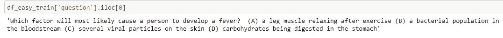
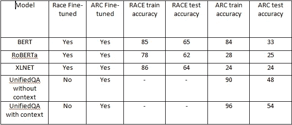

# 使用变压器的多项选择问答。

> 原文：<https://medium.com/analytics-vidhya/multiple-choice-qa-using-deep-learning-44689618a253?source=collection_archive---------4----------------------->

AI2 弧数据集。

Nguyen Dang Hoang Nhu 在 [Unsplash](https://unsplash.com?utm_source=medium&utm_medium=referral) 上拍摄的照片

## 目录

1.  [简介](#9e97)。
2.  [问题陈述](#30c8)。
3.  [目标](#dbb0)。
4.  [探索性数据分析](#e8f8)。
5.  [分度](#51df)。
6.  [上下文检索](#610a)。
7.  [造型](#520e)。

## **简介**

数据集越来越多地推动着人工智能的进步，为一些问答任务带来了令人印象深刻的解决方案。然而，这些数据集中在检索式的任务上，仅表层线索通常就足以识别答案。这并没有鼓励在需要推理、使用常识或其他高级方法来加深文本理解的问题上取得进展。这里提出的挑战称为 ARC (AI2 推理挑战)，旨在通过提出难以用简单基线回答的问题来解决这一限制。

## **问题陈述**

认为你已经解决了问题回答？试试 AI2 推理挑战(ARC)！

一个由 7，787 个真正的小学水平的多项选择科学问题组成的新数据集，旨在鼓励对高级问答的研究。数据集被划分为挑战集和简单集，其中前者仅包含由基于检索的算法和单词共现算法错误回答的问题。

## 公制的

精确度用作度量标准。

## 目标

1.  给定一个多项选择问题，我们必须预测正确的答案。
2.  尽可能提高精确度。

## 数据

数据可以从[这里](https://allenai.org/data/arc)下载。

提供的文件有:

*   挑战列车:1119
*   挑战开发者:299
*   挑战测试:1，172
*   简易列车:2251
*   简单开发:570
*   简单测试:2376

每组都有两种格式，CSV 和 JSON。CSV 文件在一个单元格中包含问题的完整文本及其答案选项。JSON 文件包含问题的一个分割版本，其中问题文本已经通过编程与答案选项分开。

## 数据字段

*   questionID —问题的唯一标识符(我们自己的编号)。
*   原始问题 ID —测试中的问题编号。
*   totalPossiblePoint —评分时问题值多少分。
*   AnswerKey —正确答案选项。
*   isMultipleChoiceQuestion — 1 =多项选择，0 =其他。
*   includes diagram-1 =包含图表，0 =其他。
*   考试名称-考试的来源。
*   学校等级——年级水平。
*   年份—考试的出版年份。
*   问题—问题本身的文本。
*   主题—一般问题主题。
*   类别—测试、培训或开发。

# 探索性数据分析

让我们执行 EDA 来深入了解给定的数据。

关于简易训练数据的信息如下:

train.info()

这里我们可以看到简单训练数据集有 2251 个条目。所有条目都不为空。要使用的重要列有 questionID、AnswerKey、question。

现在让我们检查一下重要的列。

## 问题:

一个问题的例子如下:

问题示例。

在这里，我们可以看到问题列中的一个条目包含有多个选项的问题。

在观察了许多问题样本后，我发现了以下情况:

(1)一个问题既包含大写字母，也包含小写字母。

(2)问题和答案选项仅由空格分隔。

(3)答案选项以 ABCD 和 1234 两种格式呈现。我们需要解决这个问题。

## 接听键:

简单训练和测试集中所有唯一值的列表如下:

AnswerKey 中的唯一值。

现在让我们看看值的分布:

列车组。

测试集。

从上面的图表我们可以推断:

1.在 easy set 中有一些包含 E 选项的问题。

2.与 ABCD 格式的问题相比，以 1234 格式回答的问题非常少。

# 探索给定的语料库。

语料库中存在的数据示例如下:

**观察:**

*   语料库中的许多句子只包含数字。
*   有些句子中有 http 链接。
*   语料库中有许多长度为 2-3 个单词的短句。
*   有些句子有没有意义的特殊字符。
*   括号里有很多没用的东西。
*   有许多 1-2 个字母的单词，它们不是停用词。因此，它们必须在提取后被去除。
*   有些句子只包含日期、地点等。
*   有些单词既包含数字又包含字母。例如，4 月，第 0434–455 页；100 等。

在为一个给定的问题提取它们之后，我们必须注意上面的事情。

现在让我们从问题列中只提取问题。

摘录问题。

现在让我们来看一些使用上述代码提取的问题示例:

问题样本。

由于在 ARC 数据集中没有给定问题的上下文，我们需要从给定的语料库中提取上下文。我们将使用两个语料库，ARC 语料库和 Aristo Mini 语料库。

现在我们将使用 ElasticSearch API 索引 ARC 语料库和 Aristo Mini 语料库。索引后，我们可以提取文档，在我们的案例句子中，与给定的问题和答案对相关。

## 索引:

索引。

在上面的代码中，我们首先打开了包含语料库的文件。然后我们为两个不同的语料库创建了 index，它相当于 SQL 中的一个表。

将数据加载到弹性搜索中。

使用上面的代码，我们可以将语料库数据加载到我们创建的索引中。“parallel_bulk”有助于更快地将数据装入索引。

现在我们的索引已经可以使用了。但是在继续之前，我们需要创建一个只包含答案选项的列表。这将有助于我们从索引中提取文档。

下面是获取给定问题的选项列表的代码:

提取选项。

使用上面的代码，我们可以得到数据集中所有问题的选项列表。

## 提取文档:

现在，我们将提取每个问题和选项对的文档，并将它们存储在一个字典中，其中，关键字将是提取的文档，值将是其 TF-IDF 得分。

这里我们从两个语料库中提取了 50 篇文档。因此，对于每个问题和选项对，我们总共有 100 个文档。

# 上下文检索

现在，从所有给定的文档中，我们将为每个问题选择前 20 个文档，并使用它们作为回答问题的上下文。

但是这里有一个重要的问题。如何评选前 20 名文档？我们不能仅仅基于 TF-IDF 分数来选择上下文，因为已经发现，仅仅 TF-IDF 分数不能返回最佳文档。

这方面的参考可以在细心的 Ranker 论文 [**这里**](https://arxiv.org/abs/1909.00596) 中读到。

我将使用这篇 [**论文**](https://drive.google.com/file/d/15K3lgiYLHvUb1zKf8x_F8LwY9o5pQhQ6/view) 中提到的方法来选择可用于创建适当上下文的相关文档。

## 文档相关性鉴别器(DRD)

DRD 将学会判断给定的问题和上下文，上下文是否包含问题所需的答案。为此，SQUAD 2.0 是一个很好的数据集，因为它包含两种类型的数据点。

在这里，我们将在 SQUAD 2.0 数据集上训练 BERT，但是做了一些调整。小队数据集被转换成二进制形式，这样，如果在给定的上下文中有答案，则它被标记为 1 否则为 0。因此，BERT 将被微调以对给定的(问题、上下文)对进行分类。

之后，我使用 BertTokenizer 创建了输入 id。tokenizer 的输入形式如下:

[CLS]问题[SEP]上下文[SEP]

获得输入标识、令牌类型标识和注意掩码后，我使用 PyTorch 数据集和数据加载器创建了数据集。

创建 PyTorch 数据集的代码。

用于训练 BERT 模型的参数如下:

DRD 参数。

我使用了变形金刚库中的伯特基础模型来微调模型。

在微调 BERT 模型后，我在 SQUAD 2.0 的验证数据集上实现了 75%的准确率。

## 应答验证鉴别器

在这里，我们创建一个模型，试图确定一个上下文是否可能包含给定问题和答案选择的信息。因此，我们向模型输入(问题、答案选择、上下文),它返回一个介于 0 和 1 之间的置信度得分。接近 1 意味着上下文是有用的。

对于这项任务，我已经采取了种族数据集，并转换成二进制分类问题。我们将这个数据集转换为元组(问题、候选答案、段落)，这些元组要么被标记为 0，这意味着答案不能使用段落来验证(对于不正确的答案)，要么被标记为 1，这加强了段落可以用来推断答案是正确的事实。

下面是我用来完成上述任务的函数:

获得数据集后，我使用 BertTokenizer 对数据集进行了标记化。tokenizer 的输入格式如下:

【CLS】问题【九月】答案选择【九月】语境【九月】

在得到模型的输入后，我像为 DRD 做的那样对模型进行了微调。

对于这个任务，我实现了 75%的验证准确率。

## 正在检索上下文

在我们训练了两个鉴别器之后，我们可以使用它们来获取数据集中每个问题的上下文。

我使用了以下两个函数来完成这项任务:

该函数将返回两个分数，分别来自每个鉴别器。

第二个功能是:

在这个函数中，我们只需传递我们的数据集，它将返回每个数据点的上下文。

# 系统模型化

对于建模，我的方法是首先在 RACE 数据集上微调模型，然后在 ARC 数据集上微调模型。除了 UnifiedQA 模型，我对所有模型都使用了这个过程。

## 基线模型

在这个模型中，我们从所有给定的选项中随机选择一个答案。

对于这个模型，测试精度为 25%。

## 伯特模型

准备的输入如下:

[CLS]语境[SEP]问题+答案 _ 选择[SEP]

## 罗伯塔模型

输入按以下格式准备:

~~语境~~ 问题 选择

## XLNET 模型

输入按以下格式准备:

语境<sep>问题+选择</sep>

## 统一 QA 模型

该模型是 T5 模型的扩展。更多关于这个的可以从 [**这里**](https://arxiv.org/pdf/2005.00700.pdf) 了解。

输入按以下格式准备:

问题+ \\n +所有选项+ \\n +上下文+

## 建模概要:

建模总结

# 结论

通过开展这个项目，我发现了以下几点:

1.  模型大小对最终性能有影响。
2.  背景对回答问题非常重要。因此，应该使用更好的上下文检索技术。
3.  通过增加鉴别器，我们在计算速度的代价上得到了更好的性能。
4.  NLP 中的迁移学习使许多事情变得容易完成。

# 未来的工作

有很多方法可以提高性能。其中一些如下:

1.  使用更大的模型。由于计算资源较少，我只使用了基本模型。
2.  对于使用 ARD 和 DRD 的评分环境，我们可以使用多个 DRD 或 ARD，并将他们的平均分数作为最终分数。
3.  我们可以使用 KV 注意力来获得更好的上下文，而不是取 ARD 和 DRD 分数的平均值(如 attention Ranker[**论文**](https://arxiv.org/ftp/arxiv/papers/1909/1909.00596.pdf) 中所述)。
4.  尝试使用基于解码器的模型，如 GPT、GPT-2 等。

## **参考文献:**

1.  [https://github.com/sobamchan/race-bert/blob/master/race.py](https://github.com/sobamchan/race-bert/blob/master/race.py)
2.  [https://arxiv.org/ftp/arxiv/papers/1909/1909.00596.pdf](https://arxiv.org/ftp/arxiv/papers/1909/1909.00596.pdf)
3.  [https://arxiv.org/pdf/2005.00700.pdf](https://arxiv.org/pdf/2005.00700.pdf)
4.  [https://drive . Google . com/file/d/15k 3 lgiylhvub 1 zkf 8 x _ f 8 lwy 9 o 5 pqhq 6/view](https://drive.google.com/file/d/15K3lgiYLHvUb1zKf8x_F8LwY9o5pQhQ6/view)
5.  [https://allenai.org/data/arc](https://allenai.org/data/arc)
6.  [应用人工智能课程](https://www.appliedaicourse.com/)。

你可以在这里联系我 [LinkedIn](http://www.linkedin.com/in/keshav-rawat) 和 [Github](https://github.com/keshav5196) 。