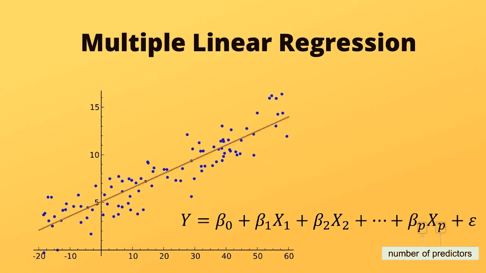
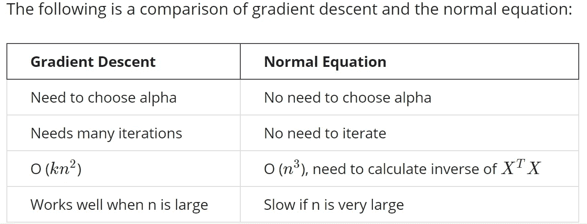
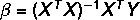

# 仅使用 numpy 从头开始多元线性回归

> 原文：<https://medium.com/analytics-vidhya/multiple-linear-regression-from-scratch-using-only-numpy-98fc010a1926?source=collection_archive---------2----------------------->



图片来源:[https://morioh.com/p/0d9b2bedf683](https://morioh.com/p/0d9b2bedf683)

线性回归是机器学习的起始算法。在 scikit learn 等库的帮助下，实现多元线性回归几乎不需要两三行代码。数据集也可以在熊猫的帮助下轻松处理，但我尽量避免这种方法。在这篇文章中，我解释了如何用 python 实现矩阵的经典方法。这种方法着重于直接从书本到代码实现算法！我用过的唯一一个包是 numpy，因为我们的数据集处理矩阵，而 numpy 有许多函数可以有效地处理它们，如果没有这些函数，我们就必须编写大量的循环，这可能仍然没有 numpy 有效。所以让我们马上开始吧！

有一个以上输入的线性回归称为多元线性回归或多元回归。在这个实现中，我使用了[房地产数据集](https://www.kaggle.com/quantbruce/real-estate-price-prediction)，它有几个特征，算法试图预测价格，这是预测器。

我们必须首先进行一些导入，这些导入将在我们的代码中使用。

正如承诺的那样，我不会用熊猫。因此，我们必须努力编写一个函数来加载数据集。

```
HEADERS
['No', 'X1 transaction date', 'X2 house age', 'X3 distance to the nearest MRT station', 'X4 number of convenience stores', 'X5 latitude', 'X6 longitude', 'Y house price of unit area']
```

```
Dataset Size
414 X 8
```

让我们从这个数据集中选择我们的特征和目标变量。

```
Size of X
(414, 5)
Size of Y
(414,)
```

设置好我们的数据后，让我们对算法如何工作以及我们到底要编码什么有一个大致的了解，而不用深入所有数学背后的证明细节。为了更容易理解，我将尽力把算法与我们正在使用的房地产数据集联系起来。

## **入门**

在这个阶段，我们有 N 个数据样本，并且我们已经把它分成我们的特征矩阵和目标矩阵。除了第一列(“否”)和目标列(“单位面积的 Y 房价”)之外，我们的数据集中总共有六个特征(“X1 交易日期”、“X2 房屋年龄”、“X3 到最近的 MRT 站的距离”、“X4 便利店数量”、“X5 纬度”、“X6 经度”)。我们必须找到一种关系来生成目标 Y，并将其公式化为一个方程，该方程是不同特征的函数。为了方便起见，我还排除了第一个特性(“X1 交易日期”)，因为数据在数据集中的格式不正确。这里我们有 N = 414 个样本，当我们将数据分成训练集和测试集时，这些样本也会减少。因此，此时 N = 414，特征数量(假设 p)= 5

对于单个特征，我们有以下形式的线性方程

y = 𝛽0+𝛽x，

其在扩展到单个样本的多个特征时采取以下形式

𝑦=𝛽0+𝛽1𝑥1+𝛽2𝑥2+…𝛽𝑝𝑥𝑝

对于 N 个样本，我们可以将其概括为

𝑦1=𝛽0+𝛽1𝑥11+𝛽2𝑥12+…𝛽𝑝𝑥1𝑝

𝑦2=𝛽0+𝛽1𝑥21+𝛽2𝑥22+…𝛽𝑝𝑥2𝑝

⋮

𝑦𝑖=𝛽0+𝛽1𝑥𝑖1+𝛽2𝑥𝑖2+…𝛽𝑝𝑥𝑖𝑝

⋮

𝑦𝑁=𝛽0+𝛽1𝑥𝑁1+𝛽2𝑥𝑁2+…𝛽𝑝𝑥𝑁𝑝

如果我们以矩阵的形式表示上述方程，我们分别有(N *X* p)，(1 *X* (p+1))和(N *X* 1)阶的 x、𝛽和 y 矩阵。

用矩阵形式表示这个方程组，我们有

Y = X * transpose(𝛽)

但是要进行这个矩阵乘法，我们得让 X 为(N *X* (p+1))。我们从上面的等式中观察到，在每个等式中, *x* 0 项都是 1。我们现在正在处理的数据集到目前为止有 N = 414 和 p = 5，这使得我们的 X 为(414 *X* 5)的阶。但是对于矩阵乘法，我们必须通过首先添加一列 1(bias(*X*0)项)来使其为(414 *X* 6)阶。同样，我们的 Y 应该是一个列向量(414 *X* 1 ),它现在是行向量的形式。

```
Size of X
(414, 6)
Size of Y
(414, 1)
```

让我们也看看我们的 X 和 Y 矩阵，检查是否一切正常。

```
X headarray([[  1\. , 32\. , 84.87882, 10\. ,  24.98298, 121.54024],
       [  1\. , 19.5, 306.5947, 9\.  ,  24.98034, 121.53951],
       [  1\. , 13.3, 561.9845, 5\.  ,  24.98746, 121.54391],
       [  1\. , 13.3, 561.9845, 5\.  ,  24.98746, 121.54391],
       [  1\. , 5\.  , 390.5684, 5\.  ,  24.97937, 121.54245]])Y headarray([[37.9],
       [42.2],
       [47.3],
       [54.8],
       [43.1]])
```

到目前为止一切顺利！

## 随机分割数据集

现在，我们遵循传统的方法，将数据集分为训练集和测试集，训练集占数据集的 70%。

现在让我们来看看我们的训练和测试集的形状。

```
TRAINING SET
X_train.shape:  (290, 6)
Y_train.shape:  (290, 1)

TESTING SET
X_test.shape:  (124, 6)
Y_test.shape:  (124, 1)
```

我们将仅将该算法应用于我们的训练集，并使用测试集来检查该算法的性能。因此，我们的 N 从 414 减少到现在的 290(70%)。

从我们的矩阵方程中，我们已经准备好了 x 矩阵和 y 矩阵，我们的目标是找到𝛽矩阵(或者更准确地说是特征系数，但是从现在开始让我们把𝛽转置矩阵称为𝛽)，使得从矩阵乘法中获得的 y(y =x𝛽)最接近我们实际的 y 矩阵。换句话说，我们必须找到贝塔(𝛽)矩阵，使误差最小。

为此，我们有两种方法:

1.  梯度下降法
2.  正规方程法

在这篇文章中，我们将遵循正常方程的方法。正规方程是一种无需迭代就能找到最佳 beta(𝛽的方法。



这个对比摘自吴恩达在 Coursera 上的机器学习课程

在正规方程法中，最佳β值由下式给出:



正规方程的数学证明需要线性代数知识，但感兴趣的人可以将[移到这里](https://eli.thegreenplace.net/2014/derivation-of-the-normal-equation-for-linear-regression)。

## β值和预测

接下来，我们实现一个函数来查找𝛽的值，并开始使用计算出的𝛽.进行预测

```
(124, 1)
```

我们可以看到，到目前为止，我们的代码已经预测了所有测试样本的 Y 值。是时候检验我们模型的准确性了。

## 检查准确性

```
Mean Absolute Error:  5.484897442452742
Root Mean Square Error:  7.038888303432659
R square:  0.6927055239131656
```

因此，这个模型看起来还不错，但仍有改进的余地。至于我，就交给你了！:-)

参考文献和致谢:

1.  数据集:[https://www . ka ggle . com/quant Bruce/real-estate-price-prediction](https://www.kaggle.com/quantbruce/real-estate-price-prediction)
2.  深入数学正规方程证明:[https://Eli . the green place . net/2014/线性回归的正规方程推导](https://eli.thegreenplace.net/2014/derivation-of-the-normal-equation-for-linear-regression)
3.  图片来自:【https://morioh.com/p/0d9b2bedf683 
4.  感谢我的朋友 Ashish sureka(LinkedIn:[https://www.linkedin.com/in/ashish-sureka/](https://www.linkedin.com/in/ashish-sureka/))在概念和代码方面帮助了我。

> 有疑问吗？在 LinkedIn 上找到我:[https://www.linkedin.com/in/dddash11/](https://www.linkedin.com/in/dddash11/)

在此获取完整代码:[https://github . com/dddash 11/ML/blob/main/notebooks/ML % 20 algorithm % 20 implementations/Linear % 20 regression/multiple _ Lin _ reg _ implementation . ipynb](https://github.com/dddash11/ML/blob/main/notebooks/ML%20Algorithm%20implementations/Linear%20Regression/multiple_lin_reg_implementation.ipynb)