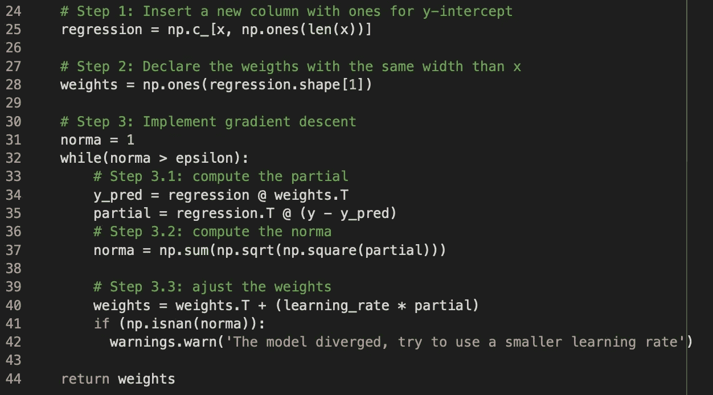

# 使用 Python 从头开始多元线性回归

> 原文：<https://medium.com/analytics-vidhya/multiple-linear-regression-from-scratch-using-python-db9368859f?source=collection_archive---------2----------------------->

图片来自漫威

在上一篇文章中，您学习了如何仅使用 NumPy 从头开始实现一个简单的线性回归。在今天的帖子中，我将展示如何仅使用 NumPy 从头开始实现多元线性回归。

# 多元线性回归

在简单线性回归中，我们希望仅使用一个解释变量“x”来预测因变量“y ”,如下式所示。

y= ax + b

“y”是因变量，“x”是解释变量，“a”是直线的斜率，“b”是截距变量，即“x”为零时“y”的值。在线性回归中，我们希望找到使预测误差最小化的“a”和“b”的值。

多元线性回归是线性回归的扩展，当您有多个解释变量来预测因变量时使用。

图一。多元线性回归公式

其中，对于 i=n 个观察值:

*   Y =是因变量。
*   Xs =是解释变量。
*   *图* 0 =是 y 轴截距(常数项)。
*   其他*a*是每个解释变量的斜率系数。
*   *也称为砝码。*

如果你注意的话，线性回归是多元回归的简单版本，其中从*2*到*p*的所有*项都为零。*

举个例子，我们假设你想卖你的车，想估计你的车值多少钱。你知道诸如车型年份、马力和里程等因素会影响汽车价格。在这种情况下，您可以创建如下所示的多元线性回归。

图二。一个多元线性回归的例子。

## 但是我怎么知道贝塔的最佳值是什么？

这部分类似于简单的线性回归。我们希望使用梯度下降技术来最小化成本函数。如果你不知道这些术语是什么，你可以在[我的媒体帖子](/analytics-vidhya/stop-just-using-machine-learning-and-learn-how-to-build-it-linear-regression-and-gradient-descent-3653de24c6d5)中学习。

从我之前的帖子，你知道成本函数是下面的函数。

图 3。简单线性回归误差函数。其中，n 是数据中的观察次数，ȳ是预测值，y 是实际值

我们的目标是找到使成本函数值最小的‘a’和‘b’的值。简单线性回归的导数，其中:

图 4。简单线性回归的偏导数

对于多元线性回归，过程是相同的，但现在我们将一个 *X* 0 = 1 添加到等式中，这样我们就可以推广成本函数的导数。所以多元线性回归公式变成了:

图五。完全多元线性回归公式

这个函数的导数是

图六。线性多元回归的偏导数。

为了更新权重，我们只需要将导数乘以学习率，然后从之前的权重中减去。

图 7。更新*s 的公式，其中* α是学习率*。*

我们同时更新所有的*和*是很重要的。

这是一个迭代过程，我们能通过使用矩阵使它更有效吗？

# 矢量化多元线性回归

在 Python 中，我们可以使用矢量化来实现多元线性回归和梯度下降。我们可以将 y、s 和 x 转换成矩阵，如下图所示。

图八。矢量化多元线性回归

利用该图像，我们可以使用下面的公式得到预测的 y:

图九。用于获得预测值的矢量化公式

具有以下公式的导数:

图 10。矢量化偏导数。

最后，为了获得更新的权重，我们有下面的等式:

图 11。更新权重的矢量化公式

# 让我们写代码吧

图 12。多元线性回归函数声明

对正在学习数据科学但没有软件工程背景的人的第一条建议是。始终记录您的代码。

因此，我们从一个名为 fit_linear_regression 的函数开始，它将接收 Xs，Ys，学习速率和ε。ε作为一个阈值，当误差小于ε时，我们将停止。

图 13。Python 中的多元线性回归

*   在步骤 1 中，我们将包含 1 的列作为 y 轴截距插入到 x NumPy 数组中。
*   在第二步中，我们初始化，这里我调用权重。权重将是一个 NumPy 数组，包含 x 中变量的数量。
*   在步骤 3 中，我们将更新权重，直到偏导数的范数小于ε。
*   在步骤 3.1 中，我们得到了如图 9 所示的预测值和如图 10 所示的偏导数。
*   在步骤 3.2 中，我们得到了 norma。
*   在步骤 3.3 中，我们更新了权重，如图 11 所示。
*   第 41 行和第 42 行中的 if 是为了在我们输入一个高学习率并且函数发散时警告我们。
*   函数的返回是调整后的权重。

现在我们有了正确的权重，我们如何预测值呢？

# 做预测

图 14。函数进行预测

要进行预测，我们只需在权重数组(不包括 y 截距的最后一个值)和之后转置的 Xs 值之间进行点积，就可以得到这个结果，并将其与 y 截距相加。

现在我们从头开始实现了我们的多元线性回归，但是它与 sklearn 相比如何呢？

# 与 sklearn 比较

图 15。来自 sklearn 函数和我们函数的 MSE

第一个是来自 sklearn 模型的[均方误差](https://en.wikipedia.org/wiki/Mean_squared_error)，第二个是来自我们函数的 MSE。

正如我们所看到的，它们是相似的。我们的函数 MSE 只比 sklearn 大 0.004。

# 结论

在这篇文章中，你学到了

1.  什么是多元线性回归。
2.  我们如何拟合多元线性回归模型。
3.  矢量化多元线性回归公式。
4.  如何只用 Python 和 NumPy 实现自己的多元线性回归？

你可以在这个 [Colab](https://colab.research.google.com/drive/1uO-f2GLgBqSXiBmI46MaHHDJccJMdy11?usp=sharing) 笔记本里看到用来写这篇文章的代码。

如果你喜欢你所读的，一定要👏下面，分享给你的朋友，关注我，不要错过这一系列的帖子。