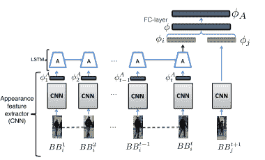
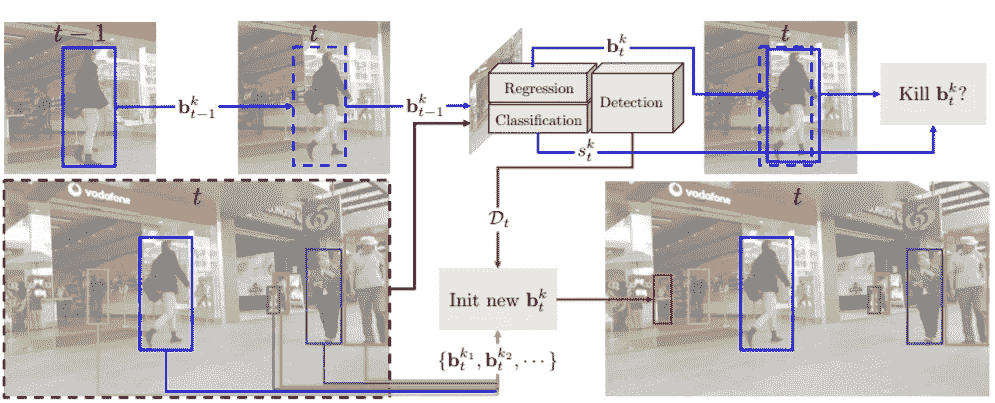
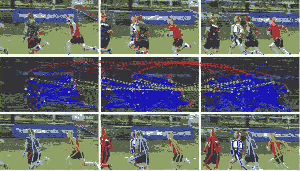
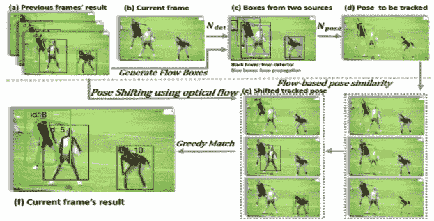

# 多目标跟踪方法…

> 原文：<https://medium.com/analytics-vidhya/multiple-object-tracking-approaches-71375c1cd4eb?source=collection_archive---------6----------------------->

随着人工智能的出现，从视频中跟踪物体成为广泛研究的课题之一。该问题分为两个部分:检测每个视频帧中的对象，并随着时间的推移关联相同的对象以进行跟踪。

**追踪=检测+关联**

关联算法(最常见是匈牙利算法)将连续帧中的每个对象关联起来。为了对单个对象的帧进行关联，不同的线索被认为是匹配的，如外观、运动、姿势等。

有两种类型的跟踪方法:1)自顶向下的方法，2)自底向上的方法。自顶向下的方法首先检测边界框，然后在连续的帧中关联边界框。自下而上方法使用更细粒度的线索来检测和关联帧上的对象。特别是，它使用姿势或像素线索进行关联。

我从这两种方法中征集了一些论文。

**自上而下的跟踪方法:**

论文 1。追踪不可追踪的线索:学习追踪具有长期依赖性的多个线索[ [链接](https://arxiv.org/abs/1701.01909)

论文 2。没有铃声和哨声的跟踪[ [链接](https://arxiv.org/abs/1903.05625)

图 1(论文 1):直到时间帧 t 的单个对象的检测框与 t+1 时间帧中的检测相关联。本文使用 LSTM 来利用对象的时间信息进行匹配。

图 2(论文 2):这篇论文把一个探测器转换成了追踪器。对象在连续的帧中会轻微移动。因此帧 t-1 和 t 中的各个检测到的物体将彼此高度重叠。它们使用来自 t-1 帧的单个对象的检测建议位置，并在帧 t 中执行检测。如果检测得分高，则继续跟踪，否则启动新的跟踪。

**自下而上的跟踪方法:**

3.PoseTrack:联合多人姿态估计和跟踪

4.人体姿态估计和跟踪的简单基线

图 3(论文 3):他们检测连续帧中的所有身体部位，并形成具有检测节点、当前帧中身体部位的节点之间的边(空间边)和时间帧中相同类型身体部位之间的边(时间边)的图。然后，切割图形，使节点和边的数量保持最少。

图 4(论文 4):他们使用光流和检测交并来选择当前需要跟踪的帧姿态。然后在对象姿态关键点之间执行贪婪匹配。

***结论:*** 自底向上的方法匹配在计算上是昂贵的，因为随着时间的推移，需要对多个对象的许多关键点进行匹配。因此，从底层方法很难得到可行解。另一方面，自上而下的方法使用检测到的边界框来关联对象，即使使用简单的匈牙利算法也能更快地优化。