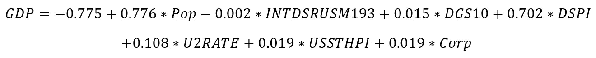

# 利用宏观经济变量预测 GDP 的多元回归模型(上)

> 原文：<https://medium.com/analytics-vidhya/multiple-regression-model-for-predicting-gdp-using-macroeconomic-variables-part-1-7bfef9a527e3?source=collection_archive---------0----------------------->

来源:https://unsplash.com/

## **简介**

这篇短文探讨了如何使用多元线性回归技术预测一个国家的国内生产总值。具体来说，我们研究其他宏观经济变量，如人口、利率、失业率等，是否可以用来预测一个国家的 GDP。线性回归是一种统计模型，用于寻找输入变量(也称为自变量/解释变量)和输出变量(因变量/响应变量)之间的关系。与用于预测分类结果的逻辑回归模型相比，线性回归模型用于预测连续变量。

当我们只有一个输入变量时，这是一个简单的线性回归，它的方程是这样的:

*其中 Y 是输出变量，X 是输入变量，beta_0 是截距(即当为零时的预测值；β_ 1 是斜率/回归系数(即，当增加/减少时预期变化的速率。E 是期望为零的误差项(E(e)=0(即，期望回归系数的变化应该为零)。*

对于由一个以上的独立变量组成的多元线性回归，具有 k 个线性独立预测变量的一组观察值的一般方程的形式为:

*需要注意的是，对于因变量和自变量之间的关系，上面的参数是线性的。* *一般线性模型的矩阵形式写成；*

**参数估计**

线性回归的基本模型是“最小二乘估计”。它对每个观测值(数据点)到线的所有垂直偏差进行平方和求和，目标是最小化误差。最小二乘估计通常用于拟合回归线。

**正规方程**

表达式的正规方程组；

正规方程简单地表示为:

**举例:**考虑四对数据点{(-1，-1)，(0，-1)，(1，1)，(2，1)}。找到该数据的最佳拟合线性关系的标准方程系统的形式为: *b=Ax，*可表示为；

**注:**

**在 R 国实施:**

已经建立了关于线性回归的充分的理论背景，我们现在在 R 中实现上面的例子来解释如何使用统计编程包来解决这个问题。第一种方法使用 R 中的“lm”函数，另一种方法使用矩阵方法，如上所述。

● **使用 R** 中的“lm”函数:我们可以简单地创建 X 和 Y 向量(数据点)并应用“lm”函数来获得与我们之前获得的理论方法相同的结果(如下所示)。

●或者，我们可以使用 R 中的" **matrix()** "函数创建一个向量矩阵，然后应用" lm "函数来获得相同的结果，如下所示。

**使用多元线性回归处理宏观经济变量**

**案例分析:**

GDP 和其他宏观经济变量之间有什么关联？

**数据:**

数据:国内生产总值(美国经济分析局)

来源:[https://fred.stlouisfed.org/series/GDP](https://fred.stlouisfed.org/series/GDP)

**注:**考虑的每个宏观经济变量的数据被下载并合并到一个 excel 表格中，形成一个表格。使用数据管理/争论技术添加了额外的宏观经济变量，以确定它们如何影响我们的模型。

数据涵盖的时期:1953 年 4 月 1 日至 2021 年 1 月 1 日

**数据转换&处理:**

缺失值使用以下几种方法进行处理:

-平均(用非缺失值的平均值替换缺失值-如果没有异常值)

-如果存在异常值，用非缺失值的中值替换缺失值。

-在 R 中，我们可以使用“鼠标包”来处理丢失的值。该软件包使用数据集中其他变量的一些信息来估算缺失的数据。

在这个项目中，我们使用了“鼠标包”。为缺失值创建一个数据框架，然后“mice 包”对缺失数据进行估算，以确保不再有任何缺失数据(参见 R 代码)。

**探索性分析:**

该数据由 272 条记录和 28 个特征组成。我们对建模多个自变量感兴趣，以确定这些变量和因变量(GDP)之间的关系。我们还检验了模型中独立变量的共线性和相互作用。为了帮助理解变量之间的关系，我们使用了如下所示的散点图。

基于我们的探索性分析，并考虑到我们正试图预测一个连续变量，我们得出结论，我们对这部分研究的最佳选择是线性回归模型。

**基本型号:**

我们开始回归分析，首先用下面列出的变量模拟 GDP。随后，在建立初始模型后，我们添加了额外的宏观经济变量，这些变量可能会提高模型的性能。

**型号:**

因变量:国内生产总值(年百分比)—国内生产总值

自变量:人口(年百分比)— Pop、利率(年百分比)— INTDSRUSM193、10 年期国债恒定到期利率— DGS10、可支配个人收入(年百分比)— DSPI、失业率(年百分比)— U2RATE、所有交易房价指数— USSTHPI

**型号:**

● **p 值:**可支配收入、失业率和房价指数(HPI)具有高度显著性，如表 1 所示。然而，人口利率和到期利率变量都是适度显著的，而利率似乎不显著。

● **多重共线性检查:**我们获得了方差膨胀因子(VIF)来检查自变量之间是否存在多重共线性。研究表明，VIF=1 表示没有多重共线性，VIF = 1.0 到 5.0 表示中度共线性，而 VIF > 5 表示独立变量高度相关。在此分析中，我们将 VIF 的阈值设置为 2。因此，我们假设 VIF > 2 似乎表示多重共线性。在表 1 中，我们得出的结论是，由于每个 VIF≤2，所以每个独立变量彼此不相关。类似地，下面的 VIF 柱状图显示没有一个变量突破阈值线(> 2)。R (83.7%)意味着约 84%的 GDP 变化是由预测变量的变化解释的。

**改进模型**

为了确定我们是否可以提高模型的性能，我们在基础模型中一次添加一个额外的变量:

● **企业利润(CP):** 预测变量是“企业税后利润(不含 IVA 和 CCAdj)年百分比”(Corp)。

● **10 年盈亏平衡通胀率(T10YIE):** 预测变量为“10 年盈亏平衡通胀率年百分比”(T10YIE)。

**向现有数据集添加新宏观经济变量的流程:**

为了将附加变量合并到 R 中的现有数据中，我们执行了以下步骤:

●准备了一个工作数据框架，以便将新变量与现有宏观经济变量正确合并。

●确保将“日期”列设置为“主键”，以便在导入新数据时，“日期”列采用日期格式，而不是因子格式。这一步是必要的，因为并非所有的变量在完全相同的时间范围内都可用。

●我们检查了新的合并数据，以确保数据完全一致。例如，通过检查丢失的值并使用“mice 包”填充它们，如果它们存在的话。

●执行的所有步骤都记录在作者的 [GitHub 页面](https://github.com/msamiyu/MULTIPLE-REGRESSION-MODEL-FOR-PREDICTING-GDP-USING-MACROECONOMIC-VARIABLES-PART-1)上附带的 R 代码中。

**扩展模型 1-(基础模型加公司利润变量)**

该模型是基本模型的扩展。这个新模型使用所有用于基本模型建模的变量和一个附加变量(公司利润变量)。

这个新模型的输出如下所示:

型号:

● **p 值:**如表 2 所示，可支配收入、失业率、房价指数、企业利润(新增)具有高度显著性。然而，人口利率和到期利率变量都是适度显著的，而利率似乎不显著。

● **多重共线性检查:**从表 2 中，基于阈值，每个 VIF < 2 显示没有多重共线性。类似地，图 2 中的 VIF 条形图显示没有一个变量穿过阈值线(> 2)。我们观察到 R (84.4%)和调整后的 R (83.9%)比表 1 中的略有增加。这表明新变量略微提高了模型拟合度。

**扩展模型 2-(扩展模型 1 加上 10 年盈亏平衡通货膨胀率)**

该模型是上述扩展模型 1 的扩展。这个新模型使用了上述扩展模型 1 建模所用的所有变量和一个附加变量(10 年盈亏平衡通货膨胀率)。

这个新模型的输出如下所示:

型号:

● **p 值:**我们看到估计系数的精度降低了。如表 3 所示，可支配收入、失业率和房价指数仍然非常显著，而人口比率具有中等显著性，利率具有较低的显著性。然而，到期利率、公司利润和通货膨胀率似乎没有统计学意义。这可以追溯到添加新变量时的多重共线性效应。

**注意:**由于多重共线性会影响 p 值和回归系数，因此我们不能相信获得的 p 值，即使它不会影响我们的预测。

● **多重共线性检查:**从表 3 中，根据我们为此研究设置的 VIF 阈值，只有人口、成熟率、可支配收入和失业率变量具有 VIF < 2，这表明没有多重共线性。VIF≤2 的利率和房价指数表现出很少或没有多重共线性。然而，企业利润和通货膨胀率变量显示了与 VIF 的某种程度的多重共线性> 2。尽管研究表明，VIF≤5 具有中度共线性，用于研究目的。我们观察到 R (90.5%)和调整后的 R (89.4%)比我们在表 2 中看到的有所增加。这表明新变量提高了模型拟合度，即使存在某种程度的适度可接受的多重共线性。

**结论:**

在这篇文章中，我们研究了如何使用其他宏观经济变量来预测 GDP。为了达到这个目的，我们使用了多元线性回归分析。我们首先建立了一个基础模型，然后扩展了基础模型，以灌输额外的变量来确定我们是否可以改善我们的基础模型的性能。我们还通过在 5%的显著性水平上比较 VIF 值和 p 值，评估了每个额外变量如何影响我们的回归拟合。多元线性回归模型似乎是用于确定从属和独立特征之间的线性关系的合适模型。

**参考文献:**

●弗雷德经济数据:[数据来源](https://fred.stlouisfed.org/series)

●费利佩·减压阀:[解读 R 中的线性回归模型](https://feliperego.github.io/blog/2015/10/23/Interpreting-Model-Output-In-R)

●作者的 Github: [GitHub](https://github.com/msamiyu/MULTIPLE-REGRESSION-MODEL-FOR-PREDICTING-GDP-USING-MACROECONOMIC-VARIABLES-PART-1)