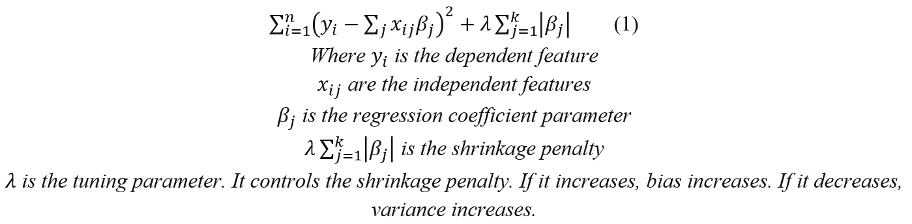
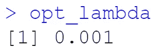
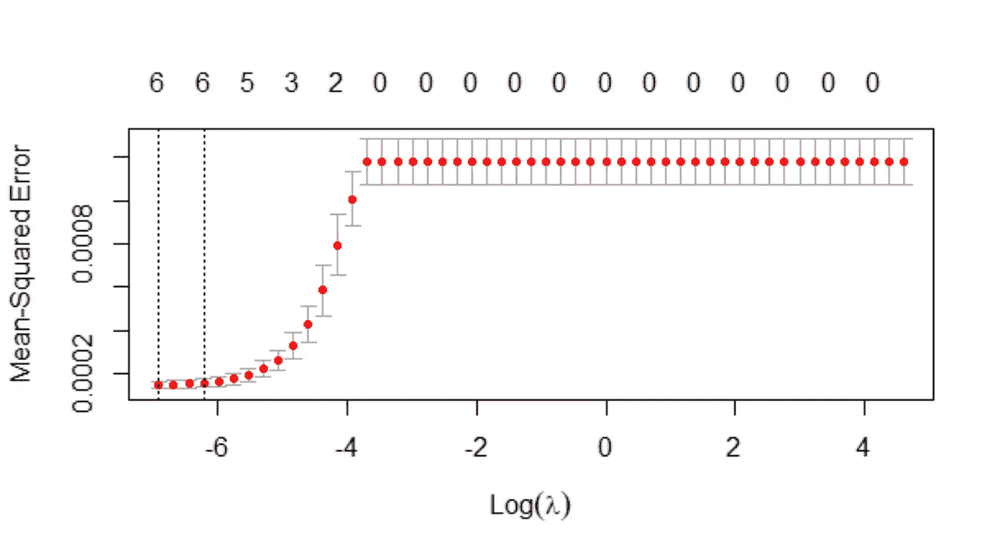
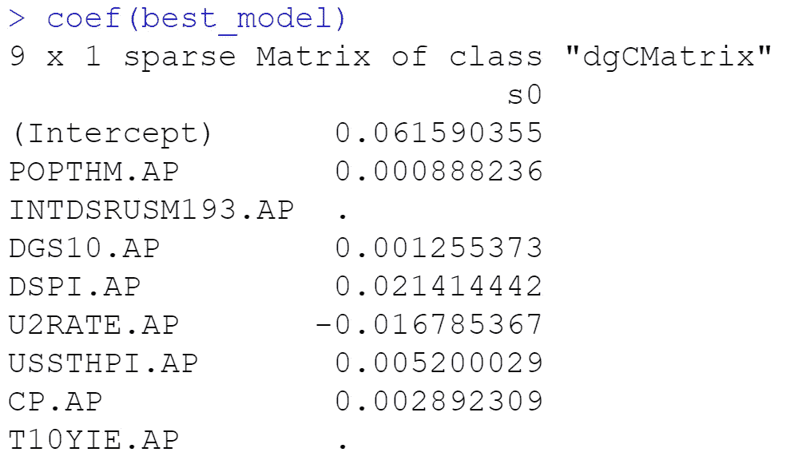
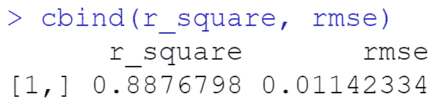
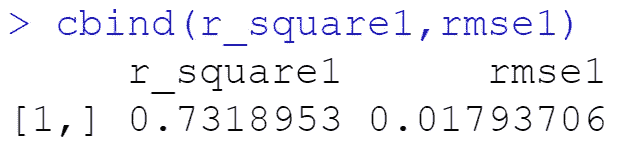

# 利用宏观经济变量预测 GDP 的 LASSO 回归模型

> 原文：<https://medium.com/analytics-vidhya/multiple-regression-model-for-predicting-gdp-using-macroeconomic-variables-part-2-59996c61b862?source=collection_archive---------4----------------------->

来源:https://www.nxtmine.com/

# **简介**

幸运的是，使用机器学习(ML)算法来检测与驱动业务的变量相关的模式的能力，使其在预测与业务决策相关的风险因素方面非常有用。我们的兴趣是识别和评估宏观经济变量对 GDP 的影响。这个项目的这一部分侧重于使用机器学习方法，通过宏观经济变量来预测 GDP。这是[第一部分](/@msamiyu2/multiple-regression-model-for-predicting-gdp-using-macroeconomic-variables-part-1-7bfef9a527e3)的延续，在第一部分中，我们使用多元线性回归模型预测了六个预测值的 GDP，增加了两个新的宏观经济变量，以观察每个变量在 p 值、r 平方和调整后 r 平方方面对基础模型拟合的敏感性。根据为研究设置的阈值(VIF > 2 ),观察到的方差膨胀因子(VIF)显示了某种程度的多重共线性。因此，在本次会议中，我们有兴趣使用正则化回归模型(Lasso Regression)，一种机器学习方法来处理这一点。Lasso 回归向残差平方和添加了收缩惩罚，由于多重共线性，通过强制回归系数为零来移除某些预测变量。随机森林技术主要像套索模型一样进行特征选择，但我们更感兴趣的是对观察到的宏观经济变量的解释和预测。

# **数据预处理**

数据:宏观经济变量(美国经济分析局)

来源:[宏观经济变量——FRED](https://fred.stlouisfed.org/series)(合并到 excel 表格中的变量——转换为年度百分比:28 列 272 行)。

将数据集分为训练(70%)和测试(30%)后，缺失值通过使用 R 中的“mice 包”进行插补来单独处理。为缺失值创建一个数据框，然后“mice 包”对缺失数据进行插补，以确保不再有任何缺失数据(参见 [GitHub](https://github.com/msamiyu/MULTIPLE-REGRESSION-MODEL-FOR-PREDICTING-GDP-USING-MACROECONOMIC-VARIABLES-PART-2) 中的 R 代码)。

# **测量**

**因变量**:国内生产总值(GDP)——年百分比(GDP。美联社)

**自变量**:人口比率(POPTHM) —年百分比(POPTHM。美联社)

利率(INTDSRUSM193) —年百分比(INTDSRUSM193。美联社)

10 年期国债固定到期利率(DGS10) —年百分比(DGS10。美联社)

失业率(U2RATE) —年百分比(U2RATE。美联社)

所有交易房价指数(USSTHPI)-年百分比(USSTHPI。美联社)

公司税后利润(CP) —年百分比(CP。美联社)

10 年盈亏平衡通货膨胀率(T10YIE) —年百分比(T10YIE。美联社)

# **功能选择**

自变量或预测值由其他宏观经济变量组成，即人口率、利率、国债固定到期率、失业率、房价指数、企业利润和通货膨胀率，而因变量是国内生产总值，每个变量都转换为年度百分比。

**模型:**套索回归模型的形式为:

**注:**

*   调整超参数以获得用于构建 Lasso 回归模型的最佳 lambda 值。
*   R 中用于计算最佳λ的“glmnet”库默认使用 alpha 来表示上面(1)中的λ。
*   对于 Lasso 回归，出于“glmnet”库计算的目的，alpha 设置为 1。

# **模型验证**

● **交叉验证(CV):** 数据集分为训练集(原始数据的 70%)和测试集(30%)。该模型在训练集上进行训练，然后在测试集上进行测试。为了确保原始数据集中的每个观察/记录都可以出现在训练和测试集中，我们应用了 **K-Fold CV** 。

# **车型性能**

模型的性能应基于以下指标:

●**R-Square**-它是一种相对拟合度，显示了模型中的方差与总方差的对应关系。较高的 R-Square 表明更适合我们的回归模型。

● **RMSE(均方根误差)** —这是一种绝对的拟合度量，显示了模型无法解释的方差的标准偏差。较低的 RMSE 表明更适合我们的回归模型。

# **结果**

*   **最优λ**:对列车数据进行 10 重交叉验证后，得到的最小均方误差(MSE)的最优λ值为:

最佳值的列车 MSE 图如下所示；

*   **重要的独立变量**:下面的输出显示了对预测更重要的独立变量(显示的值)以及那些系数将被缩减的变量，Lasso 模型将移除它们的预测值。输出显示利率(INTDSRUSM193)和通货膨胀率(T10YIE)变量被 Lasso 模型收缩和去除。

**车型性能**

*   **列车数据:**

从上面的输出中，r 平方(88.8%)显示，我们训练的宏观经济数据中约有 89%符合 Lasso 回归模型。而 RMSE (0.0114)表明约 1.1%的方差无法用我们的模型解释。

*   **测试数据:**

从上面的输出中，r 平方(73.2%)表明，我们的测试宏观经济数据中约有 73%符合 Lasso 回归模型。而 RMSE (0.018)表明约 1.2%的方差无法用我们的模型解释。

# **结论**

在这篇短文中，我们研究了如何使用其他宏观经济变量来预测 GDP。为了实现这一目标，我们使用套索回归技术扩展了本文第一部分的[中开发的模型，通过在 5%的显著性水平上比较 VIF 值和 p 值来评估每个额外变量如何影响我们的回归拟合。Lasso 回归模型似乎是一种合适的正则化技术，它通过将一些参数强制为零来帮助克服线性回归基础模型中的多重共线性效应，并帮助我们进行要素选择。获得的 r 平方似乎更可靠，训练和测试数据的 RMSE 给出了最小的预测误差。它还可以防止普通回归模型输出中可能出现的过度拟合。相比之下，机器学习方法有助于预测准确性。](/@msamiyu2/multiple-regression-model-for-predicting-gdp-using-macroeconomic-variables-part-1-7bfef9a527e3)

# **参考文献**

*   弗雷德经济数据:[数据来源](https://fred.stlouisfed.org/series)
*   Deepika Singh: [线性，套索和，带 R 的脊回归](https://www.pluralsight.com/guides/linear-lasso-and-ridge-regression-with-r)
*   作者的 GitHub: [GitHub](https://github.com/msamiyu/MULTIPLE-REGRESSION-MODEL-FOR-PREDICTING-GDP-USING-MACROECONOMIC-VARIABLES-PART-2)