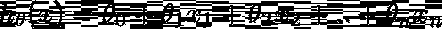
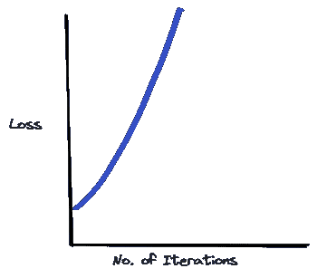
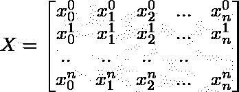

# 多元线性回归

> 原文：<https://medium.com/analytics-vidhya/multivariate-linear-regression-1c06b12cb982?source=collection_archive---------3----------------------->

真实世界的数据集总是有多个变量或要素。当一个回归问题的结果有一个以上的特征/变量要考虑时，就称为多元回归。

单个变量的假设函数是，

在多变量 n 的情况下，x 变成一个向量或包含 n 个变量作为向量元素的列。

对于 n 个特征，参数也变成向量，

多变量的假设函数，

为了方便起见，我们添加了 x 的第零个特征，它总是 1。因此，假设函数变成了，

在向量形式中，假设函数可以写成:

# 多变量梯度下降

使用该算法可以找到多个变量的梯度下降，

> 重复直到收敛:

并同时更新，

## 如何检查梯度下降是否工作正常？

获得梯度下降的迭代可以因问题而异。一些可能需要很少的迭代次数来达到全局最小值，而一些可能需要大量的迭代。

为了检查它们是否正常工作，计算梯度下降，并在图表上绘制特定参数值的损失函数值。

如果梯度下降正常工作，那么损失函数的值应该随着每次迭代而减小。

如果图看起来随着迭代次数的增加而增加，那么梯度下降没有按预期工作。在这种情况下，我们必须选择较小的 alpha 值。

有时，随着迭代，图可能会重复地减少和增加。这种情况还表明 alpha 值很高，我们必须降低 alpha 值，这样参数才会收敛。

为了得到最佳的阿尔法值，我们可以绘制一系列阿尔法值的梯度下降图。无论哪个值导致损失函数快速下降，我们都可以最终确定α的值。

除了这种方法，我们还可以使用自动收敛测试来检查损失函数是否收敛。选择比如 0.001 的阈值，并且如果损失函数的减少小于阈值，那么我们可以假设该函数是收敛的。但在实践中，很难选择阈值，以前的方法很好地找到梯度下降的效率。

## 特征缩放

假设我们有一个介于范围(0-5000)之间的特征 x1 和一个介于范围(1 -10)之间的特征 x2。如果我们对此函数进行梯度下降，cos 函数将具有高瘦轮廓(如果在轮廓图中表示)。从函数上的任何一点达到全局最小值都要花很多时间。

将要素的值除以其值的范围(要素的最大值-要素的最小值)是一种缩放方法。

一般来说，我们可以将每个特性放在 2 到 6 个值之间的范围内，或者任何值之间的范围内。举个例子，

## 均值归一化

一种缩放方法，其中用 x_i 和特征 x 的平均值之差替换 xi。这使得特征的平均值约为零。

## 特征和多项式回归

我们不必强制使用所有给定的特性。根据我们的问题陈述，我们总是可以忽略一些特性或添加新特性(可以是其他特性的组合)。

类似地，我们不必对数据拟合直线，因为实际输出可能不在一条直线上。我们可以用多项式函数来更好地拟合数据集。

直线拟合，

我们可以在现有特征的基础上创建新的特征，例如，

如前所述，我们可以尝试不同的多项式函数来更好地拟合数据，并将它们进行比较，看哪一个拟合得最好。

二次拟合，

三次拟合，

平方根拟合，

应用这些多项式函数时，重要的是特性的值应在较小的范围内。因此，必须小心地进行特征缩放。

# 正态方程

梯度下降法是寻找损失函数最小的最低参数值的方法之一。参数值在每次迭代中都会改变，直到识别出全局最小值。正规方程试图寻找最少的参数值，而不需要连续迭代。

一般来说，让我们考虑一个数学二次函数。我们通过使它等于零来求解这个函数。

类似地，在正规方程中，我们取损失函数的偏导数，对于每个参数将其赋值为零，并求解每个参数。

通过使用微积分求解，我们可以得到最小值，

在哪里，

如果我们使用正规方程方法，就没有必要执行特征缩放来将特征值的范围缩小到几个值以内。

当比较正规方程和梯度下降时，

*   我们不必选择学习率α，并在正规方程中进行大量迭代。因此，它节省了大量的时间和复杂性。
*   但是梯度下降适用于大量的要素。而如果 n 较大，则计算正规方程较慢，并且成本几乎为零，

因为我们需要计算，

实际上，如果特征的数量超过 10，000，那么我们可以考虑转移到梯度下降。

## 正规方程与不可逆性

当我们通过使用正规方程方法找到最小参数值来计算最小损失函数时，

有时，如果结果值是奇异矩阵或退化矩阵，则 X 的逆(转置)是不可能的。为了解决这种情况，我们不得不采取伪逆。**伪逆**可以通过用奇异值分解(SVD)方法分解所得的不可逆矩阵来获得。

我们还可以通过找出其奇异性背后的原因，将不可逆的结式矩阵转换为可逆矩阵。

*   有时可能存在冗余特征，使得矩阵线性相关。我们可以删除或更改这些功能。
*   有时可能有太多的特征(训练数据的数量可能小于或等于特征的数量)。在这种情况下，我们可以删除一些特征。

*注:本文是*[*# 30 daysofdata*](https://github.com/swaathi317/30DaysOfData)*的一部分，文章内容是我自己从* [*Andrew NG 机器学习课程*](https://www.coursera.org/learn/machine-learning) *中的笔记。*