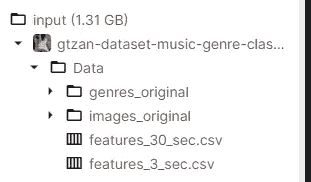
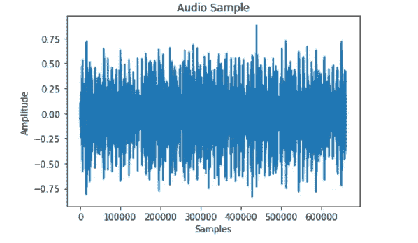
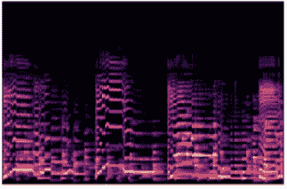
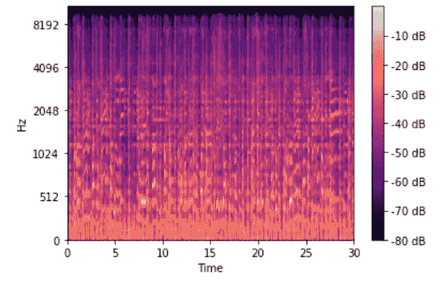
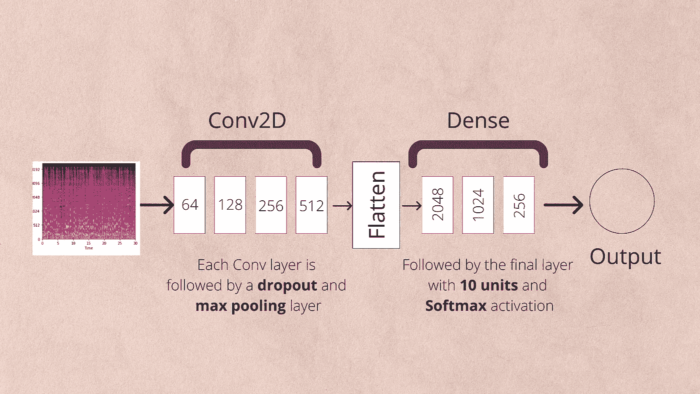
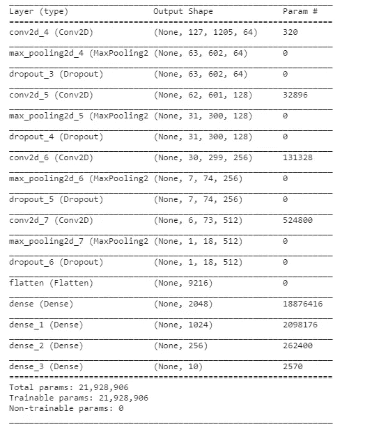
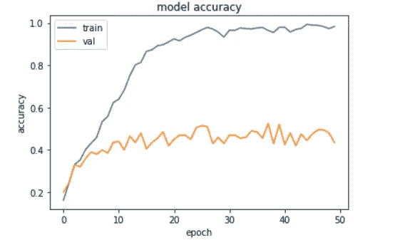

# 使用深度学习的音乐分类| Python

> 原文：<https://medium.com/analytics-vidhya/music-classification-using-deep-learning-python-b22614adb7a2?source=collection_archive---------2----------------------->


深度神经网络已被用于各种分类任务，帮助人类做出重要决定或自己做出这些决定。

不同音乐流派之间的区别是我们可以应用深度学习的一个任务。我决定开始这个深度学习项目，学习音频分类和处理。

现在我在这里与你分享我的发现。

本文将包含以下小节:

*   **探索 GTZAN 数据集。**
*   **加载和扩充数据。**
*   **建造我们的模型**
*   结果和结论。

让我们开始吧。

## GTZAN 数据集

GTZAN 数据集是一组 **1000 个不同的音频文件，即 10 种不同类别的**音乐；

*   布鲁斯音乐
*   经典的
*   国家
*   迪斯科舞厅
*   嘻哈
*   爵士乐
*   金属
*   流行音乐
*   瑞格舞
*   岩石

它由每节课 100 个文件组成，每个音频片段长 30 秒。



数据集的目录结构

正如上面的快照所示，我们这里有 4 种不同类型的数据。

'**流派 _ 原创'**文件夹由 1000 个原创音频文件组成，这些文件根据其流派(标签)被分隔到不同的文件夹中。

' **images_original'** 文件夹由这些音频文件的 Mel 光谱图的图像组成。

“ **features_30_sec.csv** ”和“ **features_3_sec.csv** ”各包含从音频文件中提取的不同特征，如不同 *melspec* 分量的平均值和标准偏差以及*滚降频率。*

让我们绘制一个音频文件；



绘制的音频样本

让我们看看 *images_original* 文件夹包含了什么。我们将绘制其中一幅图像。



一个爵士音乐文件的 Mel 谱图

上图显示了使用 Mel 谱图的音频文件的图示。

## 加载数据

即使我们有可用的光谱图，我仍然会应用增强并自己提取特征。

增强参数以及模型架构改编自 *Marcharla Vaibhavi 和 P. Radha Krishna* 在“ [***使用带有数据增强的神经网络进行音乐流派分类***](https://www.researchgate.net/profile/Pisipati-Radha-Krishna/publication/353244342_Music_Genre_Classification_using_Neural_Networks_with_Data_Augmentation_A_Make_in_India_Creation/links/60ef05789541032c6d3e78ff/Music-Genre-Classification-using-Neural-Networks-with-Data-Augmentation-A-Make-in-India-Creation.pdf) ”中的工作

让我们首先导入所需的库。

**audiomentations** 库是一个易于使用的工具，允许我们以各种方式增加音频文件。

让我们创建函数来扩充我们的数据。

*add_noise* 和 *pitch_shift* 实例现在可以用来扩充任何音频文件。

现在我们需要为训练和测试准备数据。

它将按以下顺序完成:加载音频文件→分成测试和训练元素→扩充训练数据→从测试和训练集中提取特征→对标签进行编码。

相当长的旅程！


照片由[斯潘塞·因布罗克](https://unsplash.com/@spencerimbrockphoto?utm_source=unsplash&utm_medium=referral&utm_content=creditCopyText)在 [Unsplash](https://unsplash.com/s/photos/music?utm_source=unsplash&utm_medium=referral&utm_content=creditCopyText) 上拍摄

让我们从加载一个文件开始，检查如何提取它的 mel-spectrogram。

在这里，我们已经将声谱图应用到先前加载的同一个文件中。



梅尔光谱图

现在我们编写一个例程，加载所有的音频文件及其标签。

加载完整的音频数据

数组 X 和 Y 现在包含了我们的音频数据和它们对应的标签。

**X 的形状:(999，617400)**

**Y 的形状:(999，10)**

现在，我们将这些数据分成测试集和训练集，并扩充训练集。

```
from sklearn.model_selection import train_test_split #split the data using the SkLearn libraryaudio_train, audio_test, y_train, y_test = train_test_split(\
     X, Y, test_size=0.20, random_state=6)
```

来自训练数据增强和特征提取

**！！上面的代码可能需要几分钟才能完成，因为它要处理 700 个文件！！**

现在我们有以下变量:

x _ train→Mel-spectrogram 形式的所有训练数据。(形状= 2397，128，1206)

y _ train→训练数据的标签

但是我们还需要从测试数据中提取 mel-spec 特征。

从测试数据中提取特征

请注意，这次我们没有增加数据，因为测试数据应该保持原始状态，以便进行最佳评估。

```
#converting the test and train data to numpy array
X_train = np.stack(X_train)
X_test = np.stack(X_test)
```

还有最后一步。我们的标签仍然是文本形式。我们需要对这些数字进行编码。好在什么都有图书馆:d。

现在只剩下最后一件事了。Keras conv2d 层要求我们为数据增加一个额外的维度。相当简单的整形过程。

```
X_train = X_train.reshape(X_train.shape[0],X_train.shape[1],X_train.shape[2],1)
X_test = X_test.reshape(X_test.shape[0],X_test.shape[1],X_test.shape[2],1)
```

## 构建模型

现在我们的数据已经准备好了，我们可以继续构建和编译模型了。我们将使用 Tensorflow 的 Keras API 来构建模型。

如前所述，模型架构取自一篇研究论文，文章末尾添加了一个链接。



模型架构

让我们编码这个。



模型摘要

现在我们只需要训练它。

训练一个 2D CNN 模型需要很长时间，我在一个笔记本上做了我的处理。在开始培训之前，请确保您已经设置了 GPU 环境。

最后，让我们画出精度图。

## 结果和结论



训练和验证准确性

我们当前模型的最高精度为 **52.5 %。这证明了音乐分类是一项艰巨的任务。即使有这样一个复杂的模型和扩充的数据，我们也只能勉强跨过 50 %的门槛。**

实现的论文实际上提到了六种不同的增强技术。我们只使用了 2 个，也许使用更多的这些可以改善结果。你可以自由地进行实验。

## 最后的想法

这种型号有很多种可能性可以试用。其中之一是从 CNN 模型转移到 RCNN。其他技术可以尝试提取 Mel 谱图之外的特征。

如果你发现任何这样的新技术，请在评论中提及它们。

论文参考:[*奎师那，Macharla Vaibhavi P. Radha。"使用数据增强的神经网络进行音乐流派分类."(2021).*](https://www.researchgate.net/profile/Pisipati-Radha-Krishna/publication/353244342_Music_Genre_Classification_using_Neural_Networks_with_Data_Augmentation_A_Make_in_India_Creation/links/60ef05789541032c6d3e78ff/Music-Genre-Classification-using-Neural-Networks-with-Data-Augmentation-A-Make-in-India-Creation.pdf)