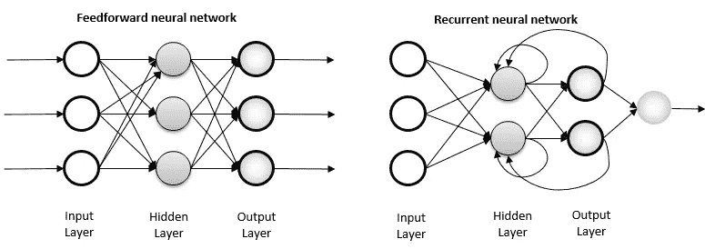

# LSTM RNN 的音乐一代

> 原文：<https://medium.com/analytics-vidhya/music-generation-with-lstm-based-rnn-3fa967bc1f37?source=collection_archive---------24----------------------->

大家好。在这篇文章中，我将尝试解释我所知道的基于 LSTM(长短期记忆)的 RNN(递归神经网络)的音乐生成。让我们首先检查我在模型的训练阶段使用的数据集包含什么样的信息。

## 关于数据集

众所周知，音乐是用音符来表现的。我更喜欢在数据集中使用另一种音符系统，称为 ABC 符号，而不是 Do、Re、Mi 等风格的经典音符。在 ABC 符号中，数字和特殊字符与字母符号 A 到 G 一起用来表示给定的音符。每个字母对应古典音符中的 Do、Re、Mi 等古典音符。除了组成旋律的音符，其他单位作为附加信息；参考号、作曲家、出处、音符长度、速度、节奏键、装饰音等。这些值中的每一个都构成了我们数据集的特征。ABC 记谱法经常被用来表现传统的民间音乐。我使用的数据集是从[科布的爱尔兰民间音乐](https://cobb.ece.wisc.edu/irish/Tunebook.html)【1】中编译而来的。下面你会看到数据集中用 ABC 符号表达的音乐样本。

```
X:1 
T:Alexander's 
Z: id:dc-hornpipe-1 
M:C| 
L:1/8 
K:D Major
(3ABc|dAFA DFAd|fdcd FAdf|gfge fefd|(3efe (3dcB A2 (3ABc|! dAFA DFAd|fdcd FAdf|gfge fefd|(3efe dc d2:|! AG|FAdA FAdA|GBdB GBdB|Acec Acec|dfaf gecA|! FAdA FAdA|GBdB GBdB|Aceg fefd|(3efe dc d2:|!
```

这里，我们面临一个问题:我们的计算机能从包含字母和特殊字符的数据中理解吗？既然我们要用权重值乘以特征，那么 B x 0.23 将是一个不合逻辑的运算，这似乎不太可能，不是吗？为此，我们必须把数据转换成计算机能理解的格式。就像计算机把图像表示成包含像素值的矩阵一样，我们会给数据集中的每个音符赋予一个数值，不管是字母还是特殊字符。这种操作在文献中被称为编码。

为了执行编码过程，我们首先借助下面的代码片段将所有歌曲收集到一个列表中。把这个列表中的每个原始字符提取出来，从小到大排序后，我们把它扔进`vocab`变量。`vocab`变量包含独特的字符，它们携带信息并代表我们的歌曲。然后我们定义允许我们给这些唯一的字符赋值的操作，也就是执行编码过程:`char2id`，它把字符映射到数字，还有，`idx2char`，它把数字映射到字符。

下面您可以看到数据集中的每个独特的字符及其相应的数值。

```
{   
   '\n':   0,
   ' ' :   1,
   '!' :   2,
   '"' :   3,
   '#' :   4,
   "'" :   5,
   '(' :   6,
   ')' :   7,
   ',' :   8,
   '-' :   9,
   '.' :  10,
   '/' :  11,
   '0' :  12,
   '1' :  13,
   '2' :  14,
   '3' :  15,
   '4' :  16,
   '5' :  17,
   '6' :  18,
   '7' :  19,
   ... 
}
```

让我们将上述操作合并成一个函数，以便更加模块化和有组织性。

按照前面指定的字符编码过程，我们的样本数据包括字母、数字和特殊字符，如下所示。

```
'X:1\nT:Alex' <---encoding---> [49 22 13  0 45 22 26 67 60 79]
```

这样，在对数据集执行预处理操作之后，我们现在就可以使用数据集了。

我们的下一步是将包含歌曲的文本分解成我们将在实际训练中使用的样本批次。我们提供给模型的每个输入字符串都包含与`seq_length`一样多的文本字符。此外，为了预测下一个字符，我们需要为每个输入序列定义一个目标序列，用于模型的训练。对于每个输入字符串，对应的目标字符串将包含相同长度的字符，除非有一个字符被向右移动。

要做到这一点，我们必须将文本分成`seq_length + 1`。假设变量`seq_length`是 3，我们的文本是“赫尔辛基”，我们的输入字符串将是“Hel ”,目标字符串将是“els”。

这个函数，它的定义可以在下面看到，允许我们将这个字符串流转换成所需大小的数组。

为试验目的创建的批量样本输入系列，然后是预期值；

```
Step   0   input: 18 ('6')   expected output: 0 ('\n') 
Step   1   input: 0 ('\n')   expected output: 45 ('T') 
Step   2   input: 45 ('T')   expected output: 22 (':') 
Step   3   input: 22 (':')   expected output: 32 ('G') 
Step   4   input: 32 ('G')   expected output: 73 ('r')
```

现在是时候设计我们的模型了。我们可以在我们的模型中使用经典的人工神经网络，但由于我们称为音乐的旋律由一系列重复的音符组成，使用前馈技术的经典人工神经网络在这个问题上有些功能障碍。因为组成我们音乐的音符并不是相互独立的，相反，它们是以适应前一个的方式一个接一个地排列的。这就是为什么在我们的模型中，我们将使用 RNN，这是一种更先进的人工神经网络算法，它为这种序列和重复问题提供了一个非常好的解决方案。除了经典的神经网络之外，该算法还可以将前一个节点的输出作为输入，同时将其输出作为并行和后一个节点的输入。下面您可以找到一个图表，从中可以看出前馈神经网络和递归神经网络(RNNs)之间的区别。



前馈 NN vs 递归 NN(图片来源:[https://www . research gate . net/figure/Feed-forward-and-Recurrent-ANN-architecture _ fig 1 _ 315111480](https://www.researchgate.net/figure/Feed-forward-and-recurrent-ANN-architecture_fig1_315111480))

虽然它为一些问题提供了一个很好的解决方案，但是 rnn 也有一些缺失。其中之一是将数组元素的信息携带到某个过去的点以进行下一步的能力，换句话说，它们的内存非常短，当使用前面的元素时，算法开始变得困难。作为对此的解决方案，已经开发了旨在解决这种问题的门单元。有几种类型的门细胞，例如，LSTM(长短期记忆)和 GRU。我们将使用其中的 LSTM，我避免进入细节，因为它涉及一些复杂的数学运算，这些不是我们现在的重点。但是出于某种直觉，我在下面留下了一个可视化的 LSTM 门细胞。


LSTM·萨尔马·普伦西比(gif 来源:[https://becoming human . ai/long-short-short-memory-part-1-3c ACA 9889 BBC](https://becominghuman.ai/long-short-term-memory-part-1-3caca9889bbc)

您可以在下面看到我们模型摘要的输出。

```
Model: "sequential" _________________________________________________________________ Layer (type)                 Output Shape              Param #    ================================================================= embedding (Embedding)        (32, None, 256)           21248      _________________________________________________________________ lstm (LSTM)                  (32, None, 1024)          5246976    _________________________________________________________________ dense (Dense)                (32, None, 83)            85075      ================================================================= Total params: 5,353,299 Trainable params: 5,353,299 Non-trainable params: 0 _________________________________________________________________
```

训练结束后，模特会将 LSTM RNN 模特公司制作的音乐以弦乐的形式呈现给我们。我们复制这个序列，并将其粘贴到笔记本上，我们将在计算机上打开它，并将其保存为`.abc`扩展名。经过这个过程，你就可以听音乐曲目了。请记住，模型可能不会每次都产生成功的结果，可能需要产生多次才能产生声音好听的旋律。祝你尝试愉快。

培训结束时出现的独特音乐作品:

我不想在这里分享所有的代码，因为这篇文章太长了。但是我在 GitHub 上分享了数据集和笔记本给大家体验，你可以在下面找到。下一篇文章再见。

[](https://github.com/erd3muysal/Music_Generation_with_LSTM_Based_RNN) [## erd 3 muysal/Music _ Generation _ with _ LSTM _ 总部 _RNN

### 通过在 GitHub 上创建帐户，为 erd 3 muysal/Music _ Generation _ with _ Based _ RNN 的发展做出贡献。

github.com](https://github.com/erd3muysal/Music_Generation_with_LSTM_Based_RNN) 

## 资源

[1][https://cobb.ece.wisc.edu/irish/Tunebook.html](https://cobb.ece.wisc.edu/irish/Tunebook.html)

[2][https://machine learning mastery . com/how-to-prepare-categorial-data-for-deep-learning-in-python/](https://machinelearningmastery.com/how-to-prepare-categorical-data-for-deep-learning-in-python/)

[http://introtodeeplearning.com/](http://introtodeeplearning.com/)

[4][https://Stanford . edu/~ sher vine/l/tr/teaching/cs-230/cheat sheet-recurrent-neural-networks](https://stanford.edu/~shervine/l/tr/teaching/cs-230/cheatsheet-recurrent-neural-networks)