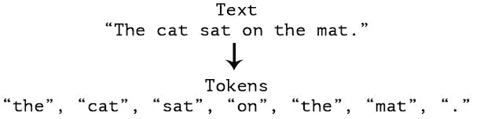
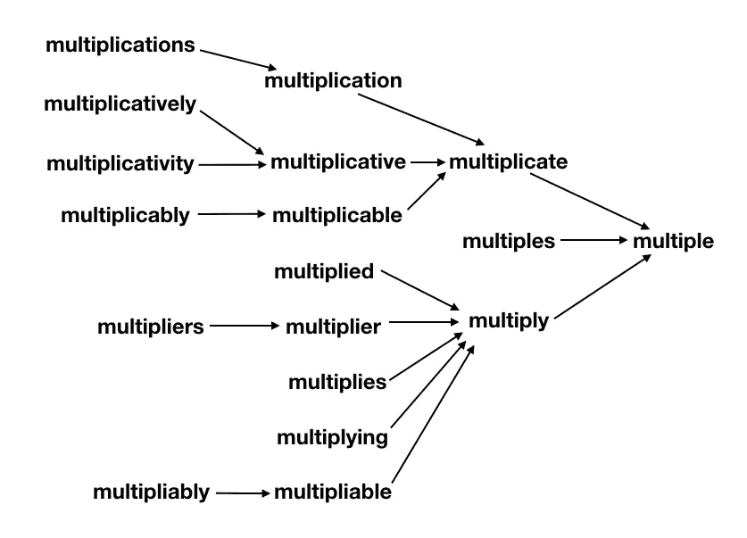
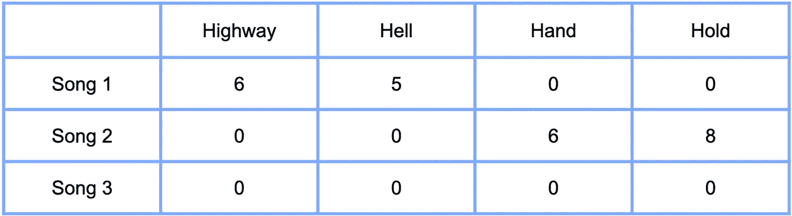
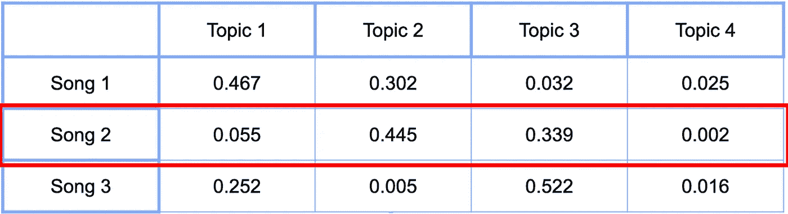

# 与自然语言处理相匹配的音乐

> 原文：<https://medium.com/analytics-vidhya/music-matching-with-natural-language-processing-44d5e50c9b9f?source=collection_archive---------10----------------------->

你有没有听过一首拨动心弦的歌曲，却发现下一首歌完全破坏了这种氛围？可能是相同的流派，甚至是同一位艺术家，但就是感觉不对。像 Spotify 和 Apple Music 这样的应用程序在过去几年里在歌曲推荐方面取得了巨大的进步，然而，我总是觉得它们都没有足够重视歌曲的一个关键方面。歌词。所以我决定纠正这个问题，建立一个完全基于歌词的*的[歌曲推荐应用](https://song-recommendation-by-lyrics.herokuapp.com/)。*

# *数据采集*

*如果我要根据歌词来比较歌曲，我首先要收集所有的歌词。我用美汤和硒刮出了由这篇[排名文章](https://www.ranker.com/crowdranked-list/greatest-classic-rock-bands)确定的前 263 个最佳经典摇滚乐队。一旦我有了所有艺术家的名单，我就使用一个 [python 客户端](https://github.com/johnwmillr/LyricsGenius)来抓取所有艺术家的每首歌曲的 [Genius 的](https://genius.com/)歌词页面。在一天结束的时候(实际上是 10 天的刮擦)，我有将近 40，000 首歌曲，我把它们很好很整洁地存储在 Postgres 数据库中。*

# *数据清理*

*当处理语言数据时，我显然不能使用我在过去的项目中处理数字数据时使用的任何技术。然而，我仍然可以使用一个过程来将杂乱的歌词转换成我可以继续前进的格式。所有这些清理都是通过强大的 python NLP 工具 [Spacy](https://spacy.io/) 完成的。*

## *标记化*

*第一步是将歌词符号化。这包括将每首歌转换成一个单词列表。*

**

## *删除停用词*

*一旦我有了每首歌的歌词列表，我就可以删除停用词。停用词是任何不一定会增加句子一般意思的词。像“the”、“is”、“in”和“for”这样的词都可以删除。确定哪些词是停用词取决于项目。例如，我还必须删除在经典摇滚歌曲中经常出现的“啊”和“哦”这样的词。如果我有从科学论文中清理数据的任务，我可能就不需要担心“啊”和“哦”经常出现。*

## *词汇化*

*也许清理过程中最重要(也是最复杂)的部分是术语化。这是将单词分解成词根或基本单词的过程。“猫”变“猫”，“然”变“跑”，“学”变“学”。下面的图表显示了 17 个不同的单词如何汇聚成单词“multiple”。*

**

*这个过程简化了我们的数据集，同时保持了每首歌的一般意义。在这一点上，我已经将肮脏的抒情数据浓缩成更简单的格式，我可以开始分析这些数据了。*

# *计数矢量化*

*数据清理过程大大简化了数据集，但为了分析歌词，我必须以某种方式用数字格式表示数据。为此，我求助于机器学习 Python 库 scikit-learn 来创建计数矢量器。计数矢量化或多或少是计算每个单词在一首歌曲中出现的次数的过程。在下面的例子中，第一首歌包含单词“highway”六次和“hell”五次，而第二首歌包含单词“hand”六次和“hold”八次。第三首歌没有歌词。*

**

*在这一点上，我可以将每一首歌曲表示为一个存在于这个巨大的“*单词空间*中的向量。然而，对于每一首歌，在 40，000 首歌中出现的任何词都有一列。你可以想象，这个矩阵会很快变得很大。在我的例子中，我有 1000 多列，这对于执行任何抒情比较来说都太大了，所以我现在需要找到一种方法来减少这个矩阵的维数。*

# *降维*

*现在我们进入项目的核心，*主题建模*。这是在一组文档中识别主题的无人监督的过程。我使用了主题建模的**潜在狄利克雷分配(LDA)** 方法，但我不会在这篇文章中深入探讨本质细节。然而，一般来说，它识别与其他单词在相同文档中持续出现的单词，并围绕这些单词组构建“主题”。*

*理解这个过程是*无监督的*很重要，这意味着我不为主题创建提供结构。一旦创建了主题，我可以查看哪些单词出现在主题中，并尝试自己描述主题。例如，一个主题包含以下单词:爱、宝贝、心、感觉、需要、时间、持有、想要、相信。这个话题很明显是关于爱和渴望的。最终，我用 LDA 方法创建了六个不同的主题。有些，就像我刚刚描述的，很容易描述，其他的就有点模糊了。*

*现在，每首歌可以被描述为基于歌曲中的词的单个主题的百分比。*

**

*正如你在上面的例子中所看到的，歌曲二包含了很多主题二和主题三，而少了很多主题一和主题四。这有效地将我的歌曲矩阵从 1000 多列减少到只有 6 列(6 个主题)。在这一点上，我可以使用这些主题分类，最终开始识别类似的歌曲。*

# *确定相似性*

*有了这六个主题，每首歌曲现在都可以在六维“主题空间”中可视化。我本可以使用**欧几里德距离**(两点之间线段的长度)来确定相似度，距离越短，歌曲越相似。然而，我决定走一条稍微不同的路线，并使用余弦距离来确定相似性。本质上，这使用了点之间的角度，而不是分隔它们的线段。我选择这个是因为从原点沿着相似线的点将具有相似的主题的*比例*，即主题 1 是主题 2 的两倍。*

# *最终产品*

*把这些放在一起，我创建了一个应用程序，你可以在这里玩。你可以将我数据库中的任何歌曲添加到“播放列表”中。然后一旦有了喜欢的播放列表，就可以求推荐了。此时，我的应用程序获取播放列表中的每首歌曲，并对主题向量进行平均，以获得整个播放列表的一个主题向量。然后，它计算播放列表向量和数据库中每首歌曲之间的余弦相似度，并返回五首最相似的歌曲。请记住，这仅仅是基于歌词，所以你可以很容易地在同一个推荐批次中获得头部撞击金属和 80 年代爱情民谣的混合。虽然这最终可能不会带来最无缝的聆听体验，但我认为仅根据歌词推荐歌曲确实可以帮助用户发现新音乐。*

# *结束语*

*这个项目是对自然语言处理和无监督学习的惊人介绍。摆弄 SpaCy 库真的让我看到了文本分析的巨大潜力，我期待着在未来的项目中继续深入这个领域。你可以在我的 github 上看到我所有的代码。*