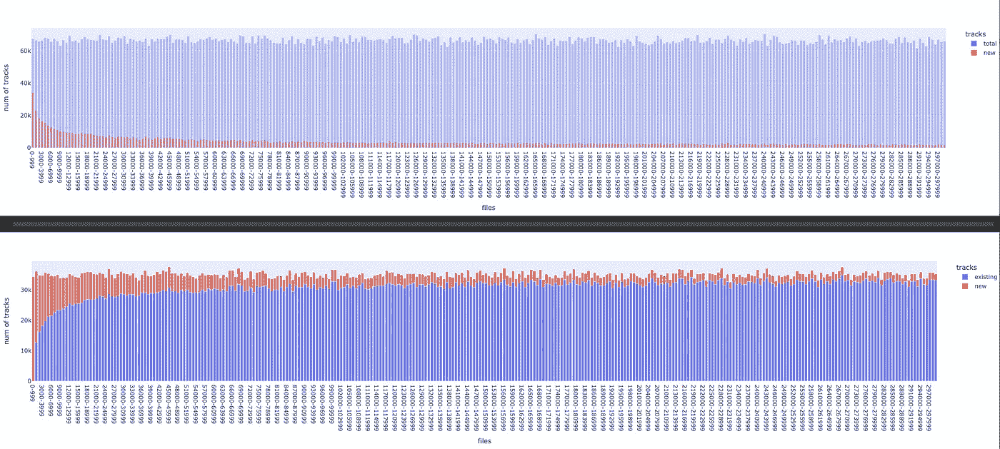

# 音乐推荐系统——第二部分

> 原文：<https://medium.com/analytics-vidhya/music-recommender-system-part-2-ff4c3f54cba3?source=collection_archive---------0----------------------->

获取音乐数据集并执行探索性数据分析

# 概述

在[上一篇文章](https://nsanka.medium.com/music-recommender-system-part-1-86936d673c31?sk=4278ddfebc850599db2fca4a5f2a2104)中，我们用所有必要的 Python 库创建了开发环境。

在本文中，让我们来看看我们使用的数据集，该数据集是作为 [Spotify 百万播放列表数据集(MPD)挑战](https://www.aicrowd.com/challenges/spotify-million-playlist-dataset-challenge)的一部分提供的。为了准备在机器学习模型中使用的数据集，我们需要执行一些数据清理和数据操作任务。我们还将研究数据集以了解功能，并结合通过 Spotify API 获得的其他数据字段。


Spotify MPD

# 访问 Spotify API

在获取和研究播放列表数据集之前，首先我们需要获取 Spotify API 的客户端凭据。如果您没有 Spotify 帐户，您需要创建一个免费/付费帐户。获得账户后，前往[面向开发者的 Spotify】，点击你的](https://developer.spotify.com/)[仪表盘](https://developer.spotify.com/dashboard/applications)并接受他们的条款。接下来点击“创建一个应用程序”,并给出应用程序的名称和描述。创建应用程序后，概览页面将会打开，您应该会在左侧看到“客户端 ID”和“客户端密码”，我们将使用它们来获取其他数据字段。“spot ipy”Python 库将用于连接 Spotify API，它有两种[授权方法](https://spotipy.readthedocs.io/en/2.12.0/)。


Spotify 应用程序的客户端 ID 和密码

# 获取数据集

我们将使用 Spotify 提供的数据集来研究音乐推荐。该数据集包括美国 Spotify 用户在 2010 年 1 月至 2017 年 11 月期间创建的公共播放列表。它有 100 万个 Spotify 播放列表，超过 200 万首独特的歌曲，近 30 万名艺术家，可在这里[获得](https://www.aicrowd.com/challenges/spotify-million-playlist-dataset-challenge/dataset_files)。首先，我们需要注册成为会员，以便访问数据集文件。创建帐户并登录后，复制“Spotify _ million _ playlist _ dataset . zip”的链接，然后在第 1 部分创建的工作区中，在终端中输入以下命令进行下载，替换“dataset_url”。zip 文件超过 5GB，所以下载需要一些时间。

```
# Download zip file
wget "dataset_url" -O spotify_million_playlist_dataset.zip
# To see all files list in zip file
unzip -l spotify_million_playlist_dataset.zip
# Extract README.md file from zip file
unzip -p spotify_million_playlist_dataset.zip README.md > README.md
```

由于 GitPod 实例只有大约 30GB 的可用磁盘空间，我们将只提取所需的文件夹/文件。从数据集中提取的自述文件，如上面的命令所示，将为您提供有关数据如何存储在文件中以及各个元数据字段的更多详细信息。zip 文件在“src”文件夹中也包含一些 python 文件，其中“stats.py”用于计算数据集的统计数。我们可以从下面的 zip 文件中提取“src”文件夹，并查看 stats.py 文件。

```
# Extract src folder from zip file
unzip spotify_million_playlist_dataset.zip "src/*" -d .
```

# 快速接近

数据集 zip 文件在数据文件夹中有 1000 个 json 文件，每个 json 文件有 1000 个播放列表。每个播放列表都有许多曲目。我们可以遵循 stats.py 文件中给出的类似方法，遍历每个文件，然后遍历每个播放列表来获取信息。我们想快速进入建模部分，所以我们决定使用部分数据。我们提取了 20 个 json 文件，从每个文件中读取信息，并添加到如下所示的列表中。

```
import os
import jsondef loop_slices(path, num_slices=20):
  cnt = 0
  mpd_playlists = []
  filenames = os.listdir(path)
  for fname in sorted(filenames):
    print(fname)
    if fname.startswith("mpd.slice.") and fname.endswith(".json"):
      cnt += 1
      fullpath = os.sep.join((path, fname))
      f = open(fullpath)
      js = f.read()
      f.close()
      current_slice = json.loads(js) # Create a list of all playlists
      for playlist in current_slice['playlists']:
        mpd_playlists.append(playlist) if cnt == num_slices:
        break return mpd_playlists# Path where the json files are extracted
path = 'data/'
playlists = loop_slices(path, num_slices=20)
```

下一步是提取播放列表中每个音轨的音频特征。我们使用 spotipy 库从 Spotify 中提取所需的音频功能。最后，出于建模目的，我们取了每个播放列表中所有曲目的音频特征的平均值。

```
import spotipy
from spotipy.oauth2 import SpotifyClientCredentials# Spotify credentials
os.environ["SPOTIPY_CLIENT_ID"] = "Replace with Client ID"
os.environ["SPOTIPY_CLIENT_SECRET"] = "Replace with Client Secret"
os.environ['SPOTIPY_REDIRECT_URI'] = "http://localhost:8080"sp = spotipy.Spotify(client_credentials_manager =      
                     SpotifyClientCredentials())cols_to_keep = ['danceability', 'energy', 'key', 'loudness', 'mode', 'speechiness', 'acousticness', 'instrumentalness', 'liveness', 'valence', 'tempo', 'duration_ms', 'time_signature']dfs = []
for playlist in tqdm(playlists):
  audio_feats = []
  for track in playlist['tracks']:
    track_uri = track['track_uri'].split(":")[2]
    feature = sp.audio_features('track_uri')
    if feature:
      audio_feats.append(feature[0]) avg_feats = pd.DataFrame(audio_feats)[cols_to_keep].mean()
  avg_feats['name'] = playlist['name']
  avg_feats['pid'] = playlist['pid']
  dfs.append(avg_feats.T)
```

在提取了 20，000 个播放列表的所有平均音频特征后，我们开始建立和训练机器学习模型。

# 处理一百万个播放列表

我们使用 20，000 个播放列表和其他文章中描述的聚类模型获得了不错的推荐。但是，当我们用不同的用户播放列表进行测试时，它对一些用户来说是失败的。因此，我们希望使用完整的数据集来重新训练模型。为此，我们需要获得所有播放列表的平均音频特征。上面提到的快速方法不起作用，或者花了太多时间来读取和提取特征。所以，我们更新了数据处理代码。在更新代码时，我们发现我们不需要提取每个曲目的特征，因为一些曲目在播放列表中重复。下图显示了前几个 json 文件的新的、现有的和总的磁道变化。尽管每个 json 文件都有超过 60K 的磁道，但只有 30K-35K 的唯一磁道，并且在最初的几个 json 文件之后，只有不到 5K 的新磁道。



更改每个 json 文件的轨道

几乎没有对数据处理代码进行流程改进。第一个是，我们没有提取所有的 json 文件，而是使用 Python 的“zipfile”库直接从 zip 文件中读取。

```
import os
import json
from zipfile import ZipFile
import fnmatchdef extract_mpd_dataset(zip_file, num_files=0, num_playlists=0):
  with ZipFile(zip_file) as zipfiles:
    file_list = zipfiles.namelist()
    #get only the csv files
    json_files = fnmatch.filter(file_list, "*.json")
    json_files = [f for i,f in sorted([(int(filename.split('.')[2].split('-')[0]), filename) for filename in json_files])] cnt = 0
    for filename in json_files:
      cnt += 1
      print('\nFile: ' + filename)
      with zipfiles.open(filename) as json_file:
        json_data = json.loads(json_file.read())
        process_json_data(json_data, num_playlists) if (cnt == num_files) and (num_files > 0):
        breakzip_file = 'data/spotify_million_playlist_dataset.zip'
extract_mpd_dataset(zip_file, 0, 0)
```

第二个改进是读取整个文件，而不是一次读取每个播放列表。我们使用 Pandas 的“json_normalize”函数将 json 文件转换成数据帧。这有助于我们非常轻松地处理播放列表和曲目。示例代码如下，你可以在 GitHub 中看到[完整代码](https://github.com/nsanka/RecSys)。

```
import pandas as pd
def process_json_data(json_data, num_playlists):
  # Get all playlists in the file
  playlists_df = pd.json_normalize(json_data['playlists']) # Get all the tracks in the file
  tracks_df = pd.json_normalize(json_data['playlists'], record_path=['tracks'], meta=['pid', 'num_followers'])
```

我们使用 Pandas 内置的 SQLite 功能来读取数据帧并保存到表中。创建了四个表，分别是播放列表、曲目、功能和评级。播放列表、表格和特征具有独特的项目，并且收视率表格具有播放列表和曲目之间的链接。为了创建唯一曲目表，我们不仅从该文件中删除了重复曲目，还删除了数据库中存在的曲目。下面是保存数据库中的表的示例代码。

```
import sqlite3
db_file = 'data/spotify_million_playlists.db'
conn = sqlite3.connect(db_file)
# Create playlists table
playlists_df.to_sql(name='playlists', con=conn, if_exists='append', index=False)# Added unique track_id for each non-duplicate tracks
# Create ratings table in database
ratings_df = tracks_df[['pid', 'track_id', 'pos', 'num_followers']]# Remove all duplicate tracks, Create tracks table
tracks_df.drop(['pos', 'duration_ms', 'pid', 'num_followers'], axis=1, inplace=True)
tracks_df = tracks_df.drop_duplicates(subset='track_uri', keep="first")
tracks_df.to_sql(name='tracks', con=conn, if_exists='append', index=False)
```

我们执行的最后一个修改是一次获得多个音轨的音频特征。spotipy 库一次可以获得 100 个音轨的音频特征。因此，我们更新了代码，从 tracks 表中获取所有的“track_uri ”,并一次处理 100 首曲目。下面是示例代码。

```
cur = conn.cursor()
cur.execute('''select track_id, track_uri from tracks where (track_id > ?) and (track_id <= ?)''', (0, 100))
rows = cur.fetchall()
uris = [row[1] for row in rows]feats_list = sp.audio_features(uris)
# Remove None items, for some tracks there are no features
feats_list = [item for item in feats_list if item]feats_df = pd.DataFrame(feats_list)
columns = ['danceability','energy','key','loudness','mode','speechiness','acousticness','instrumentalness','liveness','valence','tempo','duration_ms','time_signature']
feats_df = feats_df[columns]
track_id_list = range(1, 101)
feats_df.insert(loc=0, column='track_id', value=track_id_list)feats_df.to_sql(name='features', con=conn, if_exists='append', index=False)
```

从 Spotify 读取一百万个播放列表并获得每首独特歌曲的音频特征的完整过程需要超过 2 个小时的系统时间。因此，我们添加了代码，将日志保存在一个文本文件中，以便于跟踪，您可以在我的 GitHub 中看到完整的[日志文件](https://github.com/nsanka/RecSys/blob/main/data/read_spotify_mpd_complete_log.txt)。

# 下一步

在[的下一篇文章](/@david.de.hernandez/modeling-data-for-a-spotify-recommender-system-3056997a0fc5?sk=7ce613a3d5cbd4a69e73804983d49f91)中，我们将看到使用我们在此收集的数据来构建和训练机器学习模型。

# 参考资料:

*   [*陈、拉梅、沙德尔、扎马尼。Recsys 挑战赛 2018:自动音乐播放列表延续。《第 12 届 ACM 推荐系统会议论文集》(RecSys '18)，2018*](https://dl.acm.org/doi/abs/10.1145/3240323.3240342)
*   [用熊猫拉平 JSON】](https://towardsdatascience.com/all-pandas-json-normalize-you-should-know-for-flattening-json-13eae1dfb7dd)
*   [Python 熊猫和 SQLite](https://towardsdatascience.com/python-pandas-and-sqlite-a0e2c052456f)

如果你喜欢看我的文章，并想支持我，请考虑注册成为一个媒体成员。每月 5 美元，你可以无限制地阅读媒体上的故事。请注册使用我的链接来支持我:[https://nsanka.medium.com/membership.](https://nsanka.medium.com/membership.)