# 我的# 100 天代码之旅

> 原文：<https://medium.com/analytics-vidhya/my-100daysofcode-journey-2a904089449c?source=collection_archive---------20----------------------->

## 你好，我是古勒米娜。我是#100DaysOfCode 幸存者。

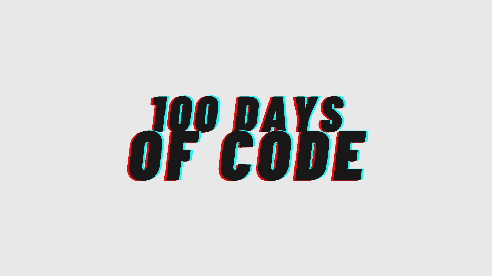

作为我今年决心的一部分，我决定参加 [#100DaysOfCode 挑战](https://www.100daysofcode.com/)。不知道这是什么？别担心，我抓住你了。挑战包括:1)在接下来的 100 天里，每天至少编写一个小时的代码，2)每天使用#100DaysOfCode 标签发布你的进度。

我的旅程从 2021 年 1 月 1 日开始。我决定用 Python 作为主要的编程语言。总的来说，我觉得这种体验棒极了，100%推荐尝试一下。

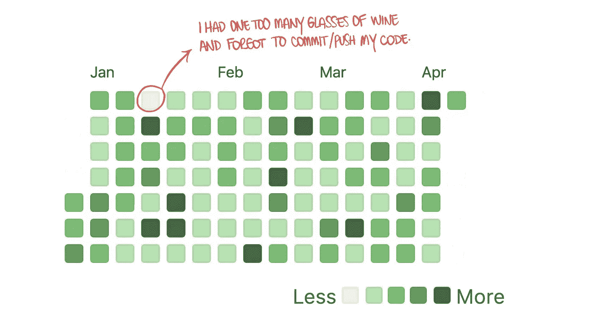

还有…谁不喜欢自己的 GitHub 个人资料上有一个好看的活动日志呢？

## 第 1-5 天:嗯……现在怎么办？！

好的，所以我公开地承诺了这个挑战，却没有一点儿关于如何开始或者从哪里开始的想法。在第一周，我创建了一个网络应用程序，告诉你 Chick-Fil-A 是否开放。因为…谁没有在周日早上宿醉，想着去买鸡块，然后发现他们不营业？啊？

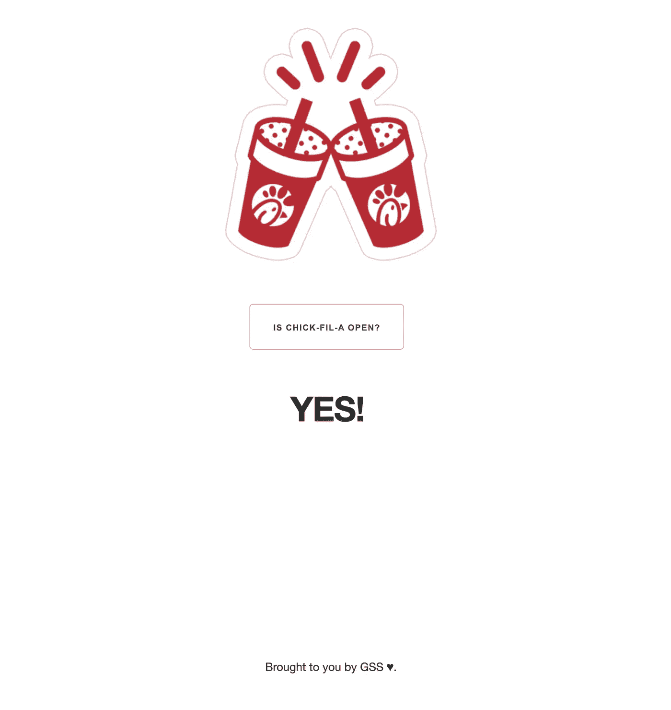

我用了`dash`和`plotly`来创建它，还用了一些 CSS 来做造型。最痛苦的部分其实不是`dash`而是 CSS。光是弄清楚如何对齐页面中的每个元素就花了我很多时间。不同的职位属性仍然让我头疼，我意识到我肯定需要继续努力。

如果你有兴趣了解更多关于`dash`的知识，Udemy 提供了一个[速成班](https://www.udemy.com/course/interactive-python-dashboards-with-plotly-and-dash/)，它很容易掌握，我个人认为很有用。

## 第 6–27 天:一切机器学习

我不打算撒谎，在这一点上我开始有点焦虑，因为我认为我在这次挑战中不会有“足够的事情要做”。这时，我在 2020 年春天上的数据挖掘课来了。

我怎么强调我在这个挑战阶段学到了多少都不为过。从特性工程到评估指标，这可能是最有用的编码会议之一。这让我回到我最喜欢的机器学习书籍之一，重温不同模型背后的理论和数学。我甚至开始用一些机器学习的概念来制作抽认卡，并把它们发布在 Twitter 上。

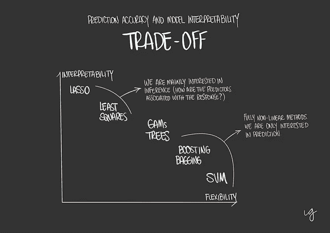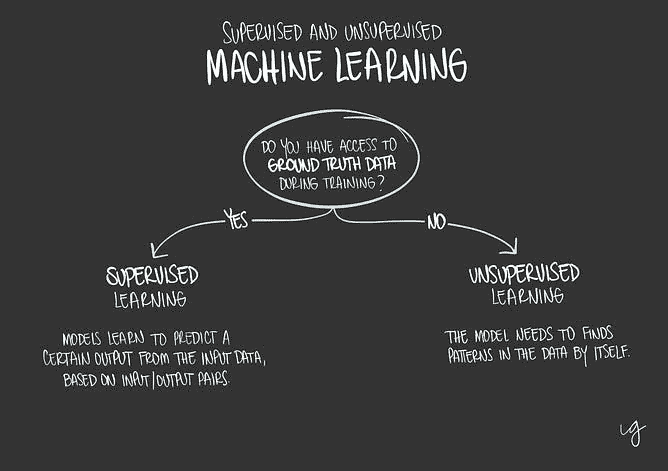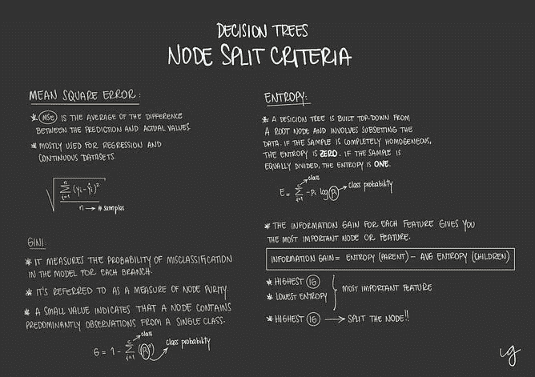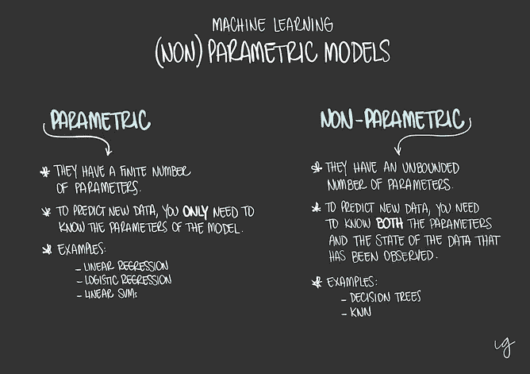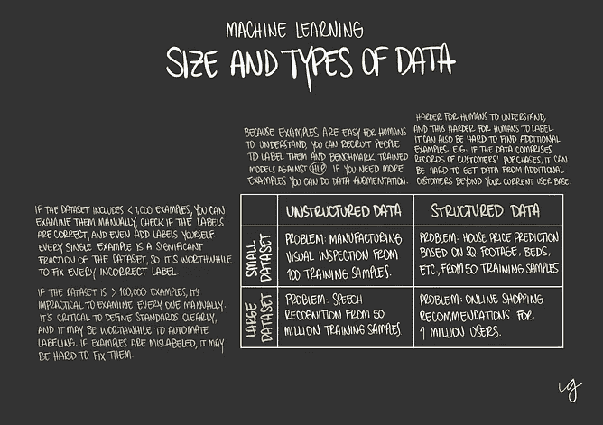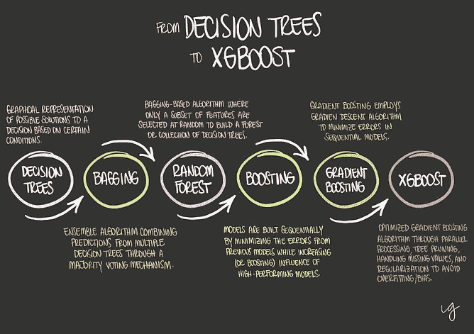

我在#100DaysOfCode 的机器学习阶段制作的抽认卡

我一共运行了 11 个模型:决策树、bagging、random forest、AdaBoost、Gradient Boosting、XGBoost、KMeans、KNN、nave Bayes 和 SVM。其中，XGBoost 是我最喜欢的一个。不仅因为我第一次测试了它，还因为它在几乎所有指标上都超越了其他型号，这让我感到惊讶。我在[我的旅程日志](https://github.com/glosophy/100-days-of-code/blob/main/log.md)中对此有更深入的讨论。

## 第 28–49 天:简短的编程问题

在这段时间里，我偶然看到了圣地亚哥的简短的编程问题推文。这非常方便，因为在审查了机器学习模型之后，我觉得我需要花更多的时间来解决类似面试的问题。

我学到了很多关于如何以一种更像蟒蛇般的方式思考的知识。有几次，当我回到我的代码时，才意识到有一种更简单、更干净的方法来解决某个问题。也有一些时候，我真的陷入困境，似乎找不到解决问题的办法。但是我下定决心要把它们都完成，所以第二天我回到代码中，想了更多，然后*瞧*！当你走向终点时，这些问题肯定会变得更有趣(也更痛苦)。

## 第 50–53 天:当数学遇到 matplotlib

旅程进行到一半时，我开始紧张起来，因为不仅我没有计划，而且我也没有足够的想法来确定下一步要写什么。由于我是 dataviz 爱好者，我决定用`matplotlib`找点乐子，试着画出漂亮的数学函数。

你能看出我已经没有编码的想法了吗？是的，我也是。

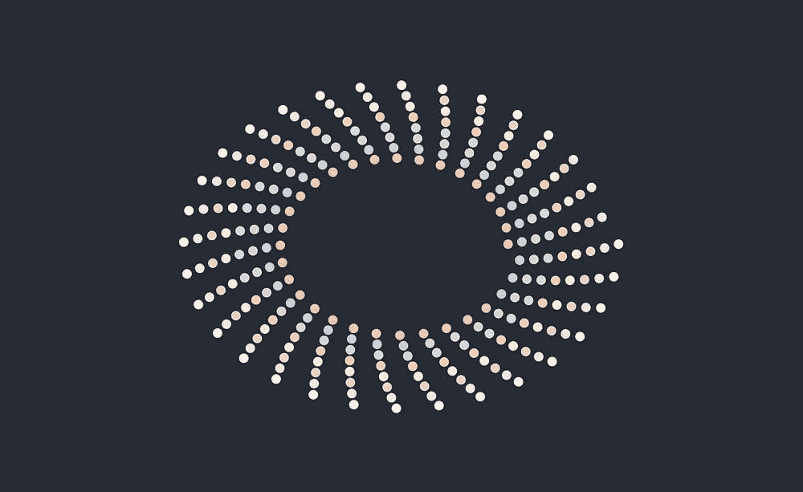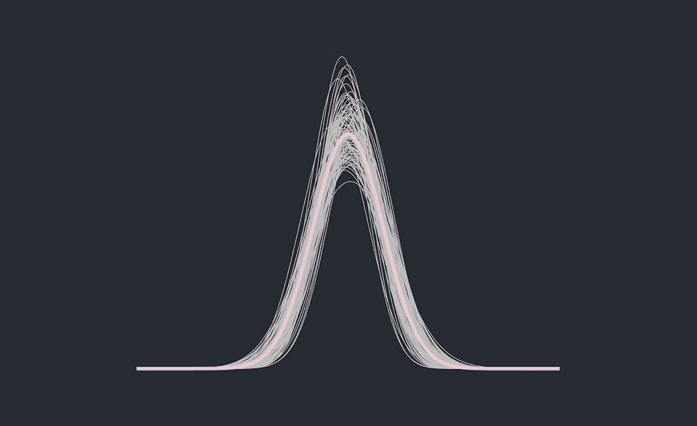

## 第 54–58 天:就在我以为我出来了的时候…

我一直最喜欢的电影语录之一是迈克尔·柯里昂的"*"当我以为我出去了，他们又把我拉了回来！"*

这正是我遇到圣地亚哥的另一条推特时发生的事情。

我非常喜欢他以前的编程问题，所以我必须至少尝试一下。剧透提醒:你解决的越多，他们就变得越难。

## 第 59-100 天:一路五彩纸屑！

我喜欢解决类似面试的编程问题的想法，所以我决定尝试一下 Confetti AI。Confetti AI 是一个教育和技能培养平台，帮助人们在数据科学和机器学习领域开始职业生涯。他们的问题和编程问题都与(但不限于)ML 理论、工程和工具、生产和应用有关。

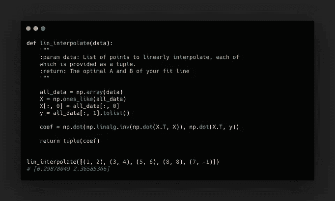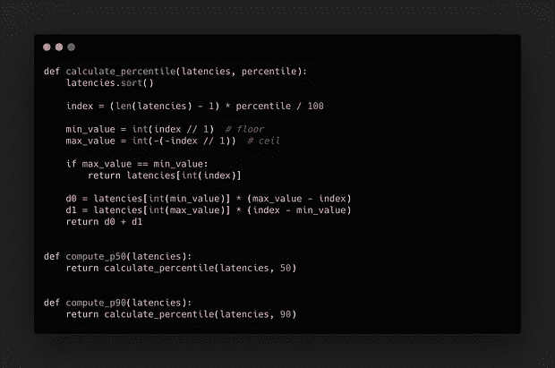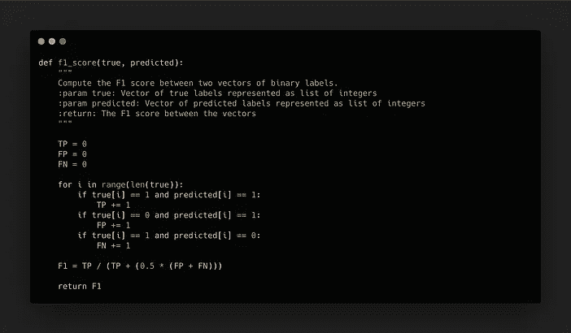

我用五彩纸屑人工智能建立的一些功能

对于那些正在寻找数据科学家、ML 工程师或数据工程师新工作的人，我怎么推荐 Confetti AI 都不为过。(或者几乎所有想深入了解 ML 的人。)嘶！如果您考虑购买 Premium，[您可以使用我的链接](https://www.confetti.ai/?ref=guillerminaschneider)。我非常感激！

# 我艰难地学会了…

如果你做到了这一步，你可能会注意到，在第 50-53 天，我不知道该做什么或做什么，直到圣地亚哥用他的简短编程问题来拯救我。但老实说，我几乎在整个比赛中都有这种感觉。

也就是说…我有点后悔的一件事是没有提前计划好我要关注的事情。如果我列出或者至少在脑海中有四五个我想做的项目，这个旅程会容易得多，压力也会小得多。

所以现在你知道了，提前计划，提前做好准备。这是我给你的第一条建议。

# 你打算这么做吗？

[在你的推文中给我贴上标签](https://twitter.com/gsutters)！我真的很想看看你做了什么，你是如何应对这个挑战的！

# 更多信息…

你会在这里找到我的#100DaysOfCode 回购。

…更多挑战详情请点击[。](https://github.com/glosophy/100-days-of-code/blob/main/rules.md)