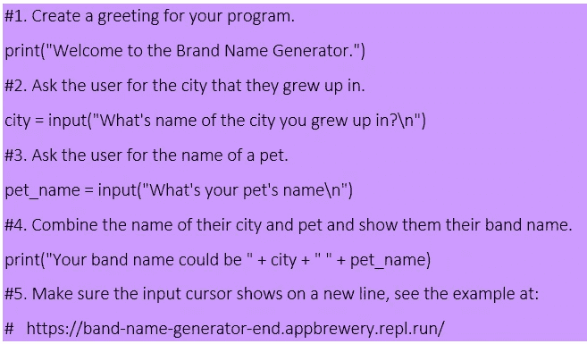
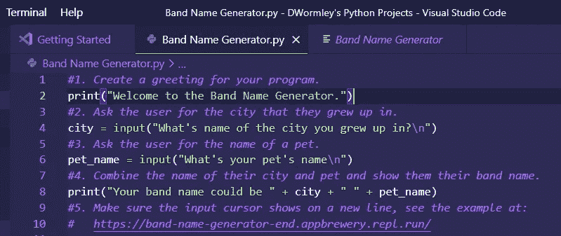
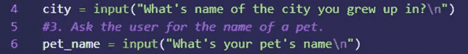

# 一个简单的 Python 初学者作品集项目

> 原文：<https://medium.com/analytics-vidhya/my-first-programming-adventure-in-python-b1c76da2992a?source=collection_archive---------7----------------------->

Joshua Woroniecki 在 [Unsplash](https://unsplash.com/s/photos/code?utm_source=unsplash&utm_medium=referral&utm_content=creditCopyText) 上的照片

我刚刚收到了我的第一个 Python 相关的编程任务，来自技术训练营的高层。请阅读我分享的这个简单但非常有趣的项目“乐队名生成器”的细节。

作为一名有抱负的 DevOps 工程师，我想提高我的编程技能。Python 是一种非常流行的语言，也是 IT 雇主越来越追求的技能。为了更好地了解 Python，我们的团队收到了按照 Paul Zhao 的“100 天内的 Python 100 个项目—学习日志”中的“[波段名生成器、](/paul-zhao-projects/python-100-projects-in-100-days-learning-journal-e42e5d4b63a5)”示例进行操作的指示我对说明做了一些修改，但我们都得到了相似的结果。

材料:

*1* 。预装 3。Windows 10 上的 9.5

2.Visual Studio 代码

3.示例“乐队名称生成器”脚本:

我们从 P. Zhao 的 Python 项目中抽取的脚本。

现在，我们有了所有的工具，让我们试一试吧！

打开 Visual Studio Code (VSC)后，我们将使用该脚本创建一个文件，并将其命名为“Band Name Generator.py”。使用 Python 扩展名保存该文件非常重要。py)。首先，保存它。py”扩展名通知您的集成开发环境(IDE)您已经创建了一个 Python 文件，它将允许使用 Python 编程语言修改该文件。否则，您将只有一个文本文件。

在 VSC 使用 Python 创建的乐队名称生成器文件的屏幕截图。

在查看屏幕截图时，您会注意到一些语句以“#”字符开头。使用“#”符号允许用户添加不会出现在输出或打印中的关于脚本的评论、说明或注释。例如，截图中的语句#1 指示我们“为您的程序创建一个问候”我们真的不需要将这个指令显示为输出的一部分。

您还会注意到一些行以“\n”符号结尾。在 Python 中，我们使用“\n”字符开始新的一行。例如，我们看到我们问观众的两个问题都以“\n”结尾。

要分隔我们的行(或在这种情况下，问题)，请在每个语句的末尾添加“\n”。

最后，我想指出出现在第八行的“+”符号。

组合(也称为串联)字符串，以创建带有“+”符号的更长语句。

在这个脚本的最终可打印语句中，我们将第四行和第六行响应中的字符串组合起来，或者用技术术语来说，连接起来。然后，我们获取片段“您的乐队名称可能是”并添加“city”和“pet_name”字符串，以创建一个新的完整语句，显示我们乐队的可能名称。

当我用我的家乡和宠物的名字作为响应时，脚本会生成以下结果:

我的乐队名称生成器的输出。

我们已经成功运行了“乐队名称生成器”脚本，现在有了一个非常有趣的乐队名称。嗯。我不确定诺福克·本尼什么时候会开始做节目或者制作唱片，但是我们肯定已经完成了我们的任务。现在，我们等待更多学习 Python 的机会。

感谢你阅读这篇文章。迎接下一个挑战！