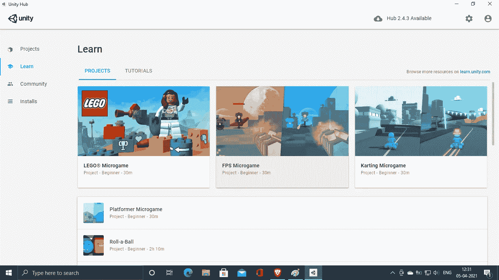

# 我作为 Unity 开发者的旅程

> 原文：<https://medium.com/analytics-vidhya/my-journey-as-a-unity-developer-5e47858421a9?source=collection_archive---------5----------------------->

# **我的第一年**

## 第一印象

**这是我第一次看到 Unity(当然我只是截屏了一下，但你明白我的意思)**

当我的 unity hub 打开这个项目的页面时，当我想到我可以用它做的所有事情时，我感到兴奋。对我来说，可能性基本上是无限的。

# **Unity 中的编程**