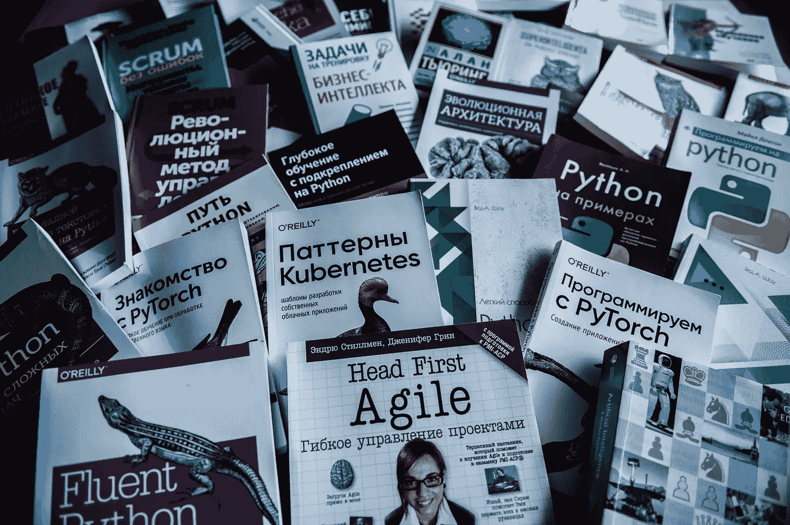
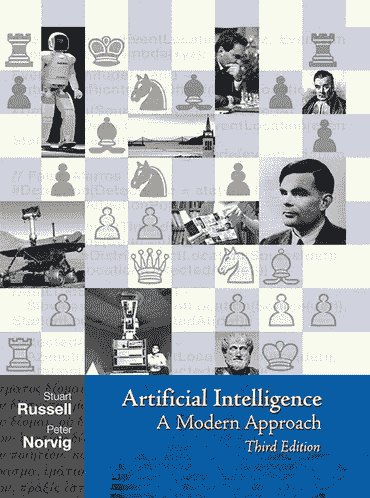
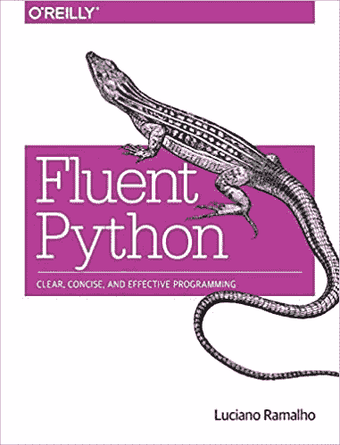
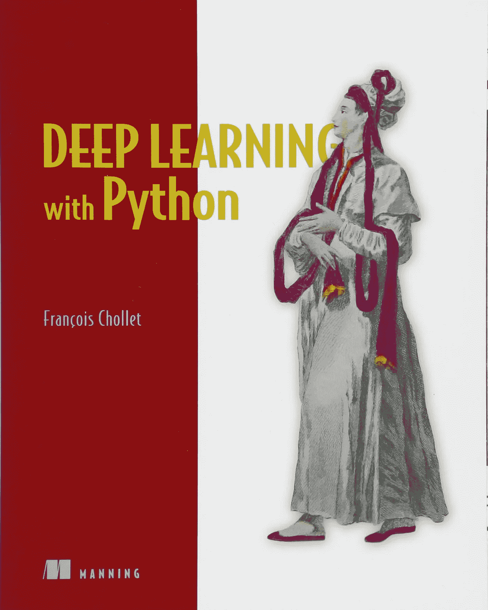
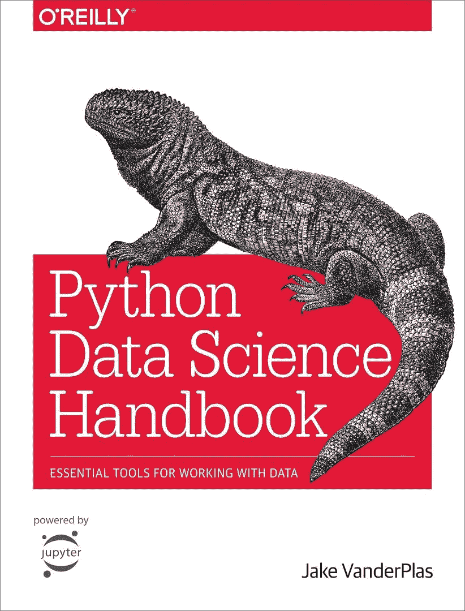
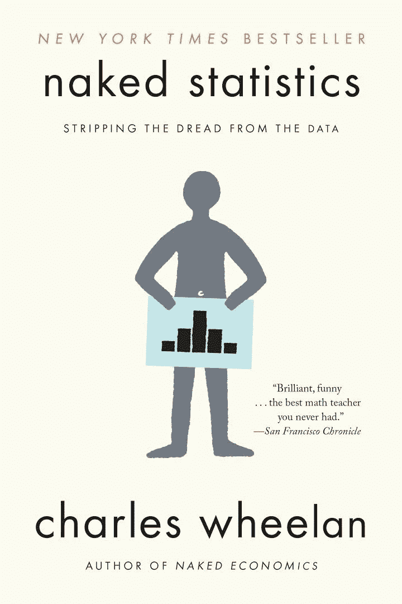
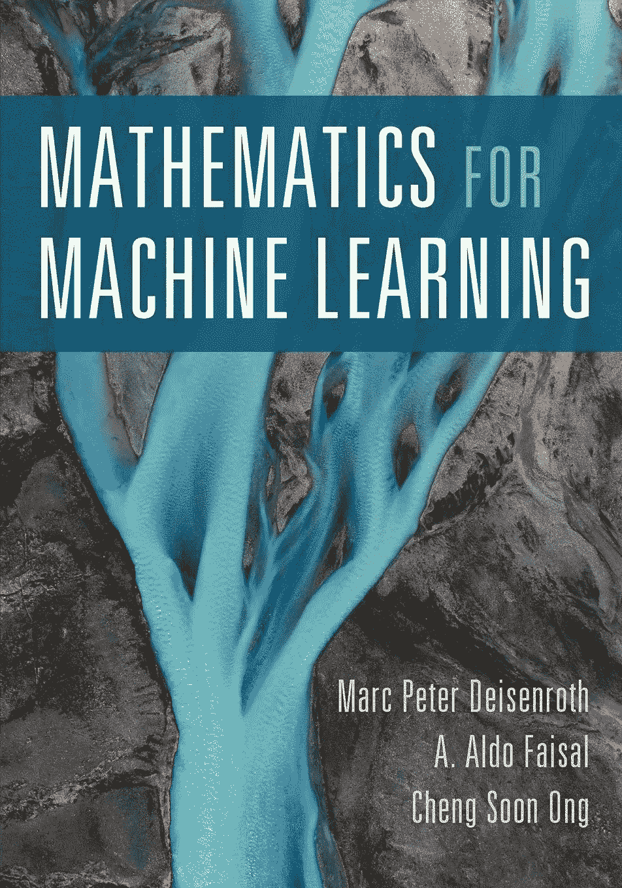
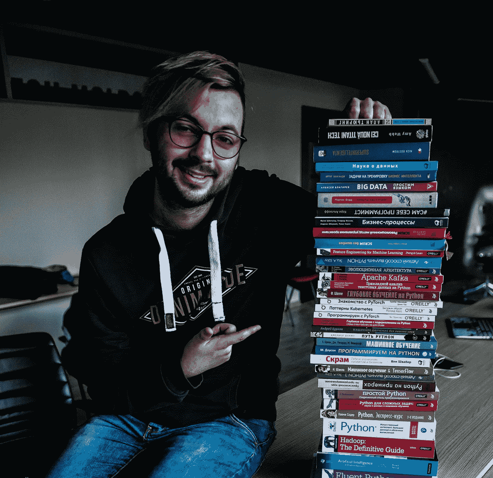

# 我看了 50 本关于人工智能的书。

> 原文：<https://medium.com/analytics-vidhya/my-top-after-reading-50-books-on-ai-6e5d9fdebd8c?source=collection_archive---------2----------------------->

50 本书，成为任何学科的专家。

照片由 [**多丽娜·潘塔兹**拍摄](https://www.facebook.com/dorinabucatari)

我不太记得在哪里听到或读到过这句话，但我觉得对我这个立志成为人工智能工程师的人来说，这听起来是个不错的目标。所以从 8 月到 11 月，我读了 50 本关于人工智能、机器学习、高等数学、python、项目管理以及更多与人工智能相关的领域的书。我决定分享我自己的顶级书籍和一个简短的推荐。

排名第一的人工智能:彼得·诺维格和斯图尔特·j·拉塞尔的现代方法。

现在人工智能几乎每次都和机器学习联系在一起。但从一开始就不是这样。然而，人工智能采用了更多的研究领域，如理解、推理、搜索等，这本书深入研究了这些领域的大部分，展示了人工智能的更多用例。另外，它讲述了人工智能的历史，相信我，这很有趣。

它包含伪代码和算法数学部分的非凡解释。我亲自用 Python 实现了大部分章节，并对软件和人工智能原理有了非常深刻的理解。

**# 2 卢西亚诺·拉马尔霍的流畅蟒蛇皮。**

做了 3 年多的 Python 爱好者，看了很多在线教程，看了很多关于 Python 的文章和书籍。但是什么都比不上流畅的 Python。这以一种非常深刻和先进的方式解释了 Python。它表明，即使 Python——乍一看是一种非常简单的编程语言，也是一种非常复杂且有时很棘手的语言。高级面向对象程序设计、元编程、编码等等只是这篇杰作中讨论的一些主题。

**# 3 深度学习用 Python 作者弗朗索瓦·乔莱。**

即使我在 PyTorch 上写神经网络(当我不得不写的时候),我第一次接触神经网络是在这本书上。Keras 的主要开发者——深度学习的框架，做了出色的工作，用简单的语言解释了许多不同的架构。

**# 4 Python 数据科学手册，作者 Jake VanderPlas。**

不管你愿不愿意，作为一名数据科学家或机器学习工程师，你将使用许多工具和库。通常你会用到 NumPy，pandas，sci-kit learn，matplotlib 和 seaborn。这本书同时也是对这些工具的完美介绍和深入研究。

查尔斯·惠兰的第 5 号裸体统计。

想学统计学，但是大学讲座很无聊，那么这本书就是给你的。这本书深入浅出的解释了统计学，讲述了不同的故事，展示了途中的公式，我最喜欢的学习方式。此外，作者有一种独特的幽默感，这使得学习统计学的方式更容易。

Cheng Soon Ong，Marc Peter Deisenroth，A. Aldo Faisal 编写的# 6 机器学习数学。

每个机器学习工程师和数据科学家都会告诉你，数学如果不是这些领域中最重要的部分，也是非常重要的。然而，在大学的讲座中，我没有发现它们中的大多数在我的领域中是适用的。具有讽刺意味的是，在我完成了软件工程的第一年(我是一名机器学习工程师)后，这一年有两个学期的高等数学，他们在课程中增加了线性代数。所以我找到了这本书，一颗真正的珍珠。它需要你抛弃数学主要领域的基础知识，机器学习的基础是线性代数、向量微积分、概率和统计。更重要的是，它向您展示了所有这些原则在哪里被应用，向您展示了它们是如何在高斯混合模型、线性回归、朴素贝叶斯和 SVM 等算法中使用的。

# 结论。

也许我读了这些书和其他 44 本书，还不能让我成为专家。我大大提高了我在这方面的能力。所以对所有这方面的新手，我强烈推荐阅读以上所有这些书。在书籍背后还有写项目、参加 Kaggle 竞赛、获得实习、从零开始实现模型和建立关系网。我亲自去做，这在我的旅程中帮助了我很多。如果你想要 50 本书的完整清单，请联系我，我会给你的。

**奖金。**

我的藏书—摄影师— [多丽娜·潘达斯](https://www.facebook.com/dorinabucatari)。