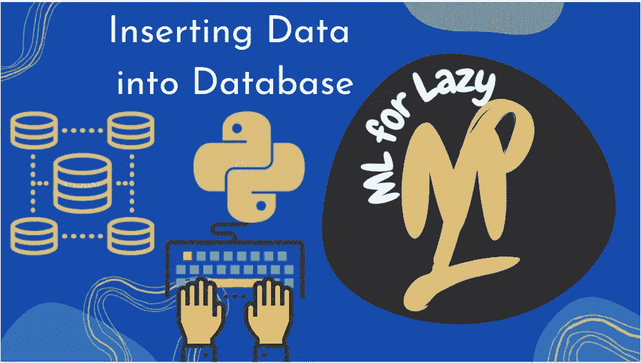
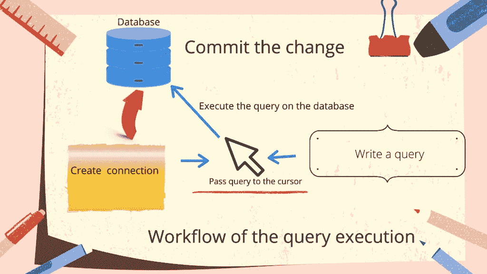
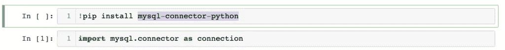
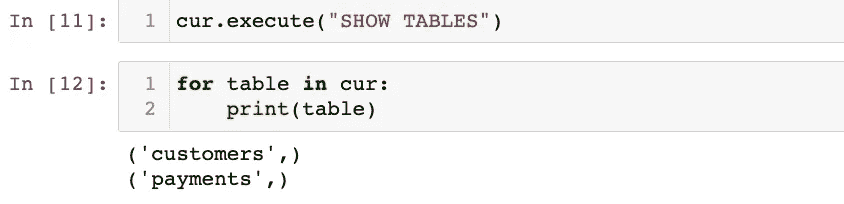

# MySQL 和 Python-插入数据。— ML 代表懒惰 2021

> 原文：<https://medium.com/analytics-vidhya/mysql-and-python-inserting-the-data-ml-for-lazy-2021-12619326d616?source=collection_archive---------6----------------------->



将数据插入数据库

吼吼！我们已经创建了数据库，并学习了如何在使用 MySQL 和 python 创建连接之后创建与数据库的连接。唯一没有回答的问题是运行查询来对数据库执行操作。通常在数据库和数据库本身上执行以下主要操作。

# 目的

这篇文章将介绍如何将数据插入数据库，并将数据永久存储在数据库中。为此，我们在查询中使用 SQL 的“INSERT，INTO”关键字。

我想回答的第一个问题是什么是查询。所以让我们来回答这个问题。

# 什么是查询？

查询是 MySql 中的一个语句，它包含我们想要对数据库或存储在数据库中的数据执行的操作的逻辑。

简而言之，它是我们给 MySql 的一个命令，这样我们的目的就实现了，我们可以对数据库和数据库中的数据做我们想做的事情。

## 使用 PYTHON 和 MYSQL 执行查询的步骤

1.  **使用凭证创建一个与数据库的连接，这个连接返回 mysql 的连接对象。**
2.  **第二，你需要创建一个光标对象，它就像一个指针(鼠标)，决定点击哪里，在这种情况下，在哪里执行查询，如果查询返回一些东西，然后存储返回的数量。**
3.  **这个游标有一个名为 execute 的方法，它让我们在连接也被传递的数据库上执行传递的查询。**
4.  最后，如果更改是永久性的，那么我们必须提交 rae 在数据库中所做的更改。
5.  **这是使用 python 和 mysql 执行查询的流程。**



为了使用 mysql，我们必须安装 [mysql-connector-python](http://mysql.com) 包。那我们一定是进口的。



首要的事情是建立联系。让我们开始吧。

```
conn = connection.connect(host="localhost", user="root", password="password",database="database which you created in previous lesson" )
```

该语句返回连接异议，即使用传递的凭证连接到我们传递的数据库。

根据我们的列表，第二件事是创建光标。让我们这样做吧。

```
cur = conn.cursor()
```

现在我们有了一个游标，我们可以在传递的数据库上执行查询。默认情况下，当我们调用光标离开连接时，会传递与之建立连接的数据库。

让我们首先编写查询并将该查询传递给游标。

```
query = "CREATE table payments(name varchar(255), address varchar(255))" cur.execute(query)
```

execute 方法让我们执行传递给该方法的查询。

让我们检查一下查询是否被执行了。让我们检索数据库中的所有表。

```
cur.execute("SHOW TABLES") for table in cur: print(table)
```



现在让我们将数据插入表中。我们将创建一个包含更多属性的新表，然后将数据插入到该表中。

```
cur.execute("CREATE TABLE customers (id INT AUTO_INCREMENT PRIMARY KEY, name VARCHAR(255), address VARCHAR(255))")
```

这是执行查询的另一种方式。从而将直接查询传递给 execute 方法。

为了插入数据，我们需要编写如下插入查询，然后执行相同的查询:

```
query = "Insert into customers(name, address) values('zack', 'zack 123')" cur.execute(query)
```

这样，我们的查询被执行，数据被插入到我们的表中。还有另一种插入数据的方法，使用格式说明符。这类似地工作，但是我们必须传递带有格式说明符和值的查询。这些值应该采用元组格式。

```
query = "insert into customers(name, address) values (%s, %s)" val = ('anthony', 'anthony 123') cur.execute(query, val)
```

“%S”表示字符串是它的值。第一个%s 将被替换为元组中的第一个值，第二个将被替换为第二个值，依此类推。

我们可以在同一个查询中添加更多的值。我们这样做的方法是使用数据库中的元组列表。

```
query = "insert into customers(name, address) values (%s, %s)" val = [ ('Peter', 'Lowstreet 4'), ('Amy', 'Apple st 652'), ('Hannah', 'Mountain 21'), ('Michael', 'Valley 345'), ('Sandy', 'Ocean blvd 2'), ('Betty', 'Green Grass 1'), ('Richard', 'Sky st 331'), ('Susan', 'One way 98'), ('Vicky', 'Yellow Garden 2'), ('Ben', 'Park Lane 38'), ('William', 'Central st 954'), ('Chuck', 'Main Road 989'), ('Viola', 'Sideway 1633') ] cur.executemany(query, val)
```

这些值将被逐个插入到表中。这样，我们将值插入到数据库中。现在，由于我们已经在数据库中进行了更改，我们需要使这些更改永久化，所以让我们使用连接对象的 commit 方法来提交这些更改。

```
conn.commit()
```

因此，我们的改变被产生和存储。

# 结论

这就是我们在数据库中存储数据的方式，一次存储一个，或者一次存储多个。在下一篇文章中，我们将看到如何取回这些数据并使用它们。因为在机器学习中，我们需要处理数据，所以我们需要从数据库中取回这些数据并执行一些操作，或者将数据馈送给机器学习模型进行训练。

假设你没有读过如何连接数据库和下载 MySQL，那么请看— [MySql 和 Python |使用 Python 创建数据库](https://mlforlazy.in/mysql-and-python-creating-database-using-python/)。


我是一名来自克什米尔的计算机科学研究生。在这些日子里，我转向传播关于机器学习的信息，这是我的激情和未来的研究。目的是让人们了解和理解机器和深度学习本身的基本概念，这些概念对该领域的进一步成功至关重要。

*原载于 2021 年 7 月 7 日*[*https://mlforlazy . in*](https://mlforlazy.in/mysql-and-python-inserting-the-data/)*。*