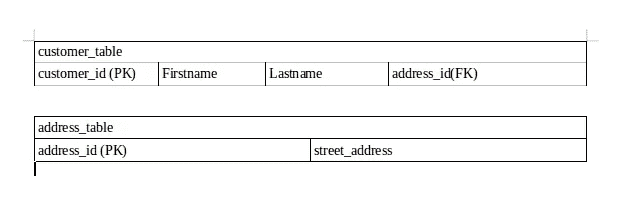

# 为初学者简化的内部连接。

> 原文：<https://medium.com/analytics-vidhya/mysql-inner-join-simplified-for-beginner-1884515ea857?source=collection_archive---------0----------------------->

在研究 SQL INNER JOIN 主题时，我做了一些简短的笔记，在此与大家分享。

# 联接两个表—内部联接

如何检索客户的名字和姓氏以及他们的地址？

客户表和地址表。

**步骤 1:** 选择查询将需要—检索 customer.firstname，customer.lastname 和 address.streetaddress

**第二步:**在 FROM 子句中添加需要连接的表名，即 customer。

**第三步**:接下来指定连接类型，即内部连接地址

第四步:查找外键。Address_id 是两个表之间的公共链接。使用 ON 子句(即 ON customer)指定上述表应如何连接。地址标识=地址.地址标识。

SQL 查询看起来像这样:

两个表内部连接的 SQL 查询。

# 连接三个表-内部连接

如何检索客户的名字和姓氏以及他们所在的城市？

三个表内部连接的 SQL 查询。

**步骤 1:** 选择查询将需要—检索 customer.firstname、customer.lastname 和 city.cityname。

**步骤 2:** 我们不能直接联接客户表和城市表，因为它们之间没有公共链接(外键)。我们必须通过地址表才能到达城市表。添加需要在 FROM 子句中连接的表名，即 customer。

**步骤 3** :接下来指定连接类型，即内部连接地址

**步骤 4:** 查找外键。Address_id 是两个表之间的公共链接。指定如何使用 ON(即 ON customer)连接上述表。地址标识=地址.地址标识。

第一个内部联接。

**步骤 5** :一旦客户和地址表连接在一起，我们就可以将这个新组合的表(客户+地址)连接到城市表。正如我们所看到的，cityID 现在是一个常见的链接。添加第二个内部连接，即内部连接城市。

**步骤 6:** 查找外键。city_id 是两个表之间的公共链接。指定如何使用 ON(即 ON address.city _id = city.city_id)连接上述表。

SQL 查询看起来像这样:

# 内部连接关键要点:

在内部联接中，行被排除(例如，如果值在一个表中，而不在另一个表中，则行被排除。只添加匹配的值)

如果需要包含所有行，而不考虑匹配值，则使用外部联接。