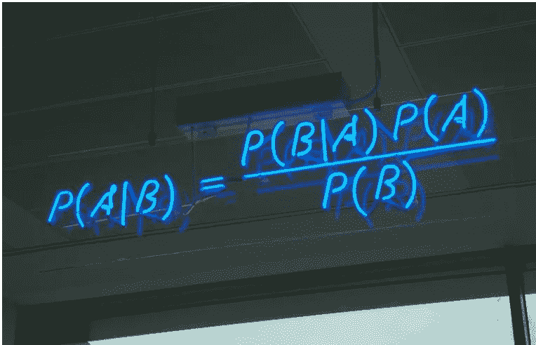
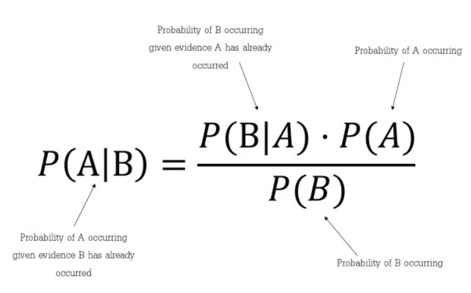

# 朴素贝叶斯

> 原文：<https://medium.com/analytics-vidhya/naive-bayes-729ac4ca48a8?source=collection_archive---------4----------------------->

**朴素贝叶斯**是一种概率机器学习算法。它被广泛用于解决分类问题。除此之外，这种算法在自然语言问题(NLP)中非常有效。

**关于贝叶斯定理**

朴素贝叶斯算法基于贝叶斯定理。让我们看看这个定理解释了什么。

简而言之，贝叶斯定理是在我们知道某些其他概率的情况下找到一个概率的一种方法。从公式中我们可以很清楚的推断出 B 的概率已经发生来确定 a 的概率，我们来看一个例子更好的理解。

**举例**

一群人计划今天去野餐，但是早上多云，

*   哦不！50%的雨天都是从多云开始的！
*   但是多云的早晨是常见的(大约 40%的日子开始时是多云的)
*   这通常是一个干旱的月份(30 天中只有 3 天多雨，或 10%)

白天下雨的几率有多大？

这里，我们把雨和云两个变量联系起来。通过使用这些，我们可以确定如下公式。

**P(雨|云)= P(雨)*P(云|雨)/P(云)**

根据给定的数据确定以下信息，

> p(云|雨)是多云和下雨发生的概率是 50%
> 
> p(云)是云的概率 40%
> 
> p(雨)是下雨的概率 10%
> 
> p(雨|云)= 0.1*0.5/0.4 = 0.125
> 
> 下雨的几率是 12.5%。让我们计划一次野餐吧！。

**朴素贝叶斯**分类器是基于贝叶斯定理的分类算法集合。它不是一个单一的算法，而是一个算法家族，所有算法都有一个共同的原则，即每一对被分类的特征都是相互独立的。例如，如果一个水果是红色的，圆形的，直径大约 10 厘米，那么它可以被认为是苹果。朴素贝叶斯分类器认为这些特征中的每一个都独立地影响该水果是苹果的概率，而不考虑颜色、圆度和直径特征之间的任何可能的相关性。

朴素贝叶斯分类器已经被大量用于机器学习问题中的文本分类和文本分析。

**朴素贝叶斯做出的假设**
朴素贝叶斯的基本假设是每个特征做出一个:

*   自主的
*   平等的

对结果的贡献。

让我们举个例子来获得一些更好的直觉。考虑**汽车被盗问题**的属性颜色、类型、来源和目标，被盗可以是“是”或“否”

数据集表示如下。

鉴于汽车的特征，我们需要对汽车是否被盗进行分类。列代表这些功能，行代表各个条目。如果我们取数据集的第一行，我们可以观察到，如果颜色是红色，类型是运动，产地是国内，那么这辆车就是被盗的。所以我们想对一辆**红色国产 SUV 是否被盗进行分类**。注意，我们的数据集中没有红色国产 SUV 的例子。

后验概率 P(y|X)可以通过首先针对目标为每个属性创建频率表来计算。然后，将频率表建模为似然表，最后，使用朴素贝叶斯方程来计算每一类的后验概率。具有最高后验概率的类是预测的结果。

“颜色”的频率和可能性表

“类型”的频率和可能性表

“起源”的频率和可能性表

要考虑的功能列表

今日=(红色，SUV，国产)

> 确定汽车被盗'是'
> 
> P(是|今天)= P(红|是)* P(SUV |是)* P(国产|是)* P(是)/P(今天)
> 
> 确定这辆车不是偷来的“不”
> 
> P(无|今日)= P(红|无)*P(SUV |无)*P(国产|无)* P(无)/P(今日)
> 
> 由于 P(今天)在两种概率中是常见的，所以我们可以忽略 P(今天)并求出概率:
> 
> p(是|今天)= 3/5*1/5*2/5*1 = 0.048
> 
> p(无|今日)= 2/5*3/5*3/5*1 = 0.144

由于 0.144 > 0.048，这意味着给定红色 SUV 和国产的特征，我们的示例被分类为“否”，该车未被盗。

我们上面讨论的方法适用于离散数据。在连续数据的情况下，我们需要对每个特性的值的分布做一些假设。

**高斯朴素贝叶斯分类器**

在高斯朴素贝叶斯中，假设与每个要素相关联的连续值按照高斯分布分布。高斯分布也称为正态分布。绘制时，它会给出一条关于特征值平均值对称的钟形曲线，如下所示:

其他流行的朴素贝叶斯分类器有:

*   **多项式朴素贝叶斯:**特征向量表示通过多项式分布产生某些事件的频率。这是通常用于文档分类的事件模型。
*   **伯努利朴素贝叶斯:**在多元伯努利事件模型中，特征是描述输入的独立布尔(二元变量)。像多项式模型一样，该模型对于文档分类任务是流行的，其中使用二元术语出现(即，单词是否在文档中出现)特征，而不是术语频率(即，单词在文档中的频率)。

希望这篇文章能帮助你更好地理解朴素贝叶斯。