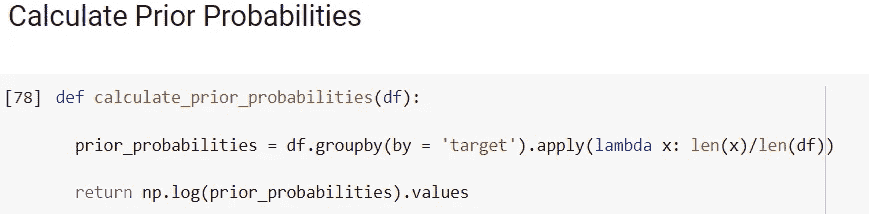

# 朴素贝叶斯算法:从头开始的 Python 实现

> 原文：<https://medium.com/analytics-vidhya/naive-bayes-algorithm-implementation-from-scratch-f9a2a12789b5?source=collection_archive---------2----------------------->

图片来源-machinelearningmastery.com

朴素贝叶斯是最简单的监督机器学习算法之一。这是一种基于贝叶斯定理的分类技术。它用于高维训练数据集，如文本分类。朴素贝叶斯假设训练数据集中的所有输入要素相互独立，即它们不相关。一个特征的出现不会影响另一个特征的出现。例如，形状、颜色和味道独立地有助于识别水果是苹果。这个假设在大多数现实生活情况下都不成立，所以被称为*天真*。

这是一种快速、易于实现、计算量少且准确的分类方法。它优于许多其他机器学习算法。除了文本分类，它还用于垃圾邮件过滤、情感分析、推荐系统和多类分类。

在继续讨论朴素贝叶斯之前，让我们首先讨论条件概率的概念和其中使用的贝叶斯定理。条件概率是给定一个事件发生另一个事件的概率，例如 P(给定 B)或 P(A | B)。

贝叶斯定理由公式给出:

它有三种类型:

1.  **伯努利朴素贝叶斯:**当输入要素仅以二进制形式存在时使用。它考虑了随机变量 x 的伯努利分布。

**2。高斯朴素贝叶斯:**与连续特征一起使用。它假设输入要素遵循正态/高斯分布。

**3。多项式朴素贝叶斯:**它用于给定术语代表其出现次数的特征。例如，在文本分类中，我们创建单词向量并存储每个单词的出现频率，这将有助于对文本进行分类。

现在，我们将从头开始看 python 实现。你也可以从[这里](https://github.com/tanvipenumudy/ML-Stream-Interns-Summer-21/blob/main/Khushi%20Jain/Naive%20Bayes/Naive_Bayes_From_Scratch.ipynb)访问代码。

我们得到了 96.66%的准确率，这是相当不错的。现在我们来看看朴素贝叶斯的利与弊。

**优点**

1.  这是一种快速、简单、计算量少且准确的分类方法。
2.  输入特征相互独立的假设使它比其他算法更快。
3.  它非常适合处理高维数据。
4.  与连续特征相比，分类特征的性能更好。
5.  它可用于多类分类。

**缺点**

1.  输入特征之间没有相关性的假设是不现实的。
2.  如果测试数据包含训练数据中不存在的类别，它将面临零频率问题。

如何提高我们分类的准确性？

1.  确保连续变量遵循正态分布。
2.  所有输入特征应相互独立，即移除相关特征。
3.  使用拉普拉斯校正来避免零频率问题。

这样，我们就完成了朴素贝叶斯算法。希望你觉得有用。鼓掌&关注我，阅读我即将推出的博客！

如果你喜欢我的博客，那么看看我以前的一些博客:

1.  [KNN 算法](/nerd-for-tech/k-nearest-neighbors-aac72032aaea?source=friends_link&sk=84ab45f698fe6bb81494f79f1aa53c7f)
2.  [线性回归](https://khushijain2810.medium.com/linear-regression-9fd219098405)
3.  [OpenCV](https://khushijain2810.medium.com/introduction-to-opencv-586e38d536fd)
4.  [Seaborn](https://khushijain2810.medium.com/seaborn-data-visualization-library-142ac64d5560)
5.  [熊猫](https://khushijain2810.medium.com/pandas-python-data-analysis-library-1d061c982fc8)
6.  [Numpy](https://khushijain2810.medium.com/numpy-day-3-at-internity-foundation-efcef826e549)

快乐学习！