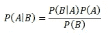
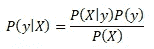
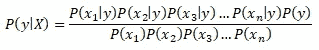
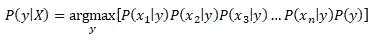
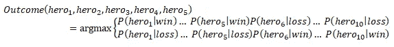
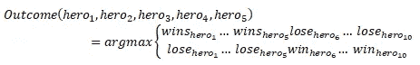
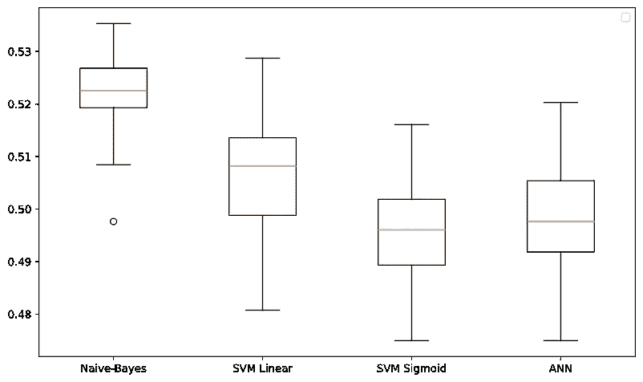
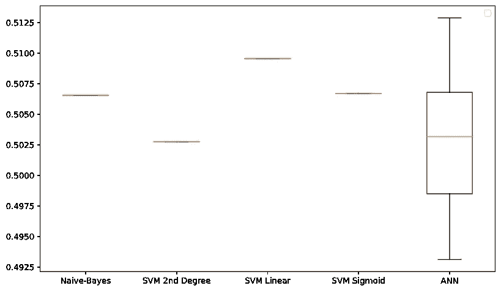

# 朴素贝叶斯分类器和预测 Dota 2 比赛的结果

> 原文：<https://medium.com/analytics-vidhya/naive-bayes-classifier-and-predicting-the-results-of-a-dota-2-match-c9b246d76cd9?source=collection_archive---------23----------------------->

Dota 2 赛季要来了！在去年因为疫情而暂停之后，除了地区在线锦标赛 Dota 2，DPC 赛季现在以新的形式回归，并于今天开始。

对于那些不熟悉的人来说，Dota 2 是电子竞技中最大的冠军，其最新版本是最大的比赛，国际 10 强，在所有比赛中聚集了最大的奖金池，达到 4000 万美元，尽管它因疫情而被推迟。此外，在电子竞技总收入最高的 30 名玩家中，有 29 名是 Dota 2 专业人士。

Dota 2 是一款多人在线战斗竞技场游戏，由 10 名玩家分成两队进行游戏，目的是控制敌人的基地并摧毁最重要的建筑 Ancients。每个玩家独立控制一个叫做英雄的角色，他们都有独特的能力和不同的游戏风格。

英雄当然是游戏中最重要的部分。不同的英雄组合和比赛给游戏带来了刺激，并在每场比赛中提供了多样性。敌对双方的英雄是从 120 名独特的英雄中挑选出来的。

我们可能希望根据单独选出的英雄来预测比赛的结果。当然，这是可能的，为此，我们将探索朴素贝叶斯分类器。

朴素贝叶斯是一个相当简单而有效的分类器。它基于特征相互独立的假设，并基于贝叶斯定理。这个定理描述了一个事件发生的概率，它是基于可能与该事件相关的条件的先验知识。简而言之，它描述了在已知事件 A 和 B 的概率以及事件 B 的条件概率的基础上，已知事件 B 发生的事件 A 的概率。

因此，对于给定的类别 y 和特征向量 X，类别 y 的概率由下式给出:

然而，由于对于给定的特征集，每个特征被假设为彼此独立。请注意，情况并非总是如此，但这种假设在大多数时候仍然有效。例如，在 Dota 2 中，英雄可以彼此独立挑选，但是，有一些英雄组合彼此配合得最好，或者团队可以选择与对手团队的英雄进行更好的比赛。

尽管如此，假设每个特征都是相互独立的，那么两者发生的概率等于它们各自概率的乘积。因此，一个类的概率可以写成:

由于分母部分对于所有类别都是恒定的，因此在计算中忽略了这一点，从而使分类器显得幼稚，无法给出准确的概率。通过获得具有最高值的类来完成分类。

在 Dota 2 中，一场比赛只能有两种结果，要么一队赢，要么一队输，因此，职业概率也可以省略。为了预测一组英雄是否会战胜对手，我们可以用数学方法将分类器写成:

对于单个英雄，我们可以通过其胜率或败率得到后验概率，P(英雄|赢)或 P(英雄|输)。换句话说，它赢或输的比赛数，除以总比赛数。同样，整个训练集的匹配总数是恒定的，我们可以省略它，以进一步简化计算。最终的分类器可以写成:

过去的补丁，7.27，使用了很长一段时间，几个在线锦标赛在这个补丁中进行。这个补丁中官方职业比赛的英雄数据集是从 [Opendota](https://www.opendota.com/) API 创建的。

为了测试分类器的性能，使用 70–30 随机分割将数据集分割为训练集和测试集。使用训练集对模型进行训练，并使用测试集对模型进行评估。这个过程重复 50 次，以确定分类器的性能。

使用相同的数据集和训练测试分割来训练线性 SVM 分类器和 sigmoid SVM。此外，一个具有三个隐层的人工神经网络被训练用于比较。

一般来说，朴素贝叶斯分类器比其他三个分类器表现得更好，其平均值为 52.24%，最大值约为 54%。这不是一个巨大的飞跃，但仍然比盲目预测一个获胜的团队要好。

必须注意的是，每个补丁都有不同的结果(因为通常，一个补丁会削弱前一个补丁中最好的英雄，并加强表现最差的英雄，目的是平衡游戏)。换句话说，如使用来自补丁 7.26 的专业比赛来预测 7.27 比赛结果的结果所示，先前补丁的结果不可转移到当前补丁。

总之，朴素贝叶斯分类器是一个简单的分类器，除了比赛中使用的英雄之外，没有任何其他数据，可以用来提高预测结果的几率，只有几个百分比。当然，如果有更多的数据可以用来做这样的预测，比如球队的总体表现，或者使用某些英雄和英雄组合等等，也不会有什么坏处。