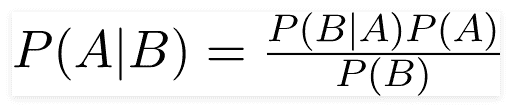
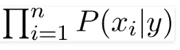
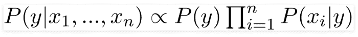
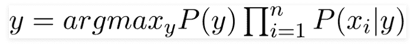

# 朴素贝叶斯分类器

> 原文：<https://medium.com/analytics-vidhya/naive-bayes-classifier-cca65df81e83?source=collection_archive---------33----------------------->

# 一点背景

正如我们所知，朴素贝叶斯定理是一种机器学习分类器模型，它是从**贝叶斯定理**中派生出来的，该定理指出:



[来源](https://towardsdatascience.com/naive-bayes-classifier-81d512f50a7c)

看起来很复杂，其实很简单。贝叶斯定理表明，我们可以根据 B 已经发生的证据找到事件 A 发生的概率。

现在，在开始讨论如何找到它之前，让我们简单介绍一下哪一个是证据，哪一个是假设:

这里有一个**假设**，因为它是在证据的基础上提出的概率。

B 是证据**,因为事件已经发生，并且与 A 是否会发生无关，这意味着 B 是预测项。**

**让我们考虑一个学生的例子。考虑到这一点，一个学生可以聪明也可以不聪明。如果他/她进行考试，聪明的学生可能会通过考试，也可能不会。因此，它仍然是一个假设或假说，“假定一个学生是聪明的，他/她将通过考试”，相应的替代假说也需要考虑。**

**因此，为了找出它是否成立，我们需要借助这样一个条件概率来展示“*学生通过考试的概率，前提是他/她是聪明的*”。**

**我希望你有一点贝叶斯定律的先决条件，其中， **P(A)** 表示先验概率，项 **P(B|A)** 表示后验概率。我们考虑在两种情况下相等的联合概率的概念，它符合我们的方程。**

# ****为什么幼稚？****

**每当我们谈到朴素贝叶斯定理时，这是一个我们经常遇到的问题！原因真的很明显。**

**该定理基于特征相互独立的假设。背后的一个重要原因是因为如果一个特性隐含了另一个特性的某个值，那么预测我们需要的值就没有用了。**

**这就像你吃了过量的糖，它肯定会增加你的体重到一个很高的水平。这里的体重取决于糖的摄入量。所以，这自动暗示你超重了，你不需要两种特征都吃！你确实需要控制你的糖摄入量。**

**因此，这使得我们不必依赖训练数据集中的重复来进行特定的分类成为可能。因此，将结果与单个领域进行比较将是合适的，只要我们有这些单个领域在某种程度上彼此不相关。**

**这就是为什么有时候天真是件好事的原因！这无疑使我们在没有重复计算证据的情况下进行分类成为可能。老实说，朴素贝叶斯定理比贝叶斯定理更聪明，完全相反！**

# ****跳回到朴素贝叶斯分类器****

*   **让我们考虑具有
    特征的数据集:x1，x2，x3，x4，x5
    输出:y**
*   **所以在这里，我们需要找到 y 的概率，即单独给定每个特定特征的输出，即 P(x1|y)，P(x2|y)，等等。**
*   **现在，我们需要找到 y 的概率，给定独立特征 x1、x2、x3、x4 和 x5 的某一组值。**

**正如我们在上面看到的，它将是 P(y|X ),其中 X 代表这 5 个特征的集合或元组。**

*   **因此，我们可以继续乘以所有 5 个特征的概率:P(xi|y ),这 5 个特征将代表我们等式中的项:P(B|A)！**

**因此在这里，P(B | A)= P(x1 | y)* P(x2 | y)* P(x3 | y)* P(x4 | y)* P(X5 | y)**

**我们可以用圆周率记法把它变成一个术语，如下所示:**

****

**[来源](https://towardsdatascience.com/naive-bayes-classifier-81d512f50a7c)**

**我们现在可能遗漏了两个重要的术语:分母 P(B)和分子 P(A)。**

*   **这里的 P(B)代表 P(x1)*P(x2)*P(x3)*P(x4)*P(x5)所以，这里我们不想考虑。原因是这是一个常数项，不会改变。最重要的是，这里我们需要的是结果 y，而不是概率 P(y|X)。**

**所以，我们会根据 P(y|X)的比例来考虑 y，也就是说，**

****

**[来源](https://towardsdatascience.com/naive-bayes-classifier-81d512f50a7c)**

**现在，让我们专注于我们的目标:找到 y 项！**

*   **我们知道，y 是一个分类特征。在这种情况下，让我们考虑一个二元分类问题。所以 y 只有两种可能的结果。因此，我们需要考虑我们获得的关于结果的特征的最高概率。**

**因此，我们简单地使用上面获得的 argmax 项:**

****

**[来源](https://towardsdatascience.com/naive-bayes-classifier-81d512f50a7c)**

**我们完成了朴素贝叶斯定理的预测模型，就在这里！**

*   **如果你想知道如何找到 P(xi|y ),可以这样想:这将是最大数量的结果，其中 x=0 假设 y=1，x=1 假设 y=1。(这是针对单个特征 x 的，设想其他独立特征也是如此。)**

**让我们跳到一个例子的代码中，让它更清楚。**

****预测虹膜数据集的类别****

**众所周知，Iris 数据集是一个非常著名的分类数据集。因此，我们将在这里使用它。你可以在这里找到它:[虹膜数据集](https://raw.githubusercontent.com/jbrownlee/Datasets/master/iris.names)**

**让我们开始吧:**

**1]导入所需的库和数据集**

```
**import** math
**import** random
**import** pandas **as** pd**import** numpy as np
from sklearn.preprocessing **import** LabelEncoder
from sklearn.model_selection **import** train_test_splitdf = pd.read_csv(‘iris.csv’)
```

**2]编码花卉类**

```
label_encoder = LabelEncoder()
df[‘class’] = label_encoder.fit_transform(df[‘class’])
```

**3]成型箱**

```
bins = [4.3, 5.5, 6.7, 7.9]
labels = [0, 1, 2]
df[‘sepal_l’] = pd.cut(df[‘sepal length in cm’], bins=bins, labels=labels)
bins = [2.0, 2.8, 3.6, 4.4]
df[‘sepal_w’] = pd.cut(df[‘sepal width in cm’], bins=bins, labels=labels)
bins = [1.0, 3.0, 5.0, 7.0]
df[‘petal_l’] = pd.cut(df[‘petal length in cm’], bins=bins, labels=labels)
bins = [0.1, 0.9, 1.7, 2.5]
df[‘petal_w’] = pd.cut(df[‘petal width in cm’], bins=bins, labels=labels)
```

**4]删除前面的列**

```
df = df.drop([‘sepal length **in** cm’, ‘sepal width **in** cm’, ‘petal length **in** cm’, ‘petal width **in** cm’], axis=1)5] Replacing the missing valuesdf[‘sepal_l’].fillna(df[‘sepal_l’].mode().values[0], inplace=True)
df[‘sepal_w’].fillna(df[‘sepal_w’].mode().values[0], inplace=True)
df[‘petal_l’].fillna(df[‘petal_l’].mode().values[0], inplace=True)
df[‘petal_w’].fillna(df[‘petal_w’].mode().values[0], inplace=True)
```

**⑹列车测试数据的拆分**

```
X = df.drop([‘class’], axis=1)
y = df[[‘class’]]
X_train, X_test, y_train, y_test = train_test_split(X, y, test_size=0.3, random_state=1)
```

**7]检查先验概率**

```
# Check Priori Probabilityprob_0 = len(**y_train**[y_train[‘class’]==0])/len(**y_train**)
prob_1 = len(**y_train**[y_train[‘class’]==1])/len(**y_train**)
prob_2 = len(**y_train**[y_train[‘class’]==2])/len(**y_train**)
```

**8]创建组合的训练数据集并找到后验概率作为字典 pxy**

```
X_train_trail = X_train.copy()
X_train_trail[‘y’] = y_train
pxy = {}
pxy[‘sepal_l_0’] = [len(X_train_trail[X_train_trail[‘sepal_l’]==0])/len(X_train_trail[X_train_trail[‘y’]==0]), len(X_train_trail[X_train_trail[‘sepal_l’]==1])/len(X_train_trail[X_train_trail[‘y’]==0]), len(X_train_trail[X_train_trail[‘sepal_l’]==2])/len(X_train_trail[X_train_trail[‘y’]==0])]
pxy[‘sepal_l_1’] = [len(X_train_trail[X_train_trail[‘sepal_l’]==0])/len(X_train_trail[X_train_trail[‘y’]==1]), len(X_train_trail[X_train_trail[‘sepal_l’]==1])/len(X_train_trail[X_train_trail[‘y’]==1]), len(X_train_trail[X_train_trail[‘sepal_l’]==2])/len(X_train_trail[X_train_trail[‘y’]==1])]
pxy[‘sepal_l_2’] = [len(X_train_trail[X_train_trail[‘sepal_l’]==0])/len(X_train_trail[X_train_trail[‘y’]==2]), len(X_train_trail[X_train_trail[‘sepal_l’]==1])/len(X_train_trail[X_train_trail[‘y’]==2]), len(X_train_trail[X_train_trail[‘sepal_l’]==2])/len(X_train_trail[X_train_trail[‘y’]==2])]
```

**这是一个示例专栏，我们需要一个接一个地为所有的特性做这件事，以防你想写更多的代码。或者，您可以对所有特性使用相同的 for 循环。我们形成一个字典 pxy，代表我们的后验概率。**

**它给出了输出表:**

**9]最后，创建预测函数:**

```
def pred(X):
    sepal_l = X[0]
    sepal_w = X[1]
    petal_l = X[2]
    petal_w = X[3]
    sepal_l_col = ‘sepal_l_’+str(sepal_l)
    sepal_w_col = ‘sepal_w_’+str(sepal_w)
    petal_l_col = ‘petal_l_’+str(petal_l)
    petal_w_col = ‘petal_w_’+str(petal_w)
    prob0 = pxy[sepal_l_col][0]*pxy[sepal_w_col][0]*pxy[petal_l_col][0]*pxy[petal_w_col][0]*prob_0
    prob1 = pxy[sepal_l_col][1]*pxy[sepal_w_col][1]*pxy[petal_l_col][1]*pxy[petal_w_col][1]*prob_1
    prob2 = pxy[sepal_l_col][2]*pxy[sepal_w_col][2]*pxy[petal_l_col][2]*pxy[petal_w_col][2]*prob_2
    x = max([prob0, prob1, prob2])
    if x==prob0:
        return 0
    elif x==prob1:
        return 1
    else:
        return 2
```

**10]然后，检查你的结果！试试你那端，让我们看看你表现如何。**

# ****短暂的结束****

**由于我们在这里将几个连续值捆绑到类中，这被称为多项式朴素贝叶斯。**

**不过，这很有可能通过高斯朴素贝叶斯模型得到更准确的解决。原因是，它对连续变量有用！**

**我们不会讨论它是如何制定的，因为它的公式有点复杂。但是，探索它到底是什么是好的。**

# ****结论****

**朴素贝叶斯定理相对来说比声称的要简单，但在预测方面，它是一种非常有效的算法。这完全取决于证据在概率方面的表现。这对于分类问题以及对数据进行情感分析非常有用。尽管如此，模型的独立性标准在现实生活的数据集上经常失效，这些数据集通常包含因变量和多重共线性变量。然而，它被用于一些值得注意的领域，并且在行业中执行小规模预测时确实有很好的性能。**