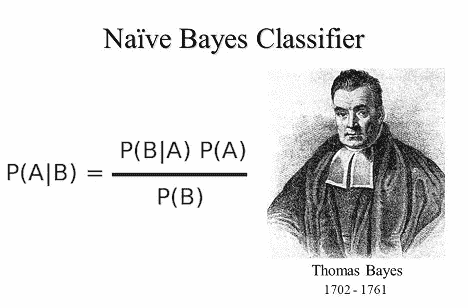
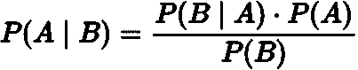

# 朴素贝叶斯:背后的数学，它是如何工作的，以及一个例子

> 原文：<https://medium.com/analytics-vidhya/naive-bayes-the-maths-behind-it-how-it-works-and-an-example-6e0a130412f7?source=collection_archive---------19----------------------->

朴素贝叶斯算法是另一种非常流行的监督机器学习算法，它试图根据贝叶斯定理根据预定义的类别对数据进行分类。朴素贝叶斯的一个经典例子是文本分类，比如从普通邮件中检测垃圾邮件。朴素贝叶斯也称为概率分类器，因为它计算任何特定数据属于哪个类的概率。

术语*朴素贝叶斯*本身是一个有趣的术语，也是一个你应该知道的术语。术语*幼稚*本身指的是算法假设所有的特征都是相互独立的。换句话说，其他特征的存在/权重或缺乏不影响任何其他特征，因此有术语“天真”。贝叶斯是以 18 世纪英国统计学家托马斯·贝叶斯的名字命名的，他最著名的成就是贝叶斯定理。

现在让我们直接进入不那么令人困惑的贝叶斯公式:

解释如下:

*   **P (A | B)** :名为后验概率，是给定 *B* 为真时 *A* 发生的概率。
*   **P(B | A)** :给定 *A* 时 *B* 发生的概率为真。
*   **P(A)**:A 为真的概率，也叫 *A* 的先验概率。
*   **P(B)**:B 为真的概率，也叫 *B* 的先验概率。

让我们将这个公式应用于现实生活中的例子，大多数在线例子试图将它与正常/垃圾邮件的例子联系起来，我也会这样做。我将在下面附上它的原始材料(所有来源都列在本指南的末尾)。

事实上，我们有许多普通邮件和垃圾邮件。我们将普通电子邮件定义为带有普通正文的电子邮件，或多或少是预测的对话。而垃圾邮件是不受欢迎的电子邮件，通常带有欺诈性的声明和意图。你并不是不知道其中的区别，但是有一个基本的定义作为起点是一件好事。

现在，假设我们有一个数据集，或者也称为语料库，包含两类电子邮件。这些电子邮件将由在这些特定电子邮件中找到的文本组成。现在有了这个数据集，我们将尝试使用贝叶斯定理进行预测。

首先，我们需要找到每个类别的先验概率，通俗地说，就是找到任何单词、电子邮件、句子属于垃圾邮件或正常电子邮件的可能性，而不管电子邮件的内容如何。接下来，我们得到我们试图分类的正文文本，并找到每个词在每个类别中出现的概率，将所有的词相乘，然后将它们乘以每个类别的先验概率。好吧，那很难，不是吗？好的，我们来举个例子。

想象一下，我们有一封电子邮件，可能是垃圾邮件，也可能是正常邮件，对吗？让我们从那封虚构的电子邮件中的一个虚构的句子开始，类似于“*亲爱的客户*”。首先我们找到每一类的先验概率，然后是*亲爱的*的概率，以及*顾客*的概率。之后，我们将它们相乘，我们应该得到短语“*亲爱的客户*”在任一类中的概率。

还有一个版本叫做高斯朴素贝叶斯。它以高斯分布命名，也称为正态分布。我们首先找到每个输入的平均值和标准差。然后，我们将先验概率乘以给定某一类的每个变量的可能性。例如，如果我们有三个变量，我们根据它们的分布找到这三个变量的可能性。然后，我们对每个可能性应用 log()并找到所有这些对数值的总和。然后，我们对另一个类重复这个过程，无论哪个过程产生的值更高，都将表示预测的类。