# 使用深度学习的命名实体识别(ELMo 嵌入+双 LSTM)

> 原文：<https://medium.com/analytics-vidhya/named-entity-recognition-using-deep-learning-elmo-embedding-bi-lstm-48295bc66cab?source=collection_archive---------0----------------------->

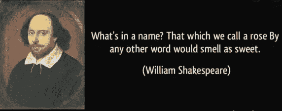

# *简介:*

[***命名-实体识别****(***)**](https://en.wikipedia.org/wiki/Named-entity_recognition)**(也称* ***实体识别*** *，* ***实体分块*******实体提取*** *)是一***

***它为你的内容增加了丰富的语义知识，帮助你迅速理解任何给定文本的主题。***

# **应用:**

*****的几个应用包括:从* ***法律、金融、医疗文档中提取重要的命名实体，*** *为* ***新闻提供商分类内容，*** *改进***等。******

# **解决这个问题的方法:**

1.  ****机器学习方法:** *把问题当作一个* ***多类分类*** *带有命名实体的是我们的标签。这里的问题是* ***对于较长的句子*** ***识别和标注命名实体需要对句子的上下文和其中的单词标注的顺序有透彻的理解，*** *这种方法忽略了并且不能抓住整个句子的本质。***
2.  ****深度学习方法:** *可以解决这个问题的最佳可能模型是* **【长短时记忆】** *模型****具体来说，我们将使用* **双向 LSTM** *进行设置。* **双向 LSTM 是两个 LSTM 的组合——一个从“从右到左”向前，一个从“从左到右”向后，从而捕捉句子的整个本质/上下文。***对于****【NER】****，由于上下文在一个序列中涵盖了过去和未来的标签，所以我们需要把过去和未来的信息都考虑进去。*****

****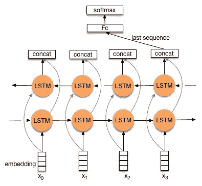****

****双 LSTM****

> ******嵌入层:**[**ELMo**](https://arxiv.org/pdf/1802.05365.pdf)(***嵌入来自语言模型***):***ELMo****是一个深度语境化的词表示，模型既，*****

*****(1)用词的复杂特点(如* ***【句法语义】*** *)和*****

*****(2)这些用法如何在语言语境中变化(即* ***来模拟一词多义*** *)。* ***举例*** *:虽然'* ***苹果*** *术语很常见，但是****ELMo****会给两者不同的嵌入(* ***果实和组织*** *)*****

******示例** : *我们也不需要担心训练数据的词汇外(OOV)标记，因为 ELMo 也会为此生成字符嵌入。*****

*****这些词向量是深度双向语言模型(****biLM****)内部状态的学习函数，在大型文本语料库上进行预训练。它们可以很容易地添加到现有的模型中，并在广泛的具有挑战性的 NLP 问题中显著提高技术水平，包括* ***问题回答、文本蕴涵和情感分析*** *。*****

****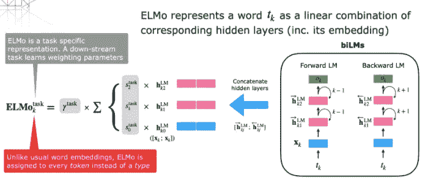****

****工程与后勤管理局****

# ****让我们看看如何解决这个问题:****

1.  ******数据** **采集** : *我们要用一个来自 Kaggle 的* [***数据集***](https://www.kaggle.com/abhinavwalia95/entity-annotated-corpus/home) *。请浏览数据以了解更多关于不同标签的信息。*****

****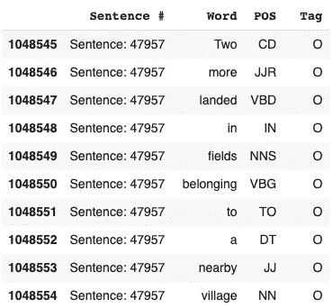****

*****我们的数据集中有****47958****句子，****35179****不同的* ***单词*** *，* ***42*** *不同的****POS*******

******在本文中我们将构建* ***2*** *不同的模型来分别预测* ***标签*** *和****POS****。******

*******2*** 。*接下来我们将使用一个* ***类*** *，它将把每一个带有命名实体(标签)的句子转换成一个元组列表[(单词，命名实体)，…]*****

****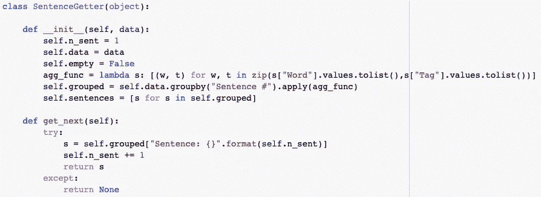********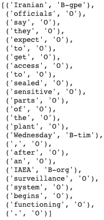****

*******3。*** *我们来看看* ***句子长度*** *在数据集中的分布。所以最长的句子有***140 个单词，我们可以看到几乎所有的句子都有不到 60 个单词的***。但是由于硬件不足，我们将使用更小的长度，即* ***50 个字*** *，这很容易处理。*******

****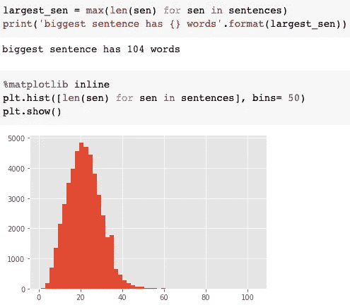****

*******4。*** *让我们创建* ***单词到索引和索引到单词*******映射*** *，这是训练前和预测后单词转换所必需的。******

****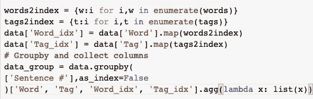********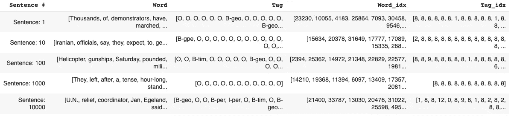****

******5。** *从前面生成的元组列表中，现在我们将构建自变量和因变量结构。*****

*   *******自变量/词语料库:*******

****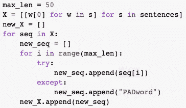********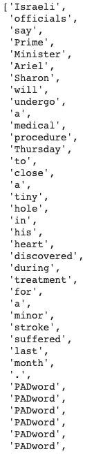****

*   *******这同样适用于命名实体，但我们需要将我们的标签映射到数字上*******

****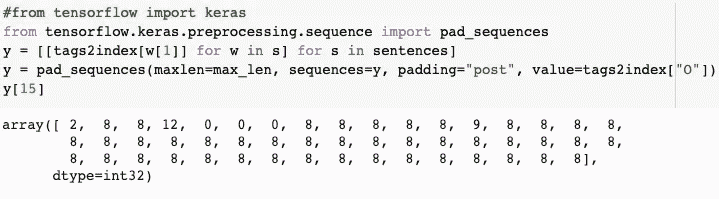****

*******6*** 。 ***训练—测试分割(90:10):*******

****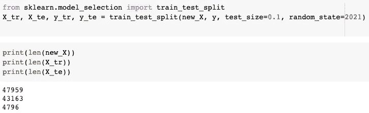****

*******7。批量训练:S*** *由于我们把***32 作为* ***的批量*** *，投料网络必须成块，都是* ***32 的倍数。********

****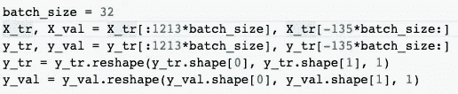****

*******8***。 ***加载 ELMo 嵌入层:*** *我们将导入****tensor flow Hub****(一个用于机器学习模型的可重用部分的发布、发现和消费的库)来加载* ***ELMo 嵌入*** *特性并创建一个函数，以便我们可以以* ***层的形式加载它*******

****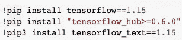****

*******请降级您的 Tensorflow 套餐，以使用此代码。如果想在 TF 2 或更高版本中执行同样的操作，必须使用 hub.load(url)，然后创建一个 KerasLayer(…，其中 trainable = True)。*******

****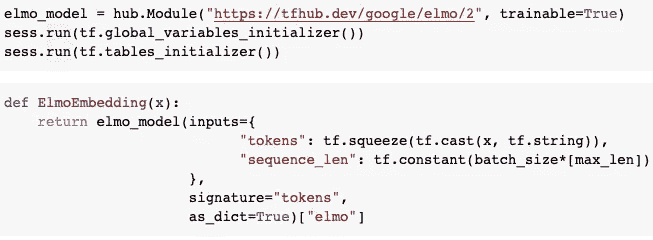****

******9*。设计我们的神经网络:*******

*   *******【ELMo】****:我们将指定填充序列的最大长度(* ***50*** *)。在网络被训练之后，嵌入层将把每个令牌转换成 n 维向量。*****
*   *******双向 LSTM*** *:双向 LSTM 以一个递归层(如第一个 LSTM 层)为自变量。这一层从先前的嵌入层获得输出。*****
*   *******我们将使用 2 个 Bi LSTM 层和残差连接到第一个 BiLSTM*******
*   *******time distributed Layer****:我们正在处理* ***多对多 RNN*** *架构，我们期望从每个输入序列得到输出。这里有一个例子，在序列(a1 →b1，a2 →b2…an →bn)中，a 和 b 是每个序列的输入和输出。TimeDistributeDense 层允许在每个时间步长的每个输出上进行密集(全连接)操作。现在使用这一层将导致一个最终输出。*****

****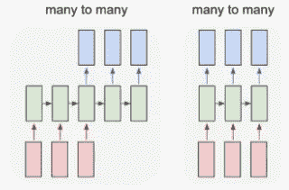********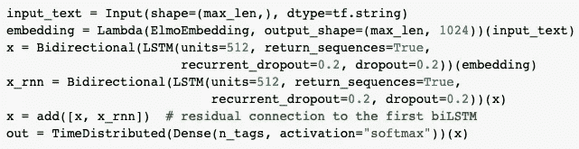********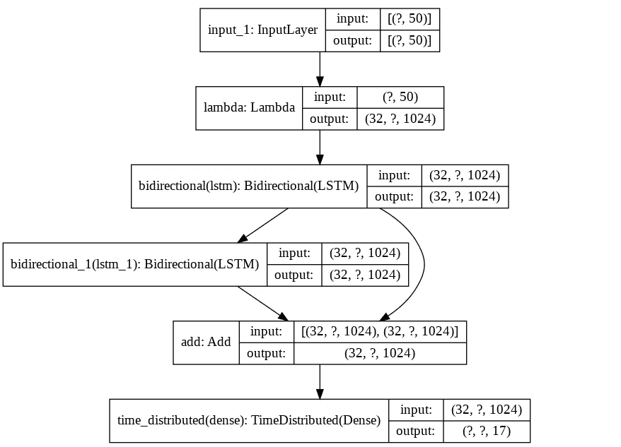****

*******10。训练*** : *只运行了 1 个纪元，因为它花费了很多时间。但是结果很棒。*****

****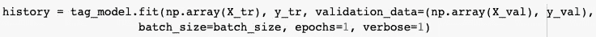****

*******11。批量预测*** *并使用****index-to-tag****将预测的索引转换回 word 格式* ***。*******

****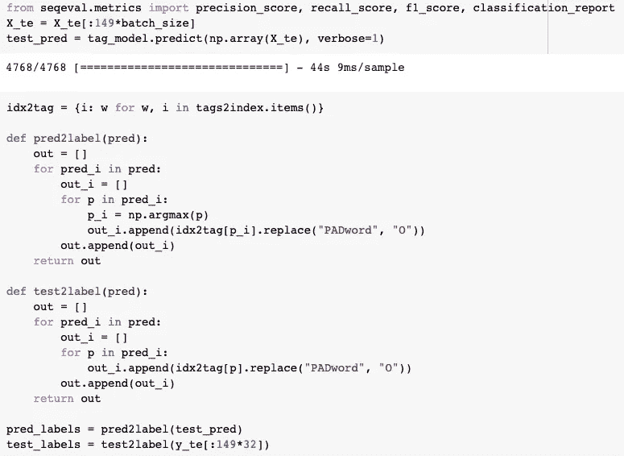****

*******12。评估指标*** : *在****NER****的情况下，我们可能会处理重要的金融、医疗或法律文档，这些文档中命名实体的精确识别决定了模型的成功。换句话说，* ***误报和漏报在 NER 任务中是有业务成本的。*** *因此，我们评估模型的主要指标将是* ***F1 得分*** *因为我们需要在精度和召回率*之间取得平衡。****

*   *******我们能够获得 81.2%的 F1 分数，这相当不错，如果你看看 F1 的微观、宏观和平均分数，它们也相当不错。如果你训练更多的时期，你肯定会得到更好的结果。*******

****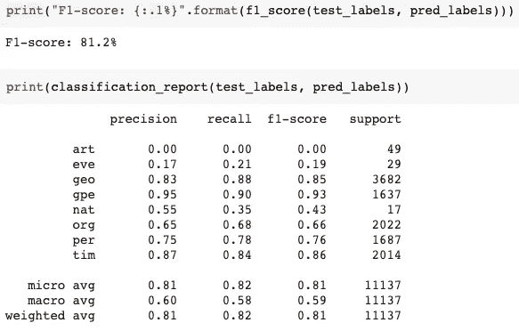****

******13*。将我们的结果与 SPACY*** : *进行比较，我们可以看到我们的模型甚至能够在单个时期内正确地检测到每个标签。*****

****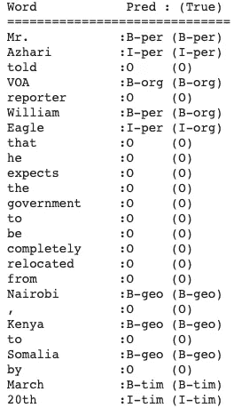****

****我们的模型结果****

****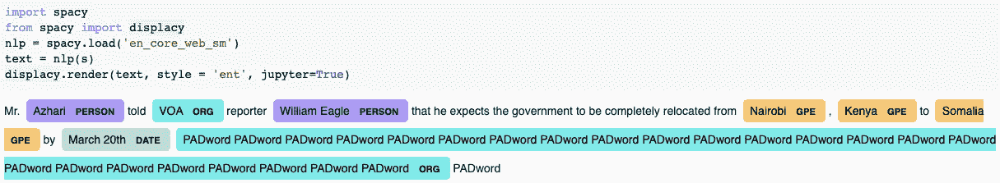****

****宽大的****

******14*。*** ***词性标注/预测*** *:因为，我们的数据集中也有* ***【词性】*** *词性，我们也可以建立类似的模型来预测。我也实现了它，并且训练了一个时期，结果还是很棒。*****

****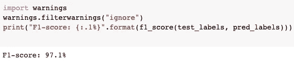****

*   ****我们能够获得 97.1%的 F1 分数，这已经很不错了，如果你看看 F1 的微观、宏观和平均分数，它们也很不错。****

****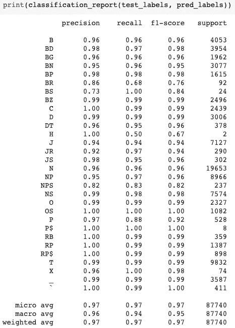****

*******将我们的结果与 SPACY*** : *我们可以看到，我们的模型甚至能够在单个时期内正确地检测每个标签。*****

****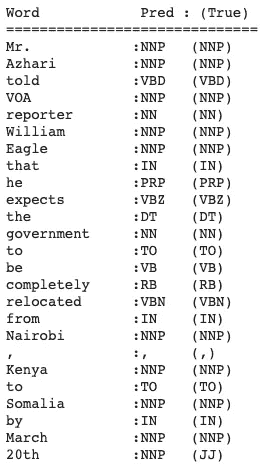****

****我们的模型结果****

****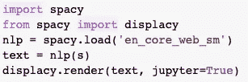********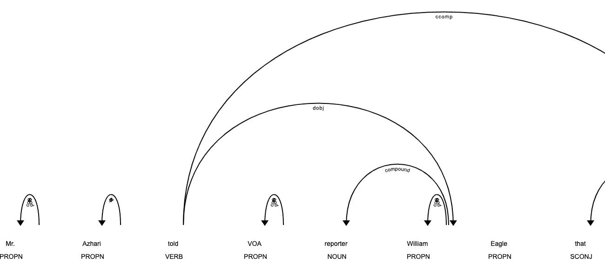****

****宽大的****

*******感谢阅读本博客。如果你喜欢它，请鼓掌，关注并分享。*******

# ****在哪里可以找到我的代码？****

********

******Github**:[https://Github . com/SubhamIO/Named-Entity-Recognition-using-ELMo-BiLSTM](https://github.com/SubhamIO/Named-Entity-Recognition-using-ELMo-BiLSTM)****

*******参考文献:*******

1.  ****【https://jalammar.github.io/illustrated-bert/】T5[T6](https://jalammar.github.io/illustrated-bert/)****
2.  ****[*https://arxiv.org/pdf/1802.05365.pdf*](https://arxiv.org/pdf/1802.05365.pdf)****
3.  ****[*https://en.wikipedia.org/wiki/Named-entity_recognition*](https://en.wikipedia.org/wiki/Named-entity_recognition)****
4.  ****[*https://allennlp.org/elmo*](https://allennlp.org/elmo)****
5.  ****[*https://sun Jackson . github . io/2018/12/11/1 ef 8909353 df 3395 a 36 F3 F4 d 3336269 b/*](https://sunjackson.github.io/2018/12/11/1ef8909353df3395a36f3f4d3336269b/)****