# 自然语言处理:高级技术~深度分析。

> 原文：<https://medium.com/analytics-vidhya/natural-language-processing-advance-techniques-in-depth-analysis-b67bca5db432?source=collection_archive---------2----------------------->

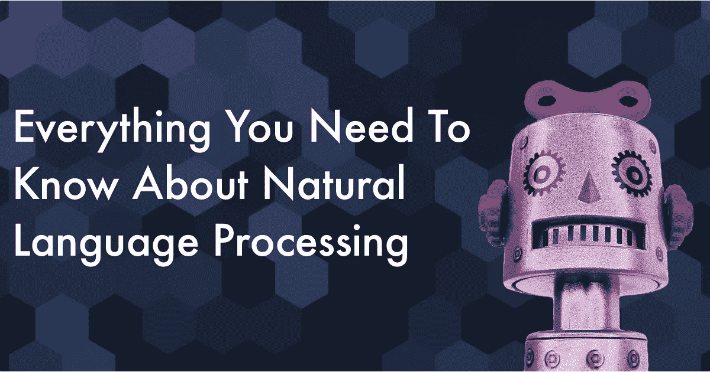

# 什么是 NLP？

**自然语言处理** (NLP) 是计算机科学、人工智能和语言学的交叉领域。目标是让计算机处理或“理解”自然语言，以执行语言翻译和问题回答等任务。

随着语音界面和聊天机器人的兴起，NLP 是信息时代最重要的技术之一，也是人工智能的重要组成部分。完全理解和表达语言的意义是一个极其困难的目标。为什么？因为人类的语言相当特殊。

人工智能领域一直设想机器能够模仿人类思维的功能和能力。语言被认为是人类最重要的成就之一，它加速了人类的进步。因此，有大量的工作正在以自然语言处理(NLP)的形式将语言集成到人工智能领域中，这并不奇怪。今天，我们看到这项工作在 Alexa 和 Siri 等产品中得到了体现。

自然语言处理主要包括自然语言理解(人对机器)和自然语言生成(机器对人)。这篇文章将主要讨论自然语言理解(NLU)。近年来，文本、视频、音频和照片形式的非结构化数据激增。NLU 有助于从文本中提取有价值的信息，如社交媒体数据、客户调查和投诉。

人类语言有什么特别之处？实际上有几件事:

*   人类语言是一个专门用来传达说话者/作者意思的系统。这不仅仅是一种环境信号，而是一种有意的交流。此外，它使用了一种小孩子可以很快学会的编码方式；它也会改变。
*   人类语言大多是离散/符号/分类信号系统，大概是因为信号可靠性更高。
*   一种语言的分类符号可以通过几种方式编码为交流信号:声音、手势、文字、图像等。人类语言可以是其中的任何一种。
*   人类语言是模棱两可的(不像编程和其他形式语言)；因此，在对人类语言的语言/情景/上下文/单词/视觉知识的表示、学习和使用方面存在高度的复杂性。

# 为什么要学习 NLP？

从这一研究领域衍生出的有用应用正在快速增长。它们从简单到复杂。以下是其中的一些:

*   拼写检查，关键字搜索，查找同义词。
*   从网站提取信息，如产品价格、日期、位置、人员或公司名称。
*   分类:学校文本的阅读水平，较长文档的正面/负面情绪。
*   机器翻译。
*   口语对话系统。
*   复杂问题回答。

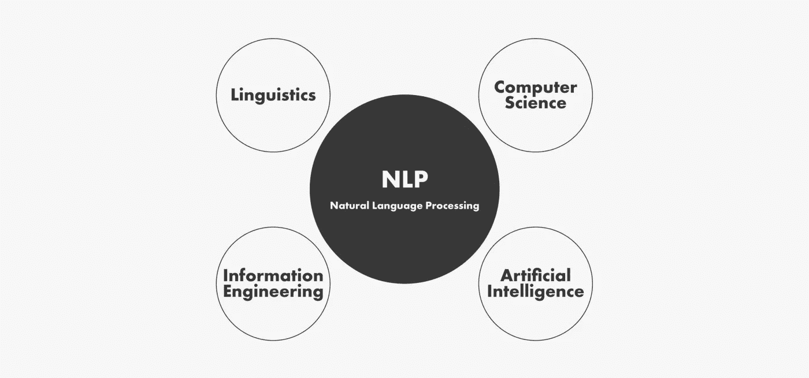

事实上，这些应用已经在行业中大量使用:从**搜索**(书面和口头)到在线广告**匹配**；从自动化/辅助**翻译**到 [**情感分析**](https://heartbeat.fritz.ai/training-a-sentiment-analysis-core-ml-model-28823b21322c) 用于营销或金融/交易；以及从**语音识别**到**聊天机器人/对话代理**(自动化客户支持、控制设备、订购商品)。

# 深度学习

这些 NLP 技术中的大部分都是由深度学习驱动的，深度学习是机器学习的一个子领域。深度学习只是在这个十年开始时才开始再次获得动力，主要是由于这些情况:

*   大量的训练数据。
*   更快的机器和多核 CPU/GPU。
*   具有高级功能和改进性能的新模型和算法:更灵活的中间表示学习，更有效的端到端联合系统学习，更有效的使用上下文和在任务之间转移的学习方法，以及更好的正则化和优化方法。

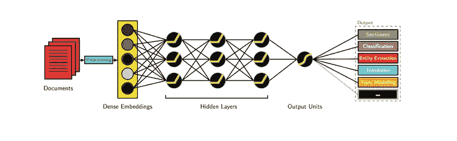

大多数机器学习方法工作良好，因为人类设计的表示和输入特征以及权重优化可以最好地做出最终预测。另一方面，在深度学习中，表征学习试图从原始输入中自动学习好的特征或表征。机器学习中人工设计的特征通常是过度指定的、不完整的，并且需要很长时间来设计和验证。相比之下，深度学习的学习特性容易适应，学习速度快。

深度学习为视觉和语言信息提供了一个非常灵活、通用和可学习的框架来表示世界。最初，它导致了语音识别和计算机视觉等领域的突破。最近，深度学习方法在许多不同的 NLP 任务中获得了非常高的性能。这些模型通常可以用单个端到端模型来训练，并且不需要传统的、特定于任务的特征工程。

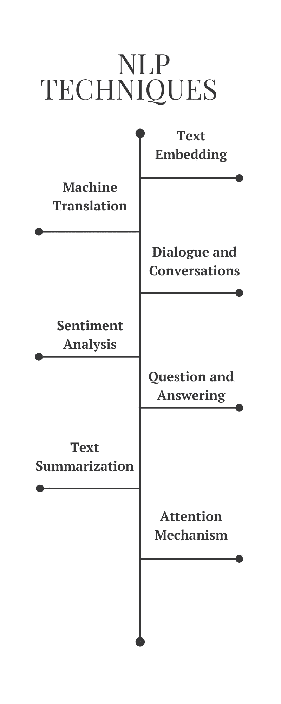

# 文本嵌入

在传统的自然语言处理中，我们认为单词是离散的符号，可以用一个热点向量来表示。向量的维数是整个词汇表中的单词数。单词作为离散符号的问题在于，对于独热向量来说，没有自然的相似性概念。因此，另一种选择是学习在向量本身中编码相似性。核心思想是，一个词的意思是由经常出现在附近的词给出的。

**文本嵌入**是字符串的实值向量表示。我们为每个单词建立一个密集的向量，选择它，使它与出现在相似上下文中的单词向量相似。单词嵌入被认为是大多数深层 NLP 任务的一个很好的起点。它们允许深度学习在较小的数据集上有效，因为它们通常是深度学习架构的第一个输入，也是 NLP 中最受欢迎的迁移学习方式。单词嵌入中最流行的名字是谷歌(Mikolov)的 [**Word2vec**](https://www.tensorflow.org/tutorials/representation/word2vec) 和斯坦福(Pennington、Socher 和 Manning)的 [**GloVe**](https://nlp.stanford.edu/projects/glove/) 。让我们更深入地研究这些单词表示

在[**word 2 vec**](https://arxiv.org/pdf/1301.3781v3.pdf)**，**我们有一个很大的文本语料库，其中固定词汇中的每个单词都用一个向量来表示。然后我们遍历文本中的每个位置 *t* ，它有一个中心词 *c* 和上下文词 *o* 。接下来，我们用 *c* 和 *o* 的词向量的相似度来计算给定 *c* 的情况下 *o* 的概率(反之亦然)。我们不断调整单词向量来最大化这个概率。

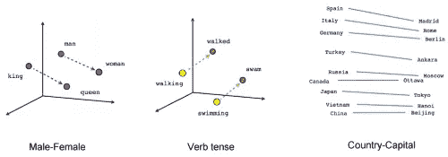

对于 Word2vec 的高效训练，我们可以从数据集中剔除无意义(或频率较高)的单词(如 **a、**T32、的、的**、**然后**……)。这有助于提高模型精度和训练时间。此外，我们可以通过更新所有正确标签的权重来对每个输入使用负采样，但是只对少数不正确的标签使用负采样。**

Word2vec 有两种型号值得一提:

**Skip-Gram:** 我们考虑包含 *k* 个连续术语的上下文窗口。然后我们跳过这些单词中的一个，并尝试学习一个神经网络，该网络获得除跳过的单词之外的所有单词，并预测跳过的单词。因此，如果两个词在大型语料库中重复共享相似的上下文，则这些词的嵌入向量将具有相近的向量。

CBOW 和 SkipGram

**连续单词包:**我们在一个大型语料库中抽取大量的句子。每当我们看到一个单词，我们就把周围的单词。然后，我们将上下文单词输入到神经网络中，并预测该上下文中心的单词。当我们有数千个这样的上下文单词和中心单词时，我们就有了神经网络数据集的一个实例。我们训练神经网络，最后，编码的隐藏层输出表示特定单词的嵌入。碰巧的是，当我们对大量的句子进行训练时，相似上下文中的单词会得到相似的向量。

[**手套**](https://nlp.stanford.edu/pubs/glove.pdf) 模型试图通过捕捉一个单词嵌入整个观察语料库的结构中的含义来解决这个问题。为此，Skip-Gram 和 CBOW 的模型一抱怨是它们都是基于窗口的模型，这意味着语料库的共现统计数据没有被有效地使用，导致次优的嵌入。

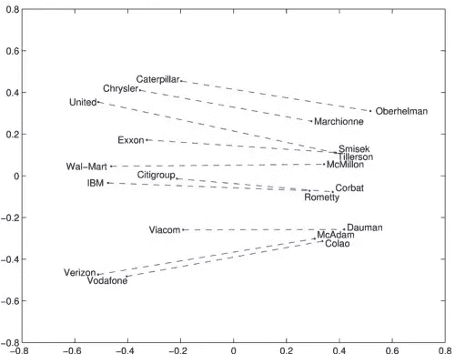

[GloVe](https://nlp.stanford.edu/pubs/glove.pdf) 模型试图通过捕捉嵌入整个观察语料库的结构中的一个单词的含义来解决这个问题。为此，该模型训练单词的全局共现计数，并通过最小化最小平方误差来充分利用统计，结果，产生具有有意义的子结构的单词向量空间。这样的轮廓充分保留了单词与向量距离的相似性。

除了这两种文本嵌入，最近还开发了许多更高级的模型，包括 [FastText](https://arxiv.org/pdf/1607.04606.pdf) 、 [Poincare 嵌入](https://arxiv.org/pdf/1705.08039.pdf)、 [sense2vec](https://arxiv.org/pdf/1511.06388.pdf) 、[Skip-think](https://arxiv.org/pdf/1506.06726.pdf)、 [Adaptive Skip-Gram](https://arxiv.org/pdf/1502.07257.pdf) 。

# 机器翻译

机器翻译是语言理解的经典测试。它包括语言分析和语言生成。大型机器翻译系统有巨大的商业用途，全球语言是一个每年 400 亿美元的产业。给你举几个明显的例子:

*   谷歌翻译每天处理 1000 亿个单词。
*   [脸书](https://code.facebook.com/posts/289921871474277/transitioning-entirely-to-neural-machine-translation/)使用机器翻译自动翻译帖子和评论中的文本，打破语言障碍，让世界各地的人们相互交流。
*   [易贝](https://www.ebayinc.com/stories/news/ebays-machine-translation-technology-breaks-down-borders/)利用机器翻译技术实现跨境贸易，连接世界各地的买家和卖家。
*   [微软](https://blogs.msdn.microsoft.com/translation/2018/04/18/microsoft-brings-ai-powered-translation-to-end-users-and-developers-whether-youre-online-or-offline/)为 Android、iOS 和 Amazon Fire 上的最终用户和开发者带来了人工智能翻译，无论他们是否可以访问互联网。
*   [Systran](https://globenewswire.com/news-release/2016/10/17/880052/10165647/en/SYSTRAN-1st-software-provider-to-launch-a-Neural-Machine-Translation-engine-in-more-than-30-languages.html) 早在 2016 年就成为首家推出 30 多种语言的神经机器翻译引擎的软件提供商。

在传统的机器翻译系统中，我们必须使用并行语料库——一组文本，每一个文本都被翻译成一种或多种不同于原文的语言。

例如，给定源语言**“f”**(例如法语)和目标语言**“e”**(例如英语)，我们需要构建多个统计模型，包括使用贝叶斯规则的概率公式、在平行语料库上训练的翻译模型 **p(f|e)** ，以及在纯英语语料库上训练的语言模型 **p(e)** 。

不用说，**这种方法跳过了数百个重要的细节**，需要大量的人体特征工程，由许多不同的&独立的机器学习问题组成，总体来说是一个非常复杂的系统。

**神经机器翻译**是通过一个大型人工神经网络对整个过程进行建模的方法，该网络被称为[递归神经网络](http://karpathy.github.io/2015/05/21/rnn-effectiveness/) (RNN)。

**RNN** 是一个有状态的神经网络，其中它有各通道之间的连接，通过时间的连接。神经元不仅接收来自前一层的信息，还接收来自前一层的信息。这意味着我们输入和训练网络的顺序很重要:与先输入“川普”再输入“川普”相比，先输入“川普”再输入“川普”可能会产生不同的结果。

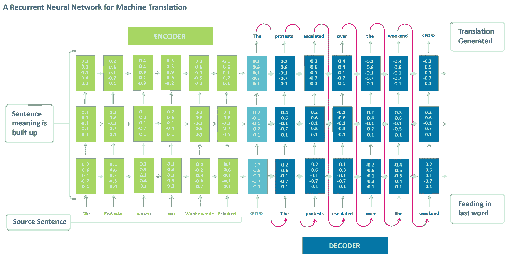

用于机器翻译的递归神经网络

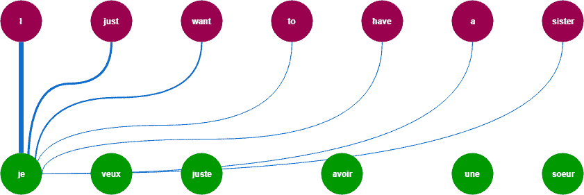

机器翻译 GIF

标准的神经机器翻译是一个端到端的神经网络，其中源句子由一个称为编码器的 RNN 编码，目标单词使用另一个称为解码器的 RNN 预测。RNN 编码器一次一个符号地读取源句子，然后以其最后的隐藏状态总结整个源句子。RNN 解码器使用反向传播来学习该摘要并返回翻译版本。令人惊讶的是，神经机器翻译从 2014 年的边缘研究活动变成了 2016 年广泛采用的领先机器翻译方式。那么使用神经机器翻译有哪些大胜算呢？

1.  **端到端训练**:神经机器翻译中的所有参数同时优化，以最小化网络输出的损失函数。
2.  **分布式表示共享优势**:神经机器翻译能更好地利用单词和短语的相似性。
3.  更好地探索上下文:神经机器翻译可以使用更大的上下文——包括源文本和部分目标文本——来更准确地翻译。
4.  **更流畅的文本生成**:深度学习文本生成比平行语料库方式质量高得多。

RNNs 的一个大问题是**消失**(或爆炸)**梯度问题**，根据所使用的激活函数，信息会随着时间的推移而迅速丢失。直觉上，这不会是一个大问题，因为这些只是权重而不是神经元状态，但是时间上的权重实际上是存储过去信息的地方；如果权重达到 0 或 1，000，000 的值，则之前的状态不会提供太多信息。因此，RNNs 在记忆序列中非常远的先前单词时会遇到困难，并且只能基于最近的单词进行预测。

[**【LSTM】**](https://heartbeat.fritz.ai/a-beginners-guide-to-implementing-long-short-term-memory-networks-lstm-eb7a2ff09a27)长短期记忆网络试图通过引入门和明确定义的记忆单元来对抗消失/爆炸梯度问题。每个神经元都有一个记忆单元和三个门:**输入、输出和遗忘**。这些门的功能是通过阻止或允许信息流动来保护信息。

*   输入门决定了有多少来自前一层的信息被存储在单元中。
*   输出层在另一端负责这项工作，并决定下一层对该单元的状态了解多少。
*   “遗忘之门”起初似乎是一个奇怪的包含，但有时忘记是好的:如果它正在学习一本书，新的一章开始了，网络可能有必要忘记前一章的一些字符。

LSTM GIF

LSTMs 可以学习复杂的序列，比如像莎士比亚一样写作，或者谱写原始音乐。请注意，这些门中的每一个都对前一个神经元中的一个细胞有权重，因此它们通常需要更多的资源来运行。LSTMs 目前非常流行，已经在机器翻译中大量使用。除此之外，它是大多数序列标记任务的默认模型，这些任务有大量的数据。

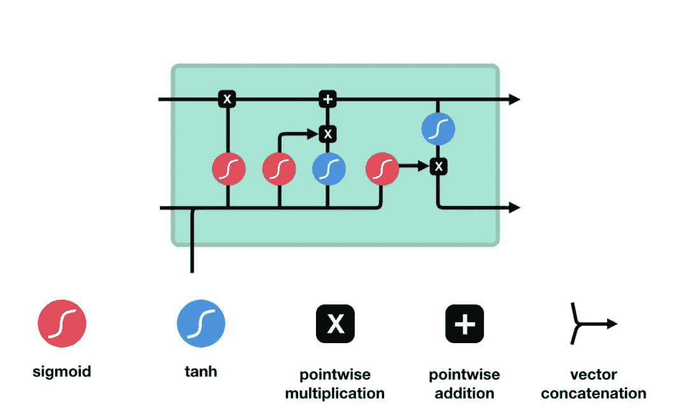

LSTM 建筑

[**门控递归单元**](https://arxiv.org/pdf/1412.3555v1.pdf) (GRU)是 LSTMs 上的微小变化，也是神经机器翻译的扩展。它们少了一个门，连线略有不同:它们有一个更新门，而不是输入、输出和遗忘门。这个更新门决定了从上一个状态保留多少信息以及从前一层允许多少信息进入。

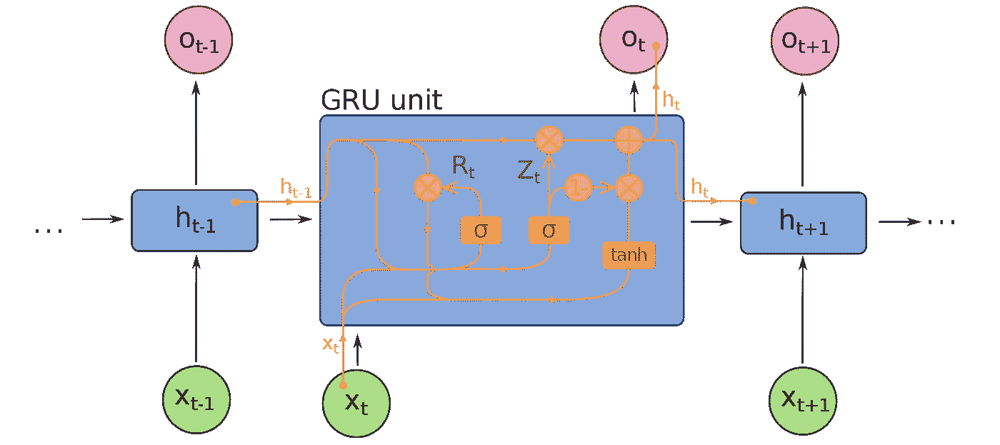

GRU 建筑

重置门的功能很像 LSTM 的遗忘门，但它的位置略有不同。它们总是发出它们的全状态——它们没有输出门。在大多数情况下，它们的功能与 LSTMs 非常相似，最大的区别是 gru 运行起来稍微快一些，也更容易一些(但是表达能力稍微差一些)。实际上，这些往往会相互抵消，因为您需要一个更大的网络来重新获得一些表现力，这反过来又抵消了性能优势。在一些不需要额外表达的情况下，GRUs 可以胜过 LSTMs。

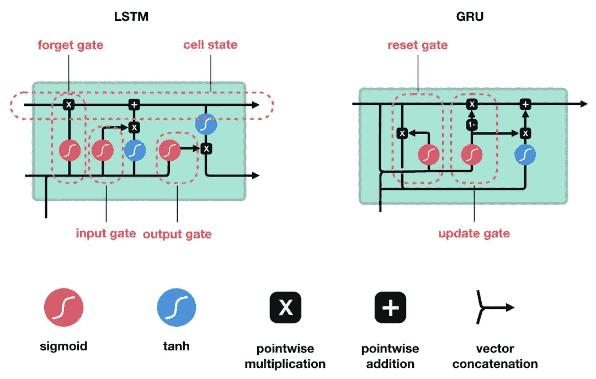

LSTM 和 GRU

除了这三个主要的架构，在过去的几年里，神经机器翻译系统有了进一步的改进。以下是最显著的发展:

*   [用神经网络进行序列到序列学习](https://arxiv.org/pdf/1409.3215v3.pdf)证明了 LSTM 对于神经机器翻译的有效性。它提出了一种通用的端到端的序列学习方法，该方法对序列结构做出最小的假设。该方法使用多层 LSTM 将输入序列映射到固定维度的向量，然后使用另一个深度 LSTM 从向量中解码目标序列。
*   [通过联合学习对齐和翻译的神经机器翻译](https://arxiv.org/pdf/1409.0473v6.pdf)在 NLP 中引入了注意机制。承认固定长度向量的使用是提高 NMT 性能的瓶颈，作者建议通过允许模型自动(软)搜索源句子中与预测目标单词相关的部分来扩展这一点，而不必像硬段一样明确地形成这些部分。
*   [用于神经机器翻译的循环卷积编码器](https://ufal.mff.cuni.cz/pbml/108/art-dakwale-monz.pdf)使用额外的卷积层增强了 NMT 的标准 RNN 编码器(神经机器翻译),以捕捉编码器输出中更广泛的上下文。
*   谷歌建立了自己的 NMT(神经机器翻译)系统，称为[谷歌的神经机器翻译](https://arxiv.org/pdf/1609.08144.pdf)，它解决了许多准确性和易于部署的问题。该模型包括具有 8 个编码器和 8 个解码器层的深度 LSTM 网络，使用残差连接以及从解码器网络到编码器的注意力连接。
*   脸书人工智能研究人员没有使用递归神经网络，而是使用[卷积神经网络](https://arxiv.org/pdf/1705.03122.pdf)对 NMT(神经机器翻译)中的学习任务进行排序。

# 对话和交谈

已经有很多关于对话式人工智能的文章，其中大部分专注于垂直聊天机器人、信使平台、商业趋势和创业机会(亚马逊 Alexa、苹果 Siri、脸书 M、谷歌助手、微软 Cortana)。人工智能理解自然语言的能力仍然有限。因此，创建完全自动化的、开放域的对话助手仍然是一个公开的挑战。尽管如此，下面展示的工作为那些想在人工智能对话中寻求下一个突破的人提供了很好的起点。

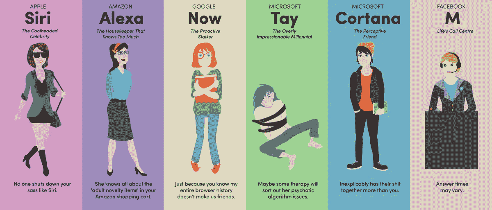

人工智能助手

来自蒙特利尔、佐治亚理工、微软和脸书的研究人员构建了一个能够生成上下文敏感对话响应的[神经网络](https://arxiv.org/pdf/1506.06714v1.pdf)。这种新颖的响应生成系统可以在大量非结构化 Twitter 会话上进行端到端训练。递归神经网络架构用于解决当将上下文信息集成到经典统计模型中时出现的稀疏性问题，允许系统考虑先前的对话话语。该模型显示了在上下文敏感和非上下文敏感的机器翻译和信息检索基线上的一致增益。

编码解码器机制

[神经反应机](https://arxiv.org/pdf/1503.02364v2.pdf) (NRM)是一款基于神经网络的短文本对话反应生成器。它采用通用的编码器-解码器框架。首先，它将响应的产生形式化为基于输入文本潜在表征的解码过程，而编码和解码都是用递归神经网络实现的。用从微博服务收集的大量一轮对话数据来训练 NRM。实证研究表明，NRM 可以对超过 75%的输入文本生成语法正确和内容适当的响应，在相同的设置下优于最先进的技术。

编码器-解码器机器翻译。

最后但同样重要的是，谷歌的[神经对话模型](https://arxiv.org/pdf/1506.05869v3.pdf)是一种简单的对话建模方法。它使用序列到序列框架。该模型通过给定对话中的前一句话来预测下一句话来进行对话。该模型的优势在于它可以进行端到端的训练，因此需要的手工规则要少得多。

编码解码器 GIF

给定大的会话训练数据集，该模型可以生成简单的会话。它可以从特定领域的数据集中提取知识，也可以从大型的、嘈杂的、通用的电影字幕领域数据集中提取知识。在特定领域的 IT 帮助台数据集上，该模型可以通过对话找到技术问题的解决方案。在嘈杂的开放域电影剧本数据集上，该模型可以执行简单形式的常识推理。

# 情感分析

人类交流不仅仅是文字和它们明确的含义。相反，它是微妙而复杂的。你可以根据朋友问你问题的方式来判断他们是厌烦、生气还是好奇。即使在完全基于文本的对话中，你也可以根据用词和标点判断客户是否变得愤怒。

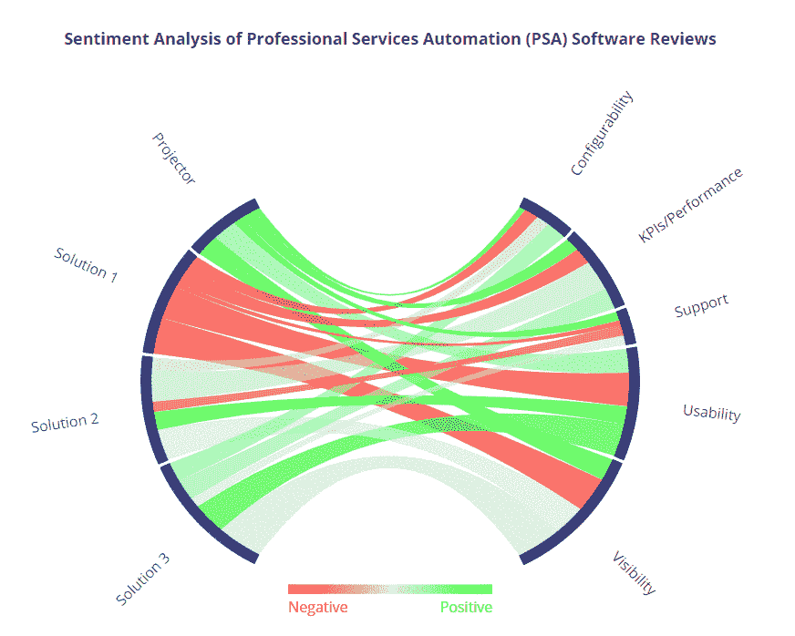

情感分析 GIF

你可以阅读亚马逊对某个产品的评论，了解评论者是喜欢还是不喜欢它，即使他们从来没有直接说过。

要让计算机真正理解人类每天的交流方式，它们需要理解的不仅仅是词语的客观定义；他们需要理解我们的情绪，我们真正的意思。情感分析是通过较小元素的语义组合来解释较大文本单元(实体、描述性术语、事实、论点、故事)的含义的过程。

情感分析的传统方法是将一个句子视为一个单词包，并参考“正面”和“负面”单词的精选列表来确定该特定句子的情感。这将需要手工设计的功能来捕捉情绪，这是非常耗时和不可伸缩的。

用于情感分析的现代深度学习方法可以用于形态学、句法和逻辑语义，其中最有效的方法是递归神经网络。顾名思义，递归神经网络开发的主要假设是递归是描述语言的自然方式。递归有助于消除歧义，有助于一些任务引用特定的短语，并且对于使用语法树结构的任务非常有效。

感情的词丛。

递归神经网络非常适合具有嵌套层次和内在递归结构的设置。如果我们想一句话，这不是有这样的结构吗？

以“一大群人暴力袭击手无寸铁的警察”这句话为例。首先，我们把句子分成各自的名词短语和动词短语——“一大群人”和“暴力袭击手无寸铁的警察。”但是在动词短语中有一个名词短语，对吗？“暴力袭击”和“徒手警察”似乎相当递归。

语言的句法规则是高度递归的。因此，我们利用递归结构和一个尊重它的模型！用 RNN 的句子建模的另一个额外的好处是，我们现在可以输入任意长度的句子，这对于在 NLP 中使用神经网络来说是一个巨大的难题，用非常聪明的技巧使句子的输入向量大小相等，尽管句子的长度不相等。

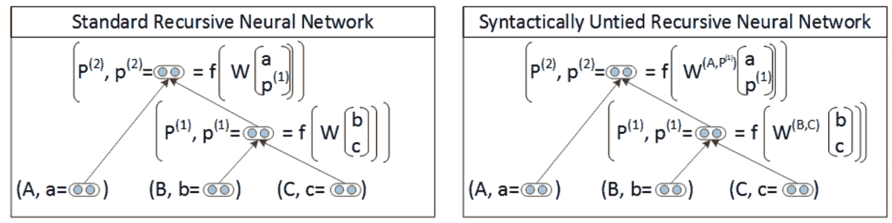

标准 RNN 是递归神经网络的最基本版本。它具有最大余量结构预测体系结构，可以成功地恢复复杂场景图像以及句子中的这种结构。它用于为来自[宾夕法尼亚树库](https://catalog.ldc.upenn.edu/ldc99t42)的自然语言句子提供一个有竞争力的句法分析器。

作为参考，Penn Treebank 是第一个大规模的 Treebank 数据集，由《华尔街日报》( WSJ)三年收集的 98，732 篇文章中的 2，499 篇文章组成，用于句法注释。此外，它优于语义场景分割、注释和分类的替代方法。

然而，标准的 RNN 既没有捕捉到语言短语的全部句法丰富性，也没有捕捉到语义丰富性。[语法上统一的 RNN](https://nlp.stanford.edu/pubs/SocherBauerManningNg_ACL2013.pdf) ，也称为复合向量语法(CVG)，是解决这个问题的一个重大升级。它使用语法上统一的递归神经网络来学习语法语义和合成向量表示。该模型训练速度快，实现效率与标准 RNN 一样高。它学习中心词的软概念，并提高需要语义信息的歧义类型的性能。

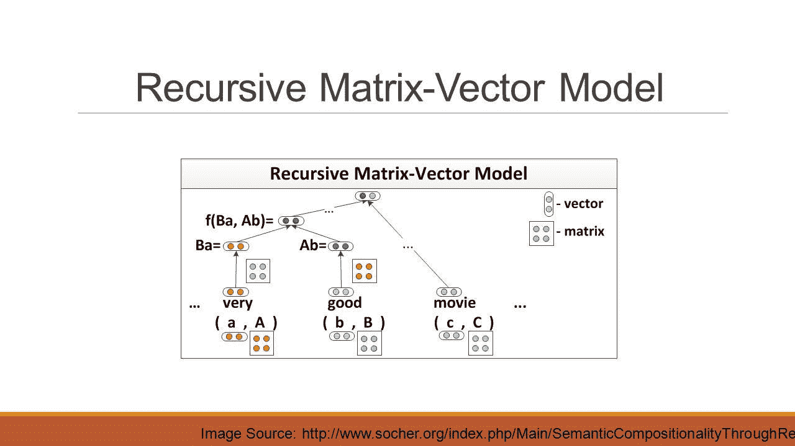

另一个发展是[矩阵向量 RNN](https://ai.stanford.edu/~ang/papers/emnlp12-SemanticCompositionalityRecursiveMatrixVectorSpaces.pdf) ，它能够捕捉甚至更长短语的组成意义。该模型为解析树中的每个节点分配一个向量和一个矩阵:向量捕获成分的固有含义，而矩阵捕获它如何改变相邻单词或短语的含义。这种矩阵向量 RNN 可以学习命题逻辑和自然语言中运算符的含义。

结果，该模型在三个不同的实验中获得了最先进的性能:

*   预测副词-形容词对的细粒度情感分布。
*   对电影评论的情感标签进行分类。
*   使用名词之间的句法路径对名词之间的语义关系(如因果关系或主题信息)进行分类。

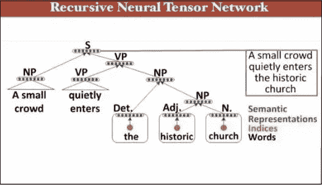

递归神经张量网络

迄今为止开发的用于情感分析的最强大的 RNN 模型是[递归神经张量网络](https://nlp.stanford.edu/~socherr/EMNLP2013_RNTN.pdf)，它具有树状结构，每个节点都有一个神经网络。该模型可用于边界分割，以确定哪些词组是肯定的，哪些是否定的。这同样适用于整个句子。当在[情感树库](https://nlp.stanford.edu/sentiment/treebank.html)上训练时，该模型在几个指标上超过所有以前的方法 5%以上。目前，它是唯一一个可以准确捕捉否定的效果及其在不同树层次上对肯定和否定短语的影响的模型。

# 问题回答

**问答(QA)系统**的理念是直接从文档、对话、在线搜索和其他地方提取信息，满足用户的信息需求。比起让用户通读整个文档，问答系统更喜欢给出一个简短的答案。如今，一个问答系统可以非常容易地与其他自然语言处理系统(如聊天机器人)结合，一些问答系统甚至超越了文本文档的搜索，可以从一系列图片中提取信息。

其实大部分的 NLP 问题都可以认为是一个问答问题。范例很简单:我们发出查询，机器做出响应。通过通读一个文档或一组指令，智能系统应该能够回答各种各样的问题。所以很自然，我们想设计一个可以用于一般 QA 的模型。

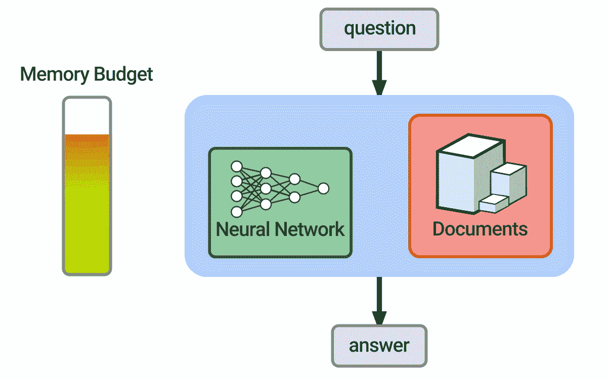

问答 GIF

一个强大的深度学习架构，被称为[动态记忆网络](https://arxiv.org/pdf/1506.07285.pdf) (DMN)，已经专门针对 QA 问题进行了开发和优化。给定输入序列(知识)和问题的训练集，它可以形成情景记忆，并使用它们来生成相关的答案。该架构具有以下组件:

*   **语义记忆模块**(类似于知识库)由预先训练的手套向量组成，用于从输入句子中创建单词嵌入序列。这些向量将作为模型的输入。
*   **输入模块**将与问题相关的输入向量处理成一组称为*事实*的向量。该模块使用**门控循环单元**实现。GRU 使网络能够学习当前考虑的句子是否与答案相关或无关。
*   **问题模块**逐字处理问题，并使用与输入模块相同的 GRU 和相同的权重输出向量。事实和问题都被编码为嵌入。
*   **情节记忆模块**接收从输入中提取的事实和问题向量，并编码为嵌入。这使用了一个受大脑海马体启发的过程，海马体可以检索由一些反应(如视觉或声音)触发的时间状态。
*   最后，**应答模块**产生适当的响应。最后，情节记忆应该包含回答问题所需的所有信息。这个模块使用另一个 GRU，用正确序列的交叉熵错误分类训练，然后可以转换回自然语言。

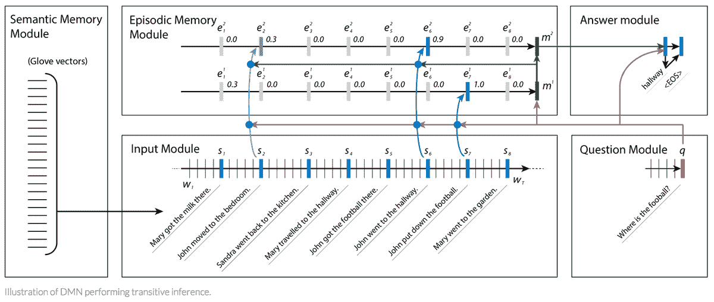

动态存储网络(DMN)

DMN 不仅在问答任务上做得非常好，而且在情感分析和词性标注方面也优于其他架构。自问世以来，动态记忆网络已经有了重大改进，以进一步提高其在问答任务中的准确性，包括:

*   [视觉和文本问答的动态记忆网络](https://arxiv.org/pdf/1603.01417.pdf)基本上是应用于图像的 DMN。它的内存和输入模块升级到能够回答视觉问题。该模型在不支持事实监督的情况下，提高了许多基准视觉问答数据集的艺术水平。
*   [用于问答的动态协同网络](https://arxiv.org/pdf/1611.01604.pdf)解决了从对应于错误答案的局部最大值中恢复的问题。它首先融合问题和文档的相关表示，以关注两者的相关部分。然后，动态指向解码器在潜在的答案跨度上迭代。这种迭代过程使得模型能够从对应于错误答案的初始局部最大值中恢复。

# 文本摘要

对于人类来说，手动总结大型文本文档是非常困难的。文本摘要是自然语言处理中为源文档创建简短、准确和流畅的摘要的问题。在当今快速发展的信息时代，它已经成为帮助和解释文本信息的重要而及时的工具。随着推送通知和文章摘要获得越来越多的关注，为长文本生成智能和准确的摘要的任务每天都在增长。

**它是如何工作的？**

自动文本摘要首先计算整个文本文档的词频。然后，存储和排序 100 个最常用的单词。然后根据每个句子包含的高频词的数量给每个句子打分，高频词的价值更高。最后，取前 X 个句子，并根据它们在原文中的位置进行排序。

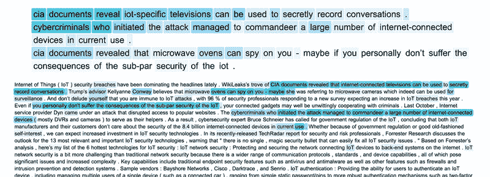

文本摘要 GIF

通过保持简单和通用，自动文本摘要算法可以在其他实现可能难以处理的各种情况下工作，例如包含外语或在标准英语语言语料库中找不到的独特单词关联的文档。

文本摘要有两种基本的方法:**提取**和**抽象**。前者从原文中提取单词和单词短语来创建摘要。后者学习内部语言表示，以生成更像人类的摘要，解释原始文本的意图。

**提取摘要**中的方法通过选择一个子集来工作。这是通过从实际文章中提取短语或句子以形成摘要来完成的。 **LexRank** 和 **TextRank** 是众所周知的摘要。他们都使用谷歌 PageRank 算法的变体。

*   [LexRank](https://pypi.org/project/lexrank/) 是一种无监督的基于图的算法，使用 IDF 修改的余弦作为两个句子之间的相似性度量。这种相似性被用作两个句子之间的图边的权重。LexRank 还包含一个智能的后处理步骤，确保为摘要选择的顶级句子彼此之间不会太相似。
*   [TextRank](https://www.analyticsvidhya.com/blog/2018/11/introduction-text-summarization-textrank-python/) 是一个类似于 LexRank 的算法，但有一些增强，例如使用词汇化而不是词干化，合并词性标记和命名实体解析，从文章中提取关键短语，并基于这些短语提取摘要句子。除了文章摘要，TextRank 还从文章中提取有意义的关键短语。

文本翻译

抽象概括的模型属于深度学习的大范围。使用深度学习的文本摘要已经有了一定的突破。以下是 NLP 领域一些最大的公司发布的一些最值得注意的结果:

*   脸书的[神经注意力](https://arxiv.org/pdf/1509.00685.pdf)是一种神经网络架构，它利用基于局部注意力的模型，能够根据输入句子生成摘要的每个单词。
*   谷歌大脑的[序列到序列](https://ai.googleblog.com/2016/08/text-summarization-with-tensorflow.html)模型遵循一种编码器-解码器架构。编码器负责读取源文档并将其编码为内部表示。解码器是一个语言模型，负责使用源文档的编码表示生成输出摘要中的每个单词。
*   IBM Watson 使用类似的[序列到序列](https://arxiv.org/pdf/1602.06023.pdf)模型，但是具有注意力和双向递归神经网络特性。

# 注意机制

神经网络中的注意机制松散地基于在人类中发现的视觉注意机制。人类的视觉注意力得到了很好的研究，虽然存在不同的模型，但它们本质上都可以归结为能够以“高分辨率”聚焦在图像的特定区域，同时以“低分辨率”感知周围的图像，然后随着时间的推移调整焦点。

想象你正在阅读一整篇文章:你不是按顺序阅读每个单词或字符，而是下意识地关注信息密度最高的几个句子，并过滤掉其余的。你的注意力可以有效地从层次上捕捉上下文信息，这样就足以在减少开销的同时做出决策。神经网络中的注意机制松散地基于在人类中发现的视觉注意机制。

那么为什么这很重要呢？LSTM 和 GRU 等模型依赖于读取一个完整的句子，并将所有信息压缩到一个固定长度的向量中。这需要基于文本统计属性的复杂特征工程。一个几百字的句子用几个字来代表，肯定会导致信息丢失，翻译不到位等。

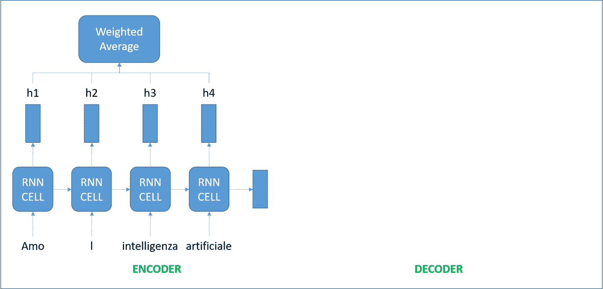

注意机制

有了注意机制，我们就不再试图把满涌的句子编码成固定长度的向量。相反，我们允许解码器在输出生成的每一步关注源句子的不同部分。我们让模型根据输入的句子和它到目前为止产生的结果来学习要注意什么。

根据上面来自[基于注意力的神经机器翻译的有效方法](https://arxiv.org/pdf/1508.04025.pdf)的图像，蓝色代表编码器，红色代表解码器，因此我们可以看到上下文向量将所有细胞的输出作为输入，以计算解码器想要生成的每个单词的源语言单词的概率分布。通过利用这种机制，解码器可以捕获全局信息，而不是仅基于一个隐藏状态进行推断。

除了机器翻译之外，注意力模型还适用于其他各种 NLP 任务。在[展示、参与和讲述:具有视觉注意力的神经图像字幕生成](https://arxiv.org/pdf/1502.03044.pdf)中，作者将注意力机制应用于生成图像描述的问题。他们使用卷积神经网络对图像进行编码，并使用具有注意力机制的递归神经网络来生成描述。通过可视化注意力权重，他们解释了模型在生成单词时正在看什么:

注意力神经图像标题。

然而，关注是有代价的。我们需要为输入和输出单词的每个组合计算一个注意值。如果你有一个 100 字的输入序列，并生成一个 100 字的输出序列，那将是 10，000 个注意值。如果您进行字符级的计算并处理由数百个标记组成的序列，上述机制可能会变得非常昂贵。

# 自然语言处理障碍

应该注意的是，在 7 种 NLP 技术的每一种中，研究人员都必须处理各种各样的障碍:算法的限制、模型的可扩展性、对人类语言的模糊理解。。。好消息是，这一领域的发展似乎是一个巨大的开源项目:研究人员不断建立更好的模型来解决现有的问题，并与社区分享他们的成果。由于最近的学术研究进展，NLP 中的主要障碍已经得到解决:

*   没有一个单一的模型架构在任务之间具有一致的最新成果**。比如在**问答**中，我们有[强监管的端到端内存网络](https://arxiv.org/pdf/1503.08895.pdf)；在**情感分析**中，我们有[树形列表](https://arxiv.org/pdf/1503.00075.pdf)；在**序列标签**中，我们有[双向 LSTM-CRF](https://arxiv.org/pdf/1508.01991.pdf) 。[动态内存网络](https://arxiv.org/pdf/1506.07285.pdf)可以跨多个域一致地良好运行。**
*   机器学习中的一种强大方法是**多任务学习，**它在相关任务之间共享表示，以使模型能够更好地概括原始任务。然而，完全联合多任务学习很难，因为它通常局限于较低层，只有在任务相关时才有用(如果任务不相关，通常会损害性能)，并且在所提出的模型中具有相同的解码器/分类器。在[一个联合多任务模型:为多个 NLP 任务生长一个 NN](https://arxiv.org/pdf/1611.01587.pdf)中，作者预定义了一个由几个 NLP 任务组成的层次结构，作为多任务学习的联合模型。该模型包括字符 n-grams 和短路以及一个最先进的纯前馈解析器，能够执行依存解析、多句子任务和联合训练。
*   **零射击学习**是解决一项任务的能力，尽管没有接受过该任务的任何训练范例。没有多少模型能够为 NLP 进行零射击学习，因为答案只有在训练期间看到时才能预测，并且是 softmax 函数的一部分。为了解决这个障碍，[指针哨兵混合模型](https://arxiv.org/pdf/1609.07843.pdf)的作者在混合模型中结合了标准的 LSTM softmax 和指针网络。指针网络有助于处理稀有单词和长期依存关系，而标准的 softmax 可以引用不在输入中的单词。
*   另一个挑战是**重复单词表示**的问题，其中模型中编码器和解码器的不同编码导致重复的参数/含义。对此最简单的解决方案是将单词向量捆绑在一起，并联合训练单个权重，如[捆绑单词向量和单词分类器:语言建模的损失框架](https://arxiv.org/pdf/1611.01462.pdf)中所示。
*   另一个大的障碍是递归神经网络，任何深度 NLP 技术的基本构建块，与卷积神经网络或前馈神经网络相比非常慢。[准递归神经网络](https://arxiv.org/pdf/1611.01576.pdf)采用 RNNs 和 CNNs 的最佳部分来提高训练速度，使用卷积实现跨时间并行，使用元素式门控递归实现跨通道并行。这种方法在语言建模和情感分析方面比其他任何模型都更好更快。
*   最后，在 NLP 中，**架构搜索**——使用机器学习来自动设计人工神经网络的过程——相当缓慢，因为传统的手动过程需要大量的专业知识。如果我们可以使用人工智能为任何问题找到正确的架构，会怎么样？
*   [来自 Google Brain 的具有强化学习的神经架构搜索](https://arxiv.org/pdf/1611.01578.pdf)是迄今为止开发的最可行的解决方案。作者使用递归网络来生成神经网络的模型描述，并使用强化学习来训练该 RNN，以在验证集上最大化所生成架构的预期精度。

# 结论

所以你走吧！我向您展示了主要自然语言处理技术的基本纲要，这些技术可以帮助计算机从单个文本或文本序列中提取、分析和理解有用的信息。

从连接不同文化的机器翻译到帮助客户服务的对话聊天机器人；从深入理解人类情绪的情感分析到可以模仿我们视觉注意力的注意力机制，NLP 的领域太广，无法完全涵盖，因此我鼓励您进一步探索它，无论是通过在线课程、博客教程还是研究论文。