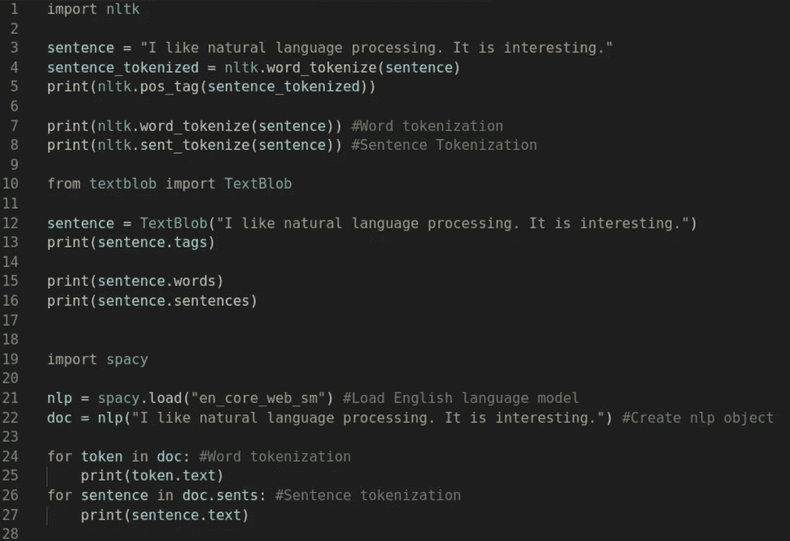
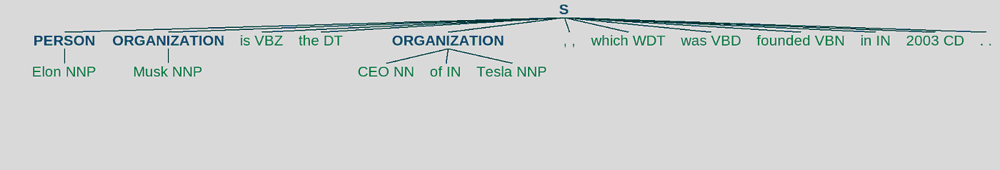

# 初学者的自然语言处理(多库的详细方法)

> 原文：<https://medium.com/analytics-vidhya/natural-language-processing-for-beginners-a-detailed-approach-with-multiple-libraries-d29e2dd0c702?source=collection_archive---------2----------------------->



# 介绍

自然语言处理是人工智能的一个领域，专注于让计算机拥有像人类一样理解语言的能力。它支持许多现实世界的应用，如垃圾邮件检测、机器翻译和文本摘要。

Python 中有许多对自然语言处理非常有用的库，每一个都有自己的优点。在本文中，我将概述三个库:NLTK、spaCy 和 TextBlob。我还将演示如何使用这些库来执行一些常见的 NLP 任务。

# NLTK

自然语言工具包(NLTK)是一个强大的 Python 包，它提供了一组自然语言算法。NLTK 是最著名的 Python NLP 库之一，由许多常用算法组成，如标记化、词性标注、词干提取、情感分析和命名实体识别。

**安装:**

NLTK 可以用 pip 包管理器安装，使用下面显示的命令:

```
pip install nltk
```

之后，您将需要安装数据，以便使用 NLTK 完成我们将在本文中介绍的不同任务。为此，您需要使用以下代码创建并运行一个 python 程序:

```
import nltknltk.download(["punkt", "tagsets", "words", "stopwords", "wordnet", "vader_lexicon", "maxent_ne_chunker", "averaged_perceptron_tagger"])
```

# 文本 Blob

TextBlob 是 Python 中另一个很棒的 NLP 库。它构建在 NLTK 之上，提供类似的功能，但具有更直观的界面和更温和的学习曲线。出于这个原因，如果您刚刚开始自然语言处理，TextBlob 通常更容易使用。

**安装:**

可以使用下面显示的命令，通过 pip 软件包管理器安装 TextBlob:

```
pip install textblob
```

因为 TextBlob 构建在 NLTK 之上，并且我们在上一步中下载了 NLTK 数据，所以我们已经完成了设置 TextBlob 的工作。

# 宽大的

spaCy 是比 NLTK 和 TextBlob 更新更快的 NLP 库。据说它具有“行业优势”和“最先进的速度”，主要用于处理和理解大量文本的应用程序。

**安装:**

您应该使用以下命令来安装 spaCy:

```
pip install -U pip setuptools wheelpip install -U spacy
```

如果以上命令不起作用，请点击此链接获取安装说明:[https://spacy.io/usage](https://spacy.io/usage)。

安装后，您将下载一个经过培训的管道。有关更多信息和可用软件包，请使用以下链接查看型号目录:[https://spacy.io/models](https://spacy.io/models)。

对于本文，我们将使用英语管道。您可以在终端/命令提示符下使用以下命令安装它。

```
python -m spacy download en_core_web_sm
```

# 标记化

记号化是一种将一段文本分成更小单元的方法，这些单元被称为**记号**。计算机可以通过分析这些记号来解释文本的意思。

标记化是自然语言处理的一项基本任务。句子标记化拆分文本中的句子，单词标记化拆分句子中的单词。通常，单词标记化在空格处拆分文本以创建单词列表，句子标记化在停止标点(例如句号或感叹号)处拆分文本以创建句子列表。

单词标记化示例:

“我爱自然语言处理！”→ *【“我”、“爱”、“自然”、“语言”、“加工”】*

## NLTK 中的标记化

NLTK 有两个用于标记化的功能:一个用于单词标记化，另一个用于句子标记化。我们可以在一串文本上调用这些函数，它将返回一个可以输出的标记化列表。

## TextBlob 中的标记化

Textblob 中的标记化非常简单——我们需要做的就是用想要使用的文本字符串创建一个 TextBlob 对象。然后，我们只需要输出*。文字*和*。句子*对象的属性，如下所示。

TextBlob 有自己的对象，称为 WordList，它是在单词标记化之后创建的。你可以像对待一个普通的列表一样对待这个列表，因为它有大部分相同的功能。如果你愿意，你也可以把它转换成一个列表。

## 空间标记化

首先，我们导入空间库。我们可以通过 spacy.load()加载已安装的管道。这将返回一个名为 nlp 的*语言*对象，包含处理文本所需的功能。在一个文本字符串上调用 nlp 对象会返回一个经过处理的 *Doc* ，我们将遍历它来输出各个令牌。第一个循环遍历 doc 本身以获取单词标记，第二个循环遍历 doc.sents 以输出句子。

# 词性标注

词性标注(简称词性标注)是将文本中的一个词标注为特定词性(名词、动词、形容词等)的过程。)根据其定义和在句子中的上下文。

词性标注是一个基本的自然语言处理概念，可用于提取单词之间的关系、构建解析树等等。

这三个库都有执行词性标注的有用功能。

## NLTK 中的词性标注

NLTK 为 POS 标记提供了一个非常简单的函数，称为 *pos_tag()* 。它接受一个标记列表，并打印出每个标记的词性。

输出是一个元组列表。每个元组的第一个元素是标记，第二个元素是词性:

[('我'，' PRP ')，('喜欢'，' VBP ')，('自然'，' JJ ')，('语言'，' NN ')，('处理'，' NN ')，('.', '.')、('它'、' PRP ')、('是'、' VBZ ')、('有趣'、' JJ ')、('.', '.')]

要查看每个缩写(如 NN 或 PRP)的含义，请运行以下代码:

```
#Outputs a list of tags and their meanings
nltk.help.upenn_tagset()
```

## TextBlob 中的位置标记

在 TextBlob 中，我们将创建一个 TextBlob 对象并使用*标签*属性。输出的格式与 NLTK 相同:格式为*(令牌，标签)*的元组列表。

输出:[('我'，' PRP ')，('喜欢'，' VBP ')，('自然'，' JJ ')，('语言'，' NN ')，('处理'，' NN ')，('它'，' PRP '，('是'，' VBZ '，('有趣'，' JJ')]

输出几乎和 NLTK 一模一样；然而，惟一的区别是 TextBlob 不包含句点，而 NLTK 包含句点。

## 空间中的词性标注

与我们之前输出每个单独的标记类似，我们将遍历每个标记，并使用 tag_ attribute 输出 POS 标记。因为我们循环并输出每个标签，所以每个标签将在不同的行中输出，但是标签与 TextBlob 和 NLTK 输出的标签相同。

输出*(这些打印在不同的行中，但我删除了多余的行以节省空间)* : PRP VBP JJ NN。PRP·VBZ·JJ。

# 停用词删除

停用词是常见的重复英语单词，如 me，I，and，should 等。停用字词删除是从文本中过滤出停用字词的过程。通过删除停用词，我们可以将更多的注意力放在重要的信息上，因为在许多场景中，停用词是不必要的(不是在每个场景中，而是在许多场景中！).

## NLTK 中的停用词移除

没有从字符串中删除停用词的内置函数，但是 NLTK 有一个英文停用词列表，可以使用停用词类访问它(如下所示)。我们将编写自己的代码来过滤掉列表中的停用词。NLTK 的停用词表都是小写的，所以我们需要将每个单独的标记改为小写，并检查它是否出现在停用词表中。如果不是，我们会将其添加到过滤列表中。这些都可以使用列表理解在一行中完成，如下所示:

输出:['喜欢'，'自然'，'语言'，'处理'，'.'、'有趣'、'.']

一旦停用词被过滤，它们通常不会被重构，因为被过滤的句子可能会被用于其他目的，如文本分类；但是，如果你想让它成为一个字符串，NLTK 提供了一个方便的 detokenizer，叫做 Treebank detokenizer。

## TextBlob 中的停用词移除

TextBlob 不提供停用字词删除功能，因此最好的方法是使用 NLTK 提供的停用字词列表。创建 TextBlob 对象后，我们使用与 NLTK 相同的过程。我们使用列表理解来创建 filtered_sentence 列表，通过检查每个单独的标记来查看它是否在停用词列表中。

输出:['喜欢'，'自然'，'语言'，'处理'，'有趣']

## 空间中的停用词移除

停用字词的移除过程在空间上有点不同。不使用 SpaCy 提供的列表(确实如此)，我们可以使用每个标记的 *is_stop* 属性来检查它是否是停用词。我们将再次使用列表理解，因为它减少了我们必须编写的代码量。

输出:【喜欢，自然，语言，处理，。，有意思，。]

# 词汇化和词干化

词干化和词干化是相似的:在两者中，我们都将一个单词简化为一个词根。在词干化中，这个词根叫做词干，在词元化中，这个词根叫做词元。

两者的关键区别在于**词条化**基于词根定义对单词进行分组，可以用来区分现在、过去和不定。让我们看一些例子:

研究→研究

散步→散步

更好→好

语料库→语料库

另一方面，**词干**通过使用一系列常见的前缀和后缀来切断单词的结尾(后缀)或开头(前缀)。

研究→研究

步行→步行

散步→散步

散步→散步

更好→更好

语料库→语料库

因为词干删除了单词的最后几个字符，所以会导致错误的意思和拼写，正如我们在第一个例子中看到的那样(Studies →Studi)。

## NLTK 中的引理化

NLTK 有一个名为 WordNetLemmatizer 的类，我们将使用它。我们首先创建一个 WordNetLemmatizer 对象，然后对一个单词调用 lemmatize 函数。*注意:WordNetLemmatizer 的单词需要小写。*

默认情况下， *lemmatize* 函数假设这个单词是一个名词。如果不是，这个函数有一个名为‘pos’的参数，你可以在这里输入词性。例如，如果你有一个形容词，你可以把“a”作为第二个参数。

## NLTK 中的词干

NLTK 有一个名为 PorterStemmer 的类，这是一个基于 Porter 词干算法的词干分析器。我们将首先创建一个单词列表，创建一个 PorterStemmer 对象，然后遍历该列表并使用 *stem()* 函数对每个单词进行词干处理。

## TextBlob 中的引理化

TextBlob 有一个我们可以创建的 *Word* 对象。然后我们可以使用那个对象的 *lemmatize()* 函数，我们传递的参数就是词性。默认情况下，它是一个名词，类似于 NLTK。

对于每个单词，我们创建一个 word 对象，并调用该对象的 *lemmatize()* 函数。内括号是词性(“a”代表形容词，“v”代表动词，默认为名词)。

## TextBlob 中的词干

TextBlob 中的词干处理过程类似于我们对 lemmatization 所做的。我们首先创建一个 word 对象，然后调用 *stem()* 函数。默认情况下，TextBlob 使用 PorterStemmer 算法。由于 stem()函数不需要任何因单词而异的词性参数，因此我们可以创建一个单词列表，遍历该列表，并对每个单词进行词干处理。

## 空间中的引理化

在 SpaCy 中，我们将像以前一样创建一个 nlp 对象，然后我们将遍历令牌。对于每个 token，都有一个名为 lemma_ 的属性，我们可以使用 token.lemma_ 来访问它，如下所示。

## 空间中的词干

spaCy 不包含任何词干函数。因此，我们必须使用 NLTK 库进行词干分析:

# 命名实体识别

NER(命名实体识别)的目标是定位和分类命名实体(人名、组织名、国家名、数量名等)。)在正文里。这是信息提取的一个步骤，可以用来回答特定的问题，比如文章中提到了哪些公司或组织。

让我们用下面这句话来形容 NER:埃隆马斯克是特斯拉的首席执行官，特斯拉成立于 2003 年。

## NLTK 中的 NER

我们将首先对上面的句子进行标记，并找到词性标签。然后，我们将使用 ne_chunk()函数对给定的标记标记列表进行分块(从非结构化文本中提取短语)。

它返回一个树对象，我们可以将其作为文本输出，或者使用 *draw()* 函数创建一个图形。

输出:

(S

(伊隆/NNP)

(机构 Musk/NNP)

是/VBZ

/DT

(组织 CEO/特斯拉/NNP 的 NN)

,/,

哪个/WDT

曾是/VBD

创立/VBN

在/在

2003/CD

./.)



这基本上是正确的。它将“埃隆”归类为一个人，“马斯克”归类为一个组织(不正确)，而“特斯拉的首席执行官”归类为一个组织。它遗漏了 2003 年(日期被视为命名实体)。命名实体识别还不是 100%准确，但将来可能会继续改进。

## 文本 Blob 中的 NER

TextBlob 不包含任何 NER 功能；因此，必须使用 NLTK 来完成，就像我们对停用词移除所做的那样(在本文前面)。

## 西班牙的 NER

当我们在 spaCy 中创建一个 NLP 对象时，它有一个 *ents* 属性，列出了在给定文本中找到的命名实体。我们可以遍历列表并打印每个实体文本和标签。spaCy 还有一个可视化工具 displacy，它可以突出显示句子中的命名实体。

输出:

特斯拉组织

2003 年日期


正如你所看到的，它发现的两个实体都被正确标记，但它错过了埃隆马斯克作为一个实体。

# 情感分析

我们将在本文中探讨的最后一个 NLP 任务是情感分析。情感分析的主要目标是确定文本的极性(是积极的、消极的还是中性的)。

## NLTK 中的情感分析

NLTK 有一个内置的、预训练的情感分析器，叫做 VADER(效价感知词典和情感推理机)。它有一个 *polarity_scores()* 函数，该函数将一个字符串作为参数，并输出一个包含以下信息的字典:负面、中性和正面得分(这些得分加起来都是 1，并且不能是负面的)，以及复合得分，其范围可以从-1(最极端的负面)到 1(最极端的正面)。复合得分越接近+1，文本的积极性越高。

下面是我们如何使用 NLTK 进行情感分析:

输出:{'neg': 0.0，' neu': 0.461，' pos': 0.539，' compound': 0.8478}

## TextBlob 中的情感分析

TextBlob 使情感分析变得非常容易。我们可以使用 TextBlob 对象的*情感*属性，它返回两个值——极性(-1 到 1)和主观性(0 到 1)。主观性决定了文本的主观或客观程度，越接近 1 的值越主观。

输出:

0.55

1.0

## 空间中的情感分析

spaCy 不像 NLTK 和 TextBlob 那样提供易于使用的情感分析功能。出于这个原因，我们不会在 spaCy 中讨论情感分析，因为这是一个涉及许多步骤的过程，包括开发和训练机器学习模型。如果你感兴趣，你可以查看 spaCy 的官方文档，了解如何训练模型。链接:【https://spacy.io/usage/training 

# 结论

NLTK、TextBlob 和 spaCy 都是 NLP 的优秀库。正如您所看到的，这三者之间有一些差异，但在大多数情况下，它们都可以用于大多数自然语言处理任务。根据我的个人经验，TextBlob 是前面提到的三个库中最容易学习的，我推荐从 TextBlob 开始，对于稍微高级一点的特性，NLTK 是一个不错的选择。如果你正在寻找更高级的自然语言处理，那么学习 spaCy 将是有益的。

感谢您的阅读！