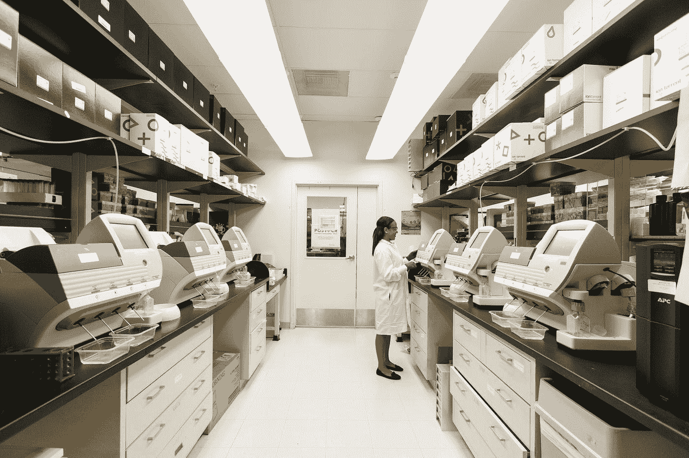
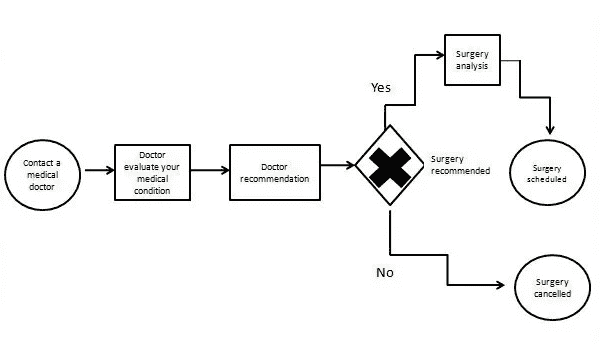
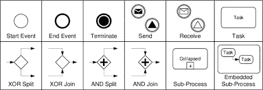
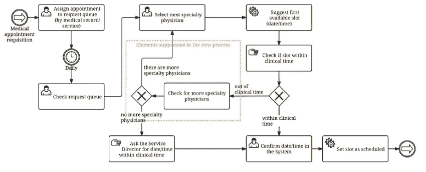

# 精准医疗中的自然语言处理和过程建模

> 原文：<https://medium.com/analytics-vidhya/natural-language-processing-nlp-and-process-modeling-in-precision-medicine-a55fa9ec9818?source=collection_archive---------7----------------------->

[国家癌症研究所](https://unsplash.com/@nci?utm_source=medium&utm_medium=referral)在 [Unsplash](https://unsplash.com?utm_source=medium&utm_medium=referral) 上拍摄的照片

N 听觉语言处理系统通过大量非结构化数据的可用性及其利用这些数据来改善和优化精准医疗的性能和实践的能力，给医疗保健和精准医疗带来了巨大的影响和机遇。

自然语言处理是人工智能的主要分支之一，它处理人类语言的翻译，并继续在我们生活的主要和战略方面发挥重要作用。

自然语言处理系统应用的出现，如语音识别、紧急检测、自动纠错、机器翻译、聊天机器人和虚拟助手以及情感分析，对我们的日常活动产生了巨大的影响。例子包括诸如 Google Translate 的应用，这是一种将不同语言翻译成用户各自的和偏好的语言的机器翻译；Alexa 是一个虚拟助手，能够进行语音交互并控制几个智能设备，使其成为一个家庭自动化系统；也许最值得注意的是，自动更正功能，它可以在我们的移动设备中更正拼写错误的单词，并提出修改和更正建议。

由于 NLP 能够理解人类语言、处理非结构化数据、绘制出重要信息并提取关键概念和含义，因此其在医疗保健领域的接受度正在加快，这为医疗保健从业者提供了将大量临床数据解释、分析和搜索为更准确、定性和可理解的形式的简单性，从而为病历提供了更高的精确度和可访问性。

> 精准医疗是一种提出定制医疗保健的医疗模式，医疗决策、治疗、实践或产品都是为患者亚组量身定制的，而不是一种药物适合所有人的模式。[维基百科](https://en.wikipedia.org/wiki/Precision_medicine)

精准医疗根据患者的医疗数据，提出量身定制的个性化医疗决策和治疗方案，以选择最合适、最有可能帮助患者的最佳方法。在精准医疗中，疾病的预防和治疗考虑了患者在基因、生活方式和环境方面的可变性。

## NLP 在精准医疗中的应用:

**1。研究和绘制健康差异:**
由于大量医疗数据的可用性，研究人员使用自然语言处理系统来发现民族和种族群体之间的健康差异以及他们对某些治疗方法和疾病的抵抗力和易感性。这些信息为临床决策、研究、生物医学和制药公司提供了先进的知识和有凝聚力的重要方法。

**2-提高时间效率:**
自然语言处理系统减轻了大量医疗记录的压力、人工检查、分析、处理和解释，从而为医疗从业者提供了更多的自由时间来专注于其他工作。
**3-提高治疗效果和方法**
NLP 用于疾病治疗，考虑到患者的病历和病情，为患者提供更好、更有效的治疗方法。有了足够的医疗信息，自然语言处理系统可以轻松地处理数据，以预测健康风险和最有可能减缓疾病传播的方法。
**3-临床决策支持:**
自然语言处理系统帮助医疗从业者在临床实践的不同领域进行评估并做出重要决策，如疾病诊断和治疗，这有助于减少耗时的过程和医疗决策中的错误。

## 过程建模

一个过程是一组配方、相关的任务或活动，执行这些任务或活动是为了获得特定的结果。过程建模用于通过图解显示过程的步骤和活动来描述任务的过程；它简要说明了任务的动作和优先级。例如，表示如何从患者与医生的联系、医疗评估、建议和所需治疗中提供健康服务的图表

医疗保健过程是复杂和动态的；协调这样一个进程是一项非常困难和复杂的任务。流程建模使我们能够组织并充分理解具有特定医疗状况的患者的最佳医疗保健维度，以及如何对不同类型患者的此类医疗保健路径进行分层，以及如何改进临时医疗保健服务。

**流程建模的语言有很多种，其中有:**
1。业务流程建模符号(BPMN)
2。形式发票 3。流程图技术
4。数据流图
5。甘特图

## 业务流程建模符号(BPMN)

BPMN 是最受欢迎的建模语言之一，基本上是为商业专业人士设计的，但它目前在不同的领域使用。

Researchgate.net 摄

它被广泛用于高效优化业务和医疗保健等领域的流程。它有助于识别我们当前系统中的挑战，从而为我们提供了一个评估所有步骤和程序的机会，并为我们提供了一个流程的图形可视化和路径，以便我们可以改进对任务的分析和理解。

Researchgate.net 摄

在对流程建模之后，我们需要对其进行分析，以了解医疗程序是如何组织的。我们通过分析过程来做到这一点，这使我们能够深入了解医疗步骤和程序是如何执行的。

分析流程有两种主要方法。分别是:
1-过程验证
2-过程模拟

**1-流程验证**
该流程针对某些属性证明或反证流程模型的正确性和有效性。它涉及在产品的设计和制造过程中收集的分析，以验证该过程是否能够可靠地输出符合特定标准的产品。这一过程对于确定产品质量至关重要。从模型预期用途的角度来看，它决定了模拟及其关联数据对真实世界的准确表示程度。

**2-流程模拟**
用于通过模拟未来或现实世界的流程来分析流程的性能。在这个过程中，医疗保健任务产生了一些能够进行预测和分析的因素，以便我们能够为任何预期或未预期的情况做好准备，并更好地改进决策和优化过程。模拟模型被用于解决问题，并在医疗保健和整个模型开发过程中辅助临床决策。

## 结论

在这篇博客中，我们讨论了自然语言处理系统和过程建模在医疗保健和精准医疗中的应用，以及它们如何影响与患者基因、生活方式和环境的可变性相关的医疗决策和治疗。