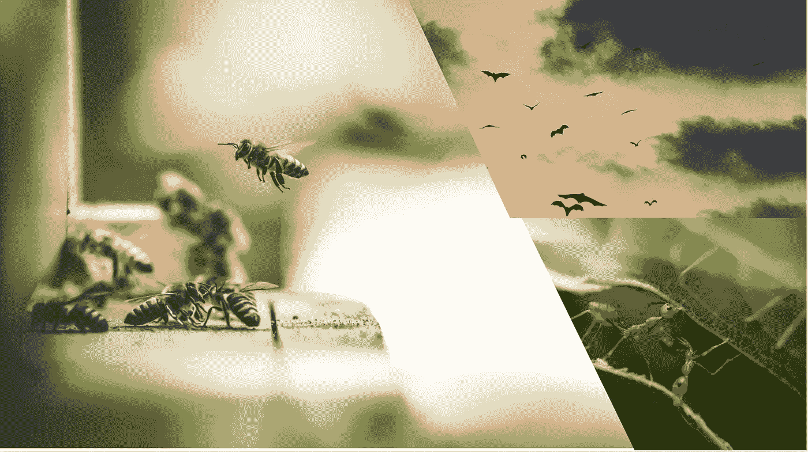

# 受自然启发的优化算法—简介

> 原文：<https://medium.com/analytics-vidhya/nature-inspired-optimization-algorithms-part-1-introduction-11dafcba07db?source=collection_archive---------9----------------------->

图片来自 Unplash:照片由埃里克沃德，医学博士 _ 杰里，克莱门特 Falize

> “深入观察自然，你就会更好地理解一切”
> ——阿尔伯特·爱因斯坦

对于那些花时间观察和思考大自然母亲的人来说，这将是最有价值的思想宝库之一，从中可以汲取灵感。大自然为人类习以为常的事情提供了惊人的解决方案，这是我们长久以来一直看到的。