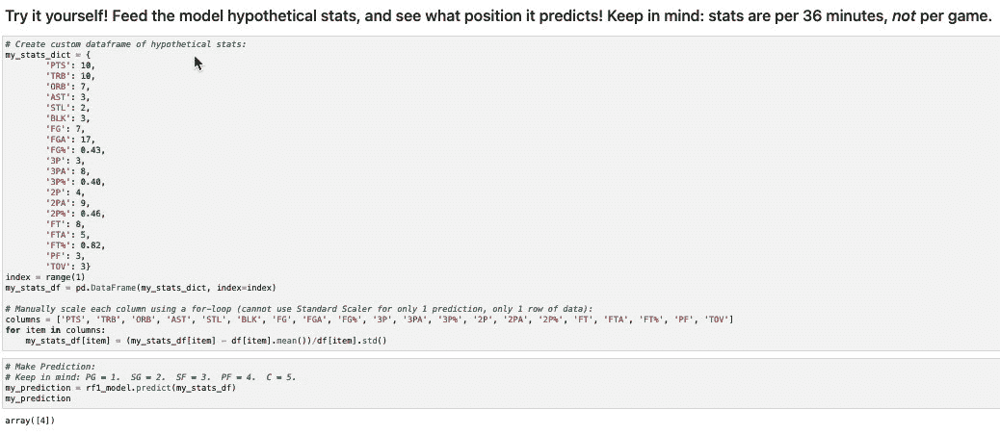
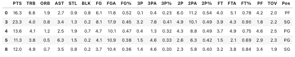
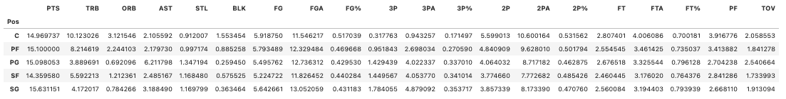
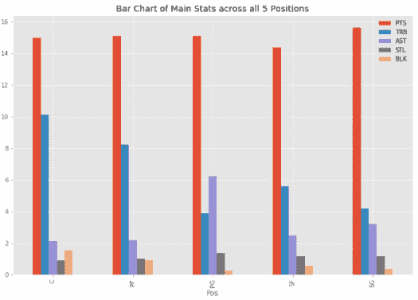
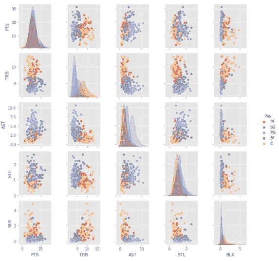
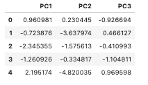
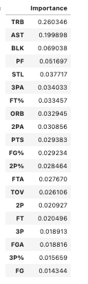
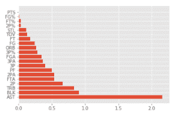
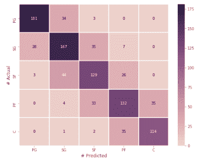
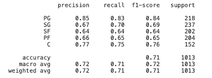

# NBA 机器学习位置预测器

> 原文：<https://medium.com/analytics-vidhya/nba-machine-learning-position-predictor-488fef42ac1c?source=collection_archive---------5----------------------->


NBA 比以往任何时候都更加“无位置”:机器学习模型还能准确预测 NBA 球员的位置吗？

这个用 Python 写的机器学习例子，使用了 15 个赛季(2005-2020)的 NBA 球员统计数据(特征)，来预测每个球员的位置(目标)。机器学习模型包括决策树、随机森林、支持向量机和梯度提升。还包括 X 数据的示例 PCA 变换。

从 Basketball-Reference.com 获得的 CSV 数据集



最终，你可以建立一个机器学习模型，在这个模型中，你可以输入你自己假设的 NBA 统计数据，并查看模型预测的位置。

# 数据预处理:

预处理主要包括清理数据和过滤数据集，只显示符合特定标准的球员。每一季都作为一个单独的 CSV 文件读入，然后连接成一个我可以使用的单一数据帧。接下来，我过滤了数据框架，只包含了至少打了 820 分钟/赛季的球员(10 分钟/场* 82 场/赛季)。我这样做是因为包含少于这个可接受的比赛分钟数的行将会不公平地扭曲数据。例如，如果一个球员只为一个队打了 1 分钟，得了 2 分，那么他每 36 分钟的得分就是 72 分；显然这不是一个公平的代表。

```
original_df = original_df[original_df.MP >= 820]
```

然后，我将数据帧切片，只包含相关特征(删除姓名、年龄和团队等列；实际上不是玩家统计数据并且对玩家的位置没有影响的特征)。下一步是将混合位置，如“C-PF”和“PF-SF”转换为 5 种主要篮球位置之一:

```
df = df.replace("C-PF","C")
```

对每个组合都这样做。最后要做的是将所有列四舍五入到两位小数:为了简单起见，这里只显示了一个转换:

```
df = df.round({'PTS': 2})
```

对每一列都这样做。我最初的数据帧由 7089 行和 29 列组成；在过滤掉玩家和不相关的列之后，我只剩下一个 4051 行 21 列的数据框架。这意味着我的模型要处理 4051 行玩家统计数据，以及模型要测试的 20 个特性(20 个特性，1 个目标列)。以下是数据帧的示例，仅显示了 5 行，但所有列都是:



为了确认目标类是均匀分布的，并且不需要进行重新平衡，我检查了每个位置的唯一值的数量:

```
df.loc[:, 'Pos'].value_counts()
```

SG:947
PG:873
PF:814
SF:809
C:608

位置分布均匀。我们现在已经完成了数据预处理，可以开始认真研究模型了。

# 模型前可视化:

# 按职位汇总统计数据:

```
summary_df = df.groupby('Pos').mean()
```



我们可以从上面的图表中收集有用的信息。我们看到，就得分而言，每个位置都没有太大的差别:每个位置平均 15 分/36 分钟。然而，我们在几个类别中看到了严重的差异，这是我们所期望的；最多的就是 TRB(总篮板)和 AST(助攻)。控球后卫带球上场并分配球，导致助攻(PGs 平均 6.2 次助攻，Cs 平均 2.1 次助攻)，中锋更高，承担更多的篮板责任(Cs 平均 10.1 个篮板，PGs 平均 3.9 个篮板)。这给出了一个很好的想法，关于在模型中期望什么，特别是在模型认为什么是帮助确定玩家位置的最重要的特征方面。

# 条形图:

```
bar_chart_df = summary_df[['PTS', 'TRB', 'AST', 'STL', 'BLK']]
bar_chart_df.plot(kind='bar', figsize = (12, 8), title='Bar Chart of Main Stats across all 5 Positions')
```



这个简单的条形图显示了五个主要的篮球统计数据——得分、篮板、助攻、抢断和盖帽——以及它们在五个位置上的分布情况。如上所述，每个位置的得分/36 分钟没有太大的不同；但是，篮板和助攻的差异很大。我们还可以在黄色部分看到，中锋平均比其他位置多得多的盖帽，一般来说盖帽很难获得，所以中锋平均只有 1.6 个盖帽/36 分钟，控球后卫平均只有 0.26 个盖帽/36 分钟，这意味着在这个特定的数据集中，中锋平均比控球后卫多 144%的盖帽/36 分钟。这个特性可能被即将到来的模型认为是更重要的特性之一。

# Seaborn 对图:

```
sns_df = df[['PTS', 'TRB', 'AST', 'STL', 'BLK', 'Pos']].head(300)
sns_df = sns_df.reset_index()
sns_df = sns_df.drop('index', axis=1)sns_plot = sns.pairplot(sns_df, hue='Pos', size=2)
sns_plot
```



这里我们看到了所有可能的 x/y 轴组合的散点图。我注意到的第一件事是这些图表中的总体正相关，也就是说，随着 x 轴值的增加，y 轴值也会增加。这对我来说很有意义，因为它告诉我，一个玩家在一个特定的类别上越好，他们在其他统计类别上也很好(好的玩家不只是做好一件事)。然而，对于 TRB 和 AST 来说，似乎相反:一般来说，一个球员的助攻越多，或者篮板越多，他的其他属性就越少。

对角线让我们深入了解每个变量的分布，按位置细分，它有助于按位置直观显示值的范围。例如，看看 TRB 与 TRB 的交叉点，我们看到中锋比其他位置有更长的尾巴，而对于 AST 指标，控卫比其他位置有更长的尾巴-更长的尾巴表明更广泛的分布，更广泛的数值范围)。虽然大多数类别的分布各不相同，但 PTS 在所有五个职位中的分布保持相对稳定。

# 模型设置:

在运行模型之前，还需要执行一些特定于模型的步骤。这包括:

1.  将数据框拆分为一个仅包含要素(X 变量)的数据框和一个仅包含目标列(y 变量，模型将预测的内容)的数据框。按照惯例，X 变量是大写的，而 y 变量是小写的。

```
X = df.drop('Pos', axis=1)
y = df.loc[:, 'Pos']
```

2.手动编码 y 标签，使其在评估过程中对混淆矩阵更有意义:

```
position_dictionary = {
"PG": 1,
"SG": 2,
"SF": 3,
"PF": 4,
"C": 5}
y = y.map(position_dictionary).values.reshape(-1,1)
```

3.将 X 和 y 分割成 X_train、X_test、y_train、y_test，并检查每个的形状:

```
from sklearn.model_selection import train_test_split
X_train, X_test, y_train, y_test = train_test_split(X, y, random_state=1, stratify=y)
```

将数据分成训练和测试数据集的目的是测试模型的准确性。您使用训练数据集(通常为数据的 80%)来“训练”模型，然后使用测试数据集(通常为数据的 20%)来“测试”模型的准确性。这为评估模型的性能提供了一种简单的方法。训练和测试数据帧的形状如下:

X_train: 3038 行，20 列
y_train: 3038 行，1 列
X_test: 1013 行，20 列
y_test: 1013 行，1 列

这意味着我们将使用包含 20 个特征/x 变量的 3038 行数据来“训练”模型。我们将使用包含相同的 20 个特征/x 变量的 1013 行数据来“测试”该模型。y 数据集只包含一列(目标列，玩家的位置)，y_train 比 y_test 包含更多的数据。

4.缩放数据:

```
from sklearn.preprocessing import StandardScaler
scaler = StandardScaler()
X_scaler = scaler.fit(X_train)X_train_scaled = X_scaler.transform(X_train)
X_test_scaled = X_scaler.transform(X_test)
```

缩放数据会改变数值的*范围*，而不会改变分布的形状。这样做是因为在我的数据集中，所有的列都不是相同的比例:例如，许多列是整数/浮点数(PTS、TRB、AST 等。)而其他则用百分比表示(FG%、3P%、FT%等)。).缩放数据通常会使机器学习算法执行得更好/更快，因为要素的规模相对较小，并且呈正态分布。这最终会使模型更容易运行。

5.PCA 变换 X 数据(不必要，例如，仅在模型中进行一次)

```
from sklearn.decomposition import PCA
pca = PCA(n_components=3)
X_pca = pca.fit(X_train_scaled)X_train_pca = X_pca.transform(X_train_scaled)
X_test_pca = X_pca.transform(X_test_scaled)X_train_pca_df = pd.DataFrame(data = X_train_pca, columns = ["PC1", "PC2", "PC3"])
X_test_pca_df = pd.DataFrame(data = X_test_pca, columns = ["PC1", "PC2", "PC3"])
```

上面的代码生成了下面的数据集。



X-data 的 PCA 变换通常在大型数据集上执行，以便减少数据集中的维数，并使模型更容易运行。它会转换 X 数据集，这意味着您不再将原始要素作为列；它们现在被分成“主成分”，并且可以计算出一个解释的方差比率，它告诉你有多少解释的方差在数据集中被捕获——它有多大意义？对于这种大小的数据集，通常不使用 X 数据的 PCA 变换；这只是为了举例，并且只在一个数据集上执行。

# 创建、拟合和预测模型:

## 测试了决策树、随机森林、支持向量机和梯度提升树。每个模型至少测试两次:一次使用所有 20 个特性，一次只使用模型本身认为最重要的 5 个特性。只有决策树被测试了三次(以显示 PCA 变换的例子以及它如何影响模型的性能)。

## 请注意，模型是使用 X_train_scaled 和附带的 y_train 数据集“训练”的，而预测是基于 X_test_scaled(模型尚未看到的数据)。

```
# Decision Trees:
from sklearn import tree
dt1_model = tree.DecisionTreeClassifier(random_state=1)
dt1_model = dt1_model.fit(X_train_scaled, y_train)
predictions = dt1_model.predict(X_test_scaled)# Random Forests:
from sklearn.ensemble import RandomForestClassifier
rf1_model = RandomForestClassifier(n_estimators=500, random_state=1)
rf1_model = rf1_model.fit(X_train_scaled, y_train)
predictions = rf1_model.predict(X_test_scaled)# Support Vector Machines (SVMs):
from sklearn import svm
from sklearn.svm import SVC
svm1_model = svm.SVC(kernel='linear', random_state=1)
svm1_model = svm1_model.fit(X_train_scaled, y_train)
predictions = svm1_model.predict(X_test_scaled)# Gradient Boosted Trees (GBTs):
from sklearn.ensemble import GradientBoostingClassifier
gbt1_model = GradientBoostingClassifier(n_estimators=20, learning_rate=0.75, max_depth=3, random_state=1)
gbt1_model = gbt1_model.fit(X_train_scaled, y_train)
predictions = gbt1_model.predict(X_test_scaled)
```

每个模型都是按照以下顺序依次运行的:首先，我测试了整个数据集，并确定了模型认为最重要/最相关的特性。然后我运行相同的模型，除了这一次，将我的特性限制在最重要的前 5 个(通过简单地删除 dataframe 中不需要的列并重新运行模型)。如上所述，对于决策树模型，包括了一个例子，其中 I PCA 变换 X 数据；其他型号不会这样做。

# 关于梯度增强树模型的注意事项:

梯度增强树模型中的一个关键参数是学习速率:模型学习的速度。一般来说，学习率越低，模型学习越慢，学习慢的模型表现更好。但这是有代价的——训练模型需要更多的时间，训练模型需要更多的树，这就产生了过度拟合的风险。为了确定哪个学习率是最好的，我创建了一个 learning_rates 列表，并运行了一个 for 循环来测试所有 learning_rates 的训练和测试数据集的准确性分数:

```
learning_rates = [0.05, 0.1, 0.25, 0.5, 0.75, 1]
for learning_rate in learning_rates:
    gbt1_model = GradientBoostingClassifier(n_estimators=20, learning_rate=learning_rate, max_features=5, max_depth=3, random_state=0) # Fit the model
    gbt1_model.fit(X_train_scaled, y_train.ravel())
    print("Learning rate: ", learning_rate) # Score the model
    print("Accuracy score (training): {0:.3f}".format(
        gbt1_model.score(
            X_train_scaled,
            y_train.ravel())))
    print("Accuracy score (validation): {0:.3f}".format(
        gbt1_model.score(
            X_test_scaled,
            y_test.ravel())))
```

运行它允许我为模型选择最佳的 learning_rate。我选择 learning_rate = 0.75，因为它具有训练准确性分数(84.7%)和测试准确性分数(68.3%)的最佳组合。

## 生成“特征重要性”表/图，以确定模型认为最重要/相关的 5 个特征，并在下一个模型中仅使用这 5 个特征与之前的模型(使用了所有 20 个特征)进行比较:

## 决策树、随机森林和梯度提升树的特征重要性表可以通过使用简单的“model.feature_importances_”函数来生成:

```
model_importances = pd.DataFrame(model.feature_importances_, index = X_train.columns, columns=['Importance']).sort_values('Importance', ascending=False)
```

上面的代码生成以下特征重要性表，这是决策树 1 的表:



我们可以在这个例子中看到，决策树 1 认为 TRB、AST、BLK、PF 和 STL 是帮助模型预测位置的最重要的特征。它认为 FG、3P%、FGA、3P 和 FT 是最不重要的特征。这是有意义的——模型认为不同位置的平均数据差异很大的类别(如 TRB 和 AST)很重要，而平均数据差异很大的类别(如 FG 和 FGA)则无助于预测。

## 然而，支持向量机的特征重要性表没有相同的“模型.特征 _ 重要性 _”函数。相反，必须构建一个情节，使其重要性可视化:

```
def f_importances(coef, names, top=-1):
    imp = coef
    imp, names = zip(*sorted(list(zip(imp, names)))) # Show all features:
    if top == -1:
        top = len(names) plt.barh(range(top), imp[::-1][0:top], align='center')
    plt.yticks(range(top), names[::-1][0:top])
    plt.show()feature_names = ['PTS', 'TRB', 'ORB', 'AST', 'STL', 'BLK', 'FG', 'FGA', 'FG%', '3P', '3PA', '3P%', '2P', '2PA', '2P%', 'FT', 'FTA', 'FT%', 'PF', 'TOV']
f_importances(abs(svm1_model.coef_[0]), feature_names)
```

上面的代码为 SVM 协议 1 生成了以下功能重要性图表:



我们可以在这个例子中看到，SVM 1 认为 AST、BLK、TRB、2P 和 FTA 是帮助模型预测位置的最重要的特征。它认为 PTS，FG%，FT%，2P%和 STL 是最不重要的特征。这是有意义的——模型认为不同位置的平均统计数据差异很大的类别(如 TRB 和 AST)是重要的，而平均统计数据不*而*不同位置的类别(如 PTS)被模型认为对做出预测没有帮助。

# 结果/评估:

# 准确度分数:

对于以下所有指标，将变量名替换为正在运行的特定模型，以便进行比较。在每个模型后运行，而不是在最后一次运行，因为“y_test”和“predictions”数据集将在每次运行新模型后发生变化。

```
from sklearn.metrics import accuracy_score
model_accuracy_score = accuracy_score(y_test, predictions)
```

确保你的准确率分数是基于 y_test，而不是 y_train。真正的准确性分数应该基于模型尚未看到的数字，这就是测试数据集。

1.  随机森林 1 准确度分数(所有 20 个特征):71.4%
2.  SVM 1 准确性得分(全部 20 个特征):70.6%
3.  支持向量机 2 准确率得分(前 5 个特征):67.2%
4.  随机森林 2 准确度分数(前 5 个特征):66.2%
5.  梯度增强的树 1 准确度分数(所有 20 个特征):66.2%
6.  梯度增强的树 2 准确度分数(前 5 个特征):65.7%
7.  决策树 1 准确度分数(全部 20 个特征):61.7%
8.  决策树 3 准确度分数(前 5 个特征):59.6%
9.  决策树 2 准确度分数(所有 20 个特征，PCA 变换):50.0%

使用所有 20 个特征的随机森林模型获得了 71.4%的最高准确度分数；从使用所有 20 个特征*和*使用 X 数据的 PCA 变换的决策树模型中获得 50.0%的最低准确度分数。一般来说，随机森林和支持向量机的表现最好，而梯度提升树和决策树的表现最差。

# 混淆矩阵:

混淆矩阵是一种可视化分类准确性的好方法，但是以一种更直观的方式。它们是分类器做出的正确和不正确预测数量的表格汇总。我定义了一个自定义函数来打印混淆矩阵热图，一旦定义了这个函数，所有未来的混淆矩阵都是通过简单地调用函数名来生成的。

```
from sklearn.metrics import confusion_matrix# Define Custom Confusion Matrix function that plots Heatmap of Actuals vs. Predictions:
def confusion_matrix_heatmap(y_test, predictions):
    """This plots the confusion matrix"""
    warnings.filterwarnings('ignore') cm = confusion_matrix(y_test, predictions) # Plot Heatmap:
    f, ax = plt.subplots(figsize=(9, 7))
    heat_map = sns.heatmap(cm, annot=True, fmt="d", linewidths=1, ax=ax, cmap=sns.cubehelix_palette(50), xticklabels=position_dictionary.keys(), yticklabels=position_dictionary.keys()) # Set X and Y Labels:
    heat_map.set_xlabel("# Predicted")
    heat_map.set_ylabel("# Actual")# Print confusion matrix:
cm1 = confusion_matrix_heatmap(y_test, predictions)
```

上面的代码生成以下混淆矩阵，这是随机森林 1 的混淆矩阵:



混淆矩阵是一种可视化模型准确性的有用方法。例如，我们可以在上面看到，在测试数据集(181+34+3+0+0)中包含的 218 个控球后卫中，模型正确预测了“控球后卫”181 次。34 次它认为控卫是得分后卫，3 次它认为控卫是小前锋，它从来不认为控卫是大前锋，它从来不认为控卫是中锋。这种分布是有意义的——随着不同位置职责的增加，模型不太可能预测控卫是那个位置。

# 分类报告:

分类报告显示模型的其他关键指标，这些指标与准确性相关，但不完全是准确性(精确度、召回率、F1 和支持得分)。我们将会看到，这些分数即使不完全相同，也非常接近于准确性分数(考虑到目标列 position 的多类性质)。

```
from sklearn.metrics import classification_report
model_class_report = classification_report(y_test, predictions, target_names = ['PG', 'SG', 'SF', 'PF', 'C'])
```

上面的代码生成以下分类报告，这是随机森林 1 的分类报告:



## 这些分数意味着什么？

精度:正面预测的准确性:该模型以 72%的比率正面预测了一个位置(意味着它说*是这个*位置，而不是*不是那个位置*)。

回忆:被正确识别的阳性的比例:该模型捕获了 71%的阳性病例。

F1 得分:正确预测的正面预测的百分比:模型正确预测了 72%的正面预测。

支持:数据集中出现的次数，也就是数据集中的行数。该数据集包含 1013 行数据，因此支持得分为 1013。

# 最终结论:

最佳准确率评分:随机森林 1 模型:71.4%
最佳分类报告评分:随机森林 1 模型:72%精度、71%召回率、72% F1 评分
最佳整体模型:随机森林 1 模型

## 让我们使用最好的模型(随机森林 1，71.4%的准确性)并给它特定的预测，给它提供真实球员的真实数据，看看它如何对每个球员进行分类。

## 首先，我创建了两个数据框架:一个是定义好自己位置的球员，另一个是玩更“无位置”游戏的球员，他们的数据不局限于他们位置的传统职责。然后，我删除并重新排序了 dataframe 列，以模拟随机森林 1 的数据集，并缩放数据，因为随机森林模型数据已被缩放。

## “位置”玩家:

```
# Select players who define their position well:
pg_steph_row = original_df.loc[((original_df['Player'] == 'Stephen Curry') & (original_df['Age'] == 26))]
sg_beal_row = original_df.loc[((original_df['Player'] == 'Bradley Beal') & (original_df['Age'] == 24))]
sf_kawhi_row = original_df.loc[((original_df['Player'] == 'Kawhi Leonard') & (original_df['Age'] == 25))]
pf_love_row = original_df.loc[((original_df['Player'] == 'Kevin Love') & (original_df['Age'] == 27))]
c_embiid_row = original_df.loc[((original_df['Player'] == 'Joel Embiid') & (original_df['Age'] == 24))]# Concatenate above into one dataframe:
position_players_df = pd.concat([pg_steph_row, sg_beal_row, sf_kawhi_row, pf_love_row, c_embiid_row], axis='rows', join='inner')# Drop/Re-order columns to mimic Random Forest 1's dataset:
position_players_df = position_players_df[['PTS', 'TRB', 'ORB', 'AST', 'STL', 'BLK', 'FG', 'FGA', 'FG%', '3P', '3PA', '3P%', '2P', '2PA', '2P%', 'FT', 'FTA', 'FT%', 'PF', 'TOV']]# Scale data (model data was scaled, so this data needs to be scaled as well):
position_players_df_scaled = scaler.fit_transform(position_players_df)
```

## “无位置”玩家:

```
# Select players who play a more "position-less" game, in which their stats are not confined to the traditional responsibilities of their position:
pg_simmons_row = original_df.loc[((original_df['Player'] == 'Ben Simmons') & (original_df['Age'] == 22))]
pg_westbrook_row = original_df.loc[((original_df['Player'] == 'Russell Westbrook') & (original_df['Age'] == 24))]
sg_harden_row = original_df.loc[((original_df['Player'] == 'James Harden') & (original_df['Age'] == 26))]
pf_lebron_row = original_df.loc[((original_df['Player'] == 'LeBron James') & (original_df['Age'] == 33))]
pf_draymond_row = original_df.loc[((original_df['Player'] == 'Draymond Green') & (original_df['Age'] == 27))]
pf_giannis_row = original_df.loc[((original_df['Player'] == 'Giannis Antetokounmpo') & (original_df['Age'] == 23))]
c_gasol_row = original_df.loc[((original_df['Player'] == 'Marc Gasol') & (original_df['Age'] == 33))]# Concatenate above into one dataframe:
positionless_players_df = pd.concat([pg_simmons_row, pg_westbrook_row, sg_harden_row, pf_lebron_row, pf_draymond_row, pf_giannis_row, c_gasol_row], axis='rows', join='inner')# Drop/Re-order columns to mimic Random Forest 1's dataset:
positionless_players_df = positionless_players_df[['PTS', 'TRB', 'ORB', 'AST', 'STL', 'BLK', 'FG', 'FGA', 'FG%', '3P', '3PA', '3P%', '2P', '2PA', '2P%', 'FT', 'FTA', 'FT%', 'PF', 'TOV']]# Scale data (model data was scaled, so this data needs to be scaled as well):
positionless_players_df_scaled = scaler.fit_transform(positionless_players_df)
```

# 然后，输入模型数据帧并预测:

## 请记住，我之前对 y 标签进行了编码:PG = 1，SG = 2，SF = 3，PF = 4，C = 5。

```
# Predict first dataframe, containing players who define their position well:
# A PG, SG, SF, PF, then C were loaded in.  Therefore, this output should be 1, 2, 3, 4, 5.
# Also keep in mind order of players: PG Curry, SG Beal, SF Leonard, PF Love, C Embiid.
position_predictions = rf1_model.predict(position_players_df_scaled)# Output = array([1, 2, 3, 4, 5])# Predict second dataframe, containing players who play a more "position-less" game:
# A PG, PG, SG, PF, PF, PF, and C were loaded in.  Therefore, this output should be 1, 1, 2, 4, 4, 4, 5.
# Also keep in mind order of players: PG Simmons, PG Westbrook, SG Harden, PF LeBron, PF Draymond, PF Giannis, C Gasol.
positionless_predictions = rf1_model.predict(positionless_players_df_scaled)# Output = array([4, 2, 2, 3, 4, 4, 4])
```

正如我们预期的那样，随机森林 1 模型正确预测了“位置”数据框中的所有 5 个位置。但是“无位置”数据框架呢？

随机森林 1 模型正确预测了“无位置”数据框架中 7 个位置中的 3 个:它正确预测了詹姆斯·哈登为 SG，德雷蒙德·格林为 PF，扬尼斯·阿德托昆博为 PF。然而，它认为控卫本·西蒙斯是大前锋，控卫威斯布鲁克是得分后卫，大前锋勒布朗詹姆斯是小前锋，而马克加索尔是大前锋。一个中锋被误认为大前锋，反之亦然，或者一个控球后卫被误认为得分后卫，反之亦然，这并不是一个严重的错误。这些位置是相似的，分担着相似的责任，而且通常，这些球员实际上在一个赛季中扮演两个位置，甚至在同一场比赛的不同时间点。这里最有趣的发现是关于 PG 本·西蒙斯的:模特认为他是 PF。本·西蒙斯身高 6 英尺 10 英寸，对于一个控球后卫来说已经很高了。就他的位置而言，他也是一个出了名的糟糕的射手，很少从外面投篮，而且当他投篮的时候，大多数时候都会投失。因此，他的统计数据更类似于大前锋，抢篮板和外线投篮不佳。这就是为什么模型认为他是一个大前锋。

## 让我们做同样的事情，但这一次，我们将使用我最喜欢的 NBA 球队纽约尼克斯队 2020-2021 赛季的统计数据。

## 在这个时间点上，这个赛季只进行了 15 场比赛，所以对这个模型的预测要有所保留:

```
# Load in 2020-2021 Knicks dataframe:
knicks_csv_path = Path('CSVs/knicks.csv')
knicks_df = pd.read_csv(knicks_csv_path)# This particular dataset did not contain a "Position" column.  Let's add one ourselves:
positions = {'Position': ['PF', 'SG', 'C', 'PG', 'SF', 'SF', 'SG', 'C', 'PG', 'SG', 'PF', 'PG', 'PG', 'SG', 'SF', 'PG']}
df_positions = pd.DataFrame(positions)
knicks_df['Pos'] = df_positions# Filter dataframe to only include rows with at least 100 Minutes Played:
# We are only 15 games through the 2020-2021 season at the time of this writing,
# so a few players who have been injured have very few minutes: remove them
# from the dataset.knicks_df = knicks_df[knicks_df.MP >= 100]# Drop/Re-order columns to mimic Random Forest 1's dataset:
knicks_df = knicks_df[['PTS', 'TRB', 'ORB', 'AST', 'STL', 'BLK', 'FG', 'FGA', 'FG%', '3P', '3PA', '3P%', '2P', '2PA', '2P%', 'FT', 'FTA', 'FT%', 'PF', 'TOV']]# Replace "NaN" values with "0" instead of dropping null rows completely (helps preserve the data):
knicks_df[np.isnan(knicks_df)] = 0.0# Scale data (model data was scaled, so this data needs to be scaled as well):
knicks_df_scaled = scaler.fit_transform(knicks_df)
```

这给我留下了一个和《随机森林 1》一模一样的数据框架。现在我所要做的就是把这个数据帧输入到随机森林 1 的模型中，看看它预测了什么:

```
knicks_predictions = rf1_model.predict(knicks_df_scaled)# Output = array([4, 3, 5, 1, 3, 2, 2, 5, 1])
```

*   随机森林 1 模型正确预测了 9 个位置中的 7 个:它正确预测了朱利叶斯·兰德尔为 PF，米切尔·罗宾逊为 C，埃尔弗里德·佩顿为 PG，雷吉·布洛克为 SF，奥斯汀·里弗斯为 SG，诺伦斯·诺埃尔为 C，伊曼纽尔·奎克利为 PG。
*   然而，它认为 SG RJ 巴雷特是一个科幻小说，它认为科幻小说凯文诺克斯是一个 SG。
*   我期望看到的正是所发生的——事实上，SG RJ·巴勒特并没有被确定为 SG，甚至没有被确定为 PG。这是因为 RJ·巴雷特，至少在他年轻职业生涯的这一点上，是一个不稳定的，糟糕的射手，他的大部分得分都在内线。
*   这些信息很有用，因为它可以成为设置阵容的因素之一——哪些球员可以打多个位置，或者哪些球员可以在新角色中尝试成功。在巴雷特这个特殊的例子中，这可能是对尼克斯的一个警告信号，不要让他打 SG，而是让他打模型预测的那个 SF。也许尼克斯可以交换巴雷特和诺克斯的位置——像模型预测的那样，在 SF 打巴雷特，在 SG 打诺克斯。

# 改进模型的方法:

第一个，也是最明显的，改进模型的方法是使用更大的数据集；我的数据集包含 15 个赛季和 4051 行数据(过滤后)，这并不小，但具有更多训练/测试数据的更大数据集可能会受益。另一种提高模型准确性的方法是进一步过滤数据框架:我只包括在赛季中至少打了 820 分钟的球员(10 分钟/场* 82 场)，我觉得这是一个很好的数字，因为它过滤掉了很少使用的球员，同时仍然保留了大量的数据。使用更高的上场时间阈值将确保数据集中包含的球员真正代表该位置的产出。

我还认为原始数据集中缺少了一个关键特征:球员的身高。这是确定一个人的位置的一个重要因素，我相信如果该特征包含在原始数据集中，它将被模型视为最重要的特征之一，并最终全面提高准确性得分。总体而言，更强大的特征工程将更好地服务于该数据集。

此外，如今的 NBA 越来越“无位置”。球员的技能比过去更加全面和全面——过去，中锋通常不会投三分球，控球后卫也不会抢很多篮板。但在今天的游戏中，一个人在纸上的“位置”并不意味着一切；球员有各种各样的技能，就像我们在随机森林 1 的预测中看到的那样，预测 NBA 的位置不再那么容易了。使用许多年前的赛季，比 15 年前更早——当时游戏比现在更严格，玩家主要坚持各自位置的传统责任——将使模型更容易做出预测。下一步可能是使用另一个随机森林模型，使用同样的 20 个特征，但这一次，使用不同的数据集，一个包含 1980-1995 年的 NBA 数据的数据集，并查看该模型与使用更新的 NBA 数据的模型相比有多准确。