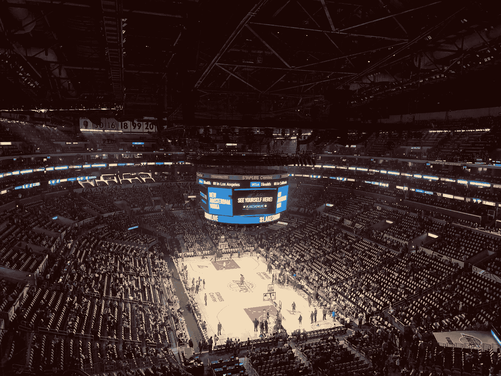
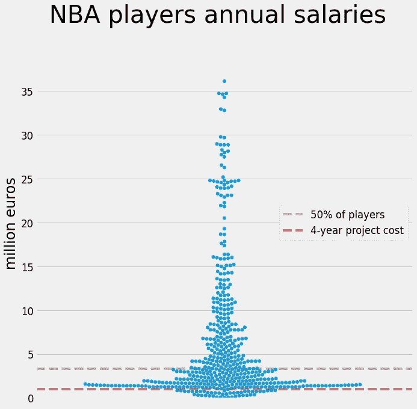
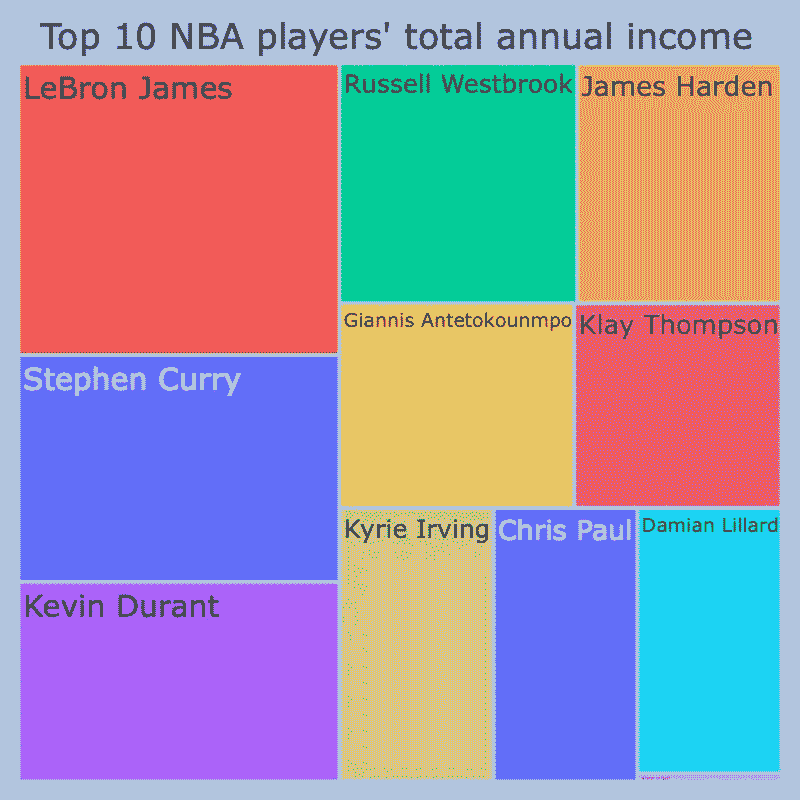

# NBA 薪酬与科学

> 原文：<https://medium.com/analytics-vidhya/nba-salaries-science-58cf162f976c?source=collection_archive---------16----------------------->

## 我们想花多少钱来娱乐？

蒂姆·哈特在 [Unsplash](https://unsplash.com/s/photos/nba?utm_source=unsplash&utm_medium=referral&utm_content=creditCopyText) 上的照片

我热爱篮球，和其他篮球迷一样，我喜欢看 NBA 比赛。世界上最优秀的选手每晚都在比赛，场面非常壮观。体育馆爆满，球队是这个星球上最好的，灯光明亮，球员是超级巨星！

我承认:我被 NBA 的强光弄瞎了。然而有一天，我在检查荷兰一个大型科学项目的预算:一个由 7 所荷兰大学和研究所组成的财团，共有 18 名科学家。更具体地说，它的预算包括 4 名研究人员(3 名博士后和 1 名博士)4 年的工资、他们的旅行、取样活动、会议、设备等。该协会研究气候变化的影响。这个项目的总成本是多少？不到 100 万欧元(更准确的说是 953228 欧元)。很多吗？让我们看看。

# NBA 合同 vs 四年科学项目

我决定将 4 年科学联盟的成本与 2020-21 赛季的 NBA 工资进行比较，这是我从篮球参考资料中刮出来的。我用了一个简单但信息丰富的群集图:

所有 NBA 球员的年薪(蓝点)。灰色虚线描绘了中间工资(即，列表中间的球员的工资)，红色虚线是 4 年科学项目的成本。

一个普通的 NBA 球员，从工资列表的中间，意味着任何接近灰色虚线的点(50%的球员)，每年仅从他们的合同中就可以赚到大约 340 万欧元。像勒布朗·詹姆斯、斯蒂芬·库里和凯文·杜兰特这样的超级巨星的收入大约是这个数字的 10 倍，还不包括赞助商。你可以看到它们，在图的顶部被描绘成几个孤独的点。

4 年的科学项目在哪里？这是图底部的红线。**NBA 收入最低的球员可以在 1 年内资助科学财团的所有 4 年**包括我在介绍中描述的一切。

# 前 10 名玩家

现在让我们来关注 10 位收入最高的球员，他们是超级巨星！这一次我将包括代言，因为这是他们总收入的一大部分。数据来自《福布斯》,在这里我决定用树状图(我有没有提到我有多喜欢简单的情节？):

2020-21 赛季收入最高的 10 名 NBA 球员的总收入(合同+代言)以及我在引言中描述的 4 年科学项目的成本的树状图(右下角的粉红色条纹)。

你能看到图右下方的粉红色条纹吗？这是 4 年科学联盟的总成本。彩色的大矩形是前 10 名 NBA 球员的年收入总和。你可以很容易地看到**勒布朗詹姆斯可以用他 1 年的总收入资助 80 个 4 年的科学财团！**其余的前 10 名玩家每年可以资助大约 40 个 4 年期的科学联盟！这些球员绝对值得他们的钱，他们在他们所做的事情上是最好的，但另一方面…你用那笔钱得到了很多重要的科学。

# 一些想法

正如我已经说过的，这些球员几乎是超级人类，他们每晚都表现出最高水平，没有其他人(至少在这个星球上！)可以接近他们所做的。也就是说，他们应该比他们的同事赚更多的钱，他们有这个权利。但是在一天结束的时候，NBA 是娱乐和表演行业，它帮助我们每周有几个小时不去想那些事情。

我忍不住问自己:为了地球的未来，我们愿意在重要的研究上花多少钱？我们愿意在娱乐上花多少钱？

> 【https://github.com/NSkyllas/NBA_salaries】代号:
> 
> 
> **数据**:
> [https://www.basketball-reference.com/contracts/players.html](https://www.basketball-reference.com/contracts/players.html)
> [https://www . Forbes . com/sites/kurtbadenhausen/2021/01/29/the-NBA-收入最高球员-2021-勒布朗-库里-杜兰特-得分-合计-2.35 亿/](https://www.forbes.com/sites/kurtbadenhausen/2021/01/29/the-nbas-highest-paid-players-2021-lebron-curry-durant-score-combined-235-million/)