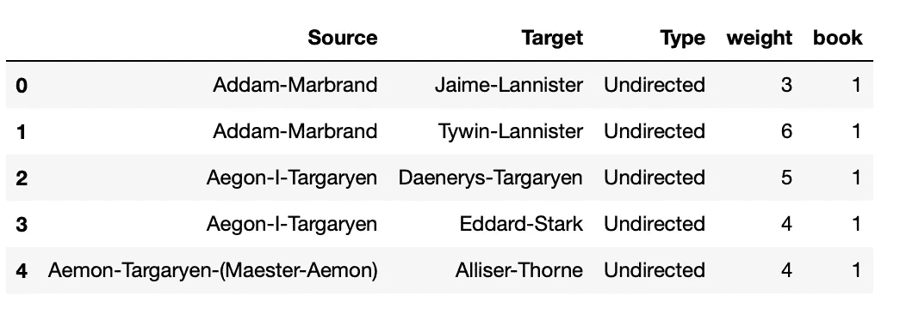

# 网络分析与可视化:权力的游戏角色网络

> 原文：<https://medium.com/analytics-vidhya/network-analysis-visualization-game-of-thrones-character-network-dc96ea3013e9?source=collection_archive---------2----------------------->


夜王。[来源](https://coolwallpapers.me/2634981-game-of-thrones.html)

本文将帮助您理解网络中心性度量的基础，以及如何在《权力的游戏》角色数据集上使用 **networkx** 库来计算它们。此外，您将学习如何在 **pyvis** 中可视化网络，并在 **Streamlit** 上创建和部署您的网络仪表板。

结束时，您将能够创造出什么:


[最终结果](https://share.streamlit.io/nairnayana3/dashboard_network_got/main/got_network.py)

# 网络科学导论

我们被越来越复杂的系统所包围。例如，我们推理和理解周围世界的能力需要我们大脑中数十亿神经元的一致活动，我们的生物存在是我们细胞内数千个基因之间无缝交互的产物。这些系统被称为复杂系统。它们在我们的日常生活中扮演着重要的角色，理解它们是 21 世纪主要的智力挑战之一。[1]

每一个复杂系统的背后都是一个错综复杂的网络，它编码了系统各组成部分之间的相互作用。网络通常指真实的复杂系统，如社会网络、新陈代谢网络、性格网络、引用网络等。网络科学是一个跨学科的领域，本质上是高度量化的，具有巨大的社会影响。仅举几个例子，它在神经科学、军事、流行病预测方面都有应用。例如，哺乳动物大脑的详细地图可能会导致脑科学的一场革命，社交网络已被用于寻找萨达姆·侯赛因，移动电话网络已被检查，以确定那些对 2004 年 3 月 11 日马德里火车爆炸事件负责的人；这些只是这个领域的广泛适用性和效用的一些例子。[1]

我们将网络的对象称为节点，而链路将节点连接在一起形成网络。而图是网络的数学表示，其对象称为顶点，边连接顶点以形成图。这些术语经常互换使用。

# 网络属性和中心性度量

## 背景和理论

在网络分析中，中心性测量用于识别节点的中心或重要程度。根据我们如何定义“重要性”或*中心性*的度量，不同的节点可以被认为或多或少重要。计算中心性可以帮助识别哪些人在社交媒体网络中最有影响力，哪些论文在引用网络中被广泛引用，犯罪网络中的强大罪犯等等。

下面描述了一些常用的中心性测量:

**节点度/度中心性**:节点的度是指附着在该节点上的边数。标准化分数是通过将节点度除以 *n-1* 获得的，其中 *n* 是节点的数量，这给出了度中心性。

密切中心性:密切中心性通过一个节点与图中所有其他节点的接近程度来衡量该节点的重要性。

设 *dij* 为节点 *i* 和*j*之间最短路径的长度，节点 *i* 的平均距离由下式给出


节点平均距离

接近中心性与平均长度成反比，或者是距离的倒数，因此由下式给出


接近中心性

**中间中心性**:中间中心性是一个节点在其他节点之间建立的连接方面的重要性的度量。例如，一个节点可以具有较小的中心度，但是它可能在保持几个节点的集群中起重要作用。中间中心性量化了一个节点作为两个其他节点之间最短路径上的桥的次数。

图 *G* 中节点 *i* 的介数中心性计算如下:

1.  对于每对顶点，计算它们之间的最短路径。
2.  对于每对顶点，确定通过给定顶点的最短路径的比例。
3.  对所有顶点对的分数求和。


中间中心性

其中分母表示在 *h* 和 *j* 之间的最短路径的总数，分子表示通过节点 *i.* 的那些路径的数量

特征向量中心性:特征向量中心性将节点的中心性定义为与其邻居的重要性成比例。它基于这样的思想，与到低得分节点的同等连接相比，到高得分节点的连接对节点的重要性贡献更大。

对于图 *G* ，顶点 *V* 和边 *E* ，如果顶点 *i* 链接到顶点 *j* 则邻接矩阵 *A* 中的条目具有值 1，否则具有值 0。

顶点 *i* 的相对特征向量中心性得分可以定义为


特征向量中心性

其中 *M(i)* 是 *i* 的所有邻居的集合，*λ*是常数。

这个方程是递归定义的，它需要找到所有相邻节点的特征向量中心性。原始方程可以用向量符号写成:


向量记法

可以使用线性代数来求解该方程，以找到λ的值。最大特征向量给出了中心性得分(根据 Perron-Frobenius 定理)。这里的条件是 *A* 是一个正矩阵，这是真的，因为它是一个邻接矩阵。

## 让我们开始写一些代码吧！

我们将使用[的《权力的游戏》角色数据集](https://www.kaggle.com/code/mmmarchetti/game-of-thrones-network-analysis/notebook)进行分析。这是《权力的游戏》系列书中人物的共现网络。在这里，如果两个字的名字出现在书中彼此相距 15 个单词的附近，则认为这两个字是同现的。

让我们导入所需的库并查看数据集。



字符网络数据集

我们现在可以使用 **networkx** 库创建对应于每个数据集的网络，并对其计算不同的中心性度量。

我们可以打印中心性值，例如，对于特征向量中心性，我们看到 Ned Stark 在第 1 本书中具有最高的特征向量中心性，而 Daenerys 在第 5 本书中具有最高的特征向量中心性。


显示书 1 和书 5 的特征向量中心性

李普·奈德·史塔克:(

我们还可以计算**网络统计数据**，如节点数、边数、直径等。对于每个网络。

# 使用 Pyvis 实现网络可视化

Pyvis 库旨在快速生成可视化网络图，并被设计为流行的 Javascript visJS 库的包装器。只需几行代码，您就可以使用 pyvis 轻松构建令人惊叹的可视化效果！

您可以使用以下代码行创建一个简单的图表，并将其保存为 HTML 文件。

当您打开 HTML 页面时，您将能够查看一个面板，您可以在其中更改节点大小、颜色和其他几个参数。


Pyvis 图形 HTML

一旦您决定了图形的定制，您可以通过点击页面底部的**生成选项**并将其嵌入源文件来保存这些设置。


下面是一个从得到的数据集中为给定的数据帧生成图形的函数。

# 使用 Streamlit 创建仪表板

[Streamlit](https://streamlit.io) 是一个开源 Python 库，可用于在几分钟内创建 web 应用。在 Streamlit 上部署您的网络图将允许用户与它们直接交互。

现在，让我们结合以上所有内容，创建一个 streamlit 仪表板！

## **来自维基百科的人物信息**

这是一个非常酷的 API，可以用来直接从维基百科加载信息。


从维基百科加载页面摘要

## **定制应用布局**

Streamlit 允许您创建容器，设置多选侧栏，编写 latex 代码，将 HTML 文件保存为组件并在仪表板中显示。

[点击此处查看完整代码！](https://github.com/nairnayana3/dashboard_network_got/blob/main/got_network.py)

## **为您的 Streamlit 仪表盘设置主题**

1.  一旦你在本地部署了你的仪表板，你可以在**设置- >编辑活动主题**下选择你的主题。
2.  自定义主题并选择**复制到剪贴板**。
3.  在 repo 中创建一个 **config.toml** 文件，并将其粘贴到那里。

```
[theme] 
# The preset Streamlit theme that your custom theme inherits from one of "light" or "dark"
base = "dark" 
# Primary accent color for interactive 
elements.primaryColor ="#35b6dc"
```


在 Streamlit 上设置自定义主题

## **通过 GitHub 部署您的仪表板**

提交数据集、代码、config.toml 和 requirements.txt 文件后，您可以使用 GitHub repo 链接来部署您的 streamlit 仪表板。

1.  转到 [Streamlit 共享](https://share.streamlit.io)
2.  通过 GitHub 登录
3.  点击**新建 App** ，选择 repo，主文件路径(your。py 文件)并点击部署！

部署应用可能需要一些时间。部署后，这些应用将出现在您的 Streamlit 共享页面上，任何人都可以通过链接查看您的应用。您在 GitHub repo 中所做的任何更改都会自动反映在您的应用程序中。

**哒哒！**您已经成功创建了一个已部署的网络仪表板！

# 参考

[1] A.L. Barabási，[网络科学图书](http://networksciencebook.com) (2015)，剑桥大学出版社

# 有用的链接

1.  GitHub 回购:[https://github.com/nairnayana3/dashboard_network_got](https://github.com/nairnayana3/dashboard_network_got)
2.  streamlit Dashboard:[https://share . streamlit . io/nairnayana 3/Dashboard _ network _ got/main/got _ network . py](https://share.streamlit.io/nairnayana3/dashboard_network_got/main/got_network.py)
3.  数据集:[https://www . ka ggle . com/code/mmmarchetti/game-of-thrones-network-analysis/notebook](https://www.kaggle.com/code/mmmarchetti/game-of-thrones-network-analysis/notebook)
4.  在 Streamlit 上部署 Pyvis(详细教程):[https://towards data science . com/how-to-deploy-interactive-Pyvis-network-graphs-on-Streamlit-6c 401d 4c 99 db](https://towardsdatascience.com/how-to-deploy-interactive-pyvis-network-graphs-on-streamlit-6c401d4c99db)
5.  有史以来最酷的引用网络:[https://www.connectedpapers.com](https://www.connectedpapers.com)

希望这篇文章对你有所帮助。请在下面留下您的反馈，并确保**关注**我的媒体账户了解更多信息！

谢谢，祝您愉快:)