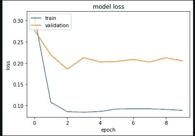
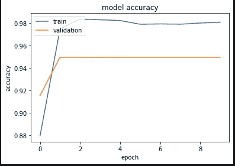
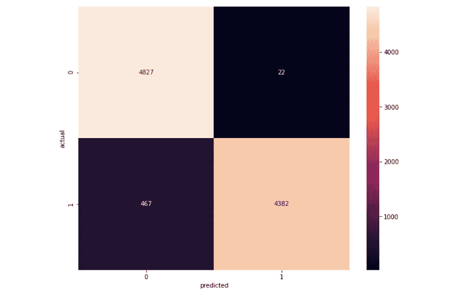

# 网络入侵检测

> 原文：<https://medium.com/analytics-vidhya/network-intrusion-detection-ffb4d79f9edb?source=collection_archive---------12----------------------->

构建可以检测网络入侵的深度学习模型


# 什么是网络入侵？

网络入侵是对您企业中的计算机或您分配的域中的地址的未经授权的渗透。

# 目标

利用 Python 编程语言和 Keras 开发了一个简单的 DNN 网络入侵检测模型。

# 先决条件

开始之前，您应该充分了解:

1.  Python 编程语言
2.  Keras —深度学习 API

# 资料组

我们将使用著名的开源 KDDCUP99 数据。您可以从以下网站下载数据集:

这里我们使用预处理数据来加速我们的过程。

# 导入所有必需的库

让我们导入所有需要的库:

# 加载训练和测试数据

# 预处理数据

出局:

```
1    24157
0     5843
Name: 0, dtype: int64
```

由于数据是不平衡的，我们使用过采样技术来平衡训练和测试数据

对于 OMP 误差

拆分数据

缩放比例

# 构建和保存模型

出局:

```
Epoch 1/10
755/755 [==============================] - 8s 10ms/step - loss: 0.3162 - accuracy: 0.8781 - val_loss: 0.2650 - val_accuracy: 0.9153
Epoch 2/10
755/755 [==============================] - 8s 11ms/step - loss: 0.1040 - accuracy: 0.9759 - val_loss: 0.2410 - val_accuracy: 0.9492
Epoch 3/10
755/755 [==============================] - 8s 11ms/step - loss: 0.0827 - accuracy: 0.9836 - val_loss: 0.2384 - val_accuracy: 0.9494
Epoch 4/10
755/755 [==============================] - 8s 11ms/step - loss: 0.0871 - accuracy: 0.9818 - val_loss: 0.2020 - val_accuracy: 0.9495
Epoch 5/10
755/755 [==============================] - 9s 12ms/step - loss: 0.0834 - accuracy: 0.9834 - val_loss: 0.2013 - val_accuracy: 0.9496
Epoch 6/10
755/755 [==============================] - 9s 11ms/step - loss: 0.0880 - accuracy: 0.9816 - val_loss: 0.2099 - val_accuracy: 0.9496
Epoch 7/10
755/755 [==============================] - 8s 11ms/step - loss: 0.0834 - accuracy: 0.9828 - val_loss: 0.2198 - val_accuracy: 0.9496
Epoch 8/10
755/755 [==============================] - 8s 11ms/step - loss: 0.0867 - accuracy: 0.9818 - val_loss: 0.1892 - val_accuracy: 0.9496
Epoch 9/10
755/755 [==============================] - 9s 11ms/step - loss: 0.0803 - accuracy: 0.9844 - val_loss: 0.2188 - val_accuracy: 0.9494
Epoch 10/10
755/755 [==============================] - 8s 11ms/step - loss: 0.0829 - accuracy: 0.9833 - val_loss: 0.2051 - val_accuracy: 0.9496
<bound method Model.summary of <tensorflow.python.keras.engine.sequential.Sequential object at 0x0000029C3E453CD0>>
```

# 图表

培训损失与验证损失:



培训准确度与验证准确度:



# 准确性和分类报告

出局:

```
304/304 [==============================] - 0s 1ms/step - loss: 0.2051 - accuracy: 0.9496
[0.20509395003318787, 0.9495772123336792]
```

出局:

```
precision    recall  f1-score   support

           0       0.91      1.00      0.95      4849
           1       1.00      0.90      0.95      4849

    accuracy                           0.95      9698
   macro avg       0.95      0.95      0.95      9698
weighted avg       0.95      0.95      0.95      9698
```

# 热图

出局:



# 结论

我们已经训练了简单的 DNN 来检测网络入侵，准确率达到了 95%。