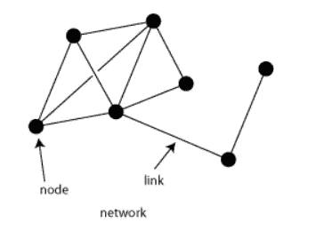
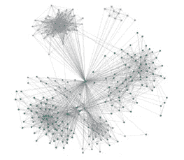
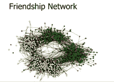
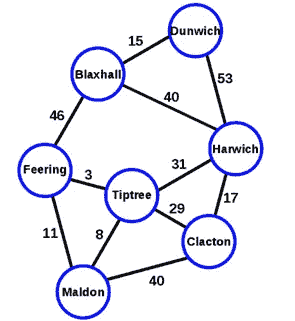
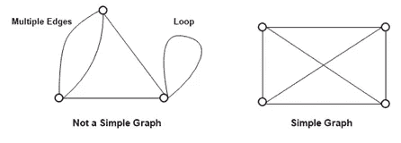
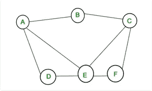
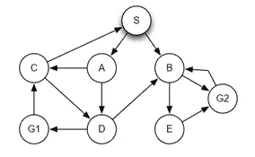
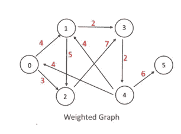

# 数据科学中的网络。

> 原文：<https://medium.com/analytics-vidhya/networks-in-data-science-99c14e0150ea?source=collection_archive---------16----------------------->

网络是不同连接对象的集合。这些物体被称为节点或顶点。我们画一条线来连接不同物体，这些物体叫做边。不同的节点使用边与对象连接，并且可以连接多个对象。

该网络可以绘制如下:

网络通常被称为图形。现实世界中有各种各样的系统可以用网络来表示。让我们以互联网为例，它是一个网络，其中节点是计算机或笔记本电脑，边是设备之间的连接，铁路网络是由不同铁路线互连的车站系统，友谊也称为网络，所有朋友通过不同的人群相互联系。

脸书网络图

网络也指承载某种信息的图或有向图。而图只表示两个或多个系统之间的联系，不提供有关其元素的信息。然而，网络定义了额外的重要定量信息。

# 不同类型的网络

日常生活中有不同类型的网络可用。

1)道路网络

2)管道网络

3)人工神经网络

4)生物网络

5)电信网络

6)计算机网络

7)社交网络

下面详细讨论一下路网和管网。

**1)** **路网:-**

道路是相互连接的线路系统，旨在适应轮式道路车辆和行人交通。在道路网络中，每个节点的权重可以是以英里或公里为单位的道路长度，用于行驶的有价值的或实际的时间以及行驶的成本可以被考虑，例如燃料和通行费的成本。此外，节点的权重还可以是吸引人的风景，道路的质量，沿路旅行的危险率和交通量。

使用道路网络可以找到两个城市之间的最简单路径。在下面给出的网络问题中，没有考虑每条道路的交通流量，但考虑了道路的长度或两个城市之间的距离，以便在图的两条边上分配权重。因此，要找到两个城市之间的最短路径，并将其视为图上的顶点，我们就可以确定两个相应城市之间的最短路径。

上图展示了英国的七个主要城市。每个节点代表一个城市，图中的每条边代表一个旅行者从一个节点到另一个节点的直线飞行距离。

**2)** **管网:-**

在管道网络中，两个节点之间的边被表示为一条管道，两个节点被视为两个连接点，节点的权重表示管道的容量。水、油或气体等流体从源头流向终端。总流量可以认为是从源头到终点的流量。因此，我们可以说从源头到终端没有流体损失。流经管道的流体流量不得超过节点容量和指定方向。

从上图中，我们可以确定，可以沿着上图中突出显示的路线设置 2 个单位的流体流量，而不会超过任何管道的容量。

# 2)什么是图？

图是一组节点或顶点和一组边的集合。

我们可以通过用点显示节点并在边的端点之间画线来绘制图形。如果给定问题的集合或顶点是 V = {a，b，c，d，e}并且边的集合是 E = {ab，ce，de，be}，则该图可以绘制如下:

如果两个顶点由一条线连接，并且如果有任何应该考虑的预定义权重，我们可以应用或放置顶点，按照我们想要的任何顺序。

**多条边**是指两条或多条边连接同一对节点的那些。如果单个节点有一条边，那么把一个节点连接到它自己就叫做一个环。

不包含多重边或回路的图是简单图**。**

****

# **最常见的图形类型**

**有三种不同类型的图表，如下所述:**

**1)简单图形**

**2)加权图**

**3)有向图**

**让我们分别讨论更多的图形类型。**

# **1)简单图形:-**

**没有任何回路和平行边的图称为简单图。简单图也称为严格图。它没有任何加权无向图，不包含图 100 或多条边。一个简单的图可以是连通的，也可以是不连通的。总共有 n 个顶点的简单图，每个顶点的度数最多为 n -1。**

****

# **2)有向图**

**如果节点之间的连接是有向的，则称之为有向图。这个有向图称为有向图。在有向图中，一个图的所有分支都用箭头表示，在箭头上它们连接到下一个节点。**

**有向图是由称为顶点的点组成的图，这些点由称为弧的有向线连接；每条弧线恰好连接两个顶点。有向图如下所示:**

****

**有向图 G = (V，E ),其映射使得每条边都映射到某个有序顶点对上**

**(Vi，Vj)。**

**所以，我们可以说哪个节点是朝着哪个节点的方向，可以有不同的节点到达一个节点。**

**有向图示例如下所示:**

**在朋友的网络中，A 可能认识 B，但这并不意味着 B 认识 A。**

# **3)加权图:-**

**加权图是这样一种图，其中每条边都有一个称为权重的数值，这也可以用到达其他节点所需的权重来衡量。这个权重由一个权重函数***w:E->R*来表示。****

****

**边上的重量可以表示很多事情。例如，在道路地图上，人 a 需要时间到达人 b，或者需要城市之间距离到达最终目的地。**