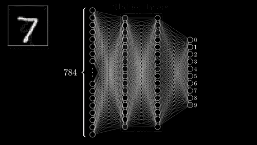
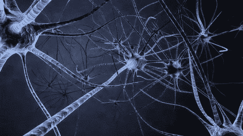
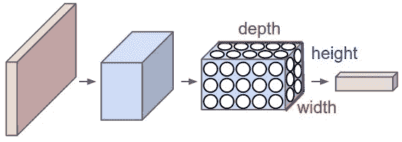

# 神经网络

> 原文：<https://medium.com/analytics-vidhya/neural-network-4e505746ba73?source=collection_archive---------24----------------------->

如果你是 IT 出身，你可能会遇到这样的情况，你希望你的系统像我们的大脑一样执行某些任务。
如果一台计算机能够用自己的智能执行这样的任务。听起来怎么样..？

神经网络

在 AI(人工智能)& ML(机器学习)的世界里，我们希望我们的机器像人脑一样思考。
由于人类大脑可以更快地学习事物，并可以根据他们过去的经验预测一些事情，我们希望我们的机器以同样的方式工作。
人脑是如何工作的，大脑的核心单位(神经元)有哪些..？让我们找出答案..= >

> **什么是神经元..**

人脑神经元

大脑神经元的基本工作单元，也称为神经细胞，发送和接收来自大脑的信号。虽然神经元与其他类型的细胞有很多共同点，但它们在结构和功能上是独特的。称为轴突的特殊突起允许神经元向其他细胞传递电信号和化学信号。

> **人类神经系统**

神经系统

神经系统是动物身体的一部分，协调其行为并在不同身体区域之间传递信号。在脊椎动物中，它由两个主要部分组成，称为中枢神经系统(CNS)和外周神经系统(PNS)。中枢神经系统包括大脑和脊髓。神经系统帮助身体的各个部分相互沟通。它也对身体内外的变化做出反应。神经系统使用电和化学手段来发送和接收信息。

> **什么是神经网络..？？**

神经网络是神经元的网络或回路，或者现代意义上的人工神经网络，由人工神经元或节点组成。因此，神经网络或者是由真实生物神经元组成的生物神经网络，或者是用于解决人工智能(AI)问题的人工神经网络。生物神经元的连接被建模为权重。正的权重反映了兴奋性连接，而负值意味着抑制性连接。所有的输入被一个权重修改并求和。这种活动被称为线性组合。最后，激活函数控制输出的幅度。例如，可接受的输出范围通常介于 0 和 1 之间，也可能是 1 和 1。

神经网络具有从不精确的数据中检索有意义数据的非凡能力，用于检测趋势和提取计算机或人类难以理解的模式。经过训练神经网络可以成为信息的“专家”,用于分析和提供预测。

> **神经网络的优势** 神经网络的一些优势列举如下-

自组织(Self-organization):人工神经网络可以生成它在学习时收到的信息的自己的表示。
**实时操作:**人工神经网络计算可以同时进行，一些特殊的(硬件)设备利用这种能力被制造出来。
**自适应学习:**学习如何解决任务的能力是基于给定训练集的数据。
**通过容错进行冗余信息编码:**一个网络的半破坏导致相应的性能下降。此外，一些网络将有能力保留数据，即使当一个主要的网络损坏发生。

> **神经网络的工作**

为了理解神经网络，我们需要将其分解，并理解神经网络的最基本单元，即感知器。

神经网络工作

什么是感知器？
感知器是一种单层神经网络，用于对线性数据进行分类。它有 4 个重要组成部分:

**输入**
权重和偏差
求和功能
激活或转换功能

感知器背后的基本逻辑如下:

将从输入层接收的输入(x)乘以它们的分配权重 w。然后将相乘的值相加以形成加权和。输入的加权和以及它们各自的权重然后被应用于相关的激活函数。激活功能将输入映射到相应的输出。

深度学习中的权重和偏差
为什么我们要给每个输入分配权重？

一旦一个输入变量被输入到网络，一个随机选择的值被指定为该输入的权重。每个输入数据点的权重表明该输入在预测结果中的重要性。

另一方面，偏差参数允许您调整激活函数曲线，以实现精确的输出。

**求和函数**
一旦输入被分配了某个权重，则取相应输入和权重的乘积。将所有这些乘积相加得到加权和。这是通过求和函数完成的。

**激活函数**
激活函数的主要目的是将加权和映射到输出。激活函数如 tanh、ReLU、sigmoid 等都是变换函数的例子。

神经网络工作

如果你喜欢上面的博客，请鼓掌并分享。

如果有建议/反馈/疑问，请在 LinkedIn 上联系我:

 [## Akash Choudhary -本科生-维威卡难达理工学院| LinkedIn

### 查看 Akash Choudhary 在世界上最大的职业社区 LinkedIn 上的个人资料。阿卡什有一个工作列在他们的…

www.linkedin.com](https://www.linkedin.com/in/akash-choudhary-6109941b4/) 

谢谢大家！注销:)🙌