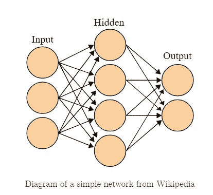
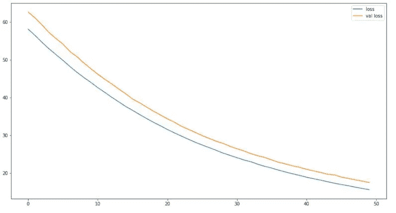

# 初学者神经网络指南

> 原文：<https://medium.com/analytics-vidhya/neural-network-guide-for-beginners-d3457bbb7e34?source=collection_archive---------8----------------------->

这篇神经网络指南是为那些刚开始学习神经网络，并想很好地理解如何用 Python 自己构建一个神经网络的人准备的。随着你对神经网络的基本拓扑结构越来越熟悉，所有复杂的数学和复杂的算法都会随着你对这个主题的深入而变得更有意义。因此，我试图把这个话题保持在一个很高的水平，而不是深入细节。我个人的信念是，加速你对神经网络理解的最好方法是把手弄脏，而不是试图理解引擎盖下的所有理论概念。

为了帮助您理解神经网络模型的一般拓扑或结构，我将探索三种不同的情况(回归、二元分类和多类分类)来演示和强调细微的差异。

# 1.回归

提醒一下，在回归问题中，我们的目标是预测连续的值。在现实生活中，这个目标变量可以代表无数的事物。出于本练习的目的，我将使用 scikit-learn 的数据集模块生成自己的回归数据集，而不是使用真实的数据。

**首先，我们导入以下:**

```
# Imports
import numpy as np
import pandas as pd
import matplotlib.pyplot as pltfrom sklearn.datasets import make_classification, make_regression
from sklearn.preprocessing import StandardScaler
from sklearn.model_selection import train_test_splitfrom tensorflow.keras.models import Sequential
from tensorflow.keras.layers import Dense
from tensorflow.keras.utils import to_categorical
```

**导入后，让我们生成自己的回归数据集:**

```
X, y = make_regression(n_samples=10000, n_features=20, random_state=42)
```

这里，我正在生成一个包含 10，000 个样本和 20 个特征的回归数据集。简单地说，这是一个包含 10，000 行和 20 列的数据集。鉴于这是一个虚拟数据，这些特征代表什么并不重要。在这一点上，我们所关心的是，我们有一个可以用来建立和训练我们的第一个神经网络模型的回归数据集。

**训练/测试分割:**

```
X_train, X_test, y_train, y_test = train_test_split(X, y, random_state=42)
```

一个重要的注意事项！由于神经网络使用梯度下降(优化技术)来最小化损失函数，所以我们首先缩放我们的数据是至关重要的。

**缩放数据:**

```
ss = StandardScaler()Z_train = ss.fit_transform(X_train)
Z_test = ss.transform(X_test)
```

现在我们已经对数据进行了缩放，让我们最终跳到构建我们的第一个神经网络模型！

**添加图层:**

```
model = Sequential()model.add(Dense(32, activation='relu', input_shape=(Z_train.shape[1],)))
model.add(Dense(8, activation='relu'))model.add(Dense(1, activation=None))
```

在这几行代码中发生了几个大的活动，所以让我们花点时间来分析一下这里发生了什么。

首先，当我们构建神经网络模型时，我们从所谓的“输入层”开始，以“输出层”结束。夹在中间的是“隐藏层”。每一层都有许多节点或“权重”。例如，在下图中，输入层有 3 个节点，隐藏层有 4 个节点，输出层有 2 个节点。



我们上面的代码本质上是从左到右构建这个一般流程。

*   我们的输入图层有 20 个结点，因为我们的虚拟数据集有 20 个要素
*   我们的隐藏层有 32 个节点，因为这是我们在这个例子中使用的数字。我可以使用任何数字，但我决定使用 32，因为 32 是一个很好的基数 2 的数字。
*   我正在添加第二个隐藏层，有 8 个节点。同样，除了 8 也是一个很好的基数 2 之外，没有什么特别的原因。
*   对于我的输出层，我只用一个节点结束它。对于输出层，我们只有一个节点是很关键的，因为这是一个回归问题，我们希望模型的实际输出没有任何转换。

第二，注意每一层都有一个激活功能。现在，注意到行业标准是出于计算原因使用 ReLU 就足够了。您可能会遇到 sigmoid 或双曲线正切激活函数，但请记住 ReLU 是目前最常见的激活函数选择。

**我们来编译:**

```
model.compile(optimizer='adam', loss='mse', metrics=['mae'])
```

让我们花点时间来分析一下这行代码。

*   如前所述，神经网络使用梯度下降来寻找最优解。事实证明，梯度下降是一个非常复杂的过程，有许多不同的技术可以执行这一方法。到目前为止，最常见的优化器是“adam”。然而，还有其他可用的技术，如 AdaGrad 和 RMSProp。作为一个通用的经验法则，当有疑问时，我建议你总是默认为“adam”。
*   由于这是一个回归问题，我们的损失函数是 mse(均方误差)。
*   除了 mse，我们还可以测量和比较其他回归指标。在这个特殊的例子中，我选择了 mae(平均绝对误差)。

**拟合模型:**

```
first_model = model.fit(Z_train, y_train, batch_size=256, epochs=50, validation_data=(Z_test, y_test))
```

同样，这里发生了很多事情，所以让我们也将它分解成各个组件。

*   Batch_size 为 256 意味着我们的模型将通过 256 个样本传播以计算误差，然后对接下来的 256 个样本重复该过程，依此类推。
*   Epochs 为 50 意味着模型会看到整个数据集 50 次。每当整个数据集通过神经网络模型时，我们都将其计为一个时期。
*   请注意，在拟合模型时，我还能够传入验证数据(测试数据)。这是一个很棒的附加功能，因为我可以同时拟合和测试模型。

为了直观地显示损失函数在每个时期是如何改进的，我们可以绘制训练和测试数据的损失函数:

```
plt.figure(figsize=(15,8))
plt.plot(first_model.history['loss'])
plt.plot(first_model.history['val_loss'])
plt.legend(['loss', 'val loss']);
```



最后，我们可以产生我们的预测！

```
first_model.predict(Z_test)
```

# 2.二元分类

**类似于上面的回归，让我们创建一个虚拟数据集，训练/测试分割，并缩放数据:**

```
X, y = make_classification(n_samples=10_000, n_features=20, random_state=42)X, y = make_classification(n_samples=10_000, n_features=20, random_state=42)X_train, X_test, y_train, y_test = train_test_split(X, y, stratify=y, random_state=42)ss = StandardScaler()
Z_train = ss.fit_transform(X_train)
Z_test = ss.transform(X_test)
```

**让我们来构建模型:**

```
model = Sequential()model.add(Dense(32, activation='relu', input_shape=(Z_train.shape[1],)))
model.add(Dense(8, activation='relu'))model.add(Dense(1, activation='sigmoid'))
```

与上面的回归拓扑非常相似，我们保持一切不变，除了注意输出层，我们使用 sigmoid 作为我们的激活函数。这是因为 sigmoid 函数采用曲率并将其限制在 0 和 1 之间，这对于二元分类问题是完美的，因为我们本质上是预测概率。这与 logit 函数如何在逻辑回归中绘制最佳拟合线以限制 0 和 1 之间的值基本相同。

**我们来编译:**

```
model.compile(loss='binary_crossentropy', optimizer='adam', metrics=['acc'])
```

再一次，一些改变适应了现在这是一个二进制分类问题的事实。

*   二元分类问题的损失函数是“二元交叉熵”
*   注意“adam”仍然是首选的优化器。
*   对于其他指标，我增加了准确性。我们可以添加其他分类指标，如灵敏度、特异性、精确度等。

**拟合模型:**

```
model_2 = model.fit(Z_train, y_train, batch_size=256, epochs=50, validation_data=(Z_test, y_test))
```

装配过程保持不变。

如上所述，您可以生成预测、图形损失函数和度量等。

# 3.多分类

类似的方法也适用于多分类问题，有三个主要的调整。

**让我们重复这个过程创建一个虚拟数据集，训练/测试分割，并缩放数据:**

```
X, y = make_classification(n_samples=10000, n_features=20, n_informative=4, n_classes=3)y = to_categorical(y)X_train, X_test, y_train, y_test = train_test_split(X, y, stratify=y, random_state=42)ss = StandardScaler()
Z_train = ss.fit_transform(X_train)
Z_test = ss.transform(X_test)
```

这是第一个主要的调整。注意，我使用 Keras 中可用的 to _ categorical 函数将我们的目标类向量转换成二进制类矩阵。你可以认为这是对我们的目标变量的一次性编码。

例如，在我们的虚拟数据集中，我们创建了 3 个独立的类。因此，当我们对 y 进行一次性编码时，转换结果如下:

0 = [1, 0, 0]

1 = [0, 1, 0]

2 = [0, 0, 1]

**让我们来建造:**

```
model = Sequential()model.add(Dense(32, activation='relu', input_shape=(Z_train.shape[1],)))
model.add(Dense(16, activation='relu'))model.add(Dense(3, activation='softmax'))
```

这是第二个调整。对于多分类，我们的输出层的激活函数将是 softmax。同样，不用深入兔子洞，注意到 softmax 激活函数只是使我们的输出正常化就足够了。

**我们来编译:**

```
model.compile(loss='categorical_crossentropy', optimizer='adam', metrics=['acc'])
```

这是第三个主要的调整。对于多分类，我们的损失函数将是分类交叉熵。我们将坚持使用 adam 作为我们的优化器，并使用准确性作为我们的分类标准来进行验证。

**让我们来拟合模型:**

```
model_3 = model.fit(Z_train, y_train, batch_size=256, epochs=50, validation_data=(Z_test, y_test))
```

# 摘要

我们探索了如何为回归、二元分类和多分类数据集构建神经网络模型。虽然三者的整体拓扑保持不变，但我们探讨了三者之间的主要差异，主要涉及输出层激活函数和损耗函数。

不用说，还有很多本指南没有涉及的主题。例如，我们还没有涵盖一些可以应用于神经网络的正则化方法，如 l2、漏失层和早期停止。然而，我认为拥有这些基础知识将有助于你在数据科学之旅中成长和学习更多关于神经网络的知识。