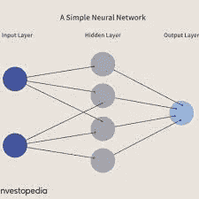
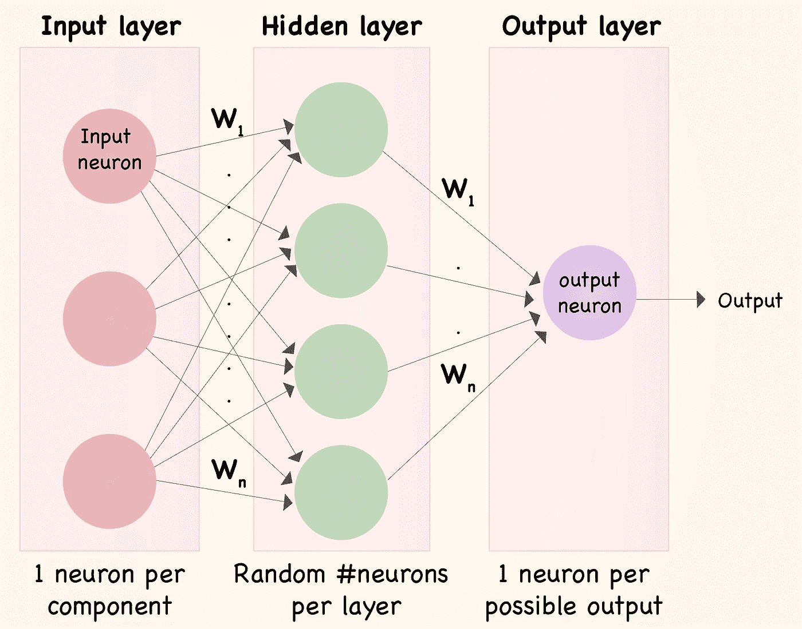
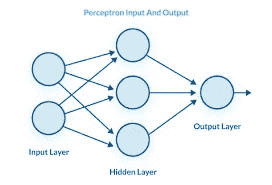
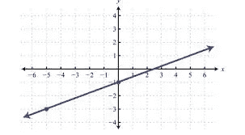
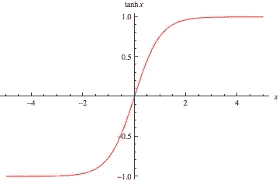
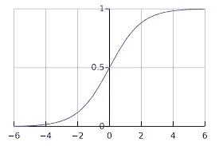
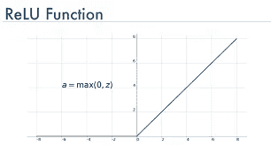
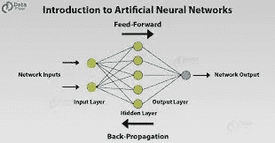
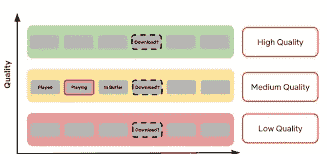
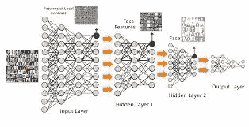

# 神经网络:工作原理及其行业用例

> 原文：<https://medium.com/analytics-vidhya/neural-network-how-it-works-and-its-industry-use-cases-30455d3fce11?source=collection_archive---------1----------------------->

# 什么是神经网络？

**神经网络**是一系列模拟人脑运作的算法，用来识别大量数据之间的关系。它们在金融服务中有多种应用，从预测和营销研究到欺诈检测和风险评估。

# 神经网络是如何工作的？

神经网络有许多层。每一层都执行特定的功能，网络越复杂，层就越多。这就是为什么神经网络也被称为多层感知器。

最纯粹的神经网络有三层:

1.  输入层
2.  隐藏层
3.  输出层

顾名思义，每一层都有特定的用途。这些层由节点组成。根据需要，一个神经网络中可以有多个隐含层。输入层拾取输入信号，并将它们传输到下一层。它从外部世界收集数据。

隐藏层执行所有计算的后端任务。网络甚至可以没有隐藏层。然而，神经网络至少有一个隐藏层。输出层传输隐藏层计算的最终结果。

像其他机器学习应用程序一样，在向神经网络提供特定问题之前，您也必须用一些训练数据来训练神经网络。但在我们更深入地了解神经网络如何解决问题之前，您应该先了解感知器层的工作原理:

# 感知器层是如何工作的？

一个神经网络由许多感知器层组成；这就是它被命名为“多层感知器”的原因这些层也称为密集层的隐藏层。它们是由许多感知器中子组成的。它们是协同工作形成感知层的基本单元。这些神经元接收输入集合中的信息。您将这些数字输入与一个偏差和一组权重相结合，然后生成一个输出。

对于计算，每个神经元考虑权重和偏差。然后，组合函数使用权重和偏差来给出输出(修改的输入)。它通过以下等式工作:

组合=偏差+权重*输入

此后，激活函数产生具有以下等式的输出:

输出=激活(组合)

这个函数决定了神经网络执行什么样的角色。它们构成了网络的各个层次。以下是常见的激活功能:

## 线性函数

在这个函数中，输出仅仅是神经元的组合:

激活=组合

## 双曲正切函数

它是神经网络中最受欢迎的激活函数。它是一个 sigmoid 函数，位于-1 和+1 之间:

激活= tanh(组合)

## 物流功能

逻辑函数与双曲正切函数非常相似，因为它也是一种 sigmoid 函数。然而，它是不同的，因为它位于 0 和 1 之间:

激活= 11 +电子组合

## 校正的线性单位函数

就像双曲正切函数一样，校正的线性单位函数也很普遍。整流线性单位函数的另一个名称是 ReLU。ReLU 等于或大于零时等于组合，小于(负)零时为负。

# 那么，神经网络到底是如何工作的呢？

现在你知道了神经网络背后的东西和它是如何工作的，我们可以把注意力集中在神经网络的工作上。

它是这样工作的:

1.  信息被输入到输入层，输入层将信息传递到隐藏层
2.  两层之间的互连为每个输入随机分配权重
3.  在权重分别与每个输入相乘后添加到每个输入的偏差
4.  加权和被传递给激活函数
5.  激活函数确定应该激发哪些节点来进行特征提取
6.  该模型将应用程序功能应用到输出层以交付输出
7.  权重被调整，并且输出被反向传播以最小化误差

该模型使用成本函数来降低错误率。您必须根据不同的训练模式来改变重量。

1.  该模型将输出与原始结果进行比较
2.  它重复这个过程以提高精确度

该模型在每次迭代中调整权重，以提高输出的准确性。

# 神经网络的使用案例

人工**神经网络**可以以多种方式**使用**。他们可以对信息进行分类，对数据进行聚类，或者预测结果。安的可以**用于**一系列的任务。这些包括分析数据、将语音转录为文本、为面部识别软件提供动力或预测天气。

## 使用人工神经网络(ANN)的顶级公司

*   **英伟达公司(NVDA)**
*   **字母表(GOOG，GOOGL)**
*   **Salesforce.com(CRM)**
*   **Amazon.com(AMZN)**
*   **微软公司(MSFT)**
*   **Twilio (TWLO)**
*   **IBM (IBM)**
*   脸书(FB)

## 案例研究:网飞

网飞公司不会让其电视剧和电影的成功碰运气——分析师称其股票应该得到回报。

该公司希望能够“将伟大的故事讲述和伟大的技术方面结合起来，”首席执行官雷德·哈斯汀斯在 2015 年告诉 MarketWatch。“这就是我们想要去的地方。”

网飞使用**卷积神经网络**和专有算法，本质上是用于**分析视觉图像**的深度机器学习，是其方法的一个主要例子。

正是这种方法引起了富国银行分析师肯·塞纳和马西·瑞维克的注意。根据 FactSet 的数据，他们在周三首次对网飞 NFLX 进行了评级，给出了增持评级和 230 美元的 12 个月目标价，这是涵盖该股的分析师中最高的目标价。

Sena 和 Ryvicker 表示，**神经网络**的改进和进步使网飞能够有效地向订户推送推荐的节目和电影，甚至使用数据来做出制作和获取内容的决策。

亚利桑那州立大学的未来学家布莱恩·戴维·约翰逊说，多年来，人们已经能够逐帧逐像素地分析视频——他甚至在 2009 年写了一本关于这方面的书。但直到现在，内容许可方面仍存在阻碍创新的障碍。

“网飞一直在努力研究算法，将消费者与他们的内容匹配起来——网飞也比 2009 年有更多的权力让人们允许他们搜索他们的视频，”Johnson 在给 MarketWatch 的一封电子邮件中说。“[**人工智能**和**神经网络**的进步意味着他们现在可以理解这些数据。

“本质上，他们在数据中寻找与他们所寻找的正确输出相等的模式。人工智能的范围和规模允许他们以前所未有的方式做到这一点。”

Ryvicker 和 Sena 表示，除了将收集到的数据用于平台改进，如添加自动播放、“跳过介绍”按钮、定制预告片以及将星级系统更改为向上或向下，网飞还可以将这种能力用于内容供应的决策。

关于网飞的建议的实施情况

Ryvicker 和 Sena 写道，通过卷积神经网络的进步，网飞可以检测和分析驱动观众参与的潜在场景元素。他们写道，这种数据驱动的方法可以告知网飞许可哪些内容，并提供对生产的洞察。

“我们认为这是推动网飞在原创方面取得成就的重要因素，续订率大约是传统电视网的三倍，”Ryvicker 和 Sena 写道，并指出网飞获得了 91 项艾美奖提名，仅次于 HBO。“此外，网飞自己估计，这些效率加上更高的用户保留率，每年为公司节省超过 10 亿美元。”

网飞正在加入脸书、谷歌和微软等公司的行列，探索深度学习算法，以改善他们的用户体验。

网飞的工程师 Xavier Amatriain，Justin Basilico 和应岱臻在一篇博客文章中解释了这项新的努力，详细介绍了他们对深度学习如何改善网飞电影和电视推荐引擎的研究。然而，与脸书或谷歌等更大的公司不同，网飞在亚马逊网络服务上运行其算法，它已经在亚马逊网站上托管其流媒体服务，而不是建立定制的基础设施。

深度学习是人工智能的一个分支，旨在使用模拟人脑结构和行为的计算机系统来解决复杂问题。虽然网飞尚未透露他们将如何确切地将算法应用于推荐，但工程师们确实分解了他们将如何使用 GPU 来构建深度学习神经网络。

“在设计我们在云中利用计算能力的方法时，我们试图达成一种平衡，使训练神经网络变得快速而容易，”工程师们写道。“我们寻求实现一个大规模神经网络训练系统，该系统利用了 GPU 和 AWS 云的优势。我们有能力使用许多 GPU 核心、CPU 核心和 AWS 实例……在我们的解决方案中，我们采用基于 GPU 的并行方法进行训练，并使用分布式计算来处理超参数调整和不同的配置。”

# ********感谢您阅读* * * * * * * *