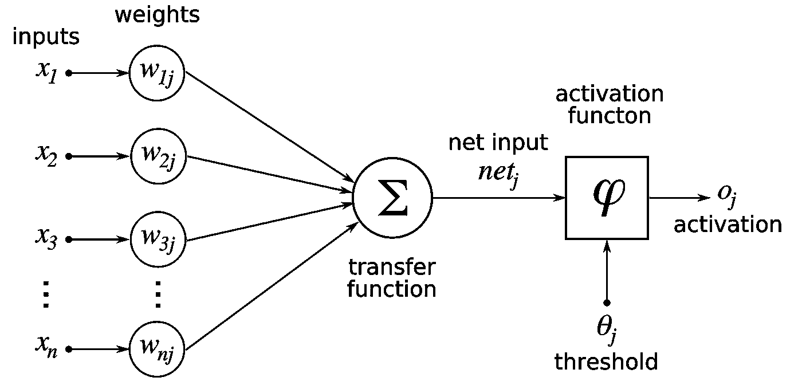

# 神经网络

> 原文：<https://medium.com/analytics-vidhya/neural-networks-832d597828ba?source=collection_archive---------15----------------------->

神经网络(NN)是当今世界上使用最广泛的概念之一。神经网络也称为人工神经网络(ANN)。

那么这些概念是什么，它们是如何工作的？继续读！

人工神经网络或更广为人知的神经网络定义如下

> **神经网络**是一系列模拟人脑运作的算法，用来识别大量数据之间的关系。

# 1.神经元

在讨论神经网络之前，我们必须讨论神经网络的基本构件。每个神经网络由**神经元组成。**神经元的结构如下

图片来自 [TechTalks](https://bdtechtalks.com/2019/08/05/what-is-artificial-neural-network-ann/artificial-neuron/)

如图所示，每个神经元都将权重和特征作为输入。如果神经元在网络的第一层，那么它将数据集的“实际特征”作为其特征，否则如果它不在第一层，那么它将来自先前层的其他神经元的输出作为其特征。神经网络的每一层都有特定的权重。

每个神经元做的过程是

1.  **线性计算**:在这一部分，神经元取权值并与输入特征值相乘，然后求和。由于这是一个简单的计算，它不计算任何复杂的函数。因此，如果听之任之，这是没有用的。
2.  **非线性计算**:为了计算各种复杂的函数，我们必须进行某种非线性计算。这就是激活功能发挥作用的地方。计算线性部分后，神经元获取该值并将其提供给某个激活函数。激活函数对给定值做一些进一步的计算，然后输出。

# 2.激活功能

简单来说，**激活函数是在 NN 中用来学习数据中复杂模式的函数**。现在，要回答的另一个问题是，是否强制使用激活功能？答案是肯定的！激活函数是人工神经网络最重要的组成部分。没有它们，我们将只是计算毫无用处的线性数据。

最常用的激活功能有哪些？让我们看看

# 热卢

ReLU 代表“校正线性单位”。这是最常用的激活功能。

*   **当值为负时，返回零**
*   **当输入值为正时，再次返回相同的值**

来源:Quora

# 乙状结肠的

sigmoid 函数将任何实数作为输入，并且**返回一个介于 0 和 1 之间的值。**乙状结肠功能也是对称的。所以当输入为 0 时，它返回值 0.5。

来源:Quora

# 3.神经网络的结构

每个神经网络都遵循标准结构。它由 3 部分组成

*   输入层
*   隐藏层
*   输出图层

[来源](https://data-flair.training/blogs/artificial-neural-network/)

## 输入层

输入层是将数据集/问题的“实际特征”提供给网络的层。输入图层中的结点数量等于数据集/问题的要素数量。一直困扰大家的一个问题是，要不要把输入层算作图层之一。

> 输入层应该**而不是**被认为是层之一。

层数的计数总是从第一个隐藏层开始。

## 隐藏层

隐藏层是所有实际和复杂计算发生的地方。神经网络的实际学习发生在这些隐藏层中。神经网络中可以有任意数量的隐藏层。但是层数太多会导致过度拟合等复杂情况。

每个隐藏层都有其自己的相关权重向量，该权重向量对于该特定层是唯一的。这些权重在反向传播期间被调整，以最小化成本并提高精度。

优选的激活函数包括 ReLU、Tanh

## 输出层

输出层是任何神经网络的最后一层。这一层在模型完成所有学习后，向用户提供最终结果。输出层中常用的激活函数是 Sigmoid 函数。这个函数对于二进制分类问题是优选的，因为它输出 0 或 1。

输出层被包括在内，并被计为神经网络的一层。

总之，神经网络是最强大的技术之一，与这些层相关的计算可以调整，以产生更好的结果，用于各种应用。

查看我的其他文章👇

 [## 区块链——最佳安全性

### 在当前的大数据时代，安全性已成为至关重要的一部分。几年前，安全性还没有被揭示出来…

medium.com](/analytics-vidhya/blockchain-security-at-its-best-19af095e60b7)  [## 机器学习中的(超)参数

### 你好。如果你是机器学习(ML)/深度学习(DL)的初学者，甚至是有经验的专业人士，你…

medium.com](/analytics-vidhya/hyper-parameters-in-machine-learning-52f8bae89288)  [## 为什么线性回归不适合分类？

### 你有没有想过为什么每个问题都有不同的算法？让我们考虑一个简单的线性例子…

medium.com](/analytics-vidhya/why-linear-regression-is-not-suitable-for-classification-cd724dd61cb8)