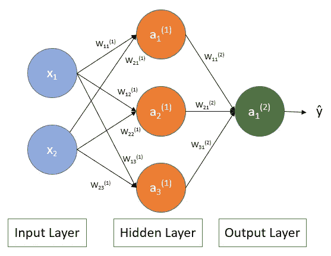
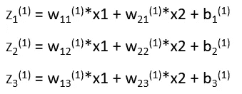
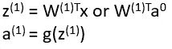
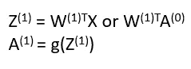
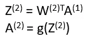
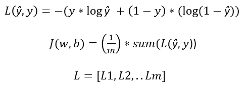
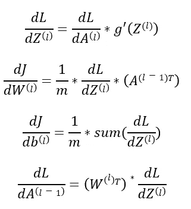
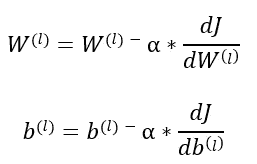
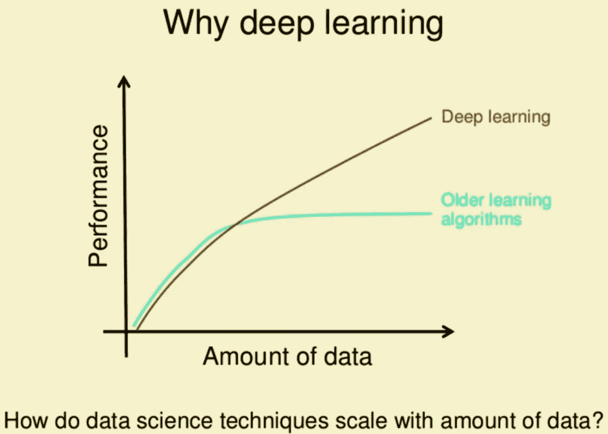

# 神经网络和深度学习

> 原文：<https://medium.com/analytics-vidhya/neural-networks-and-deep-learning-b747eb9debb8?source=collection_archive---------21----------------------->

我最近在 Coursera 上完成了深度学习专业化的第一门课程。我想写一些我学到的关于神经网络的东西。

**目录:**

1.  什么是神经网络？
2.  神经网络表示
3.  正向传播
4.  反向传播
5.  深度学习为什么会腾飞？

**1。什么是神经网络？**

这是一种机器学习技术，它使用一个功能网络来学习高维空间中数据的**映射以及**分类器**(或回归器)。神经网络具有分层结构，其中每一层从前一层获取输入，并使用非线性激活函数对其进行转换。**

**2。神经网络表示:**

两层神经网络

在上图中，我们有一个 2 层神经网络(在计算层数时不考虑输入层)。输出层将给出模型的最终预测(在二进制分类器的情况下，类 1 的概率)。输入层和输出层之间的所有层都称为隐藏层。每个连接都有一定的权重。神经元使用这些权重来计算输入的加权和，并应用激活函数(sigmoid、tanh、relu 等。)来生成它们的输出。

我们知道了神经网络的样子，现在我们将试着理解它是如何工作的。

**3。正向传播**

前向传播指的是中间变量如 a1、a2 等的计算和存储。我们为算法提供输入特征、权重和偏差，然后使用前向传播来计算每一层的输出。以下是 1 个训练示例的向前传球的数学版本。

**对于第一层:**

a1 = g(z1)，a2 = g(z2)，a3 = g(z3)，其中 g 是激活函数。

如果我们把上面的方程放入矩阵形式，它们看起来会像这样，每行代表一个神经元。

其中 Z 是所有 z1、z2、z3 的 3×1 列向量，W 是 2×3 权重矩阵，X 是 2×1 输入特征向量。

如果我们一次获取完整的训练数据(m 个训练示例)，正向传播将如下所示。现在，Z1，A1，A0 将分别是 3Xm，3Xm，2Xm 矩阵。

类似地，对于第二层，

前向传播将为给定的一组权重和偏差生成输出。但是，如何选择一组最佳的参数呢？

**4。反向传播:**

任何机器学习算法的主要目标都是最小化错误。为此，我们可以使用梯度下降来更新学习参数，如权重和偏差。这种为神经网络中的每一层更新参数的方法是使用反向传播来完成的。它被称为反向传播，因为我们从最后一层开始更新参数，并向后移动到第一层。

让我们用逻辑回归的损失函数来理解二元分类器

这里，L(yhat，y)是损失函数，J(w，b)是成本函数。损失函数 wrt Z，W，b 和 A 的梯度为

其中所有的 *d/dx* 都是偏导数。

我们将如下更新权重

其中，α是学习率。

我们多次重复这个更新权重的过程，直到我们将误差减小到期望的阈值。

**5。深度学习为什么会腾飞？**

如上图所示，深度学习的性能随着数据量的增加而增加，而传统的机器学习算法在某个点之后不会随着数据的增加而提供那么多的提升。因此，在这个大数据时代，有了 GPU，我们能够比 20 年前更快地训练深度学习模型。还有，已经做了很多工作来改进深度学习算法，使它们运行得更快。

谢谢你阅读它。:)