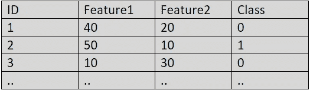
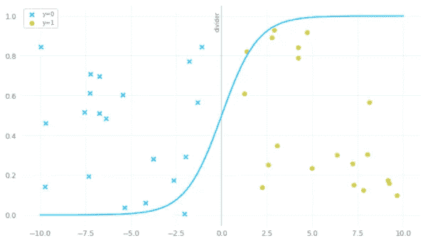
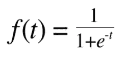
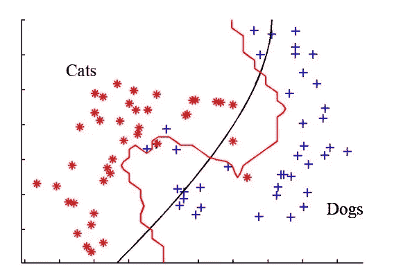
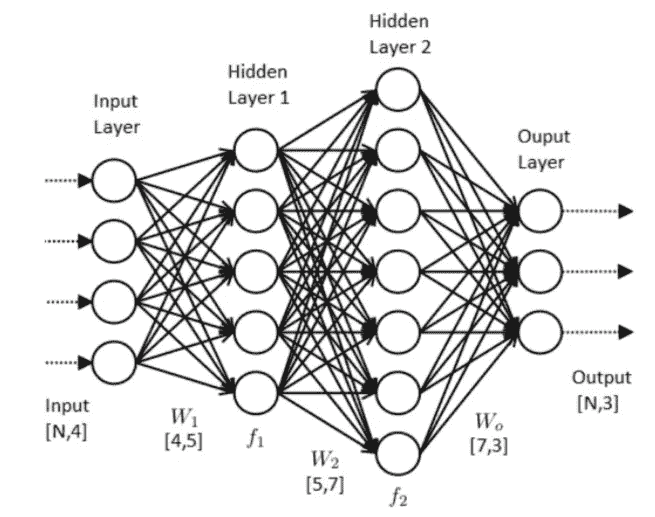
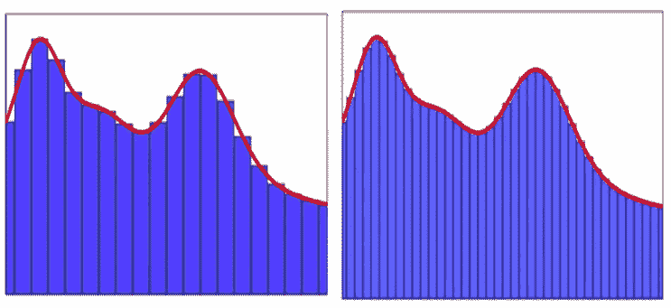
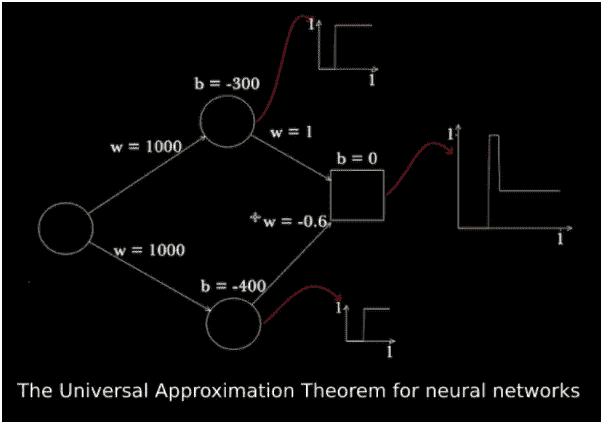

# 神经网络和通用逼近定理的力量。

> 原文：<https://medium.com/analytics-vidhya/neural-networks-and-the-power-of-universal-approximation-theorem-9b8790508af2?source=collection_archive---------14----------------------->

我们都听说过神经网络，以及它如何能够学习任何复杂的功能。但让我告诉你，这不是真正的魔法，而是一些很酷的算法和定理的组合，它们设法复制人类水平的准确性。

## 在本文中，我们将逐层深入，了解幕后发生的事情。

## **问题陈述**

我们来举一个二进制分类的问题陈述。假设给你一个数据集，其中给你一些特征，根据这些特征，你必须判断一个人是否患有癌症(1 类)或没有(0 类)。

二元分类数据集

**任务**

现在我们的任务是找到一个函数，它可以将我们的特征映射到我们的类，也就是说，我们在函数中输入我们的特征，它应该会给出我们的类。让我们绘制并查看我们的数据以及哪些功能可以帮助我们。

使用 Sigmoid 的二元分类

在上图中，我们可以看到我们的数据不是线性可分的，即 **y = w1*x +b** 不会有太大帮助。这就是我们使用 sigmoid 函数引入非线性的原因，该函数由下式给出

Sigmoid 函数公式

当我们通过这个 sigmoid 函数传递数据时，我们会得到一条类似于上图中的曲线，我们可以使用超参数调整来调整 sigmoid 函数的形状，即通过调整权重和偏差的值(分别为公式 y = w*x + b 中的 w 和 b)。

**现实来袭**

但是，通过查看数据，我们就能知道什么函数会对我们有帮助，真的这么简单吗？实际上，在现实世界的问题中，我们看到的数据要复杂得多，有许多特征和类，而更复杂的是预测用于在类中分隔它们的函数。让我们看看一些数据，看看为什么我们需要神经网络。

仅仅通过看上面的图，我们无法判断哪个函数可能对我们有帮助，以及我们如何得到一些锯齿形函数来区分这两个类。

现在该怎么办？

**神经网络拯救**

具有两个隐含层的神经网络

所以神经网络什么也不是，而是一个神经元的网络，每个神经元试图学习一个简单的功能，在这些简单神经元的帮助下，网络试图学习一个非常复杂的功能。

在上面的图像中，我们可以看到有 4 个输入特征(输入层)，每个输入通过隐藏层中的每个神经元，其输出通过下一层，最后我们有一个输出层，有 3 个输出神经元(即 3 个类)。

现在，世界已经知道了神经网络的力量，以及它们在学习这些复杂功能方面有多好，但是这些网络内部究竟发生了什么，为什么它们这么好。答案很复杂，但也很简单。

# 通用逼近定理

**根据维基百科**

> 在人工神经网络的数学理论中，**通用逼近定理**是在感兴趣的给定函数空间内建立算法生成的函数类的密度的结果。通常，这些结果涉及前馈结构在两个欧几里得空间之间的连续函数空间上的逼近能力，并且该逼近是关于紧收敛拓扑的。

我花了大约两天时间来理解上面的定义。所以现在，我们试着用一个故事来理解它。

假设你是一个泥瓦匠(想象一下就好)，给你一个盖房子的任务。

现在，既然你是资深泥瓦匠，你就有了自己的团队。现在你要做的不是专注于房子，而是将建造房子的任务分成更小的子任务，比如打地基、砌墙、建屋顶，最小的子任务是砌砖，现在根据房子的设计，你可以修改这些简单的子任务。

你一定在想这个梅森的故事如何帮助我揭开神经网络的神秘面纱，但这就是神经网络正在做的事情。

让我们用一个情节来得到它

通用逼近定理

我们知道，我们无法说出用红色绘制图表(图 4)的合适函数，因为这非常复杂(就像我们的房子)。但是我们知道如何绘制条形图，我们可以尝试调整这些条形图的高度和宽度，使它们非常接近我们的实际功能。我们还可以看到，通过增加条形图的数量，我们能够逼近更多的值(这并不是每次都有效)。

现在下一个问题出现了，我们如何得到这些条形图。让我们看看

记住我们有一个 sigmoid 函数，我们可以通过调整权重和偏差来调整它的形状。在上面的图像中，我们有一个单一的特征，现在我们将这个特征传递给 2 个神经元(每个神经元都有自己的权重和偏差),并为每个形状略有不同的神经元获得一个 sigmoid 图。在最后一层，我们将这两个神经元的输出传递给另一个神经元(它结合了这两个神经元的结果),后者提供了稍微复杂一点的功能。现在，如果我们有更多的层和每层中更多的神经元，而不是只有两个神经元和一个层，那么我们将能够更接近地逼近所需的函数，这是通用逼近定理如何在幕后起作用的基础。

**还有一些你可以自己尝试和探索的东西，它们超出了本文的范围。**

1)除了 sigmoid，还有哪些激活功能可以使用？

2)我们如何知道每个神经元使用什么样的权重和偏差？

3)我们如何知道我们离所需功能有多近？