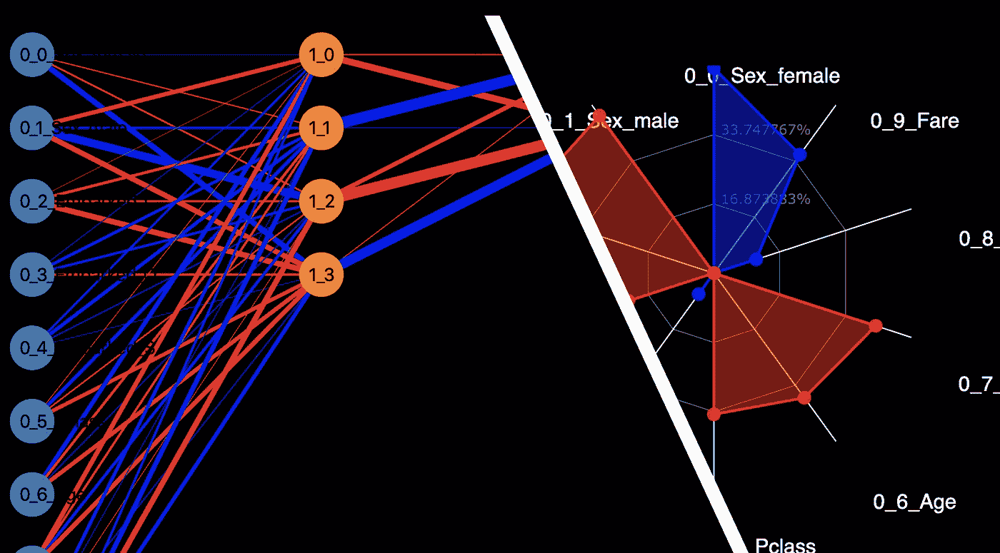

# 用于数据分析的神经网络

> 原文：<https://medium.com/analytics-vidhya/neural-networks-for-data-analysis-b3c4c5ef87a0?source=collection_archive---------4----------------------->

## 神经网络不仅仅是为了机器学习。你也可以用它来进行数据分析。

用于数据分析的神经网络(图片由作者提供)

神经网络通常由数据科学家用于机器学习，并被视为黑盒。

然而，在这个故事中，我将展示你可以使用神经网络以非常有效的方式从数据到见解。还有…