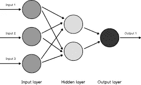
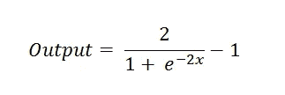
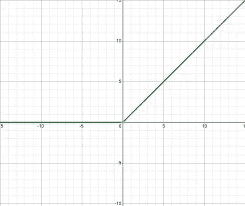

# 简而言之就是神经网络。

> 原文：<https://medium.com/analytics-vidhya/neural-networks-in-a-nutshell-bb013f40197d?source=collection_archive---------8----------------------->

艾莉娜·格鲁布尼亚克在 [Unsplash](https://unsplash.com?utm_source=medium&utm_medium=referral) 上的照片

我将尽我最大的努力呈现一个关于神经网络如何工作的透明视图，这样到本文结束时，你可能会对这个主题有一个扎实的了解。

> 关注神经网络的理由

因为机器学习算法现在被递归地用于预测各种情况，如癌症、股票等。神经网络项目的数量正以指数速度增长。我们也可以说，神经网络位于革命性机器学习项目的核心。

*让我们了解一下他们*

人工神经网络受到生物神经网络的启发。

就像生物神经网络一样，人工神经网络也在不断地学习和更新它的知识，以及基于它所遇到的经验对环境的理解。

人工神经网络只是一组数学算法，它们一起工作以对输入执行操作。这些操作然后产生一个输出。

因此，这些数学上相互关联的公式被称为人工神经网络(ANN)。

神经网络可以帮助我们理解复杂数据结构之间的关系。神经网络可以使用经过训练的知识对复杂结构的行为进行预测。他们可以处理图像，甚至做出复杂的决定，比如如何驾驶汽车，或者下一步进行哪项金融交易。

虽然神经网络可能很复杂，可以解决复杂的问题，但它们比大多数机器算法都要慢。他们也可能最终过度拟合训练数据。

> 它是如何工作的？

让我们回顾一下这个神经网络

神经网络可以包含多个层。上面所示的人工神经网络有 5 层:

1.  一个输入层
2.  一个输出层
3.  三个隐藏层

忽略第 n 个输入，总共有 12 个神经元:

1.  2 个输入神经元
2.  9 个隐藏神经元—每个隐藏层中有 3 个神经元
3.  2 个输出神经元

这是一个前馈神经网络，因为数据只在一个方向上流动，从输入层到输出层。

*   每个神经元通过突触与另一个神经元相连。
*   每个神经元从一个或多个神经元接收输入，以及权重和偏差，我稍后会详细解释。

> 什么是神经元？

神经元是一个容器，它包含一个被称为**激活函数的数学函数、**输入(x1 和 x2)、一个权重向量(w1，w2)和一个偏差(b)。

神经元首先计算输入的加权和。

将激活函数视为一种数学运算，它将输入归一化并产生一个输出。然后输出被向前传递到下一层的神经元上。

> 了解神经网络层

总会有一个输入和输出层。在一个神经网络中，我们可以有零个或多个隐藏层。*神经网络的学习过程是用层来执行的。*需要注意的关键是，神经元是分层放置的，每层都有其用途。在神经网络的每一层中，神经元执行相同的功能。它们只是计算输入和权重的加权和，加上偏差并执行一个激活函数。

> 让我们分别理解每一层

> **输入图层**

输入层负责接收输入。神经网络中必须始终有一个输入层。

输入层接收输入，通过其神经元执行计算，然后将输出传输到后续层。输入层接受输入。输出层产生最终结果。

> **输出层**

输出层负责产生最终结果。神经网络中必须始终有一个输出层。

输出层接收从它之前的层传入的输入，通过它的神经元执行计算，然后计算输出。

在具有多个隐藏层的复杂神经网络中，输出层接收来自前一个隐藏层的输入。

> **隐藏层**

隐含层的引入使得神经网络优于大多数机器学习算法。隐藏层位于输入和输出层之间，这是它们被称为*隐藏*的主要原因。“隐藏”一词意味着它们对外部系统不可见，对神经网络是“私有的”。

在一个神经网络中可以有零个或多个隐藏层。

神经网络中的隐藏层数越多，神经网络产生输出所需的时间就越长，并且神经网络可以解决的问题就越复杂。

神经元简单地计算输入和权重的加权和，加上偏差并执行激活函数。

> **激活功能**

激活函数只不过是一个接受输入并产生输出的数学函数。当计算结果达到指定阈值时，该功能被激活。这种情况下的输入是加权和加偏差:

并且阈值在函数中预定义。激活函数的这一本质会给输出增加非线性。随后，激活函数的这一特性使得神经网络能够解决非线性问题。非线性问题是那些输入和输出之间没有直接线性关系的问题。

为了处理这些复杂的情况，引入了许多可以在输入端配置的激活功能。

让我们回顾一些常见的激活功能。在我们深入研究每个激活函数之前，请看一下这个表。我正在演示五个最著名的激活函数的值是如何不同的，我将详细解释。

*每个激活功能都有自己的公式，用于转换输入。*

> 线性激活函数:

激活函数只是用一个因子来缩放输入，这意味着输入和输出之间存在线性关系。

这是数学公式:

**产量= Y*X**

> 乙状结肠激活功能:

乙状结肠激活函数是“S”形的。它可以向输出添加非线性，并返回二进制值 0 或 1。

> Tanh 激活功能:

Tanh 是 sigmoid 激活函数的扩展。因此，Tanh 可以用来增加输出的非线性。输出在-1 到 1 的范围内。双曲正切函数移动 sigmoid 激活函数的结果:

> 校正线性单位激活函数(RELU)

RELU 是最常用的激活函数之一。在隐藏层中最好使用 RELU。这个概念非常简单。它还会增加输出的非线性。但是，结果的范围可以从 0 到无穷大。

> Softmax 激活功能:

Softmax 是 Sigmoid 激活函数的扩展。Softmax 函数增加了输出的非线性，但是，它主要用于可以计算多类结果的分类示例。

激活函数将输入标准化，并产生从 0 到 1 的值范围。

*权重和偏差可以改变神经网络的运行方式。*

> 什么是偏见？

偏差只是一个常量值(或常量向量),加到输入和权重的乘积上。利用偏差来抵消结果。

该偏置用于将激活函数的结果向正侧或负侧移动。

> 什么是重量？

权重可能是神经网络最重要的概念。当输入在神经元之间传输时，权重被应用于输入，并与偏差一起传递到激活函数中。权重本质上反映了输入的重要性。

当在训练集上训练神经网络时，它用一组权重进行初始化。然后在训练期间优化这些权重，并产生最佳权重。

权重是你试图求解的方程的系数。负权重会降低产出的价值。

> 学习率:

学习率决定了我们想要更新权重的速度。学习率越低，优化算法达到局部极小点和收敛的时间越长。另一方面，如果学习率很大，那么它可能永远不会收敛并达到局部最小点。因此，需要正确的平衡。

在优化算法中使用学习率来更新权重。

> 纪元:

历元是学习算法的输入参数之一。认为 epoch 有一个循环。它决定了学习算法更新权重的次数。

如果 epoch 的值为 1，则意味着训练集中的每个数据集将被送入神经网络以更新权重。

如果时期是 5，则意味着将有 5 个循环。

> 损失和准确性:

损失函数也称为成本函数。他们计算误差值。

准确地说，成本函数是损失函数的平均值。这是优化算法试图最小化的函数。有大量的损失函数可用，如均方误差，二元交叉熵等。

损失函数本质上告诉神经网络它需要执行什么动作来提高精度。优化器利用这些信息来产生准确的权重。

神经网络然后可以向前传播输入数据。

> 正向传播:

正向传播过程也称为推理。这是最简单的神经网络形式，它接受输入，处理它们，并把它们传递给随后的层；一直到输出层的神经元。

每个神经元将权重与偏差一起应用于输入，并计算适当的激活函数。

> 反向传播:

反向传播采用预测值和实际值之间的差异来进一步增强权重。

首先，计算误差值相对于每个重量的偏导数。导数是指斜率的梯度，从最后一层开始计算。然后，导数用于计算前一层的*梯度*，然后重复该过程。对每一层中的每个重量重复该过程。

从*误差值中减去*权重值*的值，以确保精度得到提高。注:误差值是预测值和实际值之间的差值。*

当我们从最后一层向后移动到第一层时，这个过程被称为反向传播。它还可以将漏失应用到权重。

> 辍学:

Dropout 用于将权重设置为零。这个过程将权重随机设置为 0，从而增强了网络的预测。

**希望这篇文章有所帮助。**