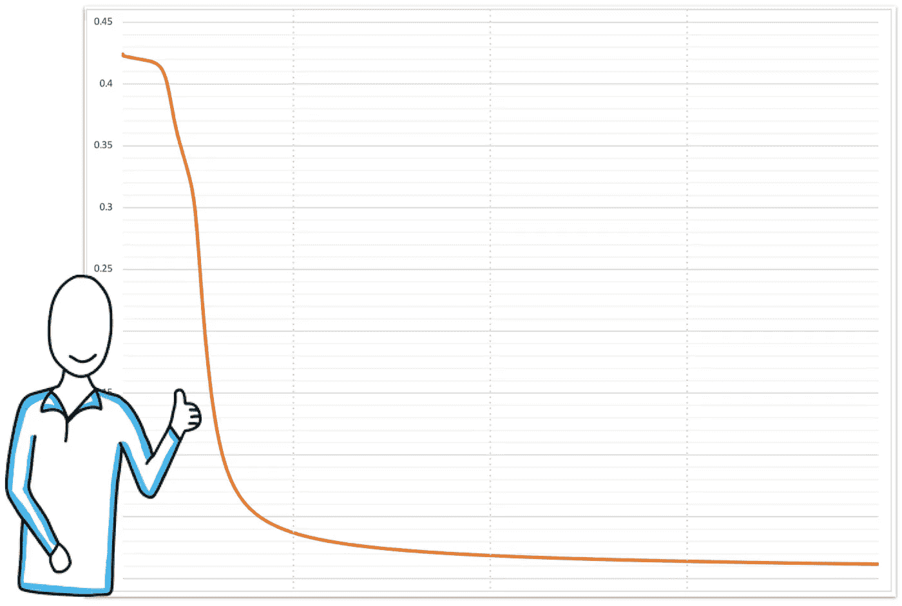

# 什么是神经网络？

> 原文：<https://medium.com/analytics-vidhya/neural-networks-in-a-nutshell-with-java-b4a635a2c4af?source=collection_archive---------4----------------------->

最强大和最广泛使用的人工智能方法之一叫做**神经网络**。但是，它们到底是什么呢？它们是如何工作的？让我用简单的英语解释一下。

# 什么是神经网络？

神经网络是被称为**神经元**的连接节点的集合。

# 什么是神经元？

神经元是一个节点，它有一个或多个**输入**和一个**输出**，如图 1 所示。神经元内部发生三种行为:

*   权重与每个**输入**相关联，以放大或去放大它；
*   将所有加权输入相加；
*   总和被用作确定最终输出的**激活功能**的输入。

图一。神经元就像一个等式——它将权重与每个输入关联起来，然后将加权输入相加并应用激活函数来计算输出。

# 什么是激活函数？

激活函数是一个数学方程，它为小输入输出一个小值，如果输入超过**阈值则输出一个大值。**常用激活函数的一个例子是图 2 所示的 **sigmoid 函数**。

图二。sigmoid 函数通常用作神经元的激活函数。

这个想法很简单:接近零的输入值将导致输出的显著变化，而太大或太小的输入值将导致最小的差异。

# 神经元是如何连接的？

一个神经元的输出可以用作其他神经元的输入。通常，神经元聚集成**层**。层是一个通用术语，适用于在神经网络内特定深度一起工作的节点的集合。输出从第一层传播到最后一层。如图 3 所示，通常有一个**输入层**，一个或多个中间层(称为**隐藏层**，以及一个**输出层**。

*   输入图层仅包含数据。那里没有正常工作的神经元。
*   隐藏层是学习发生的地方——稍后，我们将回顾如何发生。
*   输出层包含计算最终输出的神经元。

图 3。一种神经网络，在输入层有两个输入，两个隐藏层，在输出层有一个神经元。

输入和输出神经元的数量取决于手头的问题。隐藏神经元的数量往往是输入和输出神经元的总和，但不是规律。

# 它们是如何工作的？

神经网络帮助我们对信息进行分类。它们通过处理例子来训练(学习)，每个例子包含一个已知的*输入*和*输出*。**训练过程**的目标是计算与每个神经元中每个输入相关的权重值。一旦我们训练了神经网络，即我们计算了所有权重的权重，我们就可以使用神经网络将新的看不见的输入映射到输出。

# 例子

神经网络的 Hello-World 示例通常是实现一个神经网络来识别 XOR 运算符。这个神经网络有

*   两个输入，
*   一个输出，以及
*   我们将使用一个具有三个神经元的隐藏层——正如推荐的，输入和输出神经元的总和。

我们的神经网络如图 4 所示，我们将使用输入数据来训练网络和已知的输出。

图 4。我们的神经网络用于计算 XOR 运算符。

## 第一步。初始化权重和偏差

神经网络的第一步是初始化权重。我们有什么选择？

*   只用零初始化——这不是一个好策略😳。请记住，权重将乘以输入，因此当权重等于零时，输入不再起作用，神经网络无法正常学习。
*   **随机初始化权重**–这有点天真，但除了在少数情况下，它经常工作得很好。让我们在例子中使用这种方法。
*   高级策略可用。

因此，我们将用随机值初始化神经网络中的九个权重值。

## 第二步。正向传播

这是一个为网络提供一个输入并观察输出的花哨名称。我们从输入层开始，计算隐藏层的输出。结果被向前传递到下一层。然后，我们使用隐藏层的输出作为输入来计算输出层的输出。图 5 显示了数学。这只是线性代数。就是这样。

图 5。计算每个神经元的输出，从输入层开始向前移动；使用一层神经元的输出作为下一层神经元的输入。

## **第三步。计算误差**

**误差**计算为已知输出和计算出的输出(本例中为输出₃)之间的差值。误差值通常是平方的，以消除负号，并对较大的差异给予更大的权重。除以 2 并不影响计算，而且有助于以后使求导更简单。

图 6。误差计算为已知输出和计算的输出之间的差值。

如果神经网络在输出层中有一个以上的节点，则误差计算为所有部分误差的总和。

## **第四步。反向传播**

由于我们使用随机值作为权重，我们的输出可能会有很高的误差。我们需要减少误差。减少误差的唯一方法是改变计算值。并且，改变计算值的唯一方法是通过**修改权重**的值。权重的适当调整确保了随后的输出将更接近预期的输出。重复这个过程，直到我们对网络能够产生与已知输出足够接近的结果感到满意。

如何修改权值以减少误差？

简单回答:使用**梯度下降算法**。它是在 1847 年首次提出的。它应用多变量微积分，特别是**偏导数**。误差函数相对于每个权重的**导数用于调整权重值。误差函数的导数可以乘以一个选定的数(称为**学习率**，以确保新的更新权重最小化误差函数。学习率是一个很小的正值，通常在 0.0 到 1.0 之间。**

为了计算权重的偏导数，我们需要误差函数的**导数和 sigmoid 函数的**导数。**图 7 显示了权重更新的一般方程，以及求解权重 W₆方程的一个示例——输出层中神经元的第一个输入的权重。**

应用微积分链规则原理计算复合函数的导数。请注意，对于输出层中的神经元和隐藏层中的神经元，计算是相似的，但并不相同。

图 7。等式至:更新权重值(红色)、误差和误差导数(灰色)以及计算输出(sigmoid 函数)导数。

因此，我们从随机权重值开始，然后:

*   我们使用图 5 中的数学计算所有神经元的输出(正向传播)以及计算输出和已知输出之间的差异(误差)。
*   如果差异大于我们的预期，我们计算新的权重值(反向传播)。

这两个活动重复进行，直到我们将误差降低到可接受的值。一个 ***可接受的*** ***误差*** 可以是 0 到 0.05 之间的任何值。

# 编写示例代码

让我们看看上面描述的四个步骤在代码中是怎样的。我们要用 Java 实现一个简单的神经网络。我不想重新发明轮子；只需展示具体细节，就能理解事情是如何运作的。

首先，属性:

*   定义我们将使用的学习率的常数值；
*   三个变量来存储每层中的节点总数—我们将创建一个神经网络，其中两个节点在输入层，三个在隐藏层，一个在输出层。
*   存储权重值、偏差值和每个神经元输出的三个数组。

我们将创建一个具有六个节点的神经网络，我们将需要九个权重和四个偏置值用于隐藏和输出层节点。

图 8。SimpleNeuralNetwork.java-类中的属性

## 第一步。初始化权重和偏差

我们可以使用构造函数来初始化数组，并将初始值放入权重和偏差中。记住，最初，它们只是随机值。第 11 行和第 13 行进行初始化。

图 9。SimpleNeuralNetwork.java——建造商

## 第二步。正向传播

我们需要求解图 5 所示的方程。因此，让我们为此创建一个方法。请注意，输入被作为节点处理(在输入层)，但它们不计算这些节点的输出值。我们计算隐藏层节点和输出层节点的输出。通过将权重值乘以输入值，将它们相加，然后应用激活函数来计算输出。我们使用 sigmoid 作为激活函数，我们创建一个 sigmoid 方法只是为了保持关注点的分离。注意这里的 complex，基本上是图 5 中描述的线性代数的实现。我们将对每一组输入值运行此操作，因此，它将对{0，0}、{0，1}、{1，0}和{1，1}运行 4 次

图 10。SimpleNeuralNetwork.java—前向传播，即计算隐层和输出层中每个神经元的输出

## 第三步。计算误差

在我们的例子中，输出层只有一个神经元，误差计算非常简单。但是，让我们通过创建一个可用于输出层中的一个或多个神经元的实现来概括我们代码中的思想。这个实现如图 11 所示。

图 11。SimpleNeuralNetwork.java—误差计算

## 第四步。反向传播

最后，让我们创建学习部分——一个实现负责更新权重值的数学的方法。多元微积分就住在那里。此方法针对每一组已知的输出值运行，因此，它将针对{0.0}、{1.0}、{1.0}和{0.0}运行 4 次。

图 12。SimpleNeuralNetwork.java-反向传播，即计算所有神经元中权重和偏差值的新值

我们有所有的零件；是时候将它们放在一起并运行我们的实现了。看一看我们类的 *main()* 方法，作为总结:

*   训练数据(输入和已知输出)用两个数组表示。
*   创建的神经网络对象有两个输入，三个节点位于隐藏层，一个节点位于输出层。
*   向前传播、误差计算和向后传播运行 10，000 次。

图 13。SimpleNeuralNetwork.java—主要方法

最后，让我们试试我们的神经网络。经过 10，000 次迭代后，我们的神经网络是活跃的，并以可接受的性能工作。图 14 显示了错误率是如何降低的。X 轴代表迭代次数(0 到 10，000)，Y 轴是在图 13 所示的 *main()* 方法的第 18 行和第 23 行中计算的均方误差。

图 14。每次迭代的错误。总共运行 10，000 次迭代。误差从 0.4242 下降到 0.0116

对于大约 100 行代码来说还不错(你可以从我的 [GitHub 库](https://github.com/javiergs/Medium/blob/main/NeuralNetwork/BasicNeuralNetwork.java)下载完整的源代码)。然而，我们可以使用库用大约 10 行代码完成同样的工作。其中一个这样的库是[**Eclipse deep learning 4j**](https://deeplearning4j.org/)**，**一个为 Java 编写的开源、分布式深度学习库。我们可以使用一个库来解决更复杂的问题，例如训练一个用于图像分类的神经网络。输入将增加，训练数据集将更加重要(比我们的四行 XOR 更重要)，并且我们将需要不止一个隐藏层。但那是另一个故事了。感谢阅读。请在下面留下您的反馈和评论。

# 参考

你想了解更多细节吗？在此回顾 sigmoid 函数的[导数；这里复习一下微积分中的](https://www.anotsorandomwalk.com/first-derivative-of-the-sigmoid-function/)[链式法则](https://en.wikipedia.org/wiki/Chain_rule)；在这里回顾一下[渐变后代](https://en.wikipedia.org/wiki/Gradient_descent)的定义；这里详细描述了反向传播背后的数学原理。