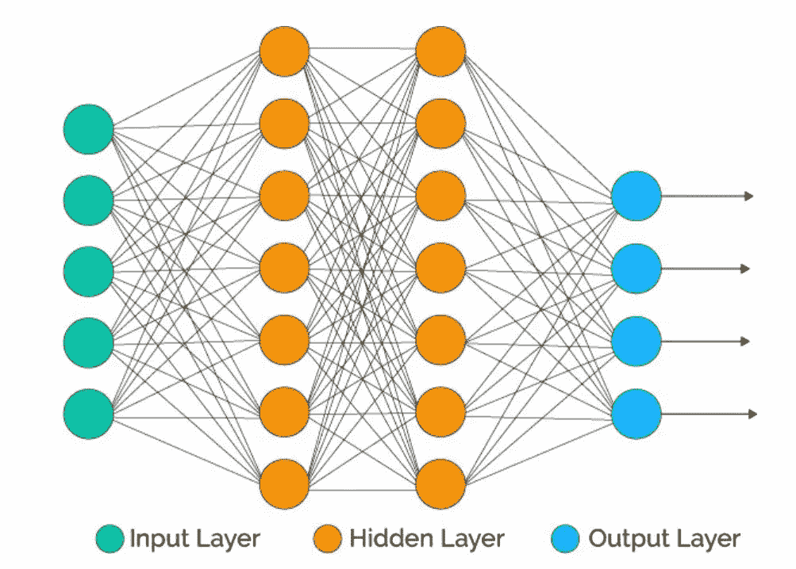
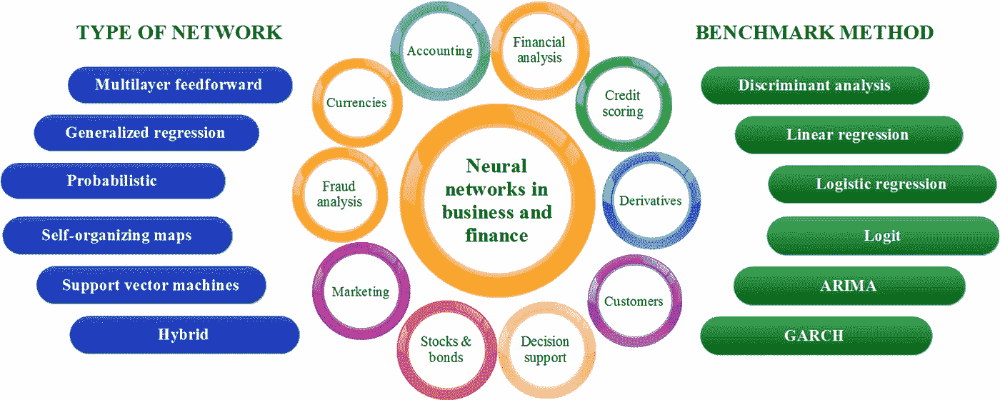

# 日常生活中的神经网络

> 原文：<https://medium.com/analytics-vidhya/neural-networks-in-everyday-life-ca2b7cb37052?source=collection_archive---------5----------------------->

# 什么是神经网络？？？

**神经网络**是一系列算法，通过模拟人脑运作方式的过程，努力识别一组数据中的潜在关系。这意味着神经网络能够像人类一样学习和处理数据。因此，需要大量数据来帮助这些神经网络学习东西，并需要大量资源来进行内部计算。他们可以适应不断变化的输入；因此，**网络**无需重新设计输出标准就能产生最佳结果。这些层包含许多用于处理数据的内部层。层次越深，输出效率越高。这些层通过两种方式接收数据，一种是处理输入数据，另一种是提高作为下一层输入的输出数据的效率。

# 什么时候使用神经网络？？？

当你有这么多数据(当然还有计算能力)时，你很可能会使用神经网络，而准确性对你来说是最重要的。例如，**癌症检测**。如果你想在实际的医疗应用中使用它，你不能在精确度上浪费时间。因此，知道何时使用神经网络以及用例中效率的**效果也很重要。**

# **日常生活中的神经网络！！！**

在日常生活中，神经网络正在接管大部分工作，从简单的物体检测到飞行中的高级自动驾驶。这些神经网络学习和预测结果的方式是最有效的，有时它在大多数活动中也比人类聪明。最重要的优点是这些神经网络是在计算机上实现的。所以他们从不懒惰或无聊地进行预测，所以他们可以是最快和最有效的。

> “我们刚刚看到神经网络/人工智能应用改变我们世界工作方式的开端。”

神经网络主要在解决各种商业管理技术中找到它们的用例。神经网络在现实世界中的商业应用正在蓬勃发展。在某些情况下，NNs 已经成为使用分析、营销和欺诈检测的企业的首选方法。神经网络和人工智能有着令人难以置信的范围，你可以用它们来帮助人类在任何领域的决策。神经网络领域及其对大数据的使用可能是复杂和高科技的，但其提高效率的最佳方式和最终目的是为人们服务。

# **数据挖掘中的神经网络:**

数据挖掘是指从大量收集的数据中只使用所需的数据字段。神经网络甚至帮助我们预测对我们的结果更有影响的数据领域。因此，它可以增强我们利用现有数据做出决策的能力。

> 更实际地说，神经网络是非线性统计数据建模工具。它们可用于模拟输入和输出之间的复杂关系，或发现数据中的模式。使用神经网络作为工具，数据仓库公司在被称为*数据挖掘*的过程中从数据集获取信息。

人工神经网络(ANN)的能力属于非常广泛的类别，一些深度学习方法已经在某些任务上实现了人类竞争的性能。他们在中找到他们的用例；

*   模式识别(雷达系统、人脸识别、信号分类、物体识别等。)
*   系统识别和控制(例如，车辆控制、轨迹预测、过程控制、自然资源管理)
*   量子化学
*   玩棋盘和视频游戏以及决策
*   序列识别(如手势、语音、手写和印刷文本识别)
*   医疗诊断
*   定向机械手和假肢
*   金融(例如，自动交易系统)
*   数据挖掘技术
*   形象化
*   机器翻译
*   社交网络过滤
*   地球科学中的黑盒模型(水文学、海洋建模和海岸工程以及地貌学)

…以及更多。

**使用神经网络的公司:**许多公司正致力于在其服务中实现这些神经网络，以吸引客户使用他们的服务。下面列出了其中一些公司:

**ContractProbe** :它是一个自动的合同评审器。在线校对工具是为律师、公证人和其他每天处理多份法律文件的专业人士设计的。用户上传 PDF、Word 或纯文本格式的文档，不到一分钟就能阅读摘要报告。

该机制基于**人工神经网络，它可以识别上传文本中的模式**。他们接受了数千份已执行的保密协议、知识产权许可、独立承包商协议、雇佣合同和其他类型协议的培训。此外，人工智能“前端”正在进一步从 ContractProbe 处理的每个新文档中学习。

# Twitter——策划时间表

Twitter 最近一直处于众多争议的中心(尤其是备受嘲笑的圆每个人头像的决定和改变人们在@回复中被标记的方式)，但我们在 Twitter 上看到的更有争议的变化之一是[向算法供稿的转变](https://blog.twitter.com/engineering/en_us/topics/insights/2017/using-deep-learning-at-scale-in-twitters-timelines.html)。 **Twitter 的人工智能实时评估每条推文，并根据各种指标给它们“打分”**。

最终，Twitter 的算法会显示可能会推动最大参与度的推文。这是由个人决定的； **Twitter 的机器学习技术根据你的个人偏好做出这些决定**，从而产生算法化的订阅源，如果我们完全诚实的话，这有点糟糕。

# 苹果的 IWatch

苹果推出的手表是手表历史上最先进的手表，它可以确保你管理你的日常活动，进行全面的健康检查，包括血氧水平、自动睡眠跟踪、跌倒检测、心电图扫描等。

它甚至使用经过神经网络训练的高级算法，这些算法可以跟踪你的每次锻炼，并对数据进行分析，最终让你采取必要的行动。神经网络在这些类型的用例中起着至关重要的作用，并且还需要确保它们的效率处于最高水平，以便它们不会向消费者推荐错误的东西。

# 语音助手:

NNs 的另一大应用是语音助手。日常生活中的语音助手在经过训练的神经网络上工作，以帮助并给出你所要求的结果。

他们被训练去发现不同的俚语、口音和不同的意思，即使他们说的是同一个句子。他们接受了最高效率的培训，以确保交付正确的所需输出。

在商业中实施 NNs 已经看到了许多公司的业务发展的急剧上升，并最终使使用它们的人受益。

