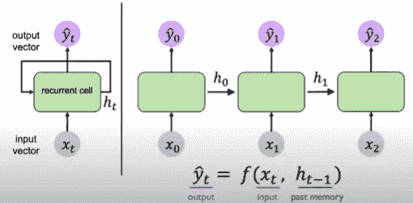
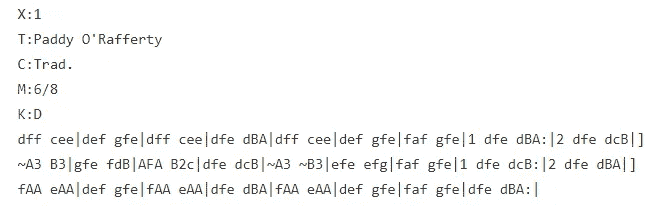
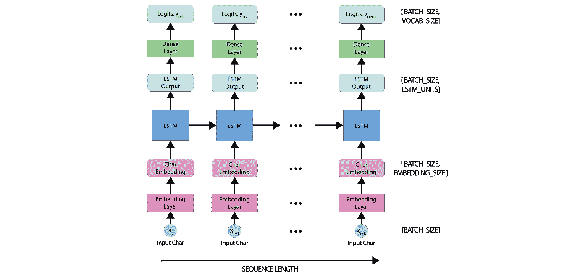
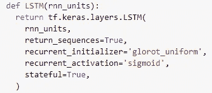
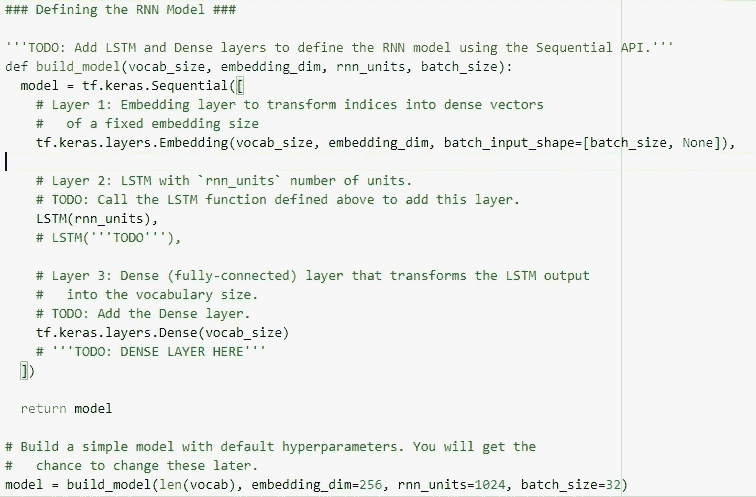
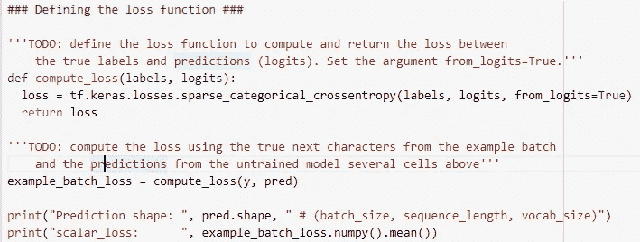
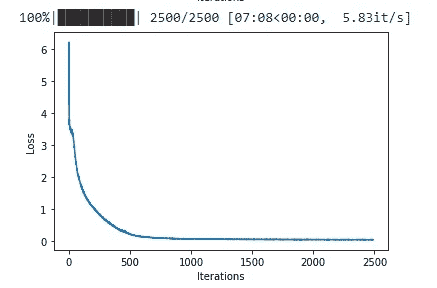
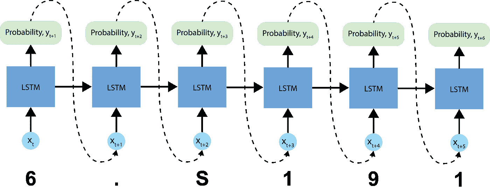

# 神经网络——RNN 和音乐的产生

> 原文：<https://medium.com/analytics-vidhya/neural-networks-rnns-and-music-generation-a1838dfa6472?source=collection_archive---------8----------------------->

深度学习是人工智能和机器学习的子集。它专注于使用“神经网络”来自动提取原始数据中的有用模式，然后使用这些模式来学习和执行特定的任务。

有神经网络的变体或选项之一是 RNN 氏症。RNN 模型(递归神经网络模型)是一种大部分时间用于自然语言处理、语音识别和合成的神经网络。

在一个普通的神经网络中，一个输入经过多层处理，产生一个输出，并假设两个连续的输入相互独立，但 RNN 增加了另一个参数:记忆。

> rnn 被称为递归的，因为它们对序列的每个元素执行相同的任务，输出依赖于先前的计算。考虑 rnn 的另一种方式是，它们有一个“存储器”，可以捕获到目前为止已经计算过的信息。理论上，rnn 可以利用任意长序列中的信息，但实际上，它们仅限于回顾几个步骤。[1]

RNN 检查网络在特定时间点正在做什么，以检查历史，并具有前瞻性，能够将信息传递到未来的时间点。它引入了作为单元状态“内部存储器”。这种记忆是由神经元维持的，它可以跨时间传递。然后我们有了神经元记忆和序列的递归关系。输出取决于过去的计算和学习过程(过去的记忆)。

这种 RNN 保持这种内部状态，随着序列的处理，这种内部状态在每个时间步被更新。递归关系定义了如何在时间步长上更新状态。单元状态由一组权重、输入和先前状态来定义。RNN 在处理序列的每个时间步都使用这个函数。

在这个项目中，我们创建了一个 RNN 模型，目标是创作一首音乐作品。我们训练了一个模型来学习 ABC 乐谱中的原始乐谱模式，然后使用这个模型来生成新的音乐。

ABC 符号是一种简写形式的音乐符号。它分为两部分:标题和注释。需要考虑的一件重要事情是，这种音乐符号不仅仅包含正在播放的音符的信息，还包含元信息，如歌曲名称、音调和速度。

ABC 符号中的歌曲示例

首先，请注意标题的每一行都以不同的字母开头，告诉您它包含的信息——第一行“X:1”只是一个参考数字(见下文),然后 T:开头的一行包含曲调的 **T** 标题，C:开头的一行包含 **C** 作曲家(在这种情况下，这是一个传统的名称——作曲家的名字已经在时间的迷雾中消失了)。在 abc-speak 中，这些线有时被称为**场**——你可能会听到人们谈论“T 场”或“C 场”——它们只是指**标题**或**作曲家。**

每个音符都被写成一个单独的字母，令人惊讶的是，字母 C 代表音符 C，D 代表 D，以此类推。大写字母 CDEFGAB 用于表示底部八度音阶(C 代表中间 C，在高音五线谱下方的第一个 leger 线上)，接着是顶部八度音阶的小写字母 cdefgab (b 是五线谱上方第一个 leger 线上的字母)。[2]

为了创建和训练 RNN 模型来生成新歌，我们使用 Tensorflow 和 Keras 库。使用三层来定义模型:嵌入层(输入层)、LSTM 层和稠密层(输出层)

LSTM 网络的定义

RNN 模式

现在是训练模型的时候了。我们可以看出这是一个标准的分类问题。给定 RNN 的先前状态，以及给定时间步长的输入，我们希望预测下一个字符的类别，也就是说，实际预测下一个字符。

为了在这个分类任务上训练我们的模型，我们可以使用一种形式的`crossentropy`损失(负对数似然损失)。我们将使用真实目标值`labels`和预测目标值`logits`来计算损失。

损失函数

为了使用经过训练的 RNN 模型生成一些音乐，我们必须给这个模型一些种子来启动它。一旦我们有了一个生成的种子，我们就可以使用训练好的 RNN 迭代地预测每个连续的字符。

2500 次迭代后的最终结果

## 预测程序

现在，我们准备编写代码来生成 ABC 音乐格式的文本:

*   初始化一个“种子”开始字符串和 RNN 状态，并设置我们想要生成的字符数。
*   使用起始字符串和 RNN 状态获得下一个预测字符的概率分布。
*   从多项式分布中抽取样本来计算预测字符的指数。这个预测的字符然后被用作模型的下一个输入。
*   在每个时间步，更新的 RNN 状态被反馈到模型中，因此它现在在进行下一次预测时有更多的上下文。在预测下一个字符后，更新的 RNN 状态再次反馈到模型中，这就是它如何学习数据中的序列依赖性，因为它从以前的预测中获得了更多信息。

用于训练模型的数据集是来自诺丁汉音乐数据库的一组圣诞歌曲，其中有诸如“野猪头”、“钟声颂歌”和“平安夜”的颂歌。

## 歌曲生成

这是 MIT 深度学习课程和 Alexander Amini 的一个项目，原始数据集来自爱尔兰民歌。

1.[http://www . wild ml . com/2015/09/recurrent-neural-networks-tutorial-part-1-introduction-to-rnns/](http://www.wildml.com/2015/09/recurrent-neural-networks-tutorial-part-1-introduction-to-rnns/)

2.[http://ABC notation . com/blog/2010/01/31/how-to-understand-ABC-the-basics/](http://abcnotation.com/blog/2010/01/31/how-to-understand-abc-the-basics/)