# 神经不经意决策集成(NODE) —一种针对表格数据的先进深度学习算法

> 原文：<https://medium.com/analytics-vidhya/neural-oblivious-decision-ensembles-node-a-state-of-the-art-deep-learning-algorithm-for-tabular-1cb6788c5212?source=collection_archive---------6----------------------->

深度学习为计算机视觉、自然语言处理、强化学习等领域的许多机器学习问题带来了革命。但是表格数据仍然牢牢地保留在经典的机器学习算法之下，即梯度推进算法(如果你感兴趣，我有一整个系列关于不同的[梯度推进算法](https://deep-and-shallow.com/2020/02/02/the-gradient-boosters-i-the-math-heavy-primer-to-gradient-boosting-algorithm/))。

直觉上，这很奇怪，不是吗？神经网络是通用逼近器，理想情况下，它们应该能够逼近函数，即使是在表格数据域中。或者他们可以，但是需要海量的数据来正确地学习这个功能？但是梯度增强树是如何做到这一点的呢？决策树的归纳偏向可能很适合表格数据域吗？

如果它们这么好，为什么我们不在神经网络中使用决策树呢？就像我们对图像有卷积运算，对文本有递归网络一样，为什么不能用决策树作为表格数据的基本构建块呢？

答案很简单——树是不可微的，没有流经网络的梯度，就像反向推进炸弹。但这是研究人员开始绞尽脑汁的地方。我们如何使决策树可区分？

# 可区分决策树

2015 年，Kontschieder 等人提出了深度神经决策森林，它具有类似决策树的结构，但可微分。

让我们后退一步，思考一下决策树。

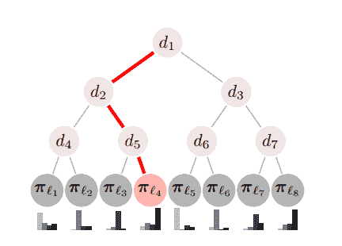

常规决策树(来源[1])

典型的决策树看起来像上面的图片。简单地说，它是一个集合的决策 nodes(dᵢ)和叶 nodes(πᵢ)，它们一起作为一个函数，y = ***F*** (θ，x)，其中 ***F*** 是决策树，由θ参数化，它将输入 x 映射到输出 y

我们先看叶节点，因为比较简单。在传统的决策树中，叶节点通常分布在类别标签上。这正好符合乙状结肠或软最大激活。因此，我们真的可以用 SoftMax 层替换叶节点，并使该节点可区分。

现在，让我们更深入地看看一个决策节点。决策节点的核心目的是决定是向左还是向右发送样本。姑且称这些决定为， *dᵢ和 d·ᵢ(读作 d·巴因缺乏乳胶支持而责备媒介)*。对于这个决定，它使用一个特定的特征( *f* )和一个阈值(*b*)——这些是节点的参数。

在传统的决策树中，这个决策是二元决策；不是右就是左，0 就是 1。但这是确定性的，不可微的。现在，如果我们放松这一点，使路由随机。它不是一个尖锐的 1 或 0，而是一个介于 0 和 1 之间的数字。这感觉像是熟悉的领域，不是吗？乙状结肠函数？

这正是 Kontschieder 等人提出的。如果我们将严格的 0–1 决策放宽到具有 sigmoid 函数的随机决策，则节点变得可微。

现在我们知道了单个节点(决策或叶节点)是如何工作的。让我们把它们放在一起。上图中的红色路径是决策树中的一条路径。在确定性版本中，样本要么通过这条路线，要么不通过。如果我们从概率的角度考虑相同的过程，我们知道，对于样本到达路径末端的叶节点的路径中的每个节点，样本进入路径的概率应该是 1。

在概率范例中，我们找到样本向左或向右( *dᵢ和 d·ᵢ*)的概率，并将沿着路径的所有概率相乘，以获得样本到达叶节点的概率。

样本到达突出显示的叶节点的概率将是(*d₁×₂×₅)*。

现在，我们只需要使用每个决策路径的概率来获取所有叶节点的期望值，以获得样本的预测。

现在你已经对如何在神经网络中使用类似决策树的结构有了直觉，让我们来谈谈节点模型。

# 神经遗忘树

遗忘树是一种对称生长的决策树。这些是树，相同的特征负责将学习实例分成树的每一层的左和右分区。 [CatBoost](https://deep-and-shallow.com/2020/02/29/the-gradient-boosters-v-catboost/) ，一个突出的梯度增强实现，使用了不经意树。遗忘树特别有趣，因为它们可以简化为一个具有 2ᵈ单元的决策表，其中 d 是树的深度。这非常简洁地简化了事情。

每个不经意决策树(ODT)输出一个 2ᵈ响应，其中 *d* 是树的深度。这是通过使用 *d* 特征-阈值组合来完成的，这些组合是 ODT 的参数。

形式上，ODT 可以定义为:

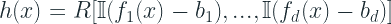

，其中 **I** 表示亥维赛函数(这是一个阶跃函数，0 表示负值，1 表示正值)

现在，为了使树输出可区分，我们应该替换分裂特征选择( *f* )和使用阈值的比较运算符( *b* )，而是它们的连续对应物。

在传统的树中，选择一个特征来分割节点是一个确定性的决定。但是对于可区分性，我们选择一种更软的方法，即特征的加权和，其中权重被学习。通常，我们会考虑选择 Softmax 而不是特征，但我们希望选择稀疏特征，即我们希望只对少数(最好是 1 个)特征做出决定。因此，为此，NODE 在可学习的特征选择矩阵上使用α-entmax 变换(Peters 等人，2019 年)

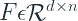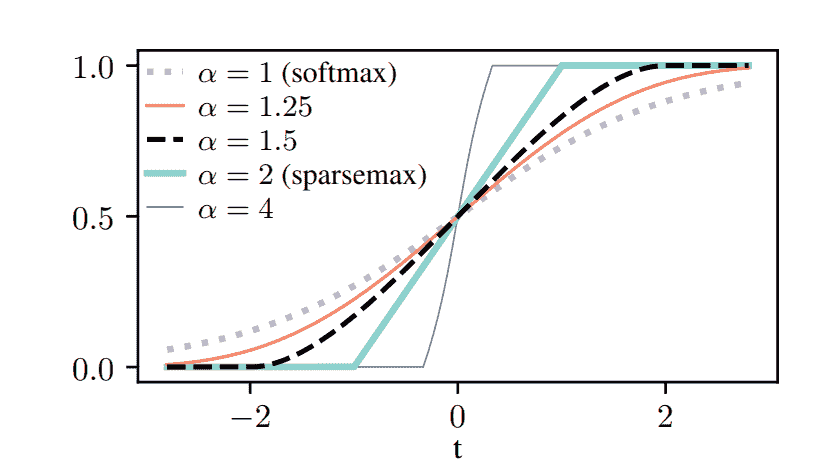

来源:[2]

类似地，我们将 Heaviside 函数放宽为两类 entmax。因为不同的特征可以具有不同的特征尺度，所以我们用参数τ来缩放 entmax

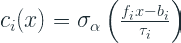

其中 *bᵢ* 和 *τᵢ* 分别是阈值和标度的可学习参数。

我们知道一棵树有两面，而到了 *cᵢ* ，我们只定义了一面。所以为了完成这个树，我们将 *cᵢ* 和 *(1-cᵢ)* 一个放在另一个上面。现在我们定义一个“选择”张量 ***C*** 作为所有树的外积:

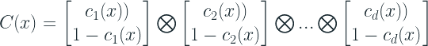

这给了我们选择权重，或者直观地，每个 2ᵈ输出的概率，在响应张量中。所以现在它简化为一个反应张量的加权和，由选择张量加权。

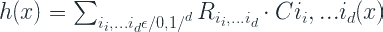

整个设置如下图所示:

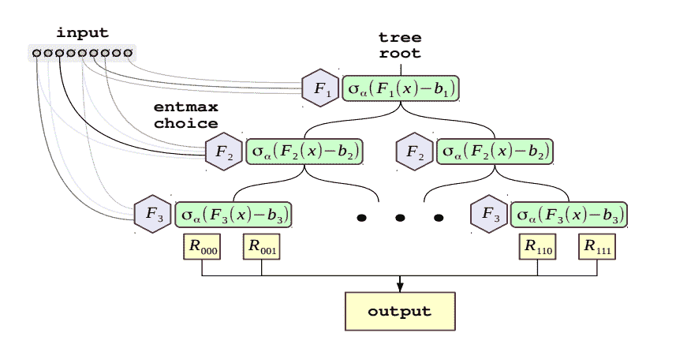

来自报纸[3]

# 神经遗忘决策集成

从一棵树跳到一片“森林”非常简单。如果集合中有 m 棵*树，最终的输出是 m 棵单独的树的连接*

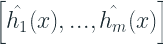

# 更深入地了解节点

除了开发核心模块(节点层)，他们还提出了一个深度版本，在这个版本中，我们将多个节点层堆叠在彼此之上，但具有剩余连接。所有先前层的输入要素和输出被连接起来，并馈入下一个节点层，依此类推。最后，对所有层的最终输出进行平均(类似于 RandomForest)。

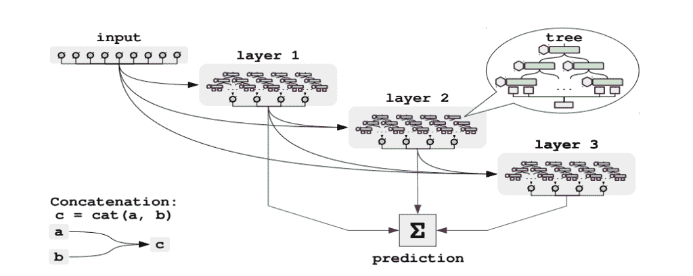

来自报纸[3]

# 培训和实验

# 数据处理

在论文的所有实验中，他们使用分位数变换将每个特征变换为遵循正态分布。这一步对于稳定的训练和更快的收敛非常重要。

# 初始化

在训练网络之前，他们建议进行数据感知初始化，以获得良好的初始参数。它们统一初始化特征选择矩阵( *F* )，而阈值( *b* )用随机特征值*fᵢ(x*初始化。天平 *τᵢ* 以这样的方式初始化，使得第一批中的所有样品都落在$latex 双侧 entmax 的线性区域内，因此得到非零梯度。最后，用标准正态分布初始化响应张量。

# 实验和结果

本文使用 Epsilon、YearPrediction、Higgs、Microsoft、Yahoo 和 Click 六个数据集进行了实验。他们将 NODE 与 CatBoost、XGBoost 和 FCNN 进行了比较。

首先，他们比较了所有算法的默认超参数。节点的默认架构设置如下:深度为 6 的 2048 棵树的单层。这些参数继承自 CatBoost 默认参数。

然后，他们调整所有的算法，然后进行比较。

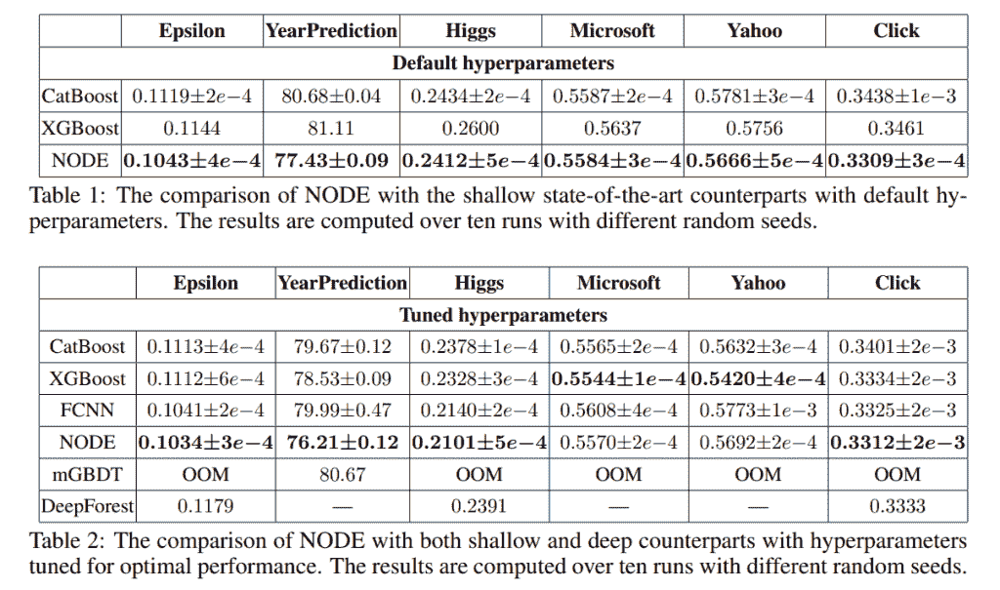

对照表(来源:[3])

# 代码和实现

作者在 PyTorch [这里](https://github.com/Qwicen/node)的一个现成模块中提供了实现。

它也在我发布的新库 PyTorch Tabular 中实现，以及其他一些用于表格数据的算法。请点击这里查看:

*   [PyPi](https://pypi.org/project/pytorch-tabular/)
*   [Github](https://github.com/manujosephv/pytorch_tabular)
*   [文档](https://pytorch-tabular.readthedocs.io/en/latest/)

# 参考

1.  页（page 的缩写）Kontschieder，M. Fiterau，A. Criminisi 和 S. R. Bulò，“深度神经决策森林”， *2015 IEEE 计算机视觉国际会议(ICCV)* ，第 1467–1475 页，doi: 10.1109/ICCV.2015.172
2.  Ben Peters，Vlad Niculae，André F. T. Martins，“稀疏序列到序列模型”， *2019 年计算语言学协会(ACL)第 57 届年会论文集*，第 1504–1519 页，doi:10.18653/v1/P19–1146。
3.  塞尔戈·波波夫，斯坦尼斯拉夫·莫罗佐夫，阿尔特姆·巴本科，“用于表格数据深度学习的[神经不经意决策集成](https://arxiv.org/abs/1909.06312)， [*arXiv:1909.06312 [cs .*LG】](https://deep-and-shallow.com/2021/02/25/neural-oblivious-decision-ensemblesnode-a-state-of-the-art-deep-learning-algorithm-for-tabular-data/1909.06312%20[cs.LG])

*原载于 2021 年 2 月 25 日 http://deep-and-shallow.com**T21*[。](https://deep-and-shallow.com/2021/02/25/neural-oblivious-decision-ensemblesnode-a-state-of-the-art-deep-learning-algorithm-for-tabular-data/)