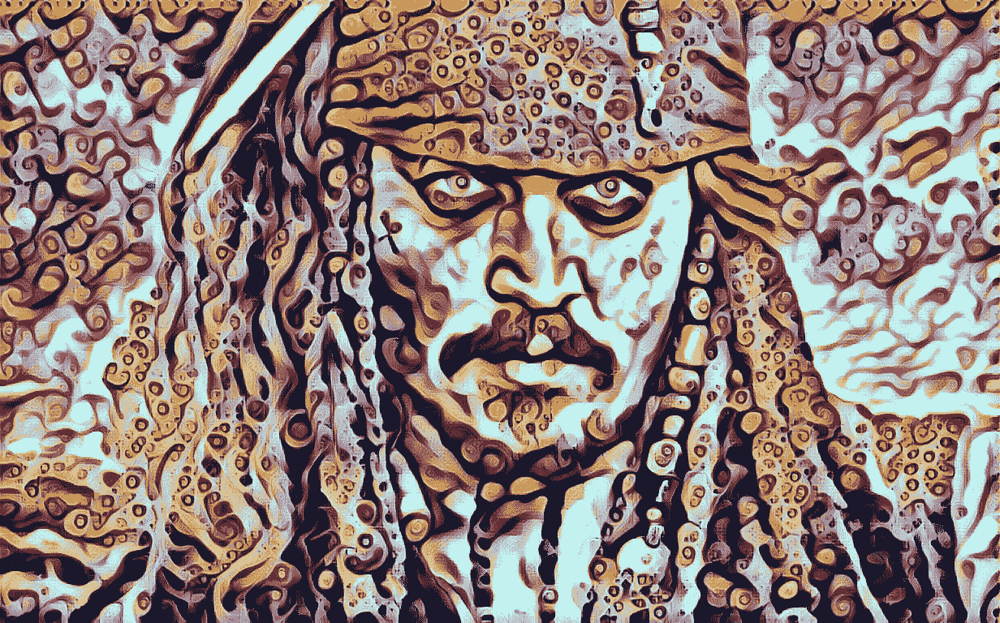
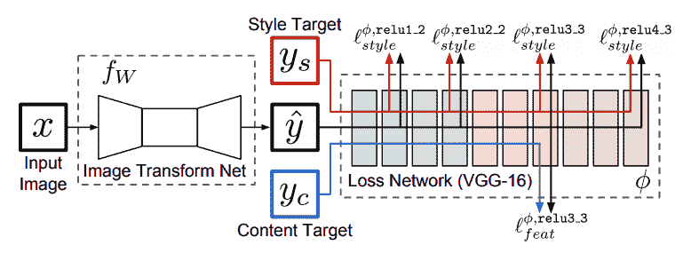
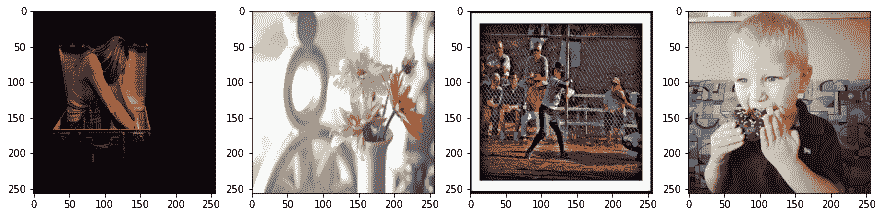
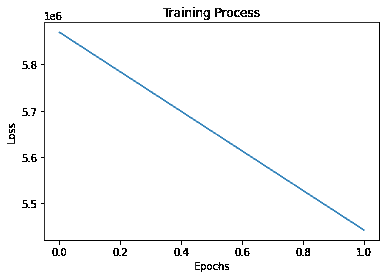
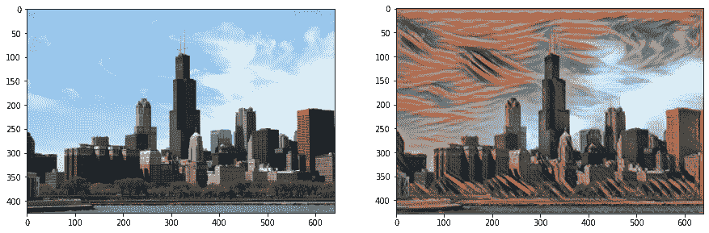
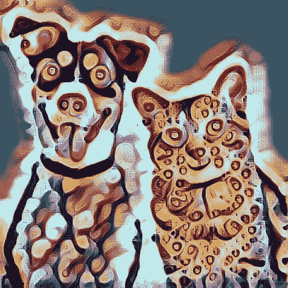
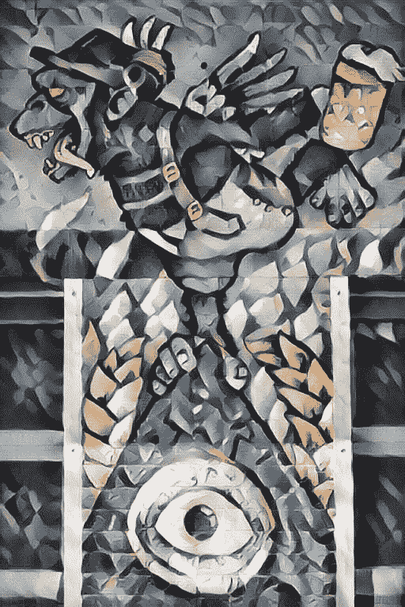
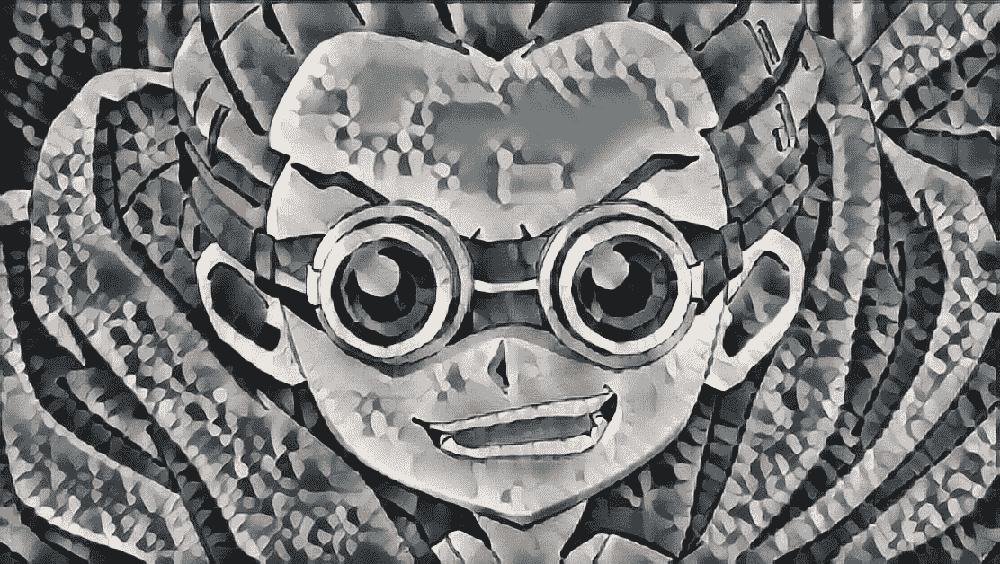

# 神经风格转移第 2 部分:快速风格转移

> 原文：<https://medium.com/analytics-vidhya/neural-style-transfer-part-2-fast-style-transfer-c2654f854f4?source=collection_archive---------16----------------------->



这是风格转换系列的第 2 部分，在这里我们用 TensorFlow 的理论和实现来介绍使用自动编码器的快速风格转换。

这是神经类型转换的第二部分，在这一部分中，我们将讨论另一种类型转换的技术，我们称之为快速类型转换。这是对[上一篇文章](https://tarunbisht11.medium.com/neural-style-transfer-part-1-introduction-dc17a3eb86d2)的跟进，如果你正在直接阅读它的第二部分，那么我建议你先阅读[上一部分](https://tarunbisht11.medium.com/neural-style-transfer-part-1-introduction-dc17a3eb86d2)，因为许多话题都是从那篇文章跟进的。

在 gatys 风格转移中，我们没有训练任何网络，我们只是根据损失函数(style_loss + content_loss)优化输出图像，并且优化需要一些轮次，因此生成风格化图像是一个非常缓慢的过程。将这种技术用于实时视频😭别提了。

这似乎是一个迭代过程，如果我们想要生成多个相同样式的图像，因为我们每次都在为相同样式的图像优化输出图像。如果有一种方法可以学习样式图像的输入-输出映射，那么我们可以一次性生成该样式的图像。🤔是的，我们可以使用自动编码器来学习输入图像和样式化输出图像之间的映射，方法是使用之前定义的损失函数来训练它。

快速风格转移让我们训练一次，并生成无限的图像，是的，我们可以用它来设计视频，甚至是实时网络视频。

# 要点

快速的风格转换让我们一次训练就能生成无限的图像。我们讨论的关于损失函数理论的大部分要点是相同的，这里的主要区别是我们将更多地关注使用损失函数的训练模型和学习映射。

在阅读这篇文章之前，先复习一下关于自动编码器的知识，特别是卷积自动编码器和深度学习中的残差层(跳过连接),因为我不会解释它们，但我们将在这里实现它们，所以先复习一些关于卷积自动编码器和残差层的基本知识，这将有助于轻松理解实现

1.我们训练一个前馈网络，使用 [Gatys 等人](https://arxiv.org/abs/1508.06576)论文中定义的损失函数将艺术风格应用于图像，更多解释参见[之前的文章](https://tarunbisht11.medium.com/neural-style-transfer-part-1-introduction-dc17a3eb86d2)。

2.我们将使用的前馈网络是一个残差自动编码器网络，它将内容图像作为输入，并输出一个风格化的图像。这与在[原始实现](https://arxiv.org/abs/1603.08155)中使用的网络相同

3.Model 还使用实例规范化，而不是基于纸张实例规范化的批处理规范化:快速样式化缺少的要素，因为这提供了更好的结果。

4.我们将使用 vgg19 来计算感知损失更多的工作描述在纸上。

如果现在有人想尝试视频和图像的风格转换，我已经为同样的目的创建了一个 [GitHub 库](https://github.com/tarun-bisht/fast-style-transfer)，并附有说明。

# 导入必要的模块

让我们从导入所有必需的模块开始:

*   numpy:用于数组操作
*   张量流:用于张量运算
*   tensor flow . keras:tensor flow 的高级神经网络库，用于创建神经网络
*   pillow:用于将图像转换为 numpy 数组，将 numpy 数组转换为图像，保存输出图像。
*   时间:用于计算每次迭代的时间
*   matplotlib:用于显示笔记本中的图像和图形
*   请求，base64，io:用于从 URL 下载和加载图像
*   os:操作系统级命令

```
**import** numpy **as** np
**import** tensorflow **as** tf
**from** tensorflow.keras.applications **import** vgg19
**from** tensorflow.keras.models **import** load_model,Model
**from** PIL **import** Image
**import** time
**import** matplotlib.pyplot **as** plt
**import** matplotlib
**import** requests
**import** base64
**import** os
**from** pathlib **import** Path
**from** io **import** BytesIO
matplotlib.rcParams['figure.figsize'] = (12,12)
matplotlib.rcParams['axes.grid'] = **False**
```

# 定义效用函数

```
**def** **load_image**(image_path, dim=None, resize=False):
    img= Image.open(image_path)
    **if** dim:
        **if** resize:
            img=img.resize(dim)
        **else**:
            img.thumbnail(dim)
    img= img.convert("RGB")
    **return** np.array(img)
```

上面的函数用于从指定的路径加载图像并将其转换成 numpy 数组

```
**def** **load_url_image**(url,dim=None,resize=False):
    img_request=requests.get(url)
    img= Image.open(BytesIO(img_request.content))
    **if** dim:
        **if** resize:
            img=img.resize(dim)
        **else**:
            img.thumbnail(dim)
    img= img.convert("RGB")
    **return** np.array(img)
```

这个函数从 URL 加载图像，并将其转换成 numpy 数组

```
**def** **array_to_img**(array):
    array=np.array(array,dtype=np.uint8)
    **if** np.ndim(array)&gt;3:
        **assert** array.shape[0]==1
        array=array[0]
    **return** Image.fromarray(array)**def** **show_image**(image,title=None):
    **if** len(image.shape)&gt;3:
        image=tf.squeeze(image,axis=0)
    plt.imshow(image)
    **if** title:
        plt.title=title**def** **plot_images_grid**(images,num_rows=1):
    n=len(images)
    **if** n &gt; 1:
        num_cols=np.ceil(n/num_rows)
        fig,axes=plt.subplots(ncols=int(num_cols),nrows=int(num_rows))
        axes=axes.flatten()
        fig.set_size_inches((15,15))
        **for** i,image **in** enumerate(images):
            axes[i].imshow(image)
    **else**:
        plt.figure(figsize=(10,10))
        plt.imshow(images[0])
```

以上三个函数用于转换和绘制图像:

*   将一个数组转换成图像
*   show_image:绘制单个图像
*   plot_images_grid:在网格中绘制批量图像

# 快速风格转换的步骤

训练模型是具有残差层的编码器-解码器架构。输入图像被传递到编码器部分，并传播到解码器部分。输出与输入大小相同，并显示生成的图像。

这个模型是根据一种称为感知损失的损失训练的，这种损失的计算方法与我们在 gatys 风格转移中计算的方法相同。使用预训练模型从定义的样式和内容层提取特征图，并使用它们来计算样式损失和内容损失。(更多细节请阅读[之前的帖子](https://tarunbisht11.medium.com/neural-style-transfer-part-1-introduction-dc17a3eb86d2)，那里有解释)

作为训练模型的一部分，我们需要训练数据，对于训练模型，我们需要不同图像的数据集(可以是任何像人、狗、汽车等)..)散装。在这篇文章中，我们使用的是[可可数据集](http://images.cocodataset.org/zips/train2014.zip)，它有很多图片。我也使用过 [Kaggle 挑战数据集](https://www.kaggle.com/c/gan-getting-started)，它有不同风景的图像，你可以在这里检查代码内核[。我们还需要一个样式图像，我们希望使用 autoencoder 学习它的样式。我们可以使用任何绘画或素描(从互联网上选择一个)](https://www.kaggle.com/tarunbisht11/generate-art-using-fast-style-transfer-in-a-second)

对于训练，该模型我们将一批各种内容的输入训练图像发送到 autoencoder，auto encoder 为我们提供输出。该输出必须是我们的风格图像，而训练时，我们将这些输出图像分批传递到我们的损失模型(vgg19 ),并提取不同层(内容层和风格层)的特征。这些特征然后用于计算风格损失和内容损失，其加权和产生训练网络的感知损失。下面这张来自论文的图片很好地描述了它。



经过训练后，我们可以使用该网络一次性设计任何图像，而无需优化

该网络的主要亮点:

*   残留层
*   编码器-解码器模型
*   解码器的输出被传递到损耗模型(VGG)以计算损耗
*   训练需要计算，因为我们每一步都要将这些图像传递给两个网络

# 定义损失

为了计算风格损失和内容损失，我们需要一个预训练的模型，我们使用 vgg19，原始实现使用 vgg16。

```
vgg=vgg19.VGG19(weights='imagenet',include_top=**False**)
vgg.summary()Model: "vgg19"
_________________________________________________________________
Layer (type)                 Output Shape              Param #   
=================================================================
input_1 (InputLayer)         [(**None**, **None**, **None**, 3)]   0         
_________________________________________________________________
block1_conv1 (Conv2D)        (**None**, **None**, **None**, 64)    1792      
_________________________________________________________________
block1_conv2 (Conv2D)        (**None**, **None**, **None**, 64)    36928     
_________________________________________________________________
block1_pool (MaxPooling2D)   (**None**, **None**, **None**, 64)    0         
_________________________________________________________________
block2_conv1 (Conv2D)        (**None**, **None**, **None**, 128)   73856     
_________________________________________________________________
block2_conv2 (Conv2D)        (**None**, **None**, **None**, 128)   147584    
_________________________________________________________________
block2_pool (MaxPooling2D)   (**None**, **None**, **None**, 128)   0         
_________________________________________________________________
block3_conv1 (Conv2D)        (**None**, **None**, **None**, 256)   295168    
_________________________________________________________________
block3_conv2 (Conv2D)        (**None**, **None**, **None**, 256)   590080    
_________________________________________________________________
block3_conv3 (Conv2D)        (**None**, **None**, **None**, 256)   590080    
_________________________________________________________________
block3_conv4 (Conv2D)        (**None**, **None**, **None**, 256)   590080    
_________________________________________________________________
block3_pool (MaxPooling2D)   (**None**, **None**, **None**, 256)   0         
_________________________________________________________________
block4_conv1 (Conv2D)        (**None**, **None**, **None**, 512)   1180160   
_________________________________________________________________
block4_conv2 (Conv2D)        (**None**, **None**, **None**, 512)   2359808   
_________________________________________________________________
block4_conv3 (Conv2D)        (**None**, **None**, **None**, 512)   2359808   
_________________________________________________________________
block4_conv4 (Conv2D)        (**None**, **None**, **None**, 512)   2359808   
_________________________________________________________________
block4_pool (MaxPooling2D)   (**None**, **None**, **None**, 512)   0         
_________________________________________________________________
block5_conv1 (Conv2D)        (**None**, **None**, **None**, 512)   2359808   
_________________________________________________________________
block5_conv2 (Conv2D)        (**None**, **None**, **None**, 512)   2359808   
_________________________________________________________________
block5_conv3 (Conv2D)        (**None**, **None**, **None**, 512)   2359808   
_________________________________________________________________
block5_conv4 (Conv2D)        (**None**, **None**, **None**, 512)   2359808   
_________________________________________________________________
block5_pool (MaxPooling2D)   (**None**, **None**, **None**, 512)   0         
=================================================================
Total params: 20,024,384
Trainable params: 20,024,384
Non-trainable params: 0
_________________________________________________________________
```

在这里，我们定义将用于计算损失的层。

```
content_layers=['block4_conv2']style_layers=['block1_conv1',
            'block2_conv1',
            'block3_conv1',
            'block4_conv1',
            'block5_conv1']
```

让我们定义一个类，该类使用一些额外的方法来创建损失模型，以便从网络访问要素地图。我们在[之前的文章](https://tarunbisht11.medium.com/neural-style-transfer-part-1-introduction-dc17a3eb86d2)中也使用过这些函数，这里我们只是将它们封装在一个类中。

```
**class** **LossModel**:
    **def** **__init__**(self,pretrained_model,content_layers,style_layers):
        self.model=pretrained_model
        self.content_layers=content_layers
        self.style_layers=style_layers
        self.loss_model=self.get_model() **def** **get_model**(self):
        self.model.trainable=**False**
        layer_names=self.style_layers + self.content_layers
        outputs=[self.model.get_layer(name).output **for** name **in** layer_names]
        new_model=Model(inputs=self.model.input,outputs=outputs)
        **return** new_model

    **def** **get_activations**(self,inputs):
        inputs=inputs*255.0
        style_length=len(self.style_layers)
        outputs=self.loss_model(vgg19.preprocess_input(inputs))
        style_output,content_output=outputs[:style_length],outputs[style_length:]
        content_dict={name:value **for** name,value **in** zip(self.content_layers,content_output)}
        style_dict={name:value **for** name,value **in** zip(self.style_layers,style_output)}
        **return** {'content':content_dict,'style':style_dict}
```

现在我们使用上面的类创建我们的损失模型

```
loss_model = LossModel(vgg, content_layers, style_layers)
```

让我们定义损失函数来计算内容和风格损失，下面方法`content_loss`和`style _loss`分别计算内容和风格损失。通过对这些损失进行加权平均，我们得到了定义在`preceptual_loss`函数中的感知损失。这些损失函数的细节包含在[前一篇文章](https://tarunbisht11.medium.com/neural-style-transfer-part-1-introduction-dc17a3eb86d2)中。

```
**def** **content_loss**(placeholder,content,weight):
    **assert** placeholder.shape == content.shape
    **return** weight*tf.reduce_mean(tf.square(placeholder-content))**def** **gram_matrix**(x):
    gram=tf.linalg.einsum('bijc,bijd-&gt;bcd', x, x)
    **return** gram/tf.cast(x.shape[1]*x.shape[2]*x.shape[3],tf.float32)**def** **style_loss**(placeholder,style, weight):
    **assert** placeholder.shape == style.shape
    s=gram_matrix(style)
    p=gram_matrix(placeholder)
    **return** weight*tf.reduce_mean(tf.square(s-p))**def** **preceptual_loss**(predicted_activations,content_activations,
                    style_activations,content_weight,style_weight,
                    content_layers_weights,style_layer_weights):
    pred_content = predicted_activations["content"]
    pred_style = predicted_activations["style"]
    c_loss = tf.add_n([content_loss(pred_content[name],content_activations[name],
                                  content_layers_weights[i]) **for** i,name **in** enumerate(pred_content.keys())])
    c_loss = c_loss*content_weight
    s_loss = tf.add_n([style_loss(pred_style[name],style_activations[name],
                                style_layer_weights[i]) **for** i,name **in** enumerate(pred_style.keys())])
    s_loss = s_loss*style_weight
    **return** c_loss+s_loss
```

# 创建自动编码器

在这里，我们首先为我们的网络定义了所有必要的层:

*   ReflectionPadding2D:用于将反射填充应用到 conv 网中的图像
*   实例规范化:我们使用实例规范化而不是批处理规范化，因为它能给出更好的结果。它将通道上的输入标准化。
*   conv layer:conv 图层的块，具有填充-> conv _ 图层->实例 _ 规范化组合
*   剩余层:具有两个转化层块的剩余层
*   UpsampleLayer:对 autoencoder 中的瓶颈表示进行上采样(如果你读过关于 auto encoder 的文章，你就会明白我的意思)。它可以被认为是反卷积层。

```
**class** **ReflectionPadding2D**(tf.keras.layers.Layer):
    **def** **__init__**(self, padding=(1, 1), **kwargs):
        super(ReflectionPadding2D, self).__init__(**kwargs)
        self.padding = tuple(padding)
    **def** **call**(self, input_tensor):
        padding_width, padding_height = self.padding
        **return** tf.pad(input_tensor, [[0,0], [padding_height, padding_height], 
                                     [padding_width, padding_width], [0,0] ], 'REFLECT')**class** **InstanceNormalization**(tf.keras.layers.Layer):
    **def** **__init__**(self,**kwargs):
        super(InstanceNormalization, self).__init__(**kwargs)
    **def** **call**(self,inputs):
        batch, rows, cols, channels = [i **for** i **in** inputs.get_shape()]
        mu, var = tf.nn.moments(inputs, [1,2], keepdims=**True**)
        shift = tf.Variable(tf.zeros([channels]))
        scale = tf.Variable(tf.ones([channels]))
        epsilon = 1e-3
        normalized = (inputs-mu)/tf.sqrt(var + epsilon)
        **return** scale * normalized + shift**class** **ConvLayer**(tf.keras.layers.Layer):
    **def** **__init__**(self,filters,kernel_size,strides=1,**kwargs):
        super(ConvLayer,self).__init__(**kwargs)
        self.padding=ReflectionPadding2D([k//2 **for** k **in** kernel_size])
        self.conv2d=tf.keras.layers.Conv2D(filters,kernel_size,strides)
        self.bn=InstanceNormalization()
    **def** **call**(self,inputs):
        x=self.padding(inputs)
        x=self.conv2d(x)
        x=self.bn(x)
        **return** x**class** **ResidualLayer**(tf.keras.layers.Layer):
    **def** **__init__**(self,filters,kernel_size,**kwargs):
        super(ResidualLayer,self).__init__(**kwargs)
        self.conv2d_1=ConvLayer(filters,kernel_size)
        self.conv2d_2=ConvLayer(filters,kernel_size)
        self.relu=tf.keras.layers.ReLU()
        self.add=tf.keras.layers.Add()
    **def** **call**(self,inputs):
        residual=inputs
        x=self.conv2d_1(inputs)
        x=self.relu(x)
        x=self.conv2d_2(x)
        x=self.add([x,residual])
        **return** x**class** **UpsampleLayer**(tf.keras.layers.Layer):
    **def** **__init__**(self,filters,kernel_size,strides=1,upsample=2,**kwargs):
        super(UpsampleLayer,self).__init__(**kwargs)
        self.upsample=tf.keras.layers.UpSampling2D(size=upsample)
        self.padding=ReflectionPadding2D([k//2 **for** k **in** kernel_size])
        self.conv2d=tf.keras.layers.Conv2D(filters,kernel_size,strides)
        self.bn=InstanceNormalization()
    **def** **call**(self,inputs):
        x=self.upsample(inputs)
        x=self.padding(x)
        x=self.conv2d(x)
        **return** self.bn(x)
```

使用上面定义的这些层，让我们创建一个卷积自动编码器。

建筑:

*   3 个 ConvLayer
*   5 个残渣层
*   3 个上采样层

```
**class** **StyleTransferModel**(tf.keras.Model):
    **def** **__init__**(self,**kwargs):
        super(StyleTransferModel, self).__init__(name='StyleTransferModel',**kwargs)
        self.conv2d_1= ConvLayer(filters=32,kernel_size=(9,9),strides=1,name="conv2d_1_32")
        self.conv2d_2= ConvLayer(filters=64,kernel_size=(3,3),strides=2,name="conv2d_2_64")
        self.conv2d_3= ConvLayer(filters=128,kernel_size=(3,3),strides=2,name="conv2d_3_128")
        self.res_1=ResidualLayer(filters=128,kernel_size=(3,3),name="res_1_128")
        self.res_2=ResidualLayer(filters=128,kernel_size=(3,3),name="res_2_128")
        self.res_3=ResidualLayer(filters=128,kernel_size=(3,3),name="res_3_128")
        self.res_4=ResidualLayer(filters=128,kernel_size=(3,3),name="res_4_128")
        self.res_5=ResidualLayer(filters=128,kernel_size=(3,3),name="res_5_128")
        self.deconv2d_1= UpsampleLayer(filters=64,kernel_size=(3,3),name="deconv2d_1_64")
        self.deconv2d_2= UpsampleLayer(filters=32,kernel_size=(3,3),name="deconv2d_2_32")
        self.deconv2d_3= ConvLayer(filters=3,kernel_size=(9,9),strides=1,name="deconv2d_3_3")
        self.relu=tf.keras.layers.ReLU()
    **def** **call**(self, inputs):
        x=self.conv2d_1(inputs)
        x=self.relu(x)
        x=self.conv2d_2(x)
        x=self.relu(x)
        x=self.conv2d_3(x)
        x=self.relu(x)
        x=self.res_1(x)
        x=self.res_2(x)
        x=self.res_3(x)
        x=self.res_4(x)
        x=self.res_5(x)
        x=self.deconv2d_1(x)
        x=self.relu(x)
        x=self.deconv2d_2(x)
        x=self.relu(x)
        x=self.deconv2d_3(x)
        x = (tf.nn.tanh(x) + 1) * (255.0 / 2)
        **return** x

    ## used to print shapes of each layer to check if input shape == output shape
    ## I don't know any better solution to this right now
    **def** **print_shape**(self,inputs):
        print(inputs.shape)
        x=self.conv2d_1(inputs)
        print(x.shape)
        x=self.relu(x)
        x=self.conv2d_2(x)
        print(x.shape)
        x=self.relu(x)
        x=self.conv2d_3(x)
        print(x.shape)
        x=self.relu(x)
        x=self.res_1(x)
        print(x.shape)
        x=self.res_2(x)
        print(x.shape)
        x=self.res_3(x)
        print(x.shape)
        x=self.res_4(x)
        print(x.shape)
        x=self.res_5(x)
        print(x.shape)
        x=self.deconv2d_1(x)
        print(x.shape)
        x=self.relu(x)
        x=self.deconv2d_2(x)
        print(x.shape)
        x=self.relu(x)
        x=self.deconv2d_3(x)
        print(x.shape)
```

在此定义输入形状和批量大小

```
input_shape=(256,256,3)
batch_size=4
```

使用`StyleTransferModel`类创建样式模型

```
style_model = StyleTransferModel()
```

在这里，我们检查所有层的形状，并验证输入形状和输出形状

```
style_model.print_shape(tf.zeros(shape=(1,*input_shape)))(1, 256, 256, 3)
(1, 256, 256, 32)
(1, 128, 128, 64)
(1, 64, 64, 128)
(1, 64, 64, 128)
(1, 64, 64, 128)
(1, 64, 64, 128)
(1, 64, 64, 128)
(1, 64, 64, 128)
(1, 128, 128, 64)
(1, 256, 256, 32)
(1, 256, 256, 3)
```

# 培训模式

这里我们定义了一个用于训练的优化器，我们使用学习率为 1e-3 的 Adam 优化器

```
optimizer = tf.keras.optimizers.Adam(learning_rate=1e-3)**def** **train_step**(dataset,style_activations,steps_per_epoch,style_model,loss_model,optimizer,
               checkpoint_path="./",content_weight=1e4, style_weight=1e-2,
               total_variation_weight=0.004):
    batch_losses=[]
    steps=1
    save_path=os.path.join(checkpoint_path,f"model_checkpoint.ckpt")
    print("Model Checkpoint Path: ",save_path)
    **for** input_image_batch **in** dataset:
        **if** steps-1 &gt;= steps_per_epoch:
            **break**
        **with** tf.GradientTape() **as** tape:
            outputs=style_model(input_image_batch)
            outputs=tf.clip_by_value(outputs, 0, 255)
            pred_activations=loss_model.get_activations(outputs/255.0)
            content_activations=loss_model.get_activations(input_image_batch)["content"] 
            curr_loss=preceptual_loss(pred_activations,content_activations,style_activations,content_weight,
                                      style_weight,content_layers_weights,style_layers_weights)
            curr_loss += total_variation_weight*tf.image.total_variation(outputs)
        batch_losses.append(curr_loss)
        grad = tape.gradient(curr_loss,style_model.trainable_variables)
        optimizer.apply_gradients(zip(grad,style_model.trainable_variables))
        **if** steps % 1000==0:
            print("checkpoint saved ",end=" ")
            style_model.save_weights(save_path)
            print(f"Loss: {tf.reduce_mean(batch_losses).numpy()}")
        steps+=1
    **return** tf.reduce_mean(batch_losses)
```

在上面的函数中，我们定义了一个单独的训练步骤。在函数内部:

*   首先，我们为模型检查点定义了 save_path
*   对于每个时期的步数，我们运行一个训练循环
*   对于每一步，我们向前传递一批图像将其传递给我们的损失模型
*   获取批量图像的内容层激活
*   连同来自样式图像的样式激活和内容激活，我们计算感知损失
*   为了平滑，我们给图像增加了一些总变差损失
*   计算损失函数相对于模型可训练参数的梯度
*   最后反向传播优化
*   每 1000 步保存一个检查点

# 为训练配置数据集

下载 coco 数据集用于训练，我们可以使用任何其他批量图像的图像数据集。使用 wget 以 zip 格式下载 coco 数据集。此外，我们创建一个目录，将下载 zip 文件解压缩。

```
wget [http://images.cocodataset.org/zips/train2014.zip](http://images.cocodataset.org/zips/train2014.zip)--2020-07-12 08:14:59--  http://images.cocodataset.org/zips/train2014.zip
Resolving images.cocodataset.org (images.cocodataset.org)... 52.216.224.88
Connecting to images.cocodataset.org (images.cocodataset.org)|52.216.224.88|:80... connected.
HTTP request sent, awaiting response... 200 OK
Length: 13510573713 (13G) [application/zip]
Saving to: ‘train2014.zip’train2014.zip       100%[===================&gt;]  12.58G  25.0MB/s    **in** 6m 56s 2020-07-12 08:21:55 (31.0 MB/s) - ‘train2014.zip’ saved [13510573713/13510573713]mkdir coco
unzip -qq train2014.zip -d coco
```

对于训练，该模型允许创建 tensorflow 数据集，该数据集从指定的路径加载所有图像，调整它们的大小使其具有相同的大小，以便进行有效的批量训练，并实现批处理和预取。下面的类为训练创建 tfdataset。

请注意，我们使用固定大小的图像训练模型，但我们可以生成任何大小的图像，因为模型中的所有层都是卷积层。

```
**class** **TensorflowDatasetLoader**:
    **def** **__init__**(self,dataset_path,batch_size=4, image_size=(256, 256),num_images=None):
        images_paths = [str(path) **for** path **in** Path(dataset_path).glob("*.jpg")]
        self.length=len(images_paths)
        **if** num_images **is** **not** **None**:
            images_paths = images_paths[0:num_images]
        dataset = tf.data.Dataset.from_tensor_slices(images_paths).map(
            **lambda** path: self.load_tf_image(path, dim=image_size),
            num_parallel_calls=tf.data.experimental.AUTOTUNE,
        )
        dataset = dataset.batch(batch_size,drop_remainder=**True**)
        dataset = dataset.repeat()
        dataset = dataset.prefetch(buffer_size=tf.data.experimental.AUTOTUNE)
        self.dataset=dataset
    **def** **__len__**(self):
        **return** self.length
    **def** **load_tf_image**(self,image_path,dim):
        image = tf.io.read_file(image_path)
        image = tf.image.decode_jpeg(image, channels=3)
        image= tf.image.resize(image,dim)
        image= image/255.0
        image = tf.image.convert_image_dtype(image, tf.float32)
        **return** image
```

使用上面的类，让我们从 coco 数据集图像创建 tfdataset。我们指定图像文件夹的路径(所有图像都在这里)和批量大小

```
loader=TensorflowDatasetLoader("coco/train2014/",batch_size=4)loader.dataset.element_specTensorSpec(shape=(4, 256, 256, 3), dtype=tf.float32, name=**None**)
```

绘制一些图像以查看数据集中的图像

```
plot_images_grid(next(iter(loader.dataset.take(1))))
```



现在让我们使用`load_url_image`从 URL 加载样式图像并绘制它。

```
# setting up style image
url="https://www.edvardmunch.org/images/paintings/the-scream.jpg"
style_image=load_url_image(url,dim=(input_shape[0],input_shape[1]),resize=**True**)
style_image=style_image/255.0show_image(style_image)
```

接下来，利用损失模型提取风格图像的风格层特征图

```
style_image=style_image.astype(np.float32)
style_image_batch=np.repeat([style_image],batch_size,axis=0)
style_activations=loss_model.get_activations(style_image_batch)["style"]
```

# 培训模式

定义内容权重、样式权重和总变化权重这些是我们可以调整以改变输出图像中样式和内容的强度的超参数

```
content_weight=1e1
style_weight=1e2
total_variation_weight=0.004
```

现在定义要训练的时期数、每个时期的步数和模型检查点路径

```
epochs=2num_images=len(loader)
steps_per_epochs=num_images//batch_size
print(steps_per_epochs)20695save_path = "./scream"os.makedirs(save_path, exist_ok=**True**)
```

启用混合精度训练通过以半精度格式执行运算，它提供了显著的计算加速。

```
**try**:
    policy = tf.keras.mixed_precision.experimental.Policy('mixed_float16')
    tf.keras.mixed_precision.experimental.set_policy(policy) 
**except**:
    **pass**
```

如果先前的检查点存在于该路径，则加载该检查点并继续进一步训练，否则我们从头开始训练

```
**if** os.path.isfile(os.path.join(save_path,"model_checkpoint.ckpt.index")):
    style_model.load_weights(os.path.join(save_path,"model_checkpoint.ckpt"))
    print("resuming training ...")
**else**:
    print("training scratch ...")training scratch ...
```

最后，我们开始训练模型。在每个时期，我们调用`train_step`函数，该函数运行到每个时期定义的步骤数，并且在每个时期之后保存模型检查点，用于进一步的推理和训练。

```
epoch_losses=[]
**for** epoch **in** range(1,epochs+1):
    print(f"epoch: {epoch}")
    batch_loss=train_step(loader.dataset,style_activations,steps_per_epochs,style_model,loss_model,optimizer,
                          save_path,
                          content_weight,style_weight,total_variation_weight,
                          content_layers_weights,style_layers_weights)
    style_model.save_weights(os.path.join(save_path,"model_checkpoint.ckpt"))
    print("Model Checkpointed at: ",os.path.join(save_path,"model_checkpoint.ckpt"))
    print(f"loss: {batch_loss.numpy()}")
    epoch_losses.append(batch_loss)epoch: 1
Model Checkpoint Path:  ./scream/model_checkpoint.ckpt
checkpoint saved  Loss: 6567731.5
checkpoint saved  Loss: 6464426.5
checkpoint saved  Loss: 6402768.0
checkpoint saved  Loss: 6336974.5
checkpoint saved  Loss: 6281922.5
checkpoint saved  Loss: 6232056.0
checkpoint saved  Loss: 6191586.5
checkpoint saved  Loss: 6155332.0
checkpoint saved  Loss: 6119712.5
checkpoint saved  Loss: 6085571.5
checkpoint saved  Loss: 6062698.0
checkpoint saved  Loss: 6036787.0
checkpoint saved  Loss: 6011265.5
checkpoint saved  Loss: 5988809.5
checkpoint saved  Loss: 5969908.0
checkpoint saved  Loss: 5950925.0
checkpoint saved  Loss: 5931179.5
checkpoint saved  Loss: 5912791.5
checkpoint saved  Loss: 5894602.0
checkpoint saved  Loss: 5880713.0
Model Checkpointed at:  ./scream
loss: 5869695.5
epoch: 2
Model Checkpoint Path:  ./scream/model_checkpoint.ckpt
checkpoint saved  Loss: 5520494.5
checkpoint saved  Loss: 5532450.5
checkpoint saved  Loss: 5529669.0
checkpoint saved  Loss: 5524684.0
checkpoint saved  Loss: 5518524.5
checkpoint saved  Loss: 5508913.5
checkpoint saved  Loss: 5503493.5
checkpoint saved  Loss: 5501864.0
checkpoint saved  Loss: 5497016.0
checkpoint saved  Loss: 5491713.0
checkpoint saved  Loss: 5491244.5
checkpoint saved  Loss: 5484620.0
checkpoint saved  Loss: 5482881.0
checkpoint saved  Loss: 5476766.5
checkpoint saved  Loss: 5472491.0
checkpoint saved  Loss: 5466294.5
checkpoint saved  Loss: 5459984.0
checkpoint saved  Loss: 5454912.5
checkpoint saved  Loss: 5449535.5
checkpoint saved  Loss: 5446370.0
Model Checkpointed at:  ./scream
loss: 5442546.5
```

在训练模型之后，让绘制与时期相关的损失，并检查损失摘要

```
plt.plot(epoch_losses)
plt.xlabel("Epochs")
plt.ylabel("Loss")
plt.title("Training Process")
plt.show()
```



现在是时候生成一些样式图像了。我们首先将保存的模型检查点加载到 autoencoder 中。

```
**if** os.path.isfile(os.path.join(save_path,"model_checkpoint.ckpt.index")):
    style_model.load_weights(os.path.join(save_path,"model_checkpoint.ckpt"))
    print("loading weights ...")
**else**:
    print("no weights found ...")loading weights ...
```

加载图像进行样式化，并将其转换为浮点型。

```
test_image_url="https://hips.hearstapps.com/hmg-prod.s3.amazonaws.com/images/chicago-skyline-on-a-clear-day-royalty-free-image-115891582-1557159569.jpg"test_image=load_url_image(test_image_url,dim=(640,480))
test_image=np.expand_dims(test_image,axis=0)test_image=test_image.astype(np.float32)
```

在模型的一次向前传递中，我们得到生成的样式图像

```
predicted_image=style_model(test_image)
```

将生成的图像像素箝位在 0 到 255 之间，并将其转换为 uint8。我们得到了我们生成的风格图像，绘制它并检查它的外观，还保存它并与朋友分享

```
predicted_image=np.clip(predicted_image,0,255)
predicted_image=predicted_image.astype(np.uint8)test_output=test_image.astype(np.uint8)
test_output=tf.squeeze(test_output).numpy()
predicted_output=tf.squeeze(predicted_image).numpy()plot_images_grid([test_output,predicted_output])
```



如果你没有足够的计算能力，使用 colab 或 kaggle 内核，他们提供免费的 GPU 甚至 TPU 来训练这些模型，一旦训练完毕，我们可以使用训练好的检查点在任何有 GPU 或 CPU 的系统中进行风格转换。

使用`opencv`,我们也可以轻松创建风格视频。

# 结果

一些图像结果



在这里，我们有实时视频风格化的行动

下面是视频风格化的行动

现在生成不同的图像和视频，玩它，分享令人兴奋的结果。

如果现在有人想尝试视频和图像的风格转换，我已经为同样的目的创建了一个 [github 库](https://github.com/tarun-bisht/fast-style-transfer)，并附有说明。

感谢阅读。✌✌✌

# 参考

[实例规范化:快速风格化缺少的要素](https://arxiv.org/abs/1607.08022)

[实时风格转换和超分辨率的感知损失](https://arxiv.org/abs/1603.08155)

[艺术风格的神经算法](https://arxiv.org/abs/1508.06576)

# 重要链接

[Github 库](https://github.com/tarun-bisht/fast-style-transfer)

[谷歌 Colab 笔记本](https://github.com/tarun-bisht/blogs-notebooks/blob/master/style-transfer/Neural%20Style%20Transfer%20Part%202.ipynb)

[Youtube 视频](https://www.youtube.com/watch?v=GrS4rWifdko)