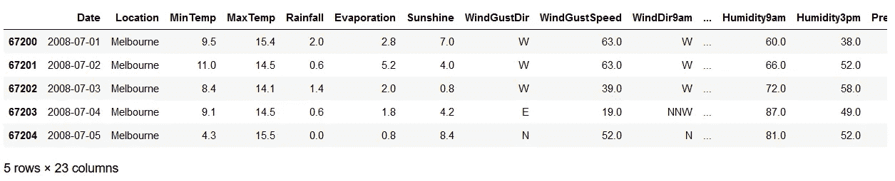
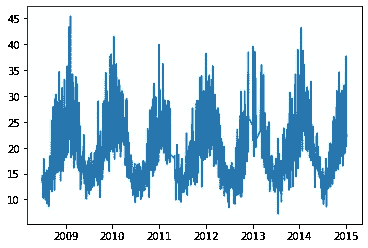
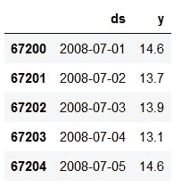
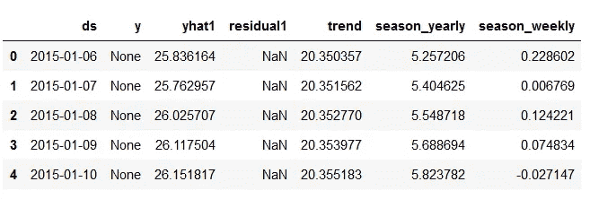
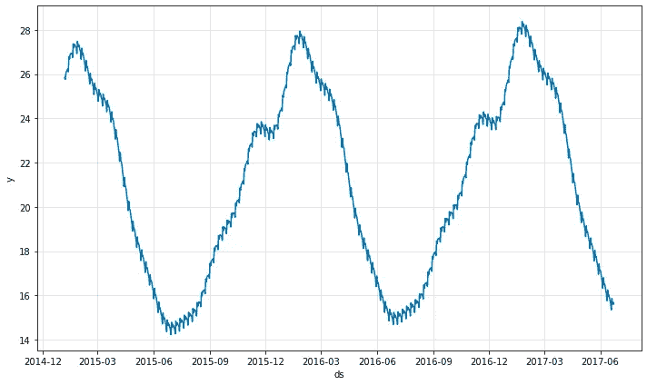
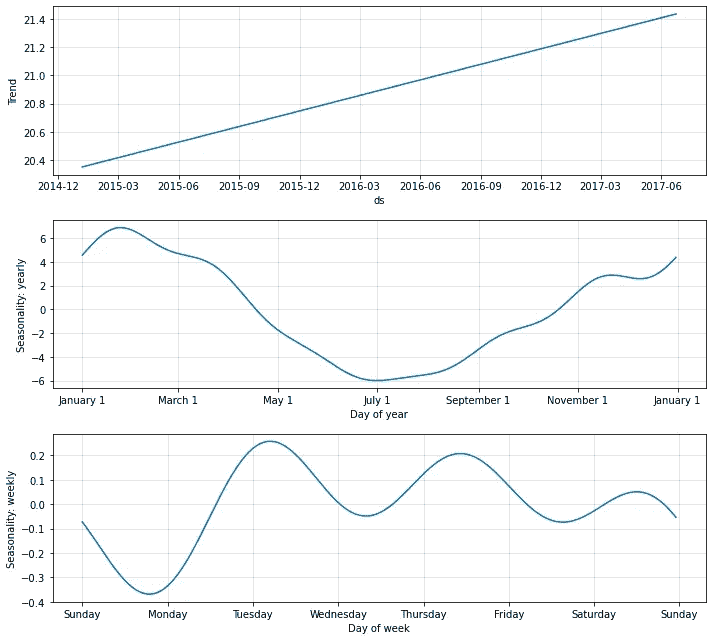

# NeuralProphet:基于神经网络的时间序列模型

> 原文：<https://medium.com/analytics-vidhya/neuralprophet-a-neural-network-based-time-series-model-3c74af3b0ec6?source=collection_archive---------5----------------------->

NeuralProphet 是一个 python 库，用于基于神经网络对时序数据进行建模。它建立在 PyTorch 之上，并受到脸书先知和 AR-Net 库的极大启发。时间序列数据基本上是在一段时间内通过重复测量获得的观察值的集合。例如，天气数据、污染水平数据等。

为了理解 NeuralProphet，我们来看一个简单的例子，用 NeuralProphet 软件包来预测澳大利亚的[降雨数据集的温度。](https://www.kaggle.com/jsphyg/weather-dataset-rattle-package)

步骤如下-

1.  安装和导入 Neural Prophet
2.  读取和预处理气象数据
3.  训练神经营养模型
4.  使用 NeuralProphet 生成预测
5.  保存模型以备将来使用

# **1。安装和导入 neural propht**

要在 Windows 上安装 NeuralProphet，请打开命令提示符并输入以下 pip 命令-

```
pip install neuralprophet
```

正在导入所有依赖项-

```
import pandas as pd 
from neuralprophet import NeuralProphet
from matplotlib import pyplot as plt
import pickle
```

我们导入 pandas、neuralprophet、matplotlib 进行数据可视化，并导入 pickle 库保存我们训练好的模型以备将来使用。

# **2。读取并预处理气象数据**

现在，我们需要做的下一件事是导入我们的数据，我们将使用的数据集是这个 weatherAUS.csv 文件。我们使用 python 库 pandas 将它读入数据框。

```
df = pd.read_csv('weatherAUS.csv')
df.head()
```

df.head()命令有助于显示数据集的前 5 行。

数据集列值如下—

日期'，'位置'，'最小温度'，'最大温度'，'降雨量'，'蒸发'，
，'阳光'，'风阵风'，'风风速' 9am '，'风风向 3pm '，'风速 9am '，'湿度 9am '，'湿度 3pm '，
，'压力 9am '，'压力 3pm '，'云 9am '，'云 3pm '，'温度 9am '，
，'温度 3pm '，'今天下雨'，'明天下雨'

为简单起见，我们将选择“墨尔本”作为地点，并预测“下午 3 点”的温度。

在分析数据帧的数据类型时，我们看到日期属于“对象”类型，为了更容易处理，我们将其转换为“日期时间”类型。

现在，我们只过滤出“墨尔本”位置的数据集，并转换“日期”列的数据类型。

```
melb = df[df[‘Location’]==’Melbourne’]
melb[‘Date’] = pd.to_datetime(melb[‘Date’])
melb.head()
```



我们可以使用 matplotlib 可视化数据，并找到天气模式。

```
plt.plot(melb[‘Date’], melb[‘Temp3pm’])
plt.show()
```



从 2009 年到 2015 年的垂直/垂直温度 3pm 图

每当我们将数据传递给 neuralprophet 时，它只需要两列——一列是代表日期的“ds ”,另一列是代表我们要预测的值的“y ”,所以我们要将日期列设置为等于 ds，将 temp3pm 设置为等于 y，然后去掉所有其他列。

```
data = melb[[‘Date’, ‘Temp3pm’]] 
data.dropna(inplace=True)
data.columns = [‘ds’, ‘y’] 
data.head()
```



用于神经营养疗法培训的更新数据集

# 3.训练神经营养模型

在所有繁琐的预处理之后，我们开始训练模型。我们创建一个新的 neuralprophet 模型的未训练实例，并使用 fit()方法来训练该模型。最终模型将存储在变量“m”中。

```
m = NeuralProphet()
model = m.fit(data, freq=’D’, epochs=1000)
```

拟合方法采用 3 个参数-数据帧、数据频率(即天数)和时期(算法在训练期间必须完成的次数)。

完成训练后，我们最终得到的平均绝对误差为 3，这意味着我们的预测将会精确到正负 3 度。这完全取决于数据集的大小和历元的数量。

现在模型已经准备好并训练好了，我们现在可以预测未来的温度。

# 4.使用 NeuralProphet 生成预测

我们将首先制作一个为期 500 天的“未来”数据框架，并使用 predict 方法来预测未来的气温。

```
future = m.make_future_dataframe(data, periods=500)
forecast = m.predict(future)
forecast.head()
```

在第一行中，make_future_dataframe()方法获取参数——数据、数据帧和 500 天的时间段，即未来 500 天的温度。



最终预测数据

通过改变周期参数，我们可以如我们所愿预测未来一天的温度。

为了更好地理解结果，我们可以把结果画出来-

```
plot1 = m.plot(forecast)
```



2015 年至 2017 年的预测图—日期(x 轴)v/s 温度(y 轴)

我们为详细的分析生成组件图-

```
plt2 = m.plot_components(forecast)
```



总体趋势显示气温正在上升。

这就是如何使用 NeuralProphet 库生成时间序列预测。

# 5.保存模型以备将来使用

对于大多数机器学习程序，使用 pickle 库保存训练模型，以保存训练模型供将来使用。

```
with open('neuralprophet_model.pkl', "wb") as f:
    pickle.dump(m, f)
```

在这里，我们打开一个文件“neuralprophet_model.pkl ”,它将包含保存的模型，我们在“wb ”(写二进制)中打开它；作为 f。

然后我们把模型 m 转储到 f。

现在我们的模型被保存起来以备将来使用。

# 参考

1.  [https://pypi.org/project/neuralprophet/](https://pypi.org/project/neuralprophet/)
2.  https://neuralprophet.com/
3.  【https://github.com/ourownstory/neural_prophet 

# 感谢您的阅读！

如果你想支持这个页面，这里是我的 [**小费罐💰**](https://www.paypal.me/saandman) ，真的很欣赏。

(不属于中型合作伙伴计划。)

给我留个便条询问。