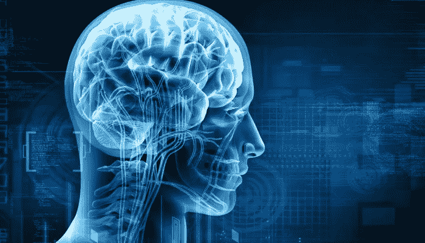
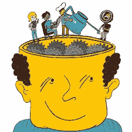
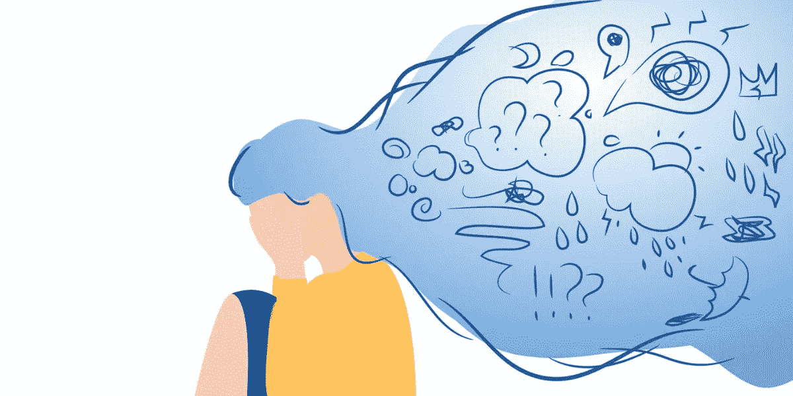
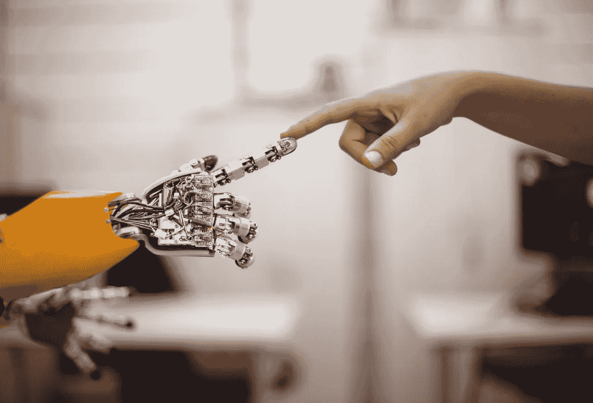
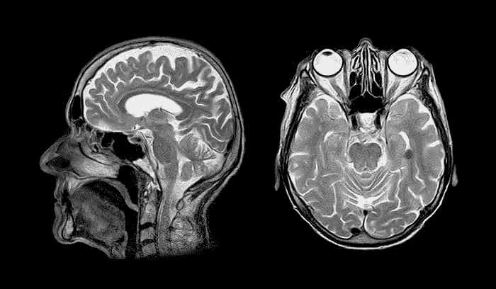
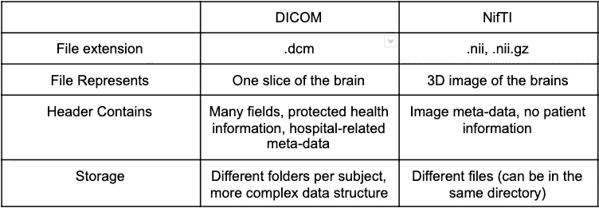
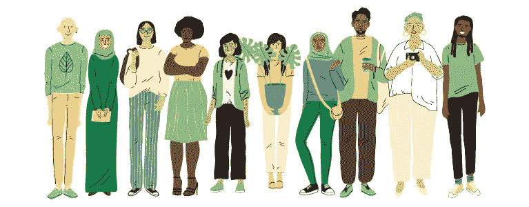

# 使用 Python 进行神经黑客攻击—第 1 部分

> 原文：<https://medium.com/analytics-vidhya/neurohacking-using-python-part-1-defbca850014?source=collection_archive---------15----------------------->

本文仅供医学生参考。如果你是医科学生，请往前走，否则…开玩笑的。医疗保健领域总是让我兴奋地学习和探索。分析和想象人体内部是很有趣的。通过“使用 R 的神经黑客入门”这门课程，不仅给了我一个思考和分析的广阔视角，还增加了我在神经黑客方面的知识。当你学习而不分享你的知识时，就没有乐趣了。不是吗。在本文中，让我们尝试使用 Python 来构建我们的神经黑客基础。

## 目录

1.  什么是神经黑客？
2.  神经黑客的目标
3.  神经黑客和生物黑客的区别
4.  DICOM 和 NIFTI 文件的区别
5.  DICOM 文件的可视化
6.  NifTI 文件的可视化

# **什么是神经黑客？**

神经黑客不过是专注于大脑和中枢神经系统(CNS)的生物黑客的一个子类。

它是一种干扰结构或操纵神经元功能以进行改善或修复的方法。

Neurohacking 是使用、改进和设计最简单的开源脚本软件的持续过程，该软件依赖于最少数量的软件平台，致力于提高神经影像数据分析的正确性、可重复性和速度。

# **神经黑客的目标**

> 神经黑客的主要目标是优化精神健康。

除此之外，还有其他目标:

1.  损坏修复
2.  模拟现实
3.  预防疾病和增强体质。

随着技术在智能健康追踪器、大脑/计算机接口等领域的发展，睡眠追踪器正在帮助人类了解他们的日常周期，以便帮助记录他们的生活方式。

# 神经黑客 vs 生物黑客

如上所述，神经黑客也被称为神经工程。它是专注于大脑和中枢神经系统(CNS)的生物黑客的一个子类。

它是一种干扰结构或操纵神经元功能以进行改善或修复的方法。

而生物黑客——也被称为 DIY 生物学——是一个极其广泛和模糊的术语，可以涵盖广泛的活动，从对酵母或其他有机体进行科学实验，到跟踪你自己的睡眠和饮食，到通过将年轻人的血液注入你的血管来改变你自己的生物学，希望它能抗衰老。

 [## 生物黑客如何试图升级他们的大脑、身体和人性

### 寻找做好事的最佳方式。也许你和我一样，有一个同事手里被植入了芯片。这些…

www.vox.com](https://www.vox.com/future-perfect/2019/6/25/18682583/biohacking-transhumanism-human-augmentation-genetic-engineering-crispr) 

# 【DICOM 和 NiFTI 文件的区别

**DICOM 文件**是以医学数字成像和通信( **DICOM** )格式保存的图像。它包含来自医学扫描的图像，例如超声波或 MRI。 **DICOM 文件**也可能包含患者的身份数据，以便将图像与特定的个人联系起来。

**NIfTI** 是一种用于神经成像的**文件**格式。…**nif ti**-2 格式是对 **NIfTI** -1 的更新，允许存储更多数据。 **NIfTI 文件**在神经科学甚至神经放射学研究的成像信息学中非常常用。

# DICOM 文件的可视化

*(DICOM —医学中的数字成像和通信)*

对 DICOM 文件进行分析大多是在 R 中完成的，但这里我们将使用 python 来完成。

DICOM 图像有两个组成部分

1.  图像数据(像素)
2.  报头(元数据:关于数据的信息)

> 让我们开始吧:)

现在我们对如何阅读和可视化 DICOM 文件有了基本的了解。在继续之前，我希望您使用 Kaggle 的数据集实现上面的代码。不要拖延。现在就做！！

 [## CT 医学图像

### 来自癌症影像存档的 CT 图像，带有对比度和患者年龄

www.kaggle.com](https://www.kaggle.com/kmader/siim-medical-images?select=dicom_dir) 

> 练习练习练习

# 可视化 NifTI 文件

*(nif ti——神经影像信息学技术倡议)*

既然您已经有信心使用 DICOM 文件了。我很确定这对你来说是小菜一碟。让我们将 DICOM 切片转换成一个 NifTI 文件。

> 你可能会问，我们为什么要进行这种转换？

这是因为 **nii** 文件(这个单个文件包含了头文件和原始图像数据)。为了节省磁盘空间，FSL 将这些文件保存为压缩文件。这就是为什么我们必须根据您想要如何处理和分析您的数据，将我们的 **DICOM** 数据转换成不同的 **NIfTI** 子格式。

 [## dcm2nii DICOM 到 NIfTI 的转换

### 简介重要说明:dcm2nii 已经过时。虽然我希望它总体上是健壮和有用的，但积极的开发…

people.cas.sc.edu](https://people.cas.sc.edu/rorden/mricron/dcm2nii.html#:~:text=nii%20file%20%28this%20single%20file,files%20as%20compressed%20gzipped%20files%20%28.&text=Therefore%2C%20you%20may%20want%20to,process%20and%20analyze%20your%20data.) 

> 现在我们知道为什么了..让我们开始吧:)

# 结论

在这个时代，掌握医疗保健领域的知识至关重要。我们生活的方式，我们做的事情是如此的正常，却对我们的身体和环境有害。心理健康是如此重要，如果不小心，它会严重损害你内心的平静，摧毁你和你周围的环境。所以传播一种积极的氛围，即使对你最大的敌人也要保持谦逊和友善。关心你的环境，就像你关心你的孩子一样。永远保持微笑。你永远不知道你可能是某人现在微笑的原因。

在本文中，我们介绍了神经黑客的基本定义，神经黑客的目标是什么，DICOM 和 NifTI 文件之间的不同，以及如何使用 python 读取和可视化它们。会喜欢你的反馈。在下一篇文章中，我将讨论如何使用 python 操作和分析这些文件。在那之前，祝你学习愉快！！