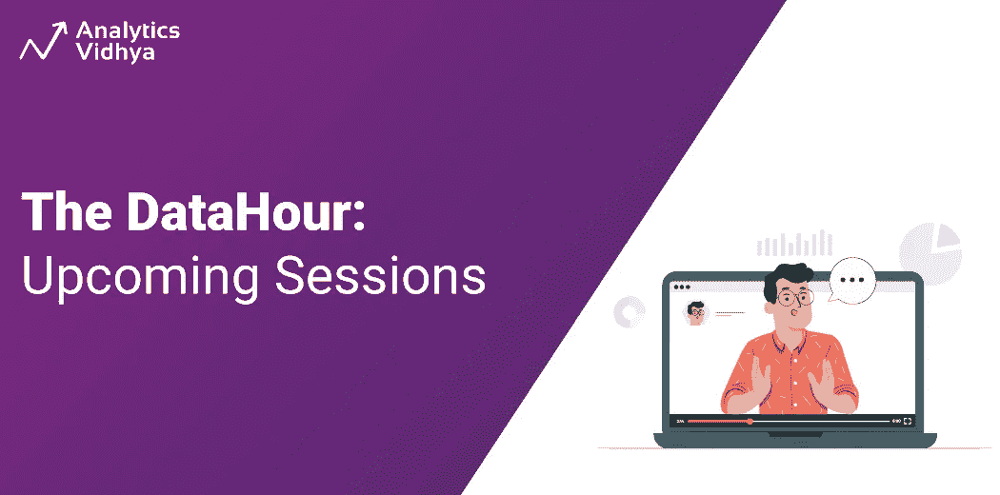

# 新的数据小时会议在这里-现在保存日期！

> 原文：<https://medium.com/analytics-vidhya/new-datahour-sessions-are-here-save-the-date-now-3f60836476de?source=collection_archive---------2----------------------->

## 立即免费注册！

# 介绍

人工智能、人工智能、区块链和数据科学正在彻底改变世界，因此其社区正在快速增长。因此，为了向我们的社区提供掌握这些领域所需的知识，Analytics Vidhya 推出了 DataHour 会议。这些课程不仅提供理论知识，还包括主题的实践演示，从而使学习变得有效和实用。

为什么要等？滚动以了解下面即将到来的数据小时，并立即[注册](https://datahack.analyticsvidhya.com/contest/all/)！

# 谁可以参加数据小时会议？

*   愿意在数据科学、机器学习、区块链和许多这样的最新技术领域开始职业生涯的学生和大一新生。
*   数据科学和 IT 专业人员正在寻找一个平台来提升他们的知识并在他们的领域中成长。

# DataHour:区块链和数据概述

区块链是一种数据结构，可以创建公共或私有的分布式数字交易账本。在这个数据小时中，您将了解区块链的所有信息——从它的起源、用途、领先的区块链公司、影响、未来应用等等。

[书 Y](https://datahack.analyticsvidhya.com/contest/datahour-modern-deep-learning-architecture/?utm_source=article&utm_medium=blog_announcement&utm_campaign=datahour) [我们现在的座位](https://datahack.analyticsvidhya.com/contest/datahour-overview-of-blockchain-and-data/?utm_source=article&utm_medium=blog_announcement&utm_campaign=datahour)！

本数据小时的发言人 Vedanth Padigelwar 是 Knoct 的创始人兼首席执行官，他建立了一个通用的分散身份，以使用区块链实现点对点的信任网络。作为核心成员，他已经在早期创业公司工作了两年多，使用 web 开发、人工智能和云技术从零开始构建应用程序。

# 数据小时会话:BigQuery ML 简介

BigQuery ML 用于使用标准 SQL 查询在 BigQuery 中创建和实现 ML 模型，使 SQL 从业者能够使用现有的 SQL 工具和技能构建模型。在这个数据小时中，您将了解 BigQuery 如何用于机器学习，它与经典的 ML 模型有何不同，它的新功能和优势，以及现实世界的应用。

[预订您的座位号](https://datahack.analyticsvidhya.com/contest/datahour-introduction-to-bigquery-ml/?utm_source=article&utm_medium=blog_announcement&utm_campaign=datahour) [W](https://datahack.analyticsvidhya.com/contest/datahour-modern-deep-learning-architecture/?utm_source=article&utm_medium=blog_announcement&utm_campaign=datahour) ！

通过这个数据小时，与 Shanthababu 互动。他是一名 ML、数据架构师和程序交付专家，在信息技术(IT)领域拥有 20 多年的经验。他已经完成了德克萨斯大学人工智能和机器学习的 PG 课程。他目前在 Cognizant 担任人工智能和数据分析主管。

# 数据小时会话:关于 Numpy 您需要知道的一切

库是为了代码的可重用性而创建的。最重要和最流行的 Python 库之一是 Numpy。NumPy 可用于对数组执行各种数学运算。这个数据小时将涵盖 numPy 的所有重要操作及其实际操作演示。

[现在就预订您的座位](https://datahack.analyticsvidhya.com/contest/datahour-everything-you-need-to-know-about-numpy/?utm_source=article&utm_medium=blog_announcement&utm_campaign=datahour)！

向专业的高级数据工程师 Partha 学习，他在完整的软件开发和分析生命周期中拥有 9 年以上的经验，擅长大数据、ML、数据集成和业务分析。他是一个充满激情的开发人员，目前是一名个人贡献者。他精通使用包括云技术、Python、Hadoop、Hive、Spark、AWS 和 Cassandra 在内的技术。

# 数据小时会话:Hyperledger 结构中的 ERC 令牌

您知道 Hyperledger Fabric 中可用和使用的 ERC 令牌类型吗？ERC-20 是可替换令牌的标准。ERC-721 是不可替换令牌的标准。ERC-1155 是多令牌(可替换和不可替换)的标准。本数据小时课程将向您介绍 ERC 令牌及其在 Hyperledger Fabric 中的应用。

[立即预订您的座位](https://datahack.analyticsvidhya.com/contest/datahour-erc-tokens-in-hyperledger-fabric/?utm_source=article&utm_medium=blog_announcement&utm_campaign=datahour)！

学习新出现的话题 ERC 令牌与普里蒂活女神。她目前在 Fraction Vault 担任区块链顾问。在班加罗 IIIT 获得博士学位后。她主要致力于私人和公共区块链网络的研究和开发。过去，她曾在派拉蒙软件解决方案公司担任区块链架构师，并在西门子担任研究实习生。2021 年，她是 Hyperledger 全球论坛的发言人。

# 数据小时会议:如何使用 Power BI 和 Excel 构建交互式仪表盘

可视化数据使数据更具吸引力和可展示性，并简化了数据的解释和分析。在 DataHour 专题讲座中，您将了解如何使用 Excel 和 Power BI 创建数据可视化仪表板。

[立即预订您的座位](https://datahack.analyticsvidhya.com/contest/datahour-how-to-build-interactive-dashboards-using-power-bi-and-excel/?utm_source=article&utm_medium=blog_announcement&utm_campaign=datahour)！

学习使用 Munmun Das 创建交互式仪表板的艺术。她是一名研究学者，在软件项目管理、产品开发、产品战略以及大型复杂自动化/转换解决方案、web 和移动应用的交付方面拥有超过 16 年的经验。她作为行业发言人、企业导师和客座讲师指导了许多行业技术力量。她是一名熟练的程序员，在 RPA 上用点网 web 应用程序实现了握手项目，并成功构建了按需 RPA。

# 结论

不要错过这个直接向行业专家学习并在新兴领域加速您职业生涯的绝佳机会:[立即注册](https://datahack.analyticsvidhya.com/contest/all/)。如对会议或主题有任何疑问，请随时联系 datahour@analyticsvidhya.com，或在会议期间直接询问演讲者。如果你跳过了“数据时间”的任何部分，你可以在我们的 YouTube [频道](https://www.youtube.com/playlist?list=PLdKd-j64gDcDv3qhAveXqBQQKbDktkfRX)上观看录像，或者在这里阅读概要[。](https://www.analyticsvidhya.com/?s=datahour+synopsis)

## 连接

假设您在注册时遇到问题，或者想要与我们进行一次会话。在 datahour@analyticsvidhya.com 与我们联系

*原载于 2022 年 12 月 19 日 https://www.analyticsvidhya.com**的* [*。*](https://www.analyticsvidhya.com/blog/2022/12/new-datahour-sessions-are-back-save-the-date-now/)