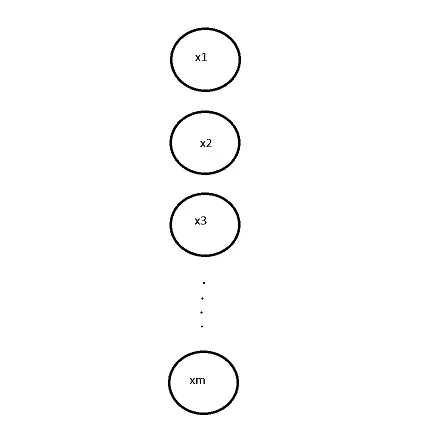
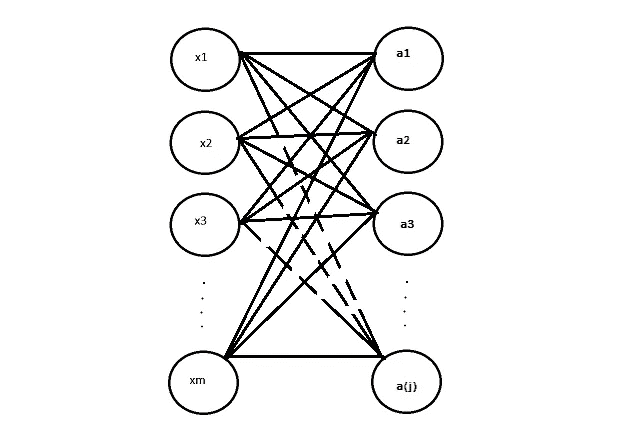
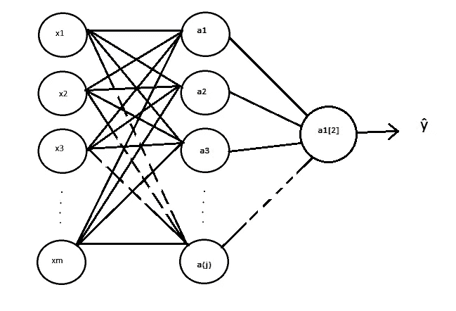
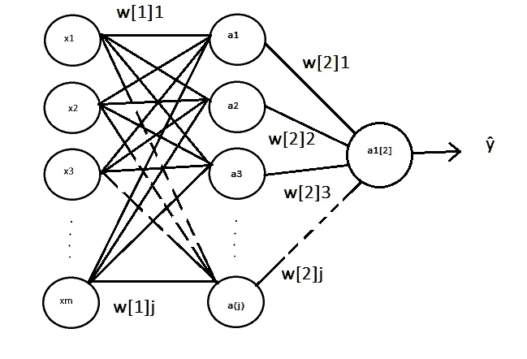
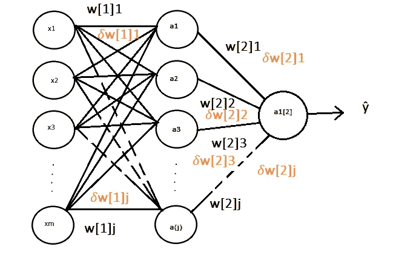
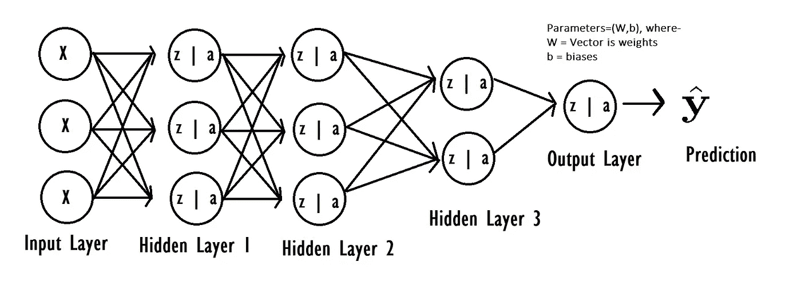

# 神经网络新手？

> 原文：<https://medium.com/analytics-vidhya/new-to-neural-networks-544ca4d6dacd?source=collection_archive---------10----------------------->

它们比你想象的要简单！

# 介绍

神经网络已经存在一段时间了。Warren McCulloh 和 Walter Pitts 早在 1943 年就写了一篇论文，思考动物神经元的内部工作方式，并提出了一种解释神经元如何工作的方法，即通过构建一个使用电路构建的简单神经网络。

然而，在此后的近 80 年里——神经网络不仅仅是一个获得一个点的对象——它们是我们所拥有的最通用和最灵活的计算算法。

尽管神经网络在现实世界应用中取得了早期的成功，如伯纳德·维德罗和斯坦福大学的马尔西安·霍夫的 ADALINE 和 MADALINE(自 1959 年以来一直在使用的模型)，但多年来我们已经意识到神经网络很棒，但它们不是一切的解决方案！

还有一个事实是，神经网络(尽管这个名字可能会给你一种矛盾的直觉)是对实际神经元工作方式的过度简化，在解释我们的大脑如何工作时几乎没有什么作用。

当我们意识到我们能够用更复杂的架构和更深层次的神经网络来训练算法时，机器学习的世界发生了革命性的变化，因为我们得到了更强大的硬件-产生了深度学习-训练深度神经网络及其变体的艺术，这是不断给予的礼物！

自动驾驶汽车(特斯拉 Model S？)、假新闻检测器、垃圾邮件分类检测、自然语言处理、AI 助手(Cortana、Alexa、Bixby、Siri、Google Assistant 等。)、对象识别和检测、图像检测和识别、医疗保健(通过语义分割预测癌症和其他肿瘤、检测儿童的发育抑制)、图像和视频增强、对原始单色图像着色、深度伪造和深度伪造检测、从图像数据合成视频以及帧增强和分辨率放大、文本到语音和语音识别、文本和语言翻译、字符识别(ocr 主要用于检测笔迹，想想 google lens)、游戏和游戏中的 NPC、零玩家游戏、场景和图像描述/字幕和数据分析以及天气/作物产量预测。

这个清单可以一直列下去，而且看不到尽头。机会是——如果你有一项任务，你有足够的数据，并且想要模仿甚至超过人类表现的出色表现，你可以用深度神经网络或它的某种变体来实现它。

【注意:我写这篇文章是假设读者对矩阵代数和微分学有基本的了解，但是如果你不懂任何数学(术语、方程等。)不用担心！你可以随时停下来查找资料，或者在需要帮助的时候伸出援手！此外，图表是由你真正用 MS paint 制作的，我不是最好的艺术家，所以请原谅我]

# 分解神经网络

神经网络由 4 个重要组件组成:

(一)输入层

(二)隐藏层

㈢参数(权重、偏差)

㈣输出层

让我们更详细地看一看它们。

***输入图层:***

首先是我们的输入层。假设我们有一个映射输入值 x1，x2，x3，x4 的任务。xm 到目标输出值 y1，y2，y3，y4…ym，其中 m 是我们数据集中的样本数(1 个样本= 1 对(x，y))。

基于这些假设，我们的输入层可能如下所示:

每个元素包含一个来自示例(x，y)的输入值 x

***隐藏层:***

我们的每一个输入元素都输入到下一层——隐藏层的每一个神经元中。

我们称隐藏层为“隐藏”，因为我们不知道它们的值。我们能从一个隐藏层得到的只是输入给它的信息和它的神经元产生的输出。这是真正的奇迹发生的地方，一个隐藏层或多个隐藏层给我们的神经网络增加了非线性(稍后将详细介绍)。

因此，为了简单起见，让我们在这个例子中保持一个隐藏层。我们的输入层应该输入到我们的隐藏层-

输入层馈入隐藏层

因此，请注意我们隐藏层中的最后一个神经元是如何标记为 a(j)的——这是因为隐藏层不需要与输入层具有相同数量的元素。在一个隐藏层中，你可以有 3 个、5 个、10 个、20 个、100 个或者任何你想要的数量的神经元。你也可以在每个隐藏层中有不同数量的神经元。

***参数和激活:***

我们为每个输入分配一个数值，称为“权重”，记为“w”。这是一个参数，可以认为是我们神经网络的控制值。我们还花时间添加另一个称为“偏差”的参数，并表示为“b”到每一层，这是一个常量值，如我们将添加到线性函数中。

现在我们来谈谈这里的“a”，它代表激活——我们隐藏层中的神经元正在进行的计算。

对于维数为(nx，m)的输入矩阵 X(或 X = [ x1，x2，x3，…。xm]每个 x 本身是 nx 行的列向量)，我们有一个称为预激活参数的东西(表示为“z”)。

z = x*w + b

然后，我们可以使用这个预激活参数来计算来自我们神经元的激活，这成为它的输出，并被馈送到它后面的层。所以，来自我们神经元的激活(a)是:

a = activation_function(z)，其中 activation_function()是我们选择的用于处理“z”的数学函数，这很重要，您选择的激活函数会影响您的神经网络的性能。

一些常用的激活函数有 sigmoid、tanh、softmax 和 relu。每一个都有不同的应用，根据你的需求，你可以设计你的神经网络来隐藏不同的激活函数。

例如，如果我们为上面的示例隐藏层选择 sigmoid 激活函数，则:

a = 1/(1 + e^(-z))

其中 e 是指数常数 e (e ≈ 2.718)。

***输出层:***

我们的输出层由单个神经元组成。这个神经元将通过接收激活 a1、a2…a(j ),然后产生输出ŷ.，对我们的原始输入数据进行预测

其中，ŷ = a1*w1+a2*w2……a(j)*w(j)。

就是这样，这些都是神经网络的元素。但是等等！我们还没有真正看到他们的行动，那里有很多有趣的事情要谈，所以让我们接下来看看。

# 训练神经网络

训练神经网络也是一个循序渐进的过程，我们可以将此过程分为以下步骤:

㈠数据收集和预处理

(二)初始化参数

㈢向前传球

㈣计算成本

㈤向后传球

㈥更新参数

㈦业绩优化和基准测试

***数据采集和预处理:***

这是训练的第一个方面，也是经常被严重低估的一个方面，不仅仅是训练神经网络，而是训练你想要建立的任何人工智能模型。一旦你脑子里有了一个问题陈述，例如，“确定一幅图像是否包含一支笔”，你就可以专注于这项任务需要什么样的数据。

用于检测图像中笔的数据集将包含各种笔的图像以及没有笔的图像。多种颜色、角度、类型、大小和方向将会有所帮助——你应该有一个多样化的数据集，除非你的特定问题需要一个受限的数据集(非常罕见)。

我们把数据分成三个数据集-

㈠训练数据集(约 98%的可用数据)

㈡发展数据集(1%)

㈢测试数据集(1 和)

您可能听说过 60–20–20 训练-开发-测试分割，如果您无法访问大量数据(少于 10，000 个示例)，这是合理的，但是对于一个相当大的数据集，比如说 100，000 或 1，000，000 甚至 1 百万以上，您不需要 200，000 个示例的开发和测试集，10，000 个示例就足够了。

现在，把 dev 集合想象成一个集合，从多个模型中测量性能，你将为你的问题选择最好的一个。测试集用于检查过度拟合/欠拟合(也称为偏差/方差检查，稍后将详细介绍)。

出于时间的考虑，我将省略这一部分的更多细节，因为老实说，以数据为中心的人工智能是未来，数据采集、分割和两者之间的一切都值得单独撰写一篇文章。

***初始化参数:***

我们必须将权重“w”初始化为随机值。这样做是因为如果我们的权重被初始化为零或相同的值，我们所有的隐藏层都变得过时-当值通过它们时，它们一遍又一遍地计算相同的值。这叫做对称状态，我们想要打破对称，我们想要把它扔到地上，粉碎成碎片。当我们将 w 初始化为随机值时，对称破缺可以实现。

我们可以将偏置项“b”初始化为零，因为它们对对称态没有直接贡献。将它们初始化为零不会损害我们的神经网络。

***向前传球:***

所以，你已经走了这么远，你理解了神经网络的各个部分。你还制定了一个你想自动化/学习的任务，希望你有足够的数据。

在您将参数 w 初始化为随机值并将 b 初始化为零之后，我们就可以开始我们的正向传播了。

我们将来自训练集 x 的输入值提供给输入层。这产生了预激活参数 z，z=x*w(转置)+ b。

一旦我们的隐藏层计算了这个预激活参数的激活，它就把这些值传递给输出层。我们神经网络的预测被计算成ŷ.

这结束了一次向前传球。现在，是时候进入正题了-

***计算成本:***

“损失”是与我们的训练数据示例(x，y)中的目标输出“y”相比时，由我们的神经网络生成的预测中存在的误差的度量

L( ŷ，y)=-y *对数(ŷ)-(1-y)*log(1- ŷ)

这也称为逻辑损失函数，您还可以使用其他类型的损失函数。

成本函数就是在我们整个训练集上计算的损失。这可以定义为:

J(w，b) =(对于 i=1…m)(∑I[-y(I)* log(ŷ(i))-(1-y(i))*log(1- ŷ(i))])/m

概括地说，我们训练神经网络的目标是获得最大的准确性，并将误差降低到尽可能低的值。从而最小化成本函数。

***向后传递:***

一旦我们有了成本，我们就可以计算参数“𝛿w”和“𝛿b".”的偏导数这是使用反向传播算法实现的，该算法本身值得单独发表一篇文章(或几篇文章)。

本质上，

对于层 l，

𝛿a =[-y(1)/a(1)+((1-y(1))/(1-a(1)))-y(2)/a(2)+((1-y(2))/(1-a(2)))……-y(m)/a(m)+((1-y(m))/(1-a(m)))]

𝛿Z[l] = 𝛿A[l] *激活 _ fn _ 一阶 _ 导数[l](Z[l])

𝛿w[l]=(𝛿z[l]*a[l-1]transposed)/m

𝛿b[l] = [𝛿Z[l]沿排求和]/m

𝛿a[l-1 = 𝛿z[l]*w[l]transposed

注意:同样，如果数学现在还不清楚，我将进行反向传播，这是一种推导，并在未来的文章中更详细地讨论它——现在，如果太难，你可以从表面上看这些方程。

***更新参数:***

下一步是更新网络参数。这可以通过使用以下等式来实现:

对于层“l”:

learning_rate*𝛿W[l]

learning_rate*𝛿b[l]

学习率也可以表示为α。

通过计算参数的偏导数(也称为梯度)来最小化成本的过程是使用反向传播来完成的，但是随后对成本执行这种更新和优化是使用诸如批量梯度下降(这里使用)之类的优化算法来完成的。

其他常用的优化算法有 Adam、小批量梯度下降、带动量的梯度下降。

一个历元是一批训练数据训练的完成。

这里使用的批量梯度下降优化算法使用整个训练数据集作为“批量”,因此当我们迭代训练数据集时，推断训练的迭代等于一个时期。

***性能优化:***

经过多次训练后(你可以点击并尝试找到正确的数字)，你最终得到一个模型，这个模型是为你希望它执行的任务而训练的。

但是它在这项任务中的表现取决于它的误差有多低，以及它的精确度有多高。在你完成训练后，错误分析是适当的。确保你的模型不会过紧或过紧。

# 深度神经网络:

既然我们已经看到了神经网络是如何构建和训练的，让我们来谈谈浅层和深层神经网络。简而言之，我们通常将具有多达 2 个隐藏层的神经网络称为浅神经网络，将具有两个以上隐藏层的神经网络称为深神经网络。

上面所有的方程都是为“l”层写的，因此适用于深度神经网络，那些不适用的方程可能也适用于深度神经网络。

就是这样。这就是你开始学习神经网络所需要的所有介绍性信息。不要忘了使用它们，试着用你觉得舒服的任何语言自己实现一个神经网络！