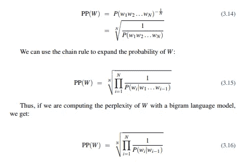
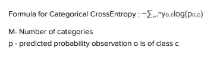
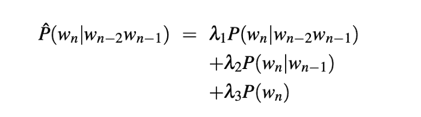
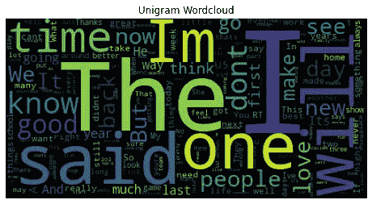
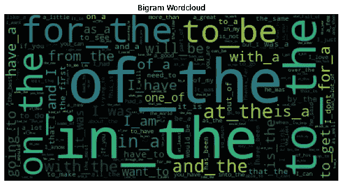
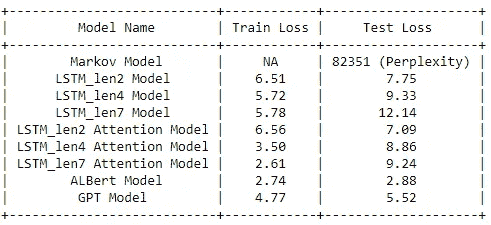
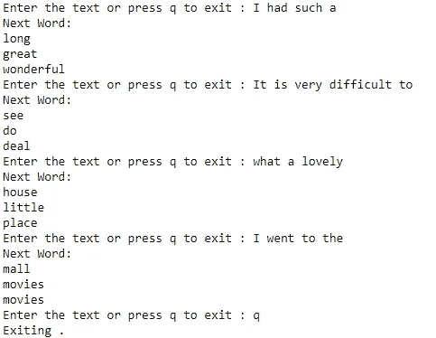

# 使用 SwiftKey 数据预测下一个单词

> 原文：<https://medium.com/analytics-vidhya/next-word-prediction-using-swiftkey-data-f121f59bc7d?source=collection_archive---------3----------------------->

## 下一个单词预测的详细实现

在这篇博客中，我将带你通过**概率**和**分类**方法来预测给定单词序列的下一个单词。

# 目录

*   **商业问题**
*   **毫升配方**
*   **现有工作**
*   **第一次切割方法**
*   **数据可视化**
*   **概率方法**
*   **分类方法**
*   **结果比较**
*   **例子**
*   **未来作品**
*   **参考文献**

# 商业问题

这个问题属于自然语言处理(NLP)领域，文本挖掘是人工智能的一个分支，帮助计算机理解、解释和操纵人类语言。文本挖掘是一种人工智能技术，它使用 NLP 将文档中的非结构化文本数据转换为 ML 算法可以使用的结构化数据。下一个单词预测问题使用上述技术来完成结果。

## 为什么下一个单词预测很重要？

它有助于减少击键次数，从而节省打字时间，检查拼写错误，帮助回忆单词。仍在努力提高语言技能的学生可以接受它的帮助。患有阅读障碍的人也可以从中受益。

# ML 公式

在本节中，我将讨论如何将上述业务问题转换为机器学习问题。

## 数据概述

为了解决这个问题，我们需要文本数据的语料库。该数据由**快速键**提供。

**数据来源**:[https://d 396 qusza 40 orc . cloudfront . net/dsscapstone/dataset/Coursera-swift key . zip](https://d396qusza40orc.cloudfront.net/dsscapstone/dataset/Coursera-SwiftKey.zip)

这个 zip 文件包含 4 个文件夹，每个文件夹包含 4 种不同语言的数据，即英语、俄语、芬兰语和德语。

我将使用英语文件夹中的数据。它包含以下文件。

*   en _ us . twitter . txt——这个文本文件包含来自 Twitter 的所有英语语言数据。
*   en_US.news.txt —此文本文件包含新闻网站和频道的所有英语语言数据。
*   en_US.blogs.txt —该文本文件包含所有博客网站的所有英语语言数据。

## 将现实世界映射到 ML 问题

下一个单词预测包括预测下一个单词。因此，给定从语料库中生成的单词序列，我必须预测下一个出现概率最高的单词。**因此，这是一个语言预测建模问题，也称为语言建模。这是概率模型。**

我们还可以用另一种方法来处理这个问题。我们可以把下一个要预测的单词看作一个类。因此它可以被视为多类分类问题。

## 业务目标和约束

**目标**

*   从语料库中清除文本数据
*   从清理的数据中创建序列
*   建立统计或神经语言模型来预测下一个单词

**约束**

*   内存限制-语料库大小可能过大，这可能会导致内存错误。
*   延迟限制—这是一个低延迟问题，因为整个问题旨在实现快速键入。
*   OOV 单词——注意词汇之外的单词是很重要的，因为所有的单词可能不会出现在语料库中，但是模型应该能够处理它。

## 绩效指标

**对于概率模型**

困惑度:它被定义为由字数归一化的测试集的逆概率。

困惑方程

**为分类模式**

分类交叉熵:每个下一个要预测的单词被认为是一个类别，所以我将使用分类交叉熵。

范畴交叉熵公式

# 现有工作

1.  论文 doi:[**10.1109/icdse 47409 . 2019 . 8971796**](http://10.1109/icdse47409.2019.8971796)

这篇研究论文是关于使用深度学习技术预测印地语中的下一个单词。我总结了用于印地语下一个单词预测的技术。

*   清理文本并生成唯一的单词
*   这些独特的单词存储在字典中，并映射到索引，因为神经网络与索引一起工作更好
*   设置序列长度，例如，如果序列长度=6，则句子被分成 6:1 的比例，即。前六个字在 input_x 中，其余的在 input_y 中
*   基于序列长度从 input_x 创建张量，并存储在 data_x 中
*   对于 data _x 中的每个张量序列，作为 input_y 的后续单词序列作为张量存储在 data_y 中。
*   LSTM 和双 LSTM 用于基于下一个单词的最高概率的预测。
*   使用的激活函数是 Softmax 来分配下一个单词的概率。
*   由于该问题被视为多类分类问题，因此损失函数是分类交叉熵。
*   LSTM 模型运行了 197 个时期，而双 LSTM 模型运行了 121 个时期。
*   对于所有的序列长度都重复了这一过程。

2.论文 doi:[**https://doi . org/10.1007/s 00521-020-05245-3(0123456789()。，-volV)(01234567 89()。**，-volV)](https://doi.org/10.1007/s00521-020-05245-3(0123456789().,-volV)(01234567 89(). ,- volV))

本文为库尔德语开发了下一个单词预测模型。在这里，他们讨论了这个问题的 N 元语言模型。

**N 元语言模型**

在语言模型中，要么概率被分配给一系列单词，要么概率被分配给给定一些前面单词的下一个单词。

这里讨论 **2 场景**:

**第一种情况** -在句子(w1 w2 w3 w4 w5)的情况下，句子的概率由 P(w1)*P(w2)*P(w3)*P(w4)*P(w5)给出，其中 P(wn)是 wn 的概率。

p(wn)=(wn 在语料库中的出现次数)/(语料库中的总字数)

**第二种情况** —在句子(w1 w2 w3 w4 w5)的情况下，句子的概率由 P(w1)* P(w2 | w1)* P(w3 | w1 w2)* P(w4 | w1 w2 w3)* P(w5 | w1 w2 w3 w4)给出，其中 P(wn|wn-1)是 wn 的概率，给定前面的单词是 wn-1。

P(wn|wn-1)= P(wn-1 wn)/P(wn-1)，即(wn-1 wn)在语料库中出现的概率除以 wn-1 出现的概率。

n 元模型可以是不同的类型。那些是一元，二元，三元等等。

**Unigram 模型—** 在该模型中，句子中每个词出现的概率由 P(wi) =文本语料库中 wi 的计数/总字数给出。

**二元模型—** 这类似于上面讨论的第二种情况。但是这里我们只考虑前一个词。

在句子(w1 w2 w3 w4 w5)的情况下，句子的概率由 P(w1)* P(w2 | w1)* P(w3 | w2)* P(w4 | w3)* P(w5 | w4)给出，其中 P(wn|wn-1)是给定前一个单词 wn-1 时 wn 的概率。

**三元模型—** 这类似于二元模型。但是这里我们考虑了前面的两个词。

因此，n 元模型的表达式为

P(wi|w1w2…wi-1)=P(wi | w(i-n+1)…。wi-1)。

这也叫马尔可夫假设。

现在处理 0 概率，使用**愚蠢退避算法**。

如果高阶 n 元语法的结果为 0，那么我们退回到低阶 n 元语法。

它由下面的公式给出。

如果 f(w iik+1)> 0，则 s(wi | wi-k+1i-1)= f(w iik+1)/f(w i1k+1)

αS(wi | w i1 ik+2)否则

例如:让我们考虑一个单词序列“这是一个非常美丽的”。

在这里，我们必须找到“美丽”的概率给定“这是一个非常”。假设“美丽”从未出现在“这是一个非常”的上下文中，那么对于 4-grams 模型，“美丽”的概率为 0。所以我们退回到 3-gram 模型，找到概率为α*P(“漂亮”|“是非常”)。

**3。关于平滑的文章**

**链接:**[**https://towardsdatascience . com/n-gram-language-models-af 6085435 eeb**](https://towardsdatascience.com/n-gram-language-models-af6085435eeb)

需要平滑来处理在未知上下文中出现在测试集中的单词。有不同的平滑技术。

*   拉普拉斯平滑:为了计算概率，我们简单地在分子上加 1，在分母上加一个额外的 V 词汇。p(word)=(word count+1)/(total number of words(N)+V)
*   P(new_word)=1/(N+V)
*   添加 k- Smoothing:我们将在计数中添加一些分数(k ),而不是给单词的频率加 1。
*   p(word)=(word count+k)/(total number of words(N)+kV)
*   P(new_word)=k/(N+kV)
*   退避和插值:退避与前面解释的愚蠢退避算法相同。插值是通过给每个 n 元模型赋予权重来组合不同的 n 元模型的方法，例如 unigram、bigram、trigram 模型。

后退和插值

# 首次切割法

在这一节中，我讨论了我决定用来解决这个项目的第一种方法。

*   从 3 个不同的文本文件中读取数据，然后将它们一起添加到 1。
*   清理文本，包括删除标点符号，数字，特殊字符，多余的空格。
*   停用字词不会被删除，因为它们对下一个字词预测起着重要作用。
*   将所有单词转换成小写。

**可视化**

*   生成一元、二元、三元模型及其频率。
*   可视化 n 个字母的单词云。

**特化**

***对于马尔可夫链模型使用 ngrams***

*   我将创建一个有 2 个键的字典-第一个键将是不同单词序列的元组，第二个键将有下一个单词。
*   该字典的值将是给定第一个关键字以及拉普拉斯平滑的第二个关键字出现的概率。
*   这将是二元和三元模型。

***为神经网络模型***

*   将整个数据编码成索引。
*   我将从保持索引顺序的编码数据中生成长度为 2、3 和 4 的序列。
*   然后，我将序列分为 x 和 y，这样只有最右边的索引在 y 中，其余的在 x 中。

**造型**

***马尔可夫链模型***

*   我将开发一个使用全部数据的二元和三元概率的马尔可夫模型。

***神经网络模型***

*   对于每个序列长度，将 x 和 y 分成训练和测试数据集
*   为不同的序列长度训练不同的 LSTM 模型。
*   不同的 LSTM 模型将用于不同的输入长度。

# 数据可视化

为了对语料库有所了解，我在清理数据后进行了一些可视化处理。

## 数据清理

为了清洁，我执行了以下步骤:

*   **去除多余的空格**:单词之间所有多余的空格都被去除。
*   **删除特殊字符**:删除任何形式的特殊字符，包括标点符号。
*   **对文本数据进行分词**:使用 ***nltk 分词器*** 对新闻和博客数据进行分词。
*   **标记 Twitter 数据**:使用 ***nltk TweetTokenizer 标记 Twitter 数据。***

**代码示例:**

## 可视化 1

基于频率的前 50 个单词

*   根据出现频率可视化前 50 个单词
*   大多数都是停用词，因为它们经常被使用。

## 可视化 2

基于频率的最后 50 个单词

*   根据词频可视化最后 50 个单词
*   它们在整个语料库中都只出现一次

## 可视化 3

单字单词云

*   用单字生成单词云。
*   这里没有停用词，因为我试图将最常用的非停用词形象化。

## 可视化 4

双字母单词云

*   这里我包括了停用词，否则短语的意思会改变。
*   从“云”这个词来看，有很多介词的用法

## 可视化 5

三元词云

**最常用的短语**

*   其中一个
*   “走出”
*   “能够”
*   一些
*   将会是

## 可视化 6

四元单词云

**最常用的短语**

*   在中间
*   最'之一'
*   其余的
*   在中间

在大多数情况下，会大量使用停用词。

整个语料库中共有 101098262 个词。从视觉效果来看，很明显它们中的大多数都是停用词。所以在开发模型时不能排除它们。此外，我无法处理整个语料库，因为我没有足够的内存来支持对如此大数据的操作。

# **概率方法**

在概率方法中，在给定一组输入单词的情况下，基于其出现的概率来预测下一个单词。

在这一部分，我们有两个模型。

1.  **马尔可夫模型**——详细解释见[此处](/@prerana1298/markov-chain-model-e642050e6c6f)。
2.  **GPT- 1 型** -详细说明见[此处](/@prerana1298/next-word-prediction-using-gpt-1-ae999acfe3de)。

# 分类方法

在分类方法中，下一个单词被视为要预测的类别。因此，这个问题变成了一个多类分类问题。

在这一部分，我们有两个模型。

1.  **带和不带注意机构的堆叠 LSTM**-详细说明见[此处](/@prerana1298/next-word-prediction-using-lstms-98a1edec8594)。
2.  **艾伯特模型** -详细说明见[此处](/@prerana1298/next-word-prediction-using-albert-4e2bf5372132)。

# 结果比较

不同型号的性能

尽管 Al-BERT 的测试损失是最低的，但正如我们前面看到的，它产生了非常糟糕的预测。所以我决定将 GPT 作为最终的预测模型，因为它是第二好的。

# 下一个单词预测

以下是 GPT 模型预测下一个单词的几个例子:

预测示例

**Github 链接:**[https://Github . com/kurchi 1205/Next-word-Prediction-using-swift key-Data](https://github.com/kurchi1205/Next-word-Prediction-using-Swiftkey-Data)

# 未来作品

*   由于内存问题，我只处理了全部数据的 1%,如果我们处理全部数据，结果会好得多。
*   最佳模型是通过微调 GPT -1 获得的。如果我们微调 GPT-2 和 GPT-3，我们可以得到更好的结果，因为它们有更多的参数。
*   Swiftkey 数据还包含许多不同语言的语料库，我们可以对它们进行处理。

# 参考

*   [https://www . analyticsvidhya . com/blog/2019/08/综合-指南-语言-模型-nlp-python-code/](https://www.analyticsvidhya.com/blog/2019/08/comprehensive-guide-language-model-nlp-python-code/)
*   [https://thecleverprogrammer . com/2020/07/20/next-word-prediction-model/](https://thecleverprogrammer.com/2020/07/20/next-word-prediction-model/)
*   [https://www.youtube.com/watch?v=BAN3NB_SNHY](https://www.youtube.com/watch?v=BAN3NB_SNHY)
*   [https://thinkinfo . com/fast text-word-embeddings-python-implementation/](https://thinkinfi.com/fasttext-word-embeddings-python-implementation/)
*   [https://www.youtube.com/watch?v=gHC9tRyVSNE](https://www.youtube.com/watch?v=gHC9tRyVSNE)
*   [https://medium . com/swlh/language-modeling-with-nltk-20 EAC 7 e 70853](/swlh/language-modelling-with-nltk-20eac7e70853)
*   [https://stack overflow . com/questions/54978443/predicting-missing-words-in-a-sentence-natural-language-processing-model](https://stackoverflow.com/questions/54978443/predicting-missing-words-in-a-sentence-natural-language-processing-model)
*   [https://huggingface.co/blog/how-to-generate](https://huggingface.co/blog/how-to-generate)